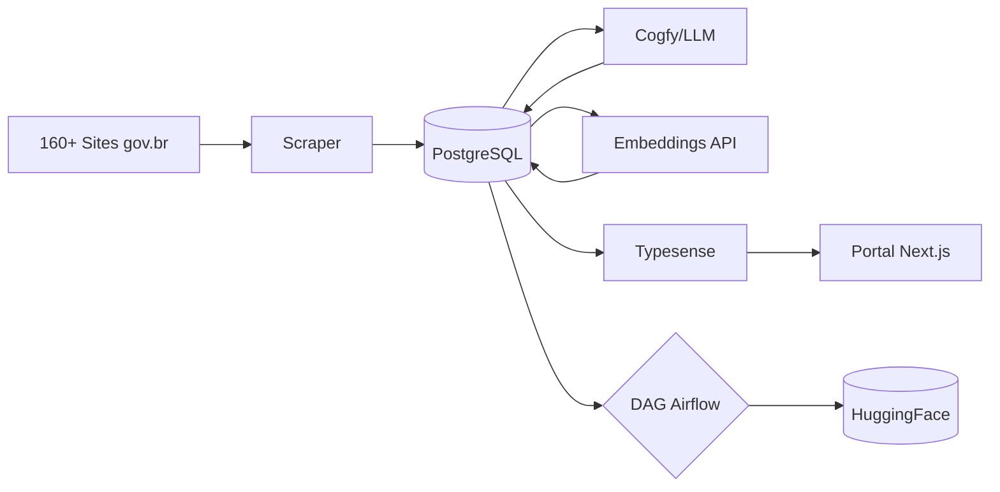

# Plano de Atualização da Documentação - DestaquesGovBr

## Contexto da Mudança Arquitetural

### Antes (Documentação Atual)
- **Source of Truth**: HuggingFace Dataset
- **Repositórios**: `scraper`, `typesense` (separados)
- **Fluxo**: Sites → Scraper → HuggingFace → Cogfy → HuggingFace → Typesense

### Agora (Nova Arquitetura)
- **Source of Truth**: PostgreSQL (Cloud SQL)
- **Repositórios**: `data-platform` (unificado) - repos antigos arquivados
- **Fluxo**: Sites → Scraper → PostgreSQL (+HF dual-write) → Cogfy → PostgreSQL → Typesense / HuggingFace (sync)
- **Novos componentes**: Embeddings API, Cloud Composer (Airflow), DAGs

### Decisões do Usuário
- [x] Criar novos arquivos + atualizar existentes
- [x] Remover todas referências aos repos arquivados (scraper, typesense)
- [x] Atualizar completamente as trilhas de onboarding

---

## Arquivos a Criar (Novos)

| Arquivo | Conteúdo |
|---------|----------|
| `docs/modulos/data-platform.md` | Visão geral do repo unificado, estrutura, CLI |
| `docs/arquitetura/postgresql.md` | Schema detalhado (5 tabelas), índices, normalização |
| `docs/workflows/airflow-dags.md` | DAGs do Cloud Composer (sync HF, etc) |

---

## Arquivos a Modificar

### 1. Arquitetura (Alta Prioridade)

| Arquivo | Mudanças |
|---------|----------|
| `docs/index.md` | Novo diagrama com PostgreSQL central, atualizar descrição |
| `docs/arquitetura/visao-geral.md` | Redesenhar diagramas Mermaid, PostgreSQL como camada 3 |
| `docs/arquitetura/fluxo-de-dados.md` | Reescrever 8 etapas (incluindo embeddings e sync HF) |
| `docs/arquitetura/componentes-estruturantes.md` | HuggingFace → "distribuição", nova seção PostgreSQL |

### 2. Módulos (Alta Prioridade)

| Arquivo | Mudanças |
|---------|----------|
| `docs/modulos/scraper.md` | Repo → data-platform, CLI, StorageAdapter, PostgresManager |
| `docs/modulos/typesense-local.md` | Repo → data-platform, lê do PostgreSQL, embeddings |
| `docs/modulos/cogfy-integracao.md` | Enrichment escreve no PostgreSQL |

### 3. Workflows (Média Prioridade)

| Arquivo | Mudanças |
|---------|----------|
| `docs/workflows/scraper-pipeline.md` | Novo repo, dual-write PostgreSQL |
| `docs/workflows/typesense-data.md` | Sync lê do PostgreSQL, inclui embeddings |

### 4. Infraestrutura (Média Prioridade)

| Arquivo | Mudanças |
|---------|----------|
| `docs/infraestrutura/arquitetura-gcp.md` | Adicionar Cloud SQL, Composer, Embeddings API, custos |

### 5. Onboarding (23 arquivos)

| Arquivo | Mudanças Necessárias |
|---------|---------------------|
| `setup-backend.md` | Atualizar refs ao data-platform |
| `setup-datascience.md` | Atualizar conexão PostgreSQL |
| `setup-devvm.md` | Verificar refs a repos |
| `airflow-tutorial.md` | Verificar se alinhado com Composer 3 |
| `roteiro-onboarding.md` | Atualizar links e estrutura |
| `troubleshooting.md` | Adicionar PostgreSQL |
| `ds/explorando-dataset/*.md` | Atualizar fonte de dados (PostgreSQL vs HF) |
| `ds/nlp-pipeline/*.md` | Verificar embeddings e busca semântica |
| `ds/ml-classificacao/*.md` | Verificar pipeline |
| `ds/qualidade-dados/*.md` | Verificar pipeline |

---

## Detalhamento dos Novos Arquivos

### `docs/modulos/data-platform.md`

```markdown
# Data Platform

Repositório unificado para toda a infraestrutura de dados do DestaquesGovBr.

## Componentes Principais
- **Scraper**: Coleta de notícias (gov.br + EBC)
- **Enrichment**: Integração com Cogfy (temas + resumos)
- **Embeddings**: Geração de vetores 768-dim
- **Typesense Sync**: Indexação para busca
- **HuggingFace Sync**: Distribuição de dados abertos

## CLI
- `data-platform scrape`
- `data-platform enrich`
- `data-platform sync-typesense`
- `data-platform generate-embeddings`

## Storage Adapter
Modos: POSTGRES, HUGGINGFACE, DUAL_WRITE
```

### `docs/arquitetura/postgresql.md`

```markdown
# PostgreSQL - Fonte de Verdade

## Schema (5 tabelas)
- agencies (158 registros)
- themes (200+ registros, 3 níveis)
- news (300k+ registros)
- sync_log (auditoria)

## Configuração Cloud SQL
- PostgreSQL 15
- 1 vCPU, 3.75GB RAM
- 50GB SSD (auto-resize até 500GB)
- Backups diários, PITR 7 dias
```

### `docs/workflows/airflow-dags.md`

```markdown
# DAGs do Cloud Composer

## sync_postgres_to_huggingface
- Execução diária
- Incremental via parquet shards
- Consulta IDs existentes via Dataset Viewer API
```

---

## Mudanças Detalhadas nos Diagramas

### Diagrama Principal (`index.md`)

**Atual:**
```
160+ Sites gov.br → Scraper → Cogfy/LLM → HuggingFace → Typesense → Portal
```

**Novo:**


### Diagrama de Arquitetura (`visao-geral.md`)

**Camadas atualizadas:**
1. **Coleta**: Scraper (data-platform)
2. **Enriquecimento**: Cogfy LLM
3. **Armazenamento**: PostgreSQL (fonte de verdade)
4. **Processamento**: Embeddings API
5. **Indexação**: Typesense (com vectors)
6. **Distribuição**: HuggingFace (dados abertos)
7. **Apresentação**: Portal Next.js

---

## Ordem de Execução

### Fase 1 - Novos Arquivos
1. Criar `docs/modulos/data-platform.md`
2. Criar `docs/arquitetura/postgresql.md`
3. Criar `docs/workflows/airflow-dags.md`

### Fase 2 - Arquitetura Core
1. `docs/index.md`
2. `docs/arquitetura/visao-geral.md`
3. `docs/arquitetura/fluxo-de-dados.md`
4. `docs/arquitetura/componentes-estruturantes.md`

### Fase 3 - Módulos
1. `docs/modulos/scraper.md`
2. `docs/modulos/typesense-local.md`
3. `docs/modulos/cogfy-integracao.md`

### Fase 4 - Workflows e Infra
1. `docs/workflows/scraper-pipeline.md`
2. `docs/workflows/typesense-data.md`
3. `docs/infraestrutura/arquitetura-gcp.md`

### Fase 5 - Onboarding
1. `docs/onboarding/roteiro-onboarding.md`
2. `docs/onboarding/setup-backend.md`
3. `docs/onboarding/setup-datascience.md`
4. Trilha DS (explorando-dataset, nlp-pipeline, etc.)
5. Demais arquivos

---

## Atualizar `mkdocs.yml`

Adicionar novos arquivos na navegação:

```yaml
nav:
  - Arquitetura:
    - PostgreSQL: arquitetura/postgresql.md  # NOVO
  - Módulos:
    - Data Platform: modulos/data-platform.md  # NOVO
  - Workflows:
    - Airflow DAGs: workflows/airflow-dags.md  # NOVO
```

---

## Verificação Final

1. `mkdocs serve` - verificar renderização local
2. Validar todos os links internos
3. Testar diagramas Mermaid
4. Buscar referências restantes a "scraper" ou "typesense" (repos antigos)
5. Verificar consistência: "PostgreSQL" como "fonte de verdade"
6. Verificar que "HuggingFace" está descrito como "distribuição"

---

## Arquivos Críticos (Leitura Recomendada Durante Implementação)

### data-platform
- `src/data_platform/managers/postgres_manager.py` - Acesso PostgreSQL
- `src/data_platform/managers/storage_adapter.py` - Dual-write
- `src/data_platform/jobs/typesense/sync_job.py` - Sync Typesense
- `src/data_platform/dags/sync_postgres_to_huggingface.py` - DAG HF

### infra
- `terraform/cloud_sql.tf` - Config PostgreSQL
- `terraform/composer.tf` - Config Airflow
- `terraform/embeddings-api.tf` - Config Embeddings
