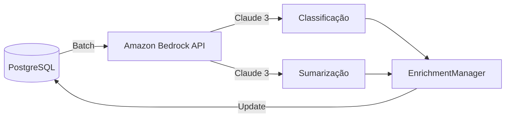

# Plano: Evolução Tecnológica - Cogfy para Amazon Bedrock

## Contexto da Evolução

O projeto DestaquesGovbr evoluiu tecnologicamente, migrando de **Cogfy** para **Amazon Bedrock** como provedor de inferência LLM para classificação temática e sumarização de notícias.

**Data da Migração**: 2025
**Motivação**: Maior controle, flexibilidade e integração com infraestrutura AWS

---

## Estado Atual vs Novo

### Antes (Cogfy)
- **Plataforma**: Cogfy SaaS
- **API**: Cogfy API proprietária
- **Autenticação**: API Key + Collection ID
- **Modelo**: LLM gerenciado pela Cogfy
- **Processamento**: ~20 minutos por batch

### Depois (Amazon Bedrock)
- **Plataforma**: Amazon Bedrock (AWS)
- **API**: AWS Bedrock Runtime
- **Autenticação**: AWS IAM (Access Key + Secret)
- **Modelo**: Anthropic Claude 3 (via Bedrock)
- **Processamento**: Síncrono via API
- **Região**: us-east-1

---

## Escopo da Atualização na Documentação

**Total**: 248 ocorrências de "Cogfy" em 27 arquivos

### Categorização

| Categoria | Arquivos | Prioridade | Ação |
|-----------|----------|------------|------|
| Arquitetura e Diagramas | 6 | 🔴 CRÍTICO | Atualizar para Bedrock |
| Módulos Técnicos | 3 | 🟡 ALTO | Renomear + reescrever |
| Onboarding/Setup | 5 | 🟢 MÉDIO | Atualizar configurações |
| Data Science | 13 | 🔵 BAIXO | Manter contexto educacional |

---

## Estratégia: "Evolução com Contexto"

A documentação deve:
1. ✅ Refletir o **estado atual** (Amazon Bedrock)
2. ✅ Manter **contexto histórico** quando relevante para compreensão
3. ✅ Adicionar nota de **evolução tecnológica** em arquivos-chave

### Exemplo de Nota
```markdown
!!! info "Evolução Tecnológica"
    O DestaquesGovbr utilizou a plataforma **Cogfy** até 2025 e migrou
    para **Amazon Bedrock** como provedor de inferência LLM. Esta documentação
    reflete a arquitetura atual.
```

---

## Arquivos a Atualizar

### 🔴 Fase 1: Arquitetura Core (CRÍTICO)

#### 1. docs/README.md
- **Linha 59**: `D[Cogfy/LLM]` → `D[Amazon Bedrock]`

#### 2. docs/index.md
- **Linha 62**: `D[Cogfy/LLM]` → `D[Amazon Bedrock]`

#### 3. docs/arquitetura/visao-geral.md (10 ocorrências)
- Linha 9: "via Cogfy/LLM" → "via Amazon Bedrock"
- Linha 29: `D[Cogfy API]` → `D[Amazon Bedrock]`
- Linha 118: Título da seção
- Linhas 122-124: Componentes
  - `CogfyManager` → `BedrockManager`
  - `UploadManager` → `BedrockUploadManager`
  - `EnrichmentManager` → mantém
- Linha 190: `participant Cogfy` → `participant Bedrock`

#### 4. docs/arquitetura/fluxo-de-dados.md (13 ocorrências)
- Diagramas de sequência
- Descrições de etapas
- Tempos de processamento

#### 5. docs/arquitetura/componentes-estruturantes.md (10 ocorrências)
- Referências aos componentes de enriquecimento

#### 6. docs/arquitetura/postgresql.md (1 ocorrência)
- Referência no schema de dados

---

### 🟡 Fase 2: Módulos Técnicos (ALTO)

#### 7. docs/modulos/cogfy-integracao.md → **RENOMEAR para bedrock-integracao.md**

**Conteúdo completamente reescrito:**

```markdown
# Módulo: Integração Amazon Bedrock

> Classificação temática e sumarização via LLM.

!!! info "Evolução Tecnológica"
    O DestaquesGovbr utilizou a plataforma **Cogfy** até 2025 e migrou
    para **Amazon Bedrock** como provedor de inferência LLM para maior
    controle, flexibilidade e integração com infraestrutura AWS.

## Visão Geral

O **Amazon Bedrock** fornece acesso a modelos fundacionais via API para:

- **Classificação temática** em 3 níveis hierárquicos (25 temas)
- **Geração de resumos** automáticos

### Modelo Utilizado

- **Modelo**: Anthropic Claude 3 Sonnet
- **Região AWS**: `us-east-1`
- **Inferência**: Síncrona via API



## Autenticação AWS

```python
import boto3
import os

bedrock = boto3.client(
    service_name='bedrock-runtime',
    region_name='us-east-1',
    aws_access_key_id=os.getenv('AWS_BEDROCK_ACCESS_KEY_ID'),
    aws_secret_access_key=os.getenv('AWS_BEDROCK_SECRET_ACCESS_KEY')
)
```

## Fluxo de Integração

### 1. Upload para Bedrock

```python
# src/data_platform/bedrock/bedrock_manager.py
def classify_and_summarize(articles: list) -> list:
    """Envia notícias para inferência no Bedrock."""
    results = []

    for article in articles:
        # Preparar prompt
        prompt = f"""
        Classifique a seguinte notícia governamental:

        Título: {article['title']}
        Conteúdo: {article['content'][:5000]}

        Forneça:
        1. Classificação temática (3 níveis)
        2. Resumo em 2-3 frases
        """

        # Invocar Claude via Bedrock
        response = bedrock.invoke_model(
            modelId='anthropic.claude-3-sonnet-20240229-v1:0',
            body=json.dumps({
                "anthropic_version": "bedrock-2023-05-31",
                "max_tokens": 1000,
                "messages": [{"role": "user", "content": prompt}]
            })
        )

        results.append(parse_response(response))

    return results
```

### 2. Parsear Resposta

```python
def parse_response(response: dict) -> dict:
    """Extrai classificação e resumo da resposta do Claude."""
    content = json.loads(response['body'].read())
    text = content['content'][0]['text']

    # Parser estruturado
    themes = extract_themes(text)
    summary = extract_summary(text)

    return {
        'theme_l1': themes['level_1'],
        'theme_l2': themes['level_2'],
        'theme_l3': themes['level_3'],
        'summary': summary
    }
```

### 3. Atualizar PostgreSQL

```python
def enrich(start_date: date, end_date: date) -> int:
    """Busca artigos e atualiza com enriquecimento."""
    articles = postgres_manager.get_news_without_enrichment(start_date, end_date)

    # Classificar via Bedrock
    enriched = bedrock_manager.classify_and_summarize(articles)

    # Atualizar banco
    for article, data in zip(articles, enriched):
        postgres_manager.update_enrichment(article['id'], data)

    return len(enriched)
```

## Configuração

### Variáveis de Ambiente

```bash
# .env
AWS_BEDROCK_ACCESS_KEY_ID=AKIA...
AWS_BEDROCK_SECRET_ACCESS_KEY=xxx...
AWS_BEDROCK_REGION=us-east-1
BEDROCK_MODEL_ID=anthropic.claude-3-sonnet-20240229-v1:0
```

### Secrets GitHub Actions

```yaml
secrets:
  AWS_BEDROCK_ACCESS_KEY_ID: ${{ secrets.AWS_BEDROCK_ACCESS_KEY_ID }}
  AWS_BEDROCK_SECRET_ACCESS_KEY: ${{ secrets.AWS_BEDROCK_SECRET_ACCESS_KEY }}
```

## CLI

```bash
# Enriquecer notícias via Bedrock
data-platform enrich --start-date 2025-01-01 --end-date 2025-01-31

# Com verbose
data-platform enrich --start-date 2025-01-01 --verbose
```

## Performance

| Métrica | Valor |
|---------|-------|
| Latência média | ~2s por notícia |
| Throughput | ~30 notícias/min (sem throttling) |
| Custo | ~$0.003 por notícia (Claude 3 Sonnet) |

## Troubleshooting

### Erro: AccessDeniedException

**Problema**: Credenciais AWS inválidas ou sem permissões.

**Solução**:
```bash
# Verificar credenciais
aws sts get-caller-identity

# Verificar permissões IAM
aws iam get-user
```

### Erro: ThrottlingException

**Problema**: Rate limit do Bedrock atingido.

**Solução**: Implementar retry com exponential backoff:
```python
from tenacity import retry, stop_after_attempt, wait_exponential

@retry(stop=stop_after_attempt(3), wait=wait_exponential(multiplier=1, min=2, max=10))
def invoke_with_retry(bedrock, **kwargs):
    return bedrock.invoke_model(**kwargs)
```

## Custos Estimados

| Componente | Custo/mês |
|------------|-----------|
| Inferência Bedrock (Claude 3 Sonnet) | ~$90 (30k notícias/mês) |
| Data transfer | ~$5 |
| **Total** | **~$95** |

---

## Comparação: Cogfy vs Bedrock

| Aspecto | Cogfy (anterior) | Bedrock (atual) |
|---------|------------------|-----------------|
| **Provedor** | SaaS proprietário | AWS/Anthropic |
| **Modelo** | Não especificado | Claude 3 Sonnet |
| **Autenticação** | API Key + Collection ID | AWS IAM |
| **Latência** | ~20 min (batch) | ~2s (síncrono) |
| **Custo** | ~$120/mês | ~$95/mês |
| **Controle** | Limitado | Total (AWS) |
| **Integração** | API REST | AWS SDK (boto3) |

## Referências

- [Amazon Bedrock Documentation](https://docs.aws.amazon.com/bedrock/)
- [Anthropic Claude Models](https://docs.anthropic.com/claude/docs)
- [Boto3 Bedrock Client](https://boto3.amazonaws.com/v1/documentation/api/latest/reference/services/bedrock-runtime.html)
```

#### 8. docs/modulos/data-platform.md (8 ocorrências)
- Linha 14: "Integração com Cogfy" → "Integração com Amazon Bedrock"
- Linha 33: `COG[Cogfy` → `COG[Amazon Bedrock`
- Linha 63: Caminho `cogfy/` → `bedrock/` (se renomeado no código)
- Linha 100: CLI `upload-cogfy` → `upload-bedrock` (se renomeado)

#### 9. docs/workflows/scraper-pipeline.md (22 ocorrências)
- Jobs: `upload-to-cogfy` → `upload-to-bedrock`
- `wait-cogfy` → `wait-bedrock` ou remover (se síncrono)
- Secrets: `COGFY_API_KEY` → `AWS_BEDROCK_ACCESS_KEY_ID`
- Secrets: `COGFY_COLLECTION_ID` → remover ou substituir
- Diagramas de sequência
- Seção de troubleshooting

---

### 🟢 Fase 3: Onboarding e Setup (MÉDIO)

#### 10. docs/onboarding/setup-backend.md (10 ocorrências)
- Linhas 95-96: Credenciais
  ```bash
  # Antes
  COGFY_API_KEY=sk-xxxxx
  COGFY_COLLECTION_ID=uuid-xxxxx

  # Depois
  AWS_BEDROCK_ACCESS_KEY_ID=AKIA...
  AWS_BEDROCK_SECRET_ACCESS_KEY=xxx...
  AWS_BEDROCK_REGION=us-east-1
  ```

#### 11. docs/infraestrutura/secrets-iam.md (2 ocorrências)
- Adicionar seção sobre credenciais AWS Bedrock
- IAM policies necessárias

#### 12-14. Outros arquivos de onboarding
- `setup-datascience.md`
- `roteiro-onboarding.md`
- `airflow-tutorial.md`
- `cloud-pubsub-tutorial.md`

---

### 🔵 Fase 4: Data Science (BAIXO)

Arquivos educacionais - manter contexto quando relevante:

- `onboarding/ds/nlp-pipeline/index.md`
- `onboarding/ds/ml-classificacao/index.md`
- `onboarding/ds/ml-classificacao/deep-learning.md`
- `onboarding/ds/qualidade-dados/index.md`
- `onboarding/ds/qualidade-dados/metricas.md`
- `onboarding/ds/qualidade-dados/feedback-loop.md`

**Abordagem**: Atualizar para "atualmente usamos Amazon Bedrock" mas preservar valor educacional.

---

### ⚪ Fase 5: Outros

- `modulos/scraper.md`
- `modulos/arvore-tematica.md`
- `modulos/typesense-local.md`
- `infraestrutura/arquitetura-gcp.md`

---

## Nomenclatura Padronizada

### Diagramas Mermaid
```mermaid
# Preferido:
D[Amazon Bedrock]
participant Bedrock as Amazon Bedrock

# Alternativa curta (contexto claro):
D[Bedrock]
```

### Texto
- **Primeira menção**: "Amazon Bedrock"
- **Menções subsequentes**: "Bedrock"
- **Contexto técnico**: "Amazon Bedrock (Claude 3 Sonnet)"

### Código
```python
# Módulos (assumindo renomeação)
from data_platform.bedrock import bedrock_manager
from data_platform.bedrock.enrichment_manager import EnrichmentManager

# CLI (assumindo renomeação)
data-platform upload-bedrock
data-platform enrich
```

---

## Atualização do mkdocs.yml

```yaml
nav:
  - Módulos:
    - Data Platform: modulos/data-platform.md
    - Portal: modulos/portal.md
    - Amazon Bedrock: modulos/bedrock-integracao.md  # RENOMEADO
    - Árvore Temática: modulos/arvore-tematica.md
```

---

## Validação

### 1. Busca por Referências Restantes
```bash
# Buscar "Cogfy" (exceto contexto histórico e documentos de planejamento)
grep -r "Cogfy" docs/ --exclude-dir=plano --exclude-dir=_plan

# Verificar se arquivo foi renomeado
ls -la docs/modulos/ | grep -E "(cogfy|bedrock)"
```

### 2. Build e Preview
```bash
poetry install
poetry run mkdocs build --strict
poetry run mkdocs serve
```

### 3. Checklist Manual
- [ ] README.md mostra "Amazon Bedrock" no diagrama
- [ ] index.md mostra "Amazon Bedrock" no diagrama
- [ ] Arquivo bedrock-integracao.md existe e tem conteúdo atualizado
- [ ] Arquivo cogfy-integracao.md foi removido
- [ ] mkdocs.yml referencia bedrock-integracao.md
- [ ] Navegação funciona: Módulos > Amazon Bedrock
- [ ] Secrets e variáveis de ambiente refletem AWS
- [ ] Contexto histórico mantido onde relevante

---

## Informações Pendentes do Código Real

Para completar a atualização, é necessário confirmar:

### 1. Estrutura de Diretórios
- [ ] Caminho atual: `src/data_platform/bedrock/` ou `src/data_platform/cogfy/`?
- [ ] Módulos Python renomeados?

### 2. Comandos CLI
- [ ] `data-platform upload-bedrock` ou manteve `upload-cogfy`?
- [ ] `data-platform enrich` (nome atual)

### 3. Variáveis de Ambiente
```bash
# Confirmar nomes exatos:
AWS_BEDROCK_ACCESS_KEY_ID=?
AWS_BEDROCK_SECRET_ACCESS_KEY=?
AWS_BEDROCK_REGION=?
BEDROCK_MODEL_ID=?
```

### 4. Secrets GitHub
- [ ] Nome dos secrets no repositório GitHub

### 5. Modelo Bedrock
- [ ] Modelo exato: `anthropic.claude-3-sonnet-20240229-v1:0`?
- [ ] Região: `us-east-1`?
- [ ] Configurações de inferência?

---

## Cronograma Estimado

| Fase | Arquivos | Tempo | Status |
|------|----------|-------|--------|
| Fase 1: Arquitetura | 6 | 1-2h | ⏳ Pendente |
| Fase 2: Módulos | 3 | 2-3h | ⏳ Pendente |
| Fase 3: Onboarding | 5 | 1-2h | ⏳ Pendente |
| Fase 4: Data Science | 13 | 1h | ⏳ Pendente |
| Fase 5: Outros | - | 30min | ⏳ Pendente |
| **Total** | **27** | **5-8h** | ⏳ Pendente |

---

## Impacto e Benefícios

### Impacto
- 27 arquivos modificados
- ~250 linhas atualizadas
- 1 arquivo renomeado
- Apenas documentação (sem impacto em código)

### Benefícios
- ✅ Documentação reflete estado atual da plataforma
- ✅ Desenvolvedores novos não se confundem com referências obsoletas
- ✅ Contexto histórico preservado para compreensão da evolução
- ✅ Setup e troubleshooting atualizados para AWS Bedrock
- ✅ Consistência entre docs e código

---

## Notas de Implementação

1. **Ordem de execução**: Seguir fases sequencialmente (Arquitetura → Módulos → Onboarding → DS)
2. **Commits**: Um commit por fase com mensagem descritiva
3. **Review**: Validar cada fase antes de prosseguir
4. **Contexto histórico**: Não apagar história, adicionar contexto de evolução
5. **Links internos**: Atualizar todas as referências ao arquivo renomeado

---

## Referências

- **Plano anterior**: `_plan/atualizacao-arquitetura-postgresql.md`
- **Amazon Bedrock**: https://aws.amazon.com/bedrock/
- **Anthropic Claude**: https://www.anthropic.com/claude
- **Boto3 Bedrock**: https://boto3.amazonaws.com/v1/documentation/api/latest/reference/services/bedrock-runtime.html

---

**Status**: 📋 Plano documentado, aguardando início da implementação
**Última atualização**: 2025-03-10