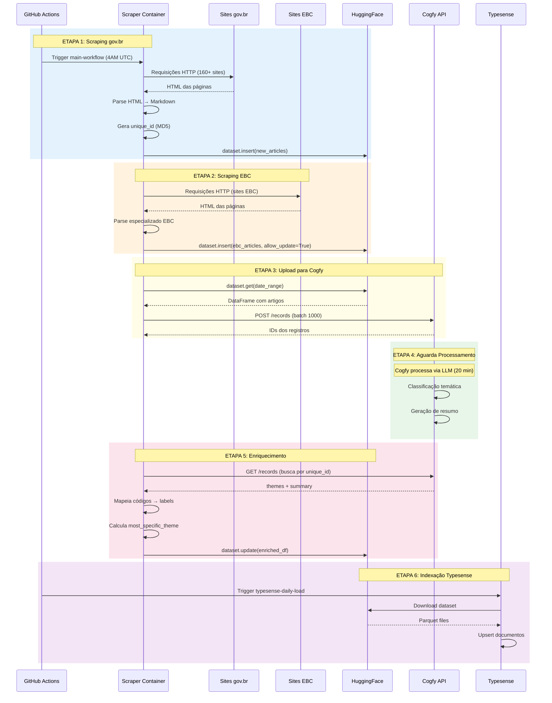

# Fluxo de Dados

## Pipeline Diário

O pipeline de dados é executado diariamente às **4AM UTC** (1AM Brasília) via GitHub Actions.

### Diagrama de Sequência Completo



## Etapas Detalhadas

### Etapa 1: Scraping gov.br

**Workflow**: `main-workflow.yaml` → job `scraper`

```bash
python src/main.py scrape --start-date YYYY-MM-DD --end-date YYYY-MM-DD
```

**Processo**:
1. Carrega URLs de `src/scraper/site_urls.yaml` (~160+ URLs)
2. Para cada URL, instancia `WebScraper`
3. Navega por páginas com paginação (`?b_start:int=N`)
4. Extrai campos: title, date, url, image, category, tags
5. Faz fetch do conteúdo completo de cada notícia
6. Converte HTML → Markdown com `markdownify`
7. Gera `unique_id = MD5(agency + published_at + title)`
8. Insere no HuggingFace via `DatasetManager.insert()`

**Retry Logic**:
```python
@retry(tries=5, delay=2, backoff=3, jitter=(1,3))
def fetch_page(url): ...
```

### Etapa 2: Scraping EBC

**Workflow**: `main-workflow.yaml` → job `ebc-scraper`

```bash
python src/main.py scrape-ebc --start-date YYYY-MM-DD --end-date YYYY-MM-DD --allow-update
```

**Diferenças**:
- Scraper especializado (`EBCWebScraper`)
- Estrutura HTML diferente dos sites gov.br
- `allow_update=True` permite sobrescrever registros existentes

### Etapa 3: Upload para Cogfy

**Workflow**: `main-workflow.yaml` → job `upload-to-cogfy`

```bash
python src/upload_to_cogfy_manager.py --start-date YYYY-MM-DD --end-date YYYY-MM-DD
```

**Processo**:
1. Carrega artigos do HuggingFace por intervalo de datas
2. Converte campos para formato Cogfy:
   - `published_at` → datetime UTC
   - `tags` → string JSON
3. Envia em batches de 1000 registros
4. Salva mapeamento `unique_id` ↔ `cogfy_record_id`

### Etapa 4: Processamento Cogfy

**Tempo**: ~20 minutos de delay configurado no workflow

O Cogfy executa:
- **Classificação temática** em 3 níveis usando a árvore de temas
- **Geração de resumo** via LLM

> **Nota**: A configuração do Cogfy não está em código. Screenshots serão adicionados futuramente.

### Etapa 5: Enriquecimento

**Workflow**: `main-workflow.yaml` → job `enrich-themes`

```bash
python src/enrichment_manager.py --start-date YYYY-MM-DD --end-date YYYY-MM-DD
```

**Processo**:
1. Aguarda delay de 20 minutos (1200 segundos)
2. Busca registros processados no Cogfy por `unique_id`
3. Extrai campos enriquecidos:
   - `theme_1_level_1` (select) → código e label
   - `theme_1_level_2` (text) → código e label
   - `theme_1_level_3` (text) → código e label
   - `summary` (text)
4. Calcula `most_specific_theme` (prioridade: L3 > L2 > L1)
5. Atualiza dataset no HuggingFace

### Etapa 6: Indexação Typesense

**Workflow**: `typesense-daily-load.yml` (10AM UTC)

```bash
python python/scripts/load_data.py --mode incremental --days 7
```

**Processo**:
1. Conecta ao Typesense em produção
2. Baixa dataset do HuggingFace (últimos 7 dias)
3. Faz upsert dos documentos na collection `news`

## Dados de Entrada e Saída

### Entrada (Sites gov.br)

```html
<!-- Estrutura típica de item de notícia -->
<article class="tileItem">
  <a href="/orgao/noticia/titulo-da-noticia">
    <h2>Título da Notícia</h2>
  </a>
  <span class="summary">Resumo...</span>
  <span class="documentPublished">01/12/2025</span>
  
</article>
```

### Saída (HuggingFace Dataset)

```json
{
  "unique_id": "abc123def456",
  "agency": "gestao",
  "published_at": "2024-12-02T10:00:00Z",
  "updated_datetime": "2024-12-02T14:30:00Z",
  "extracted_at": "2024-12-02T07:00:00Z",
  "title": "Título da Notícia",
  "subtitle": "Subtítulo explicativo",
  "editorial_lead": "Linha fina com contexto",
  "url": "https://www.gov.br/gestao/...",
  "content": "# Título\n\nConteúdo em Markdown...",
  "image": "https://www.gov.br/.../imagem.jpg",
  "video_url": null,
  "category": "Notícias",
  "tags": ["tag1", "tag2"],
  "theme_1_level_1_code": "01",
  "theme_1_level_1_label": "Economia e Finanças",
  "theme_1_level_2_code": "01.01",
  "theme_1_level_2_label": "Política Econômica",
  "theme_1_level_3_code": "01.01.01",
  "theme_1_level_3_label": "Política Fiscal",
  "most_specific_theme_code": "01.01.01",
  "most_specific_theme_label": "Política Fiscal",
  "summary": "Resumo gerado por AI..."
}
```

## Tratamento de Erros

### Scraping
- Retry com backoff exponencial (5 tentativas)
- Skip de artigos com erro (não bloqueia pipeline)
- Logs detalhados de falhas

### Cogfy
- Verificação de status antes de buscar resultados
- Fallback para valores vazios se inferência falhar

### HuggingFace
- Retry em push (5 tentativas)
- Deduplicação por `unique_id`

## Monitoramento

### GitHub Actions
- Status de cada job visível na interface
- Logs completos por etapa
- Notificações de falha

### Métricas
- Quantidade de artigos raspados por execução
- Taxa de sucesso de enriquecimento
- Tempo total de pipeline

## Execução Manual

### Scraping de período específico
```bash
# Via GitHub Actions
gh workflow run scraper-dispatch.yaml \
  -f min-date=2024-01-01 \
  -f max-date=2024-01-31
```

### Resync com Cogfy
```bash
gh workflow run cogfy-sync-dispatch.yaml
```

### Reload completo do Typesense
```bash
gh workflow run typesense-full-reload.yaml \
  -f confirm=DELETE
```

> **CUIDADO**: O full reload é destrutivo - deleta todos os dados antes de recarregar!
