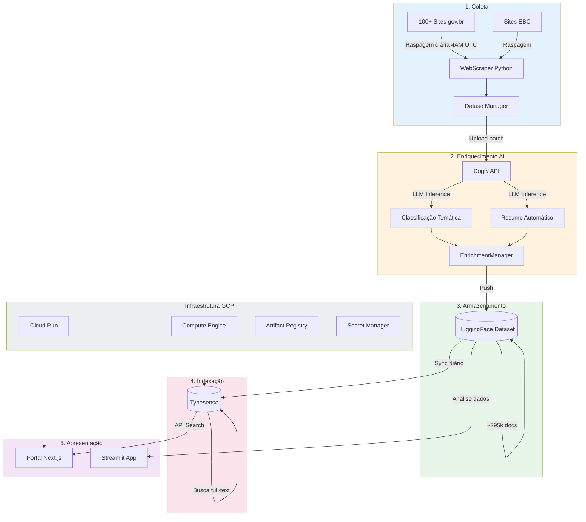
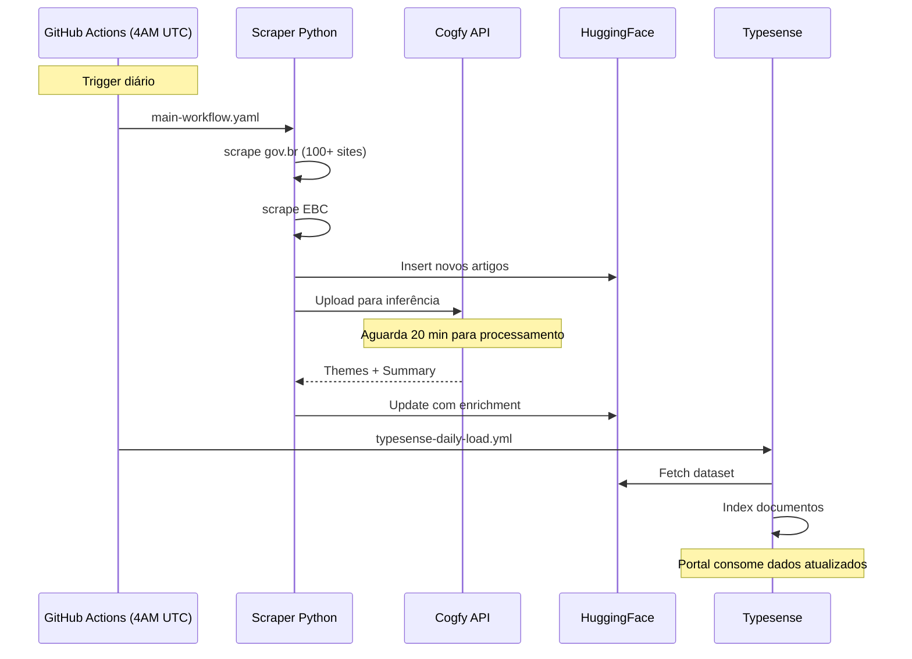

# Visão Geral da Arquitetura

## Resumo

O DestaquesGovbr é uma plataforma de agregação e enriquecimento de notícias governamentais composta por 5 camadas principais:

1. **Coleta** - Raspagem automatizada de ~100+ sites gov.br
2. **Enriquecimento** - Classificação temática e sumarização via AI/LLM
3. **Armazenamento** - Dataset no HuggingFace como fonte de verdade
4. **Indexação** - Typesense para busca full-text
5. **Apresentação** - Portal Next.js e apps de análise

## Diagrama de Arquitetura

## Componentes por Camada

### 1. Coleta (`govbrnews-scraper`)

| Componente | Arquivo | Responsabilidade |
|------------|---------|------------------|
| WebScraper | `src/scraper/webscraper.py` | Raspagem genérica de sites gov.br |
| EBC Scraper | `src/scraper/ebc_webscraper.py` | Raspagem especializada da EBC |
| ScrapeManager | `src/scraper/scrape_manager.py` | Orquestração paralela/sequencial |
| DatasetManager | `src/dataset_manager.py` | Insert/Update no HuggingFace |

**Dados extraídos por notícia:**
- `unique_id` - Hash MD5 (agency + published_at + title)
- `agency` - Identificador do órgão
- `published_at` - Data de publicação
- `title`, `url`, `image` - Metadados básicos
- `content` - Conteúdo completo em Markdown
- `category`, `tags` - Categorização original

### 2. Enriquecimento (`govbrnews-scraper` + Cogfy)

| Componente | Arquivo | Responsabilidade |
|------------|---------|------------------|
| CogfyManager | `src/cogfy_manager.py` | Cliente da API Cogfy |
| UploadToCogfy | `src/upload_to_cogfy_manager.py` | Envio de notícias para inferência |
| EnrichmentManager | `src/enrichment_manager.py` | Busca resultados e atualiza dataset |

**Campos enriquecidos:**
- `theme_1_level_1_code/label` - Tema nível 1 (ex: "01 - Economia")
- `theme_1_level_2_code/label` - Tema nível 2 (ex: "01.01 - Política Econômica")
- `theme_1_level_3_code/label` - Tema nível 3 (ex: "01.01.01 - Política Fiscal")
- `most_specific_theme_code/label` - Tema mais específico disponível
- `summary` - Resumo gerado por LLM

### 3. Armazenamento (HuggingFace)

**Dataset principal**: [nitaibezerra/govbrnews](https://huggingface.co/datasets/nitaibezerra/govbrnews)

- ~295.000+ documentos
- Atualização diária automatizada
- Exportação em CSV por agência e ano
- Versionamento automático pelo HuggingFace

### 4. Indexação (Typesense)

**Collection**: `news`

Configurado para:
- Busca full-text em `title` e `content`
- Filtros facetados por `agency`, `theme_*`, `published_at`
- Ordenação por relevância e data

### 5. Apresentação

| App | Tecnologia | URL |
|-----|------------|-----|
| Portal | Next.js 15 + Typesense | Cloud Run (GCP) |
| Streamlit | Python + Altair | HuggingFace Spaces |

## Fluxo de Dados Diário

## Tecnologias Principais

### Backend (Scraper)
- **Python 3.12+** com Poetry
- **BeautifulSoup4** para parsing HTML
- **datasets** (HuggingFace) para gerenciamento de dados
- **requests** com retry logic

### Frontend (Portal)
- **Next.js 15** com App Router
- **TypeScript 5**
- **Typesense** para busca
- **shadcn/ui** + Tailwind CSS
- **React Query** para data fetching

### Infraestrutura
- **GCP** - Cloud Run, Compute Engine, VPC
- **Terraform** - IaC
- **Docker** - Containerização
- **GitHub Actions** - CI/CD

## Custos Estimados

| Componente | Custo/mês |
|------------|-----------|
| Compute Engine (Typesense) | ~$55 |
| Cloud Run (Portal) | ~$12-17 |
| **Total** | **~$70** |

## Próximos Passos

→ Veja [fluxo-de-dados.md](fluxo-de-dados.md) para detalhes do pipeline
→ Veja [componentes-estruturantes.md](componentes-estruturantes.md) para árvore temática e órgãos
