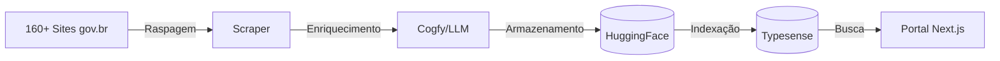

# DestaquesGovbr - Documentação Técnica

> Documentação central da plataforma DestaquesGovbr para onboarding de desenvolvedores e colaboradores técnicos.

## O que é o DestaquesGovbr?

O **DestaquesGovbr** é uma plataforma integrada de notícias e informações do Governo Federal Brasileiro que:

- **Centraliza** ~160+ portais governamentais em uma plataforma única
- **Classifica** automaticamente notícias usando AI/LLM em 25 temas e 3 níveis hierárquicos
- **Disponibiliza** dados abertos no HuggingFace (~300k+ notícias)
- **Oferece** portal web moderno com busca semântica

## Quick Start

### Para Desenvolvedores Backend (Python)
→ Veja [onboarding/setup-backend.md](onboarding/setup-backend.md)

### Para Desenvolvedores Frontend (TypeScript)
→ Veja [onboarding/setup-frontend.md](onboarding/setup-frontend.md)

### Roteiro Completo de Onboarding
→ Veja [onboarding/roteiro-onboarding.md](onboarding/roteiro-onboarding.md)

## Arquitetura



→ Veja detalhes em [arquitetura/visao-geral.md](arquitetura/visao-geral.md)

## Repositórios

| Repositório | Descrição | Tecnologia |
|-------------|-----------|------------|
| [govbrnews-scraper](https://github.com/destaquesgovbr/govbrnews-scraper) | Scraper + Pipeline de dados | Python/Poetry |
| [destaquesgovbr-portal](https://github.com/destaquesgovbr/destaquesgovbr-portal) | Portal web principal | Next.js 15 |
| [destaquesgovbr-infra](https://github.com/destaquesgovbr/destaquesgovbr-infra) | Infraestrutura como código | Terraform/GCP |
| [destaquesgovbr-typesense](https://github.com/destaquesgovbr/destaquesgovbr-typesense) | Typesense para dev local | Docker |
| [destaquesgovbr-agencies](https://github.com/destaquesgovbr/destaquesgovbr-agencies) | Dados dos órgãos | YAML |

## Estrutura da Documentação

```
docs/
├── arquitetura/           # Visão geral, fluxo de dados, componentes
├── modulos/               # Detalhes de cada módulo/repositório
├── workflows/             # GitHub Actions, CI/CD, pipelines
├── infraestrutura/        # GCP, Terraform, secrets
├── onboarding/            # Guias para novos desenvolvedores
├── plano/                 # Plano de implementação da documentação
└── assets/diagrams/       # Diagramas em Mermaid
```

## Recursos Externos

- **Portal (Preview)**: [destaquesgovbr-portal](https://destaquesgovbr-portal-klvx64dufq-rj.a.run.app/) *(URL provisória)*
- **Dataset Principal**: [nitaibezerra/govbrnews](https://huggingface.co/datasets/nitaibezerra/govbrnews)
- **Dataset Reduzido**: [nitaibezerra/govbrnews-reduced](https://huggingface.co/datasets/nitaibezerra/govbrnews-reduced)
- **Organização GitHub**: [github.com/destaquesgovbr](https://github.com/destaquesgovbr)

## Como Esta Documentação Foi Criada

Esta documentação foi **inteiramente gerada por LLM** (Claude Code) usando uma abordagem bottom-up: o código dos repositórios existentes foi analisado para criar uma camada de documentação sobre eles.

### Guia de Engenharia de Prompt

Documentamos o processo completo de criação como um guia de boas práticas:

→ Veja [plano/PLANO_IMPLEMENTACAO.md](plano/PLANO_IMPLEMENTACAO.md)

O guia inclui:

- **Mindset** para estruturar prompts de documentação
- **Prompts reais** utilizados neste projeto
- **Template reutilizável** para outros projetos
- **Boas práticas** aprendidas no processo

## Como Contribuir

→ Veja [CONTRIBUTING.md](CONTRIBUTING.md)

---

**Mantido pela equipe DestaquesGovbr** | Ministério da Gestão e da Inovação em Serviços Públicos
