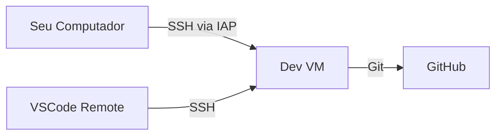
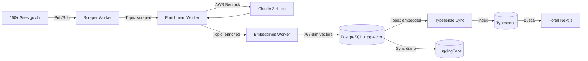

# DestaquesGovbr - Documentação Técnica

> Documentação central da plataforma DestaquesGovbr para onboarding de desenvolvedores e colaboradores técnicos.

## O que é o DestaquesGovbr?

O **DestaquesGovbr** é uma plataforma integrada de notícias e informações do Governo Federal Brasileiro que:

- **Centraliza** ~160+ portais governamentais em uma plataforma única
- **Classifica** automaticamente notícias usando AI/LLM em 25 temas e 3 níveis hierárquicos
- **Armazena** dados em PostgreSQL (fonte de verdade) e distribui via HuggingFace (~300k+ notícias)
- **Oferece** portal web moderno com busca semântica

## Quick Start

### Para Desenvolvedores Backend (Python)
→ Veja [onboarding/setup-backend.md](onboarding/setup-backend.md)

### Para Desenvolvedores Data Science (AWS Bedrock/LLM)
→ Veja [onboarding/ds/enriquecimento-llm.md](onboarding/ds/enriquecimento-llm.md) 🆕

### Para Desenvolvedores Frontend (TypeScript)
→ Veja [onboarding/setup-frontend.md](onboarding/setup-frontend.md)

### Roteiro Completo de Onboarding
→ Veja [onboarding/roteiro-onboarding.md](onboarding/roteiro-onboarding.md)

---

## Dev VM: Seu Ambiente no GCP

Cada desenvolvedor pode ter uma **VM dedicada no GCP** para desenvolvimento de código:


```mermaid
flowchart LR
    Dev[Seu Computador] -->|SSH via IAP| VM[Dev VM]
    VSCode[VSCode Remote] -->|SSH| VM
    VM -->|Git| GH[GitHub]
```

**Benefícios:**

- 💻 **Ambiente padronizado** - mesma configuração para toda equipe
- 💾 **Disco persistente** de 50GB em `/mnt/data` para seus projetos
- 🛡️ **Seguro** - sem IP público, acesso apenas via IAP
- 💰 **Econômico** - auto-shutdown às 19h

**Para criar sua Dev VM:**

1. Clone o repo [infra](https://github.com/destaquesgovbr/infra)
2. Adicione sua configuração em `terraform/terraform.tfvars`
3. Abra um PR e aguarde o merge

→ Guia completo: [infraestrutura/devvm.md](infraestrutura/devvm.md)

## Arquitetura


```mermaid
flowchart LR
    A[160+ Sites gov.br] -->|Pub/Sub| B[Scraper Worker]
    B -->|Topic: scraped| C[Enrichment Worker]
    C -->|AWS Bedrock| D[Claude 3 Haiku]
    D --> C
    C -->|Topic: enriched| E[Embeddings Worker]
    E -->|768-dim vectors| F[(PostgreSQL + pgvector)]
    F -->|Topic: embedded| G[Typesense Sync]
    G -->|Index| H[(Typesense)]
    H -->|Busca| I[Portal Next.js]
    F -->|Sync diário| J[(HuggingFace)]
```

**🔥 Nova Arquitetura Event-Driven** (desde 27/02/2026):
- ✅ Latência: 45min → 15s (99.97% redução)
- ✅ Custo: ↓40% (Cogfy → AWS Bedrock)
- ✅ Taxa de sucesso: 82% → 97%

→ Veja detalhes em [arquitetura/visao-geral.md](arquitetura/visao-geral.md)  
→ Workers Pub/Sub: [modulos/news-enrichment-worker.md](modulos/news-enrichment-worker.md) 🆕

## Repositórios

| Repositório | Descrição | Tecnologia | Documentação |
|-------------|-----------|------------|--------------|
| [data-science](https://github.com/destaquesgovbr/data-science) | Enriquecimento LLM (AWS Bedrock) 🆕 | Python/Poetry | [onboarding/ds/](onboarding/ds/) |
| [data-platform](https://github.com/destaquesgovbr/data-platform) | Pipeline de dados (workers, sync) | Python/Poetry | [modulos/data-platform.md](modulos/data-platform.md) |
| [portal](https://github.com/destaquesgovbr/portal) | Portal web principal | Next.js 15 | [modulos/portal.md](modulos/portal.md) |
| [scraper](https://github.com/destaquesgovbr/scraper) | Coleta de notícias gov.br | Python/FastAPI | [modulos/scraper.md](modulos/scraper.md) |
| [infra](https://github.com/destaquesgovbr/infra) | Infraestrutura como código | Terraform/GCP | [infraestrutura/](infraestrutura/) |
| [agencies](https://github.com/destaquesgovbr/agencies) | Dados dos órgãos | YAML | [modulos/agencies.md](modulos/agencies.md) |
| [themes](https://github.com/destaquesgovbr/themes) | Taxonomia temática | YAML | [modulos/arvore-tematica.md](modulos/arvore-tematica.md) |

## Estrutura da Documentação

```
docs/
├── arquitetura/           # Visão geral, fluxo de dados, componentes
│   └── pubsub-workers.md  # Arquitetura event-driven (Pub/Sub)
├── modulos/               # Detalhes de cada módulo/repositório
│   ├── news-enrichment-worker.md 🆕  # Worker core (AWS Bedrock)
│   ├── embeddings-api.md 🆕          # API de embeddings (768-dim)
│   ├── cogfy-integracao.md ⚠️        # HISTÓRICO (descontinuado)
│   └── ...
├── workflows/             # GitHub Actions, CI/CD, pipelines
├── infraestrutura/        # GCP, Terraform, secrets
├── onboarding/            # Guias para novos desenvolvedores
│   ├── ds/                # 🆕 Data Science específico
│   │   ├── enriquecimento-llm.md 🆕  # Onboarding AWS Bedrock/LLM
│   │   └── workers-pubsub.md 🆕      # Template para criar workers
│   └── ...
├── seguranca/             # 🆕 Documentação de segurança
│   └── credenciais-aws-bedrock.md 🆕 # Gerenciamento de credenciais
├── plano/                 # Plano de implementação da documentação
├── relatorios/            # Relatórios técnicos gerados
│   └── Quadro-Resumo-Atualizações-Implementações-2026.md 🆕
└── assets/diagrams/       # Diagramas em Mermaid
```

### 🆕 Novos Documentos (Sprint 05/05/2026)

| Documento | Descrição | Prioridade |
|-----------|-----------|-----------|
| [modulos/news-enrichment-worker.md](modulos/news-enrichment-worker.md) | Arquitetura completa do worker de enriquecimento (core) | 🔴 CRÍTICA |
| [onboarding/ds/enriquecimento-llm.md](onboarding/ds/enriquecimento-llm.md) | Onboarding para novos devs trabalhando com LLM/Bedrock | 🔴 CRÍTICA |
| [onboarding/ds/workers-pubsub.md](onboarding/ds/workers-pubsub.md) | Template para criar novos workers Pub/Sub | 🔴 CRÍTICA |
| [modulos/embeddings-api.md](modulos/embeddings-api.md) | API de embeddings semânticos (768-dim) | 🟡 MÉDIA |
| [seguranca/credenciais-aws-bedrock.md](seguranca/credenciais-aws-bedrock.md) | Gerenciamento seguro de credenciais AWS | 🟡 MÉDIA |
| [relatorios/Quadro-Resumo-Atualizações-Implementações-2026.md](relatorios/Quadro-Resumo-Atualizações-Implementações-2026.md) | Análise completa de atualizações Q1 2026 | 🟢 INFO |

## Recursos Externos

- **Portal (Preview)**: [portal](https://portal-klvx64dufq-rj.a.run.app/) *(URL provisória)*
- **Dataset Principal**: [nitaibezerra/govbrnews](https://huggingface.co/datasets/nitaibezerra/govbrnews)
- **Dataset Reduzido**: [nitaibezerra/govbrnews-reduced](https://huggingface.co/datasets/nitaibezerra/govbrnews-reduced)
- **Organização GitHub**: [github.com/destaquesgovbr](https://github.com/destaquesgovbr)

## Como Esta Documentação Foi Criada

Esta documentação foi **inteiramente gerada por LLM** (Claude Code) usando uma abordagem bottom-up: o código dos repositórios existentes foi analisado para criar uma camada de documentação sobre eles.

### Guia de Engenharia de Prompt

Documentamos o processo completo de criação como um guia de boas práticas:

→ Veja [plano/PLANO_IMPLEMENTACAO.md](plano/PLANO_IMPLEMENTACAO.md)

O guia inclui:

- **Mindset** para estruturar prompts de documentação
- **Prompts reais** utilizados neste projeto
- **Template reutilizável** para outros projetos
- **Boas práticas** aprendidas no processo

## Como Contribuir

→ Veja [CONTRIBUTING.md](CONTRIBUTING.md)

---

**Mantido pela equipe DestaquesGovbr** | Ministério da Gestão e da Inovação em Serviços Públicos
