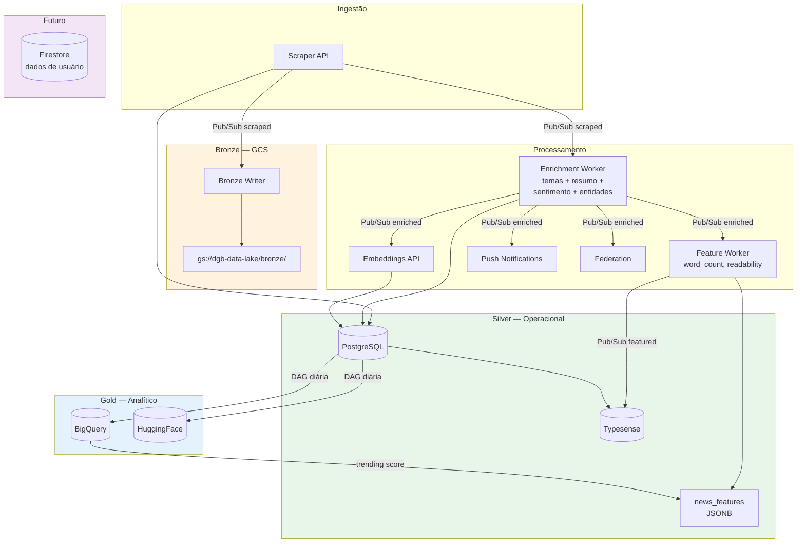

# ADR-001: Arquitetura de Dados Medallion com Feature Store JSONB

- **Status**: Proposta
- **Data**: 2026-03-01
- **Autor**: Nitai Bezerra

## Contexto

A plataforma DGB está entrando numa fase de expansão onde novos metadados (features) serão criados para cada notícia — derivados de IA (sentimento, entidades, legibilidade), métricas analíticas (trending, engajamento), e relações entre artigos (similaridade, clusters temáticos).

Atualmente o PostgreSQL (Cloud SQL, db-f1-micro, ~300k artigos) concentra todas as responsabilidades: dados brutos, enriquecidos, embeddings e queries operacionais. A tabela `news` já possui ~25 colunas e cada feature nova exigiria `ALTER TABLE ADD COLUMN`, tornando o schema rígido.

### Problemas identificados

1. **Schema acoplado a features**: cada feature nova requer migração DDL na tabela `news`
2. **Sem separação analítico/operacional**: o PG serve tanto o pipeline operacional quanto qualquer análise
3. **Sem Data Lake**: dados brutos do scraping são transformados in-place, sem preservação do estado original
4. **Dados de usuário inexistentes**: sem infraestrutura para subscriptions personalizadas, preferências ou histórico de leitura

## Decisão

Adotar uma arquitetura em camadas **Medallion (Bronze / Silver / Gold)** adaptada à escala e orçamento do DGB, com um **Feature Store leve** baseado em JSONB no PostgreSQL.

### Camadas

```
┌─────────────────────────────────────────────────────────────────────┐
│  BRONZE — Dados brutos imutáveis                                    │
│  GCS bucket (gs://dgb-data-lake/bronze/)                            │
│  JSON/Parquet particionado por data                                 │
├─────────────────────────────────────────────────────────────────────┤
│  SILVER — Dados operacionais (fonte de verdade)                     │
│  PostgreSQL: news, agencies, themes + news_features (JSONB)         │
│  Typesense: índice de busca full-text + vetorial                    │
├─────────────────────────────────────────────────────────────────────┤
│  GOLD — Dados analíticos e agregados                                │
│  BigQuery: fato_noticias, dimensões, métricas, trending             │
│  GCS: exports Parquet (HuggingFace, snapshots)                      │
└─────────────────────────────────────────────────────────────────────┘
```

### Fluxo de dados alvo



### Feature Store: tabela `news_features` (JSONB)

Em vez de adicionar colunas ao `news`, criar uma tabela lateral com schema flexível:

```sql
CREATE TABLE news_features (
    unique_id  TEXT PRIMARY KEY REFERENCES news(unique_id),
    features   JSONB NOT NULL DEFAULT '{}',
    updated_at TIMESTAMPTZ NOT NULL DEFAULT NOW()
);
CREATE INDEX idx_news_features_gin ON news_features USING GIN (features);
```

Exemplo de documento `features`:

```json
{
  "sentiment": {"score": 0.72, "label": "positive"},
  "readability": {"flesch_ease": 45.2, "grade_level": 12},
  "entities": [
    {"text": "MEC", "type": "ORG"},
    {"text": "Lula", "type": "PER"}
  ],
  "word_count": 523,
  "trending_score": 8.5,
  "similar_articles": ["abc123", "def456"],
  "topic_cluster_id": 42
}
```

### Feature Registry

Arquivo `feature_registry.yaml` versionado no repositório `data-platform` para controlar quais features existem, suas versões e como são computadas:

```yaml
features:
  sentiment:
    version: "1.0"
    model: "bedrock/claude-haiku"
    compute: "enrichment-worker"
  readability:
    version: "1.0"
    model: "local/textstat"
    compute: "feature-worker"
  entities:
    version: "1.0"
    model: "bedrock/claude-haiku"
    compute: "enrichment-worker"
  word_count:
    version: "1.0"
    model: "local/python"
    compute: "feature-worker"
  trending_score:
    version: "1.0"
    model: "bigquery/sql"
    compute: "airflow-dag"
```

## Alternativas consideradas

### 1. MongoDB/Firestore como banco principal de features

- **Prós**: schema-less nativo, escalabilidade horizontal
- **Contras**: custo de operar mais um banco, perda de JOINs transacionais com `news`, complexidade operacional
- **Veredicto**: descartado para o volume atual (~300k registros). JSONB no PostgreSQL oferece as mesmas vantagens de schema flexível com zero custo incremental

### 2. Adicionar colunas diretamente na tabela `news`

- **Prós**: simples, sem tabela extra
- **Contras**: schema cada vez mais largo, migrações DDL frequentes, acoplamento entre features e dados core
- **Veredicto**: descartado — não escala para dezenas de features com schemas heterogêneos

### 3. Vertex AI Feature Store

- **Prós**: solução gerenciada do GCP, integração nativa com ML pipelines
- **Contras**: over-engineering para o volume, custo alto, complexidade desnecessária
- **Veredicto**: descartado — o padrão PG + GCS + BQ é suficiente para o estágio atual

### 4. BigQuery como armazenamento único (sem GCS intermediário)

- **Prós**: menos componentes
- **Contras**: storage 10x mais caro que GCS, sem dados brutos imutáveis, BigQuery lê Parquet do GCS nativamente via external tables
- **Veredicto**: GCS como Data Lake bronze é mais econômico e flexível

## Plano de implementação

### Fase 0 — Fundação (~1 semana, custo: $0)

- Criar tabela `news_features` com índice GIN
- Criar bucket GCS `dgb-data-lake` via Terraform (lifecycle: Standard → Nearline 90d → Coldline 365d)
- Criar `feature_registry.yaml`
- Habilitar BigQuery API

### Fase 1 — Features locais + Bronze (~2-3 semanas, custo: +$1-2/mês)

- **Bronze Writer** (Cloud Function): subscriber de `dgb.news.scraped` → grava JSON no GCS
- **Feature Worker** (Cloud Function): subscriber de `dgb.news.enriched` → computa features locais (word_count, readability, has_numbers, paragraph_count, publication_hour, day_of_week)
- Estender Enrichment Worker com sentiment e entities (custo marginal, já paga pela chamada ao Haiku)
- Novo topic Pub/Sub: `dgb.news.featured`

### Fase 2 — BigQuery Analytics (~3-4 semanas, custo: +$0-5/mês no free tier)

- Dataset `dgb_gold` com tabelas fato e dimensão
- DAG Airflow: PG → Parquet (GCS silver/) → BigQuery load (incremental diário)
- External tables sobre dados bronze do GCS
- Views materializadas: métricas diárias por agência, trending

### Fase 3 — Features avançadas (~4-6 semanas, custo: +$2-5/mês)

- Trending score via BigQuery → atualização periódica em `news_features` → Typesense
- Topic clusters via pgvector similarity + HDBSCAN
- Métricas de engajamento: portal → Pub/Sub → BigQuery

### Fase 4 — Dados de usuário (~6-8 semanas, custo: +$0-2/mês no free tier)

- Firestore (Native mode) para `users`, `preferences`, `reading_history`
- API de preferências no portal
- Personalização baseada em histórico

## Consequências

### Positivas

- **Extensibilidade**: novas features são apenas novos campos JSONB — sem migrações DDL
- **Separação de responsabilidades**: operacional (PG/Typesense), analítico (BigQuery), histórico (GCS)
- **Custo controlado**: incremento de ~$2-4/mês sobre os ~$230-280/mês atuais, aproveitando free tiers
- **Interoperabilidade**: BigQuery lê GCS nativamente, Pub/Sub alimenta todas as camadas
- **Preservação de dados**: camada bronze garante dados brutos imutáveis para reprocessamento

### Negativas

- **Mais componentes para operar**: GCS, BigQuery, Cloud Functions adicionados ao stack
- **Latência para features analíticas**: trending score atualizado a cada 6h, não em tempo real
- **JSONB não é tipado**: validação de features depende do Feature Registry (convenção, não enforcement do banco)

### Riscos e mitigações

| Risco | Mitigação |
|-------|-----------|
| JSONB fica lento com volume grande | Monitorar; se ultrapassar 2M registros, avaliar migração para Firestore |
| BigQuery free tier não ser suficiente | 1TB queries/mês é ~10x o necessário hoje; monitorar via billing alerts |
| Feature Registry ficar desatualizado | CI check: validar que toda feature em `news_features` está registrada no YAML |

## Referências

- [Plano detalhado](https://github.com/destaquesgovbr/data-platform/blob/main/_plan/DATA-ARCHITECTURE-EVOLUTION.md)
- [PostgreSQL JSONB documentation](https://www.postgresql.org/docs/15/datatype-json.html)
- [Medallion Architecture (Databricks)](https://www.databricks.com/glossary/medallion-architecture)
- [BigQuery external tables](https://cloud.google.com/bigquery/docs/external-data-sources)
