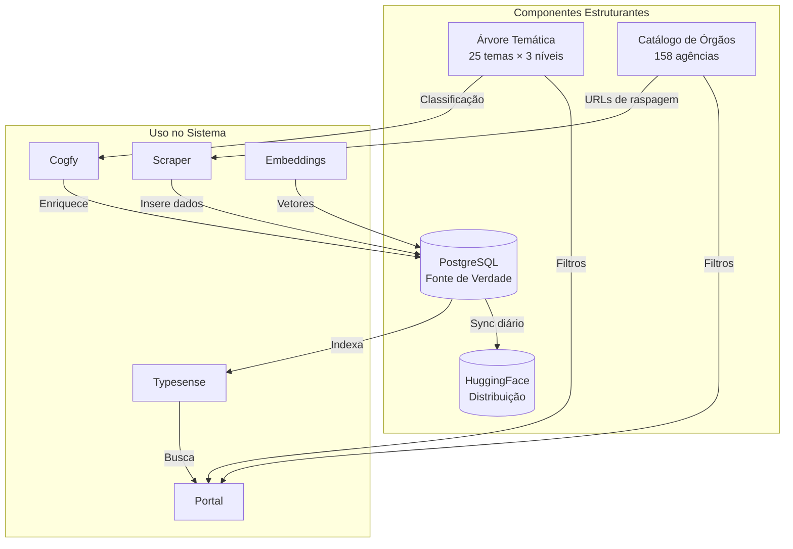

# Componentes Estruturantes

O DestaquesGovbr possui quatro componentes estruturantes que definem a organização dos dados:

1. **Árvore Temática** - Classificação hierárquica de notícias
2. **Catálogo de Órgãos** - Lista de 158 agências governamentais
3. **PostgreSQL** - Fonte de verdade dos dados
4. **HuggingFace** - Distribuição de dados abertos

## 1. Árvore Temática

### Visão Geral

A árvore temática é uma taxonomia hierárquica de **25 temas principais** organizados em **3 níveis**, usada para classificar automaticamente as notícias.

### Estrutura

```
Nível 1 (Tema)      → Nível 2 (Subtema)       → Nível 3 (Tópico)
01 - Economia       → 01.01 - Pol. Econômica  → 01.01.01 - Pol. Fiscal
                    → 01.02 - Fiscalização    → 01.02.01 - Fisc. Econômica
02 - Educação       → 02.01 - Ensino Básico   → 02.01.01 - Ed. Infantil
...
```

### Temas Principais (25)

| Código | Tema |
|--------|------|
| 01 | Economia e Finanças |
| 02 | Educação |
| 03 | Saúde |
| 04 | Segurança Pública |
| 05 | Meio Ambiente e Sustentabilidade |
| 06 | Ciência, Tecnologia e Inovação |
| 07 | Infraestrutura e Transportes |
| 08 | Cultura, Artes e Patrimônio |
| 09 | Esportes e Lazer |
| 10 | Agricultura, Pecuária e Abastecimento |
| 11 | Indústria e Comércio |
| 12 | Relações Internacionais e Diplomacia |
| 13 | Justiça e Direitos Humanos |
| 14 | Trabalho e Emprego |
| 15 | Desenvolvimento Social |
| 16 | Turismo |
| 17 | Energia e Recursos Minerais |
| 18 | Comunicações e Mídia |
| 19 | Defesa e Forças Armadas |
| 20 | Políticas Públicas e Governança |
| 21 | Legislação e Regulamentação |
| 22 | Eventos Oficiais e Cerimônias |
| 23 | Estatísticas e Dados Públicos |
| 24 | Minorias e Grupos Especiais |
| 25 | Habitação e Urbanismo |

### Arquivos

A árvore temática está armazenada no PostgreSQL e duplicada em repositórios (sincronização via pipeline):

| Local | Arquivo/Tabela | Formato |
|-------|----------------|---------|
| PostgreSQL | tabela `themes` | Normalizado (200+ registros) |
| data-platform | `src/data_platform/enrichment/themes_tree.yaml` | YAML plano |
| portal | `src/lib/themes.yaml` | YAML estruturado |

#### Formato no Data Platform (`themes_tree.yaml`)
```yaml
01 - Economia e Finanças:
  01.01 - Política Econômica:
    - 01.01.01 - Política Fiscal
    - 01.01.02 - Autonomia Econômica
    - 01.01.03 - Análise Econômica
  01.02 - Fiscalização e Tributação:
    - 01.02.01 - Fiscalização Econômica
    - 01.02.02 - Tributação e Impostos
```

#### Formato no Portal (`themes.yaml`)
```yaml
themes:
  - label: Economia e Finanças
    code: "01"
    children:
      - label: Política Econômica
        code: "01.01"
        children:
          - label: Política Fiscal
            code: "01.01.01"
          - label: Autonomia Econômica
            code: "01.01.02"
```

### Uso no Sistema

1. **Classificação (Cogfy)**: O LLM classifica cada notícia nos 3 níveis
2. **Filtros (Portal)**: Usuários filtram por tema no portal
3. **Navegação**: Páginas dedicadas por tema (`/temas/[themeLabel]`)
4. **Análise**: Agregação de notícias por tema no dashboard

### Meta Futura

Criar repositório dedicado `destaquesgovbr-themes` para:

- Centralizar a árvore temática
- Automatizar sincronização entre scraper e portal
- Versionamento e histórico de mudanças

---

## 2. Catálogo de Órgãos

### Visão Geral

O catálogo contém **156 órgãos governamentais** com metadados e hierarquia organizacional.

### Estrutura de Dados

Cada órgão possui:

- `name` - Nome oficial
- `parent` - Órgão superior (para hierarquia)
- `type` - Tipo (Ministério, Agência, Instituto, etc.)
- `url` - URL do feed de notícias

### Arquivos

| Local | Arquivo/Tabela | Conteúdo |
|-------|----------------|----------|
| PostgreSQL | tabela `agencies` | Dados dos 158 órgãos (normalizado) |
| agencies | `agencies.yaml` | Dados fonte dos órgãos |
| agencies | `hierarchy.yaml` | Árvore hierárquica |
| portal | `src/lib/agencies.yaml` | Cópia (sincronização manual) |
| data-platform | `src/data_platform/scrapers/agencies.yaml` | Mapeamento ID → Nome |
| data-platform | `src/data_platform/scrapers/site_urls.yaml` | URLs de raspagem |

### Exemplo de Entrada

```yaml
# agencies.yaml
sources:
  gestao:
    name: Ministério da Gestão e da Inovação em Serviços Públicos
    parent: presidencia
    type: Ministério
    url: https://www.gov.br/gestao/pt-br/assuntos/noticias

  inpe:
    name: Instituto Nacional de Pesquisas Espaciais
    parent: mcti
    type: Instituto
    url: https://www.gov.br/inpe/pt-br/assuntos/noticias
```

### Hierarquia Organizacional

```yaml
# hierarchy.yaml
presidencia:
  - gestao
  - mcti:
      - inpe
      - inpa
      - cnen:
          - cdtn
          - ien
  - saude:
      - anvisa
      - fiocruz
```

### Estatísticas

- **Total de órgãos**: 156
- **Tipos únicos**: 29
- **Principais pais**:

  - MCTI: 21 subordinados
  - Gestão: 12 subordinados
  - Cultura: 8 subordinados

### Uso no Sistema

1. **Scraping**: Determina quais sites raspar e como identificar a agência
2. **Filtros**: Usuários filtram por órgão no portal
3. **Navegação**: Páginas dedicadas por órgão (`/orgaos/[agencyKey]`)
4. **Hierarquia**: Visualização da estrutura organizacional

### Meta Futura

Automatizar sincronização:

1. Editar apenas em `agencies`
2. GitHub Action publica automaticamente no scraper e portal
3. Possível interface web para gestão

---

## 3. PostgreSQL (Fonte de Verdade)

### Visão Geral

O PostgreSQL (Cloud SQL) é a **fonte de verdade central** de todos os dados do sistema.

**Instância**: `destaquesgovbr-postgres` (southamerica-east1)

### Características

| Característica | Valor |
|----------------|-------|
| Documentos | ~300.000+ |
| Tabelas | 4 (agencies, themes, news, sync_log) |
| Atualização | Diária (4AM UTC) |
| Backup | Diário com PITR 7 dias |

→ Veja detalhes completos em [postgresql.md](postgresql.md)

---

## 4. HuggingFace (Distribuição)

### Visão Geral

O dataset no HuggingFace é a **camada de distribuição** de dados abertos, sincronizada diariamente a partir do PostgreSQL.

**URL**: [huggingface.co/datasets/nitaibezerra/govbrnews](https://huggingface.co/datasets/nitaibezerra/govbrnews)

### Características

| Característica | Valor |
|----------------|-------|
| Documentos | ~300.000+ |
| Sincronização | Diária (6AM UTC via Airflow) |
| Formato | Parquet (shards incrementais) |
| Versionamento | Automático pelo HF |

### Schema do Dataset

**Identificação:**

| Campo | Tipo | Origem | Descrição |
|-------|------|--------|-----------|
| `unique_id` | string | Scraper | MD5(agency + published_at + title) |
| `agency` | string | Scraper | Identificador do órgão |

**Datas:**

| Campo | Tipo | Origem | Descrição |
|-------|------|--------|-----------|
| `published_at` | timestamp | Scraper | Data/hora de publicação (ISO 8601, UTC) |
| `updated_datetime` | timestamp | Scraper | Data/hora de atualização |
| `extracted_at` | timestamp | Scraper | Data/hora da extração |

**Conteúdo Principal:**

| Campo | Tipo | Origem | Descrição |
|-------|------|--------|-----------|
| `title` | string | Scraper | Título da notícia |
| `subtitle` | string | Scraper | Subtítulo (quando disponível) |
| `editorial_lead` | string | Scraper | Lead editorial / linha fina |
| `url` | string | Scraper | URL original |
| `content` | string | Scraper | Conteúdo em Markdown |

**Mídia:**

| Campo | Tipo | Origem | Descrição |
|-------|------|--------|-----------|
| `image` | string | Scraper | URL da imagem principal |
| `video_url` | string | Scraper | URL de vídeo incorporado |

**Classificação Original:**

| Campo | Tipo | Origem | Descrição |
|-------|------|--------|-----------|
| `category` | string | Scraper | Categoria do site |
| `tags` | list | Scraper | Tags/keywords |

**Enriquecimento AI (Cogfy/LLM):**

| Campo | Tipo | Origem | Descrição |
|-------|------|--------|-----------|
| `theme_1_level_1_code` | string | Cogfy | Código tema L1 (ex: "01") |
| `theme_1_level_1_label` | string | Cogfy | Label tema L1 (ex: "Economia e Finanças") |
| `theme_1_level_2_code` | string | Cogfy | Código tema L2 (ex: "01.01") |
| `theme_1_level_2_label` | string | Cogfy | Label tema L2 |
| `theme_1_level_3_code` | string | Cogfy | Código tema L3 (ex: "01.01.01") |
| `theme_1_level_3_label` | string | Cogfy | Label tema L3 |
| `most_specific_theme_code` | string | Enrichment | Tema mais específico disponível |
| `most_specific_theme_label` | string | Enrichment | Label mais específico |
| `summary` | string | Cogfy | Resumo gerado por AI |

### Arquivos Gerados

O pipeline gera automaticamente:

```
govbrnews/
├── data/
│   └── train-00000-of-00001.parquet   # Dataset principal
├── govbr_news_dataset.csv             # CSV completo
├── agencies/
│   ├── gestao_news_dataset.csv        # CSV por agência
│   ├── saude_news_dataset.csv
│   └── ...
└── years/
    ├── 2024_news_dataset.csv          # CSV por ano
    ├── 2025_news_dataset.csv
    └── ...
```

### Uso no Sistema

1. **Comunidade**: Download para análises externas
2. **Pesquisadores**: Estudos acadêmicos
3. **Streamlit**: Visualizações públicas
4. **Dados abertos**: Acesso transparente aos dados governamentais

### Dataset Reduzido

Existe também uma versão reduzida com apenas 4 colunas para análises rápidas:

**URL**: [nitaibezerra/govbrnews-reduced](https://huggingface.co/datasets/nitaibezerra/govbrnews-reduced)

---

## Diagrama de Relacionamentos



## Sincronização

### Dados (Automatizado)
```
Scraper → PostgreSQL → Typesense (sync diário)
                     → HuggingFace (DAG Airflow 6AM UTC)
```

### Componentes Estruturantes (Manual)
```
agencies.yaml → Cópia manual → portal/agencies.yaml
                             → data-platform/agencies.yaml

themes_tree.yaml → Cópia manual → portal/themes.yaml
                                → PostgreSQL (via script)
```

### Meta Futura
```
agencies repo → GitHub Action → portal + data-platform + PostgreSQL
themes repo   → GitHub Action → portal + data-platform + PostgreSQL
```
