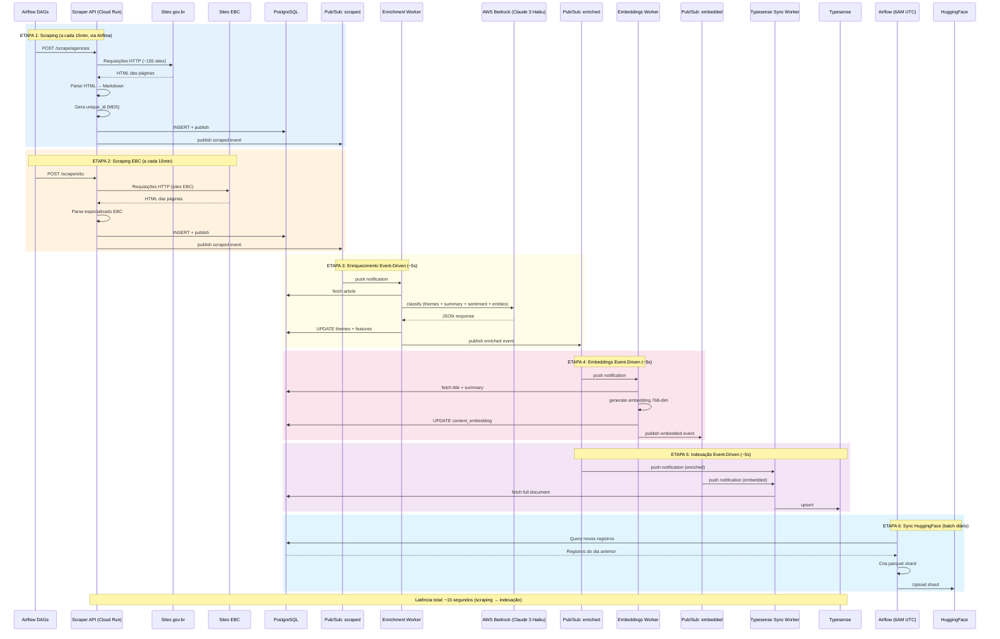

# Fluxo de Dados

!!! note "Arquitetura Atualizada (27/02/2026)"
    Pipeline migrado de **batch** (Cogfy SaaS) para **event-driven** (AWS Bedrock + Pub/Sub), reduzindo latência de **~45 min para ~15 segundos**.

## Pipeline

O pipeline de dados é baseado em **arquitetura event-driven** com Pub/Sub:

1. **Scraping** (repo `scraper`): Via Airflow DAGs, a cada 15 minutos
2. **Enriquecimento** (repo `data-science`): Via Enrichment Worker event-driven (Cloud Run)
3. **Embeddings** (repo `embeddings`): Via Embeddings Worker event-driven (Cloud Run)
4. **Indexação** (Typesense): Via Typesense Sync Worker event-driven (Cloud Run)

### Diagrama de Sequência Completo


```mermaid
sequenceDiagram
    participant AF as Airflow DAGs
    participant API as Scraper API (Cloud Run)
    participant GOV as Sites gov.br
    participant EBC as Sites EBC
    participant PG as PostgreSQL
    participant PS1 as Pub/Sub: scraped
    participant EW as Enrichment Worker
    participant Bedrock as AWS Bedrock (Claude 3 Haiku)
    participant PS2 as Pub/Sub: enriched
    participant EAPI as Embeddings Worker
    participant PS3 as Pub/Sub: embedded
    participant TSW as Typesense Sync Worker
    participant TS as Typesense
    participant AF2 as Airflow (6AM UTC)
    participant HF as HuggingFace

    rect rgb(227, 242, 253)
        Note over AF,API: ETAPA 1: Scraping (a cada 15min, via Airflow)
        AF->>API: POST /scrape/agencies
        API->>GOV: Requisições HTTP (~155 sites)
        GOV-->>API: HTML das páginas
        API->>API: Parse HTML → Markdown
        API->>API: Gera unique_id (MD5)
        API->>PG: INSERT + publish
        API->>PS1: publish scraped event
    end

    rect rgb(255, 243, 224)
        Note over AF,EBC: ETAPA 2: Scraping EBC (a cada 15min)
        AF->>API: POST /scrape/ebc
        API->>EBC: Requisições HTTP (sites EBC)
        EBC-->>API: HTML das páginas
        API->>API: Parse especializado EBC
        API->>PG: INSERT + publish
        API->>PS1: publish scraped event
    end

    rect rgb(255, 253, 231)
        Note over PS1,EW: ETAPA 3: Enriquecimento Event-Driven (~5s)
        PS1->>EW: push notification
        EW->>PG: fetch article
        EW->>Bedrock: classify (themes + summary + sentiment + entities)
        Bedrock-->>EW: JSON response
        EW->>PG: UPDATE themes + features
        EW->>PS2: publish enriched event
    end

    rect rgb(252, 228, 236)
        Note over PS2,EAPI: ETAPA 4: Embeddings Event-Driven (~5s)
        PS2->>EAPI: push notification
        EAPI->>PG: fetch title + summary
        EAPI->>EAPI: generate embedding 768-dim
        EAPI->>PG: UPDATE content_embedding
        EAPI->>PS3: publish embedded event
    end

    rect rgb(243, 229, 245)
        Note over PS2,TS: ETAPA 5: Indexação Event-Driven (~5s)
        PS2->>TSW: push notification (enriched)
        PS3->>TSW: push notification (embedded)
        TSW->>PG: fetch full document
        TSW->>TS: upsert
    end

    rect rgb(225, 245, 254)
        Note over AF2,HF: ETAPA 6: Sync HuggingFace (batch diário)
        AF2->>PG: Query novos registros
        PG-->>AF2: Registros do dia anterior
        AF2->>AF2: Cria parquet shard
        AF2->>HF: Upload shard
    end

    Note over API,TS: Latência total: ~15 segundos (scraping → indexação)
```

## Etapas Detalhadas

### Etapa 1: Scraping gov.br

**Repo**: `scraper` — via Airflow DAGs (a cada 15 min)

- ~158 DAGs dinâmicas chamam `POST /scrape/agencies` na Scraper API (Cloud Run)
- Cada agência é raspada independentemente
- Parse HTML → Markdown, gera `unique_id = MD5(agency + published_at + title)`
- Insert no PostgreSQL + publicação de evento `dgb.news.scraped` no Pub/Sub

→ Veja [Módulo Scraper](../modulos/scraper.md) para detalhes.

### Etapa 2: Scraping EBC

**Repo**: `scraper` — via Airflow DAG `scrape_ebc`

- DAG chama `POST /scrape/ebc` na Scraper API
- Scraper especializado (`EBCWebScraper`)
- `allow_update=True` permite sobrescrever registros existentes
- Publica evento `dgb.news.scraped` após INSERT

### Etapa 3: Enriquecimento Event-Driven

**Componente**: Enrichment Worker (Cloud Run) — repo `data-science`

**Trigger**: Push subscription do topic `dgb.news.scraped`

**Processo**:

1. Recebe push notification do Pub/Sub com `unique_id`
2. Verifica idempotência (`most_specific_theme_id IS NOT NULL` → skip)
3. Busca artigo completo do PostgreSQL
4. Classifica via AWS Bedrock (Claude 3 Haiku):
   - Temas L1/L2/L3 (3 níveis hierárquicos)
   - Resumo gerado por LLM
   - Análise de sentimento (positive/neutral/negative)
   - Extração de entidades (pessoas, organizações, locais)
5. Atualiza PostgreSQL (`theme_*` + `summary` + `news_features.features` JSONB)
6. Publica evento `dgb.news.enriched` no Pub/Sub

**Latência**: ~5 segundos por notícia

### Etapa 4: Embeddings Event-Driven

**Componente**: Embeddings Worker (Cloud Run) — repo `embeddings`

**Trigger**: Push subscription do topic `dgb.news.enriched`

**Processo**:

1. Recebe push notification do Pub/Sub com `unique_id`
2. Verifica idempotência (`content_embedding IS NOT NULL` → skip)
3. Busca `title + summary + content` do PostgreSQL
4. Prepara texto via `prepare_text_for_embedding()`
5. Gera embedding 768-dim (modelo local `paraphrase-multilingual-mpnet-base-v2`)
6. Atualiza `content_embedding` no PostgreSQL
7. Publica evento `dgb.news.embedded` no Pub/Sub

**Latência**: ~5 segundos por notícia

### Etapa 5: Indexação Event-Driven

**Componente**: Typesense Sync Worker (Cloud Run)

**Trigger**: Push subscription dos topics `dgb.news.enriched` e `dgb.news.embedded`

**Processo**:

1. Recebe push notification do Pub/Sub com `unique_id`
2. Busca documento completo do PostgreSQL (inclui temas, summary, embedding)
3. Prepara documento via `prepare_document()`
4. Upsert idempotente no Typesense collection `news`

**Latência**: ~5 segundos por notícia

### Etapa 6: Sync HuggingFace (Batch)

**DAG Airflow**: `sync_postgres_to_huggingface` (6AM UTC)

**Processo**:

1. Query notícias do dia anterior no PostgreSQL
2. Consulta IDs existentes no HuggingFace via Dataset Viewer API
3. Filtra apenas novos registros
4. Cria parquet shard com novos dados
5. Upload do shard para HuggingFace

→ Veja detalhes em [workflows/airflow-dags.md](../workflows/airflow-dags.md)

---

## Comparação: Arquitetura Antiga vs Nova

| Aspecto | Cogfy (até 27/02/2026) | AWS Bedrock + Pub/Sub (atual) |
|---------|------------------------|--------------------------------|
| **Arquitetura** | Batch via GitHub Actions (4AM UTC) | Event-driven via Pub/Sub |
| **Latência** | ~45 minutos (20min wait + processing) | ~15 segundos |
| **Trigger** | Cron diário | Event-driven (cada artigo) |
| **LLM** | Cogfy SaaS (modelo não especificado) | AWS Bedrock (Claude 3 Haiku) |
| **Controle** | Prompts fixos no Cogfy | Controle total de prompts |
| **Custo** | Alto (SaaS pricing) | ↓ 40% (pay-per-token) |
| **Features** | Temas + resumo | Temas + resumo + sentiment + entities |
| **Escalabilidade** | Batch 1000 registros | Auto-scaling por evento |
| **Idempotência** | Manual via verificação | Nativa (Pub/Sub + DB check) |

## Dados de Entrada e Saída

### Entrada (Sites gov.br)

```html
<!-- Estrutura típica de item de notícia -->
<article class="tileItem">
  <a href="/orgao/noticia/titulo-da-noticia">
    <h2>Título da Notícia</h2>
  </a>
  <span class="summary">Resumo...</span>
  <span class="documentPublished">01/12/2025</span>
  
</article>
```

### Saída (PostgreSQL / News)

```json
{
  "id": 123456,
  "unique_id": "abc123def456",
  "agency_id": 45,
  "agency_key": "gestao",
  "agency_name": "Ministério da Gestão",
  "published_at": "2024-12-02T10:00:00Z",
  "updated_datetime": "2024-12-02T14:30:00Z",
  "extracted_at": "2024-12-02T07:00:00Z",
  "title": "Título da Notícia",
  "subtitle": "Subtítulo explicativo",
  "editorial_lead": "Linha fina com contexto",
  "url": "https://www.gov.br/gestao/...",
  "content": "# Título\n\nConteúdo em Markdown...",
  "image_url": "https://www.gov.br/.../imagem.jpg",
  "video_url": null,
  "category": "Notícias",
  "tags": ["tag1", "tag2"],
  "theme_l1_id": 1,
  "theme_l2_id": 5,
  "theme_l3_id": 15,
  "most_specific_theme_id": 15,
  "summary": "Resumo gerado por AI...",
  "content_embedding": [0.123, -0.456, ...],  // 768 dimensões
  "embedding_generated_at": "2024-12-02T08:00:00Z"
}
```

## Tratamento de Erros

### Scraping
- Retry com backoff exponencial (5 tentativas)
- Skip de artigos com erro (não bloqueia pipeline)
- Logs detalhados de falhas

### Enrichment Worker (Event-Driven)
- Idempotência via check `most_specific_theme_id IS NOT NULL`
- Retry automático via Pub/Sub (exponential backoff 10s → 600s)
- Dead-Letter Queue (DLQ) após máximo de tentativas
- Fallback para valores vazios se AWS Bedrock falhar

### Embeddings Worker (Event-Driven)
- Idempotência via check `content_embedding IS NOT NULL`
- Retry automático via Pub/Sub
- DLQ para eventos falhados

### Typesense Sync Worker (Event-Driven)
- Upsert idempotente (não duplica documentos)
- Retry automático via Pub/Sub
- DLQ para eventos falhados

### PostgreSQL
- Connection pooling com retry
- Deduplicação por `unique_id` (ON CONFLICT)
- Transações para operações batch

### HuggingFace (Sync)
- Incremental via parquet shards
- Deduplicação via Dataset Viewer API

## Monitoramento

### Cloud Run Workers
- Logs centralizados no Google Cloud Logging
- Métricas de latência, throughput e erros no Cloud Monitoring
- Alertas configurados para DLQ (Dead-Letter Queue)

### Pub/Sub
- Métricas de mensagens publicadas/entregues/não entregues
- Monitoring de backlog (mensagens pendentes)
- DLQ monitoring para eventos falhados

### Airflow
- Web UI do Cloud Composer para DAGs
- Logs de execução por task
- Alertas de falha via email

### Métricas
- Quantidade de artigos raspados por execução
- Taxa de sucesso de enriquecimento (% de artigos processados)
- Latência end-to-end (scraping → indexação)
- Tempo de processamento por worker

## Execução Manual / Reprocessamento

### Reprocessar artigos não enriquecidos
```bash
# Via script direto no Enrichment Worker
# Busca artigos sem temas e força reprocessamento
# (implementado no repo data-science)
```

### Reprocessar embeddings
```bash
# Via script direto no Embeddings Worker
# Busca artigos sem embeddings e força reprocessamento
# (implementado no repo embeddings)
```

### Sync Typesense (full reload)
```bash
# Via script direto no Typesense Sync Worker
# Recarrega todos os documentos do PostgreSQL
# (implementado no repo data-platform)
```

### Republicar eventos manualmente
```bash
# Via Cloud Pub/Sub console ou gcloud CLI
# Para reprocessar artigos específicos
gcloud pubsub topics publish dgb.news.scraped \
  --message='{"unique_id":"abc123"}' \
  --attribute=agency_key=educacao
```

> **Nota**: Com arquitetura event-driven, reprocessamento é feito republicando eventos no Pub/Sub, não via GitHub Actions scheduled.
