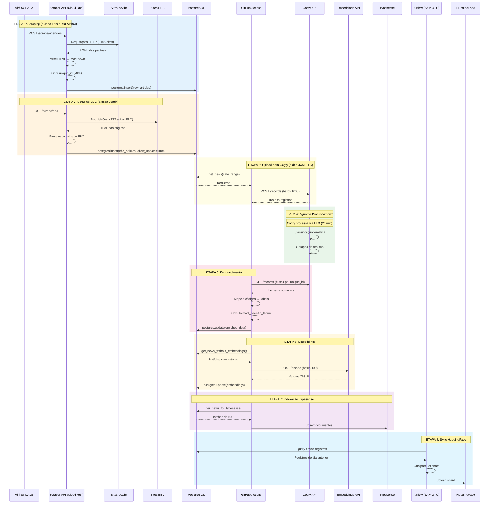

# Fluxo de Dados

## Pipeline

O pipeline de dados é composto por dois estágios independentes:

1. **Scraping** (repo `scraper`): Via Airflow DAGs, a cada 15 minutos
2. **Enrichment** (repo `data-platform`): Via GitHub Actions, diário às 4AM UTC

### Diagrama de Sequência Completo



## Etapas Detalhadas

### Etapa 1: Scraping gov.br

**Repo**: `scraper` — via Airflow DAGs (a cada 15 min)

- ~158 DAGs dinâmicas chamam `POST /scrape/agencies` na Scraper API (Cloud Run)
- Cada agência é raspada independentemente
- Parse HTML → Markdown, gera `unique_id = MD5(agency + published_at + title)`
- Insert direto no PostgreSQL

→ Veja [Módulo Scraper](../modulos/scraper.md) para detalhes.

### Etapa 2: Scraping EBC

**Repo**: `scraper` — via Airflow DAG `scrape_ebc`

- DAG chama `POST /scrape/ebc` na Scraper API
- Scraper especializado (`EBCWebScraper`)
- `allow_update=True` permite sobrescrever registros existentes

### Etapa 3: Upload para Cogfy

**Workflow**: `main-workflow.yaml` → job `upload-to-cogfy`

```bash
data-platform upload-cogfy --start-date YYYY-MM-DD --end-date YYYY-MM-DD
```

**Processo**:

1. Carrega artigos do PostgreSQL por intervalo de datas
2. Converte campos para formato Cogfy:

   - `published_at` → datetime UTC
   - `tags` → string JSON
3. Envia em batches de 1000 registros
4. Salva mapeamento `unique_id` ↔ `cogfy_record_id`

### Etapa 4: Processamento Cogfy

**Tempo**: ~20 minutos de delay configurado no workflow

O Cogfy executa:

- **Classificação temática** em 3 níveis usando a árvore de temas
- **Geração de resumo** via LLM

> **Nota**: A configuração do Cogfy não está em código. Screenshots serão adicionados futuramente.

### Etapa 5: Enriquecimento

**Workflow**: `main-workflow.yaml` → job `enrich-themes`

```bash
data-platform enrich --start-date YYYY-MM-DD --end-date YYYY-MM-DD
```

**Processo**:

1. Aguarda delay de 20 minutos (1200 segundos)
2. Busca registros processados no Cogfy por `unique_id`
3. Extrai campos enriquecidos:

   - `theme_1_level_1` (select) → código e label
   - `theme_1_level_2` (text) → código e label
   - `theme_1_level_3` (text) → código e label
   - `summary` (text)
4. Calcula `most_specific_theme` (prioridade: L3 > L2 > L1)
5. Atualiza PostgreSQL

### Etapa 6: Embeddings

**Workflow**: `main-workflow.yaml` → job `generate-embeddings`

```bash
data-platform generate-embeddings --start-date YYYY-MM-DD
```

**Processo**:

1. Busca notícias sem embeddings no PostgreSQL
2. Prepara texto: `title + summary` (fallback para `content`)
3. Envia para Embeddings API em batches de 100
4. Recebe vetores 768-dim do modelo `paraphrase-multilingual-mpnet-base-v2`
5. Atualiza `content_embedding` no PostgreSQL

### Etapa 7: Indexação Typesense

**Workflow**: `typesense-maintenance-sync.yaml` (10AM UTC)

```bash
data-platform sync-typesense --start-date YYYY-MM-DD
```

**Processo**:

1. Conecta ao Typesense em produção
2. Lê dados do PostgreSQL em batches de 5000
3. Faz upsert dos documentos na collection `news` (incluindo embeddings)

### Etapa 8: Sync HuggingFace

**DAG Airflow**: `sync_postgres_to_huggingface` (6AM UTC)

**Processo**:

1. Query notícias do dia anterior no PostgreSQL
2. Consulta IDs existentes no HuggingFace via Dataset Viewer API
3. Filtra apenas novos registros
4. Cria parquet shard com novos dados
5. Upload do shard para HuggingFace

→ Veja detalhes em [workflows/airflow-dags.md](../workflows/airflow-dags.md)

## Dados de Entrada e Saída

### Entrada (Sites gov.br)

```html
<!-- Estrutura típica de item de notícia -->
<article class="tileItem">
  <a href="/orgao/noticia/titulo-da-noticia">
    <h2>Título da Notícia</h2>
  </a>
  <span class="summary">Resumo...</span>
  <span class="documentPublished">01/12/2025</span>
  
</article>
```

### Saída (PostgreSQL / News)

```json
{
  "id": 123456,
  "unique_id": "abc123def456",
  "agency_id": 45,
  "agency_key": "gestao",
  "agency_name": "Ministério da Gestão",
  "published_at": "2024-12-02T10:00:00Z",
  "updated_datetime": "2024-12-02T14:30:00Z",
  "extracted_at": "2024-12-02T07:00:00Z",
  "title": "Título da Notícia",
  "subtitle": "Subtítulo explicativo",
  "editorial_lead": "Linha fina com contexto",
  "url": "https://www.gov.br/gestao/...",
  "content": "# Título\n\nConteúdo em Markdown...",
  "image_url": "https://www.gov.br/.../imagem.jpg",
  "video_url": null,
  "category": "Notícias",
  "tags": ["tag1", "tag2"],
  "theme_l1_id": 1,
  "theme_l2_id": 5,
  "theme_l3_id": 15,
  "most_specific_theme_id": 15,
  "summary": "Resumo gerado por AI...",
  "content_embedding": [0.123, -0.456, ...],  // 768 dimensões
  "embedding_generated_at": "2024-12-02T08:00:00Z"
}
```

## Tratamento de Erros

### Scraping
- Retry com backoff exponencial (5 tentativas)
- Skip de artigos com erro (não bloqueia pipeline)
- Logs detalhados de falhas

### Cogfy
- Verificação de status antes de buscar resultados
- Fallback para valores vazios se inferência falhar

### PostgreSQL
- Connection pooling com retry
- Deduplicação por `unique_id` (ON CONFLICT)
- Transações para operações batch

### HuggingFace (Sync)
- Incremental via parquet shards
- Deduplicação via Dataset Viewer API

## Monitoramento

### GitHub Actions
- Status de cada job visível na interface
- Logs completos por etapa
- Notificações de falha

### Métricas
- Quantidade de artigos raspados por execução
- Taxa de sucesso de enriquecimento
- Tempo total de pipeline

## Execução Manual

### Enrichment de período específico
```bash
# Via GitHub Actions (enrichment pipeline)
gh workflow run main-workflow.yaml -R destaquesgovbr/data-platform \
  -f start_date=2024-01-01 \
  -f end_date=2024-01-31
```

### Enriquecimento manual
```bash
data-platform enrich --start-date 2024-01-01 --force
```

### Geração de embeddings
```bash
data-platform generate-embeddings --start-date 2024-01-01
```

### Sync Typesense
```bash
# Incremental
data-platform sync-typesense --start-date 2024-01-01

# Full reload
data-platform sync-typesense --full-sync
```

### Reload completo do Typesense (via GitHub Actions)
```bash
gh workflow run typesense-full-reload.yaml \
  -f confirm=DELETE
```

> **CUIDADO**: O full reload é destrutivo - deleta todos os dados antes de recarregar!
