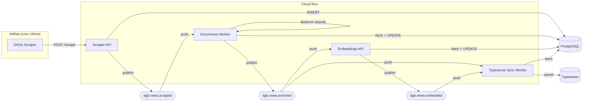

# Pipeline Event-Driven (Pub/Sub Workers)

> Processamento near-real-time de notícias via Google Cloud Pub/Sub + Cloud Run Workers.

## Motivação

O pipeline anterior (batch/cron) tinha latência de até **24 horas** entre o scraping e a disponibilidade no portal. Cada etapa rodava em schedule fixo, independente de haver dados novos.

Com a arquitetura event-driven, a latência cai para **~15 segundos**.

## Arquitetura



## Topics e Subscriptions

### Topics

| Topic | Publisher | Payload |
|-------|-----------|---------|
| `dgb.news.scraped` | Scraper API | `unique_id`, `agency_key`, `published_at`, `scraped_at` |
| `dgb.news.enriched` | Enrichment Worker | `unique_id`, `enriched_at`, `most_specific_theme_code`, `has_summary` |
| `dgb.news.embedded` | Embeddings API | `unique_id`, `embedded_at`, `embedding_dim` |

Todas as mensagens incluem atributos `trace_id` (UUID) e `event_version` ("1.0").

### Subscriptions (Push)

| Subscription | Topic | Subscriber | Ack Deadline |
|-------------|-------|-----------|-------------|
| `dgb.news.scraped--enrichment` | scraped | Enrichment Worker | 600s |
| `dgb.news.enriched--typesense` | enriched | Typesense Sync Worker | 120s |
| `dgb.news.enriched--embeddings` | enriched | Embeddings API | 600s |
| `dgb.news.embedded--typesense-update` | embedded | Typesense Sync Worker | 120s |

Cada subscription tem uma **Dead-Letter Queue** (DLQ) para mensagens que falham após o máximo de tentativas.

## Workers

### Enrichment Worker

**Repo**: `data-science` — **Serviço**: `destaquesgovbr-enrichment-worker`

Recebe eventos de `dgb.news.scraped`, classifica a notícia via Amazon Bedrock (Claude Haiku) e gera um resumo.

**Fluxo**:

1. Recebe push em `POST /process`
2. Decodifica envelope Pub/Sub, extrai `unique_id`
3. Verifica idempotência (`most_specific_theme_id IS NOT NULL` → skip)
4. Busca artigo do PostgreSQL
5. Classifica via `NewsClassifier` (Bedrock) — tema em 3 níveis + resumo
6. Atualiza PostgreSQL com temas e summary
7. Publica `dgb.news.enriched`
8. Retorna HTTP 200 (ACK)

**Código**: `src/news_enrichment/worker/`

| Arquivo | Conteúdo |
|---------|----------|
| `app.py` | FastAPI com endpoints `/process` e `/health` |
| `handler.py` | `enrich_article()`, `fetch_article()`, `publish_enriched_event()` |

**Specs**: 1 vCPU, 1Gi RAM, timeout 900s, scale 0-3

### Embeddings (endpoint /process)

**Repo**: `embeddings` — **Serviço**: `destaquesgovbr-embeddings-api`

Endpoint adicionado ao Embeddings API existente. Recebe eventos de `dgb.news.enriched`, gera embedding usando o modelo local (sem HTTP hop) e publica `dgb.news.embedded`.

**Fluxo**:

1. Recebe push em `POST /process`
2. Verifica idempotência (`content_embedding IS NOT NULL` → skip)
3. Busca title + summary + content do PostgreSQL
4. Prepara texto via `prepare_text_for_embedding()`
5. Gera embedding 768-dim com `embedding_service.generate()` (modelo local)
6. Atualiza `content_embedding` no PostgreSQL
7. Publica `dgb.news.embedded`

**Código**: `src/embeddings_api/pubsub_handler.py`

!!! note "Decisão: endpoint na API existente"
    Em vez de criar um worker separado, adicionamos `/process` ao Embeddings API para usar o modelo ML diretamente na memória, evitando um HTTP hop Cloud Run → Cloud Run.

**Specs**: 2 vCPU, 4Gi RAM (compartilha com `/generate`), scale 0-1

### Typesense Sync Worker

**Repo**: `data-platform` — **Serviço**: `destaquesgovbr-typesense-sync-worker`

Recebe eventos de `dgb.news.enriched` e `dgb.news.embedded`. Busca dados completos do PostgreSQL e faz upsert no Typesense.

**Fluxo**:

1. Recebe push em `POST /process`
2. Busca documento completo do PostgreSQL (reusa query do `PostgresManager`)
3. Prepara documento via `prepare_document()`
4. Upsert no Typesense

**Código**: `src/data_platform/workers/typesense_sync/`

| Arquivo | Conteúdo |
|---------|----------|
| `app.py` | FastAPI com endpoints `/process` e `/health` |
| `handler.py` | `upsert_to_typesense()`, `fetch_news_for_typesense()` |

**Specs**: 1 vCPU, 512Mi RAM, timeout 300s, scale 0-3

## Idempotência

Todos os workers são seguros para re-delivery (at-least-once do Pub/Sub):

| Worker | Verificação |
|--------|-------------|
| Enrichment | `most_specific_theme_id IS NOT NULL` → skip |
| Embeddings | `content_embedding IS NOT NULL` → skip |
| Typesense | Upsert é inerentemente idempotente |

## Tratamento de Erros

- **ACK sempre**: Todos os workers retornam HTTP 200 mesmo em caso de erro, para evitar retries infinitos do Pub/Sub
- **Dead-Letter Queues**: Mensagens que falham repetidamente vão para DLQ topics
- **Logging**: Cada worker loga `unique_id`, `trace_id` e status para rastreabilidade
- **DAG de reconciliação**: DAG Airflow diária captura artigos que não foram processados (safety net)

## CI/CD

Cada worker usa o reusable workflow `cloud-run-deploy.yml@v2`:

```yaml
# Exemplo: enrichment-worker-deploy.yaml
jobs:
  deploy:
    uses: destaquesgovbr/reusable-workflows/.github/workflows/cloud-run-deploy.yml@v2
    with:
      dockerfile: docker/enrichment-worker/Dockerfile
      ar_repository: destaquesgovbr-enrichment-worker
      image_name: enrichment-worker
      cloud_run_service: destaquesgovbr-enrichment-worker
```

Deploy automático em push para `main` com path filters relevantes.

| Worker | Workflow | Trigger Paths |
|--------|----------|---------------|
| Enrichment | `enrichment-worker-deploy.yaml` | `src/news_enrichment/**`, `docker/enrichment-worker/**` |
| Embeddings | `deploy.yaml` | `src/embeddings_api/**`, `Dockerfile` |
| Typesense Sync | `typesense-sync-worker-deploy.yaml` | `src/data_platform/workers/typesense_sync/**`, `docker/typesense-sync-worker/**` |

## Infraestrutura

Recursos provisionados via Terraform no repo `infra`:

| Arquivo | Conteúdo |
|---------|----------|
| `pubsub.tf` | Topics, subscriptions, DLQ, retry policies |
| `enrichment-worker.tf` | Cloud Run service + SA + IAM |
| `typesense-sync-worker.tf` | Cloud Run service + SA + IAM |
| `embeddings-api.tf` | Cloud Run service (existente, com novo endpoint) |

## Latência Esperada

```
t=0:00  DAG scrape_mec trigga
t=0:02  Scraper API busca gov.br/mec, encontra 3 artigos
t=0:05  INSERT PostgreSQL + publish dgb.news.scraped
t=0:06  Enrichment Worker recebe push
t=0:08  Bedrock classifica + gera summary → publish dgb.news.enriched
t=0:09  Typesense Sync Worker upsert (com temas, sem embedding)
t=0:09  Embeddings API recebe push
t=0:11  Modelo local gera vetor 768-dim → publish dgb.news.embedded
t=0:13  Typesense Sync Worker atualiza com embedding

Total: ~13 segundos (vs ~24 horas no pipeline batch)
```

## Links Relacionados

- [Fluxo de Dados (pipeline completo)](fluxo-de-dados.md)
- [Arquitetura GCP](../infraestrutura/arquitetura-gcp.md)
- [Tutorial Cloud Pub/Sub](../onboarding/cloud-pubsub-tutorial.md)
