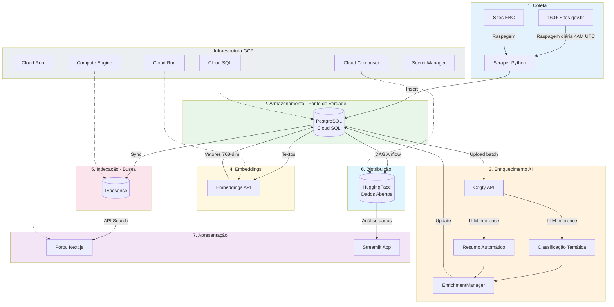
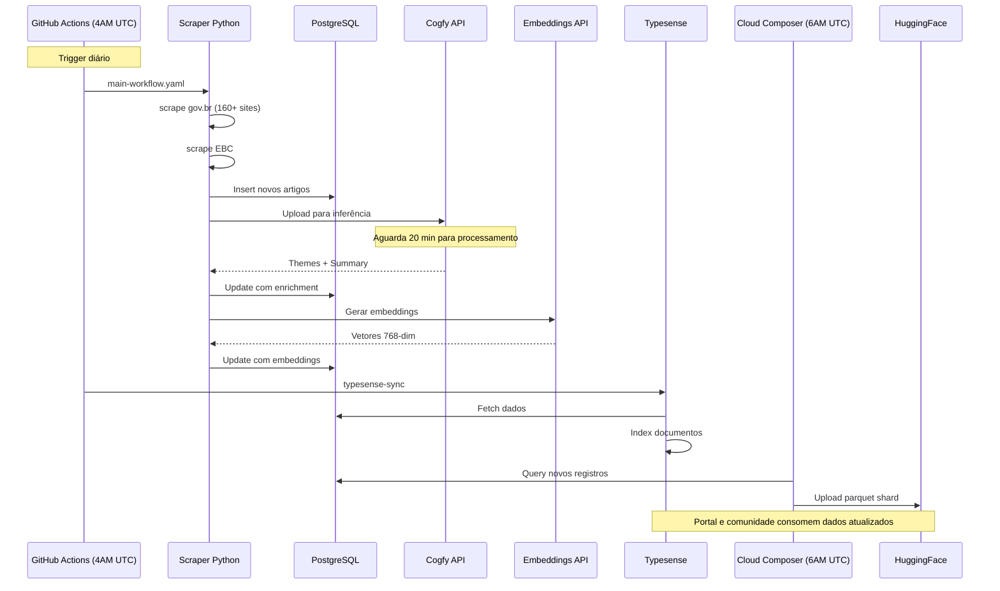

# Visão Geral da Arquitetura

## Resumo

O DestaquesGovbr é uma plataforma de agregação e enriquecimento de notícias governamentais composta por 7 camadas principais:

1. **Coleta** - Raspagem automatizada de ~160+ sites gov.br
2. **Armazenamento** - PostgreSQL (Cloud SQL) como fonte de verdade
3. **Enriquecimento** - Classificação temática e sumarização via Cogfy/LLM
4. **Embeddings** - Geração de vetores 768-dim para busca semântica
5. **Indexação** - Typesense para busca full-text e vetorial
6. **Distribuição** - HuggingFace para dados abertos
7. **Apresentação** - Portal Next.js e apps de análise

## Diagrama de Arquitetura

## Componentes por Camada

### 1. Coleta (`data-platform`)

| Componente | Arquivo | Responsabilidade |
|------------|---------|------------------|
| WebScraper | `src/data_platform/scrapers/webscraper.py` | Raspagem genérica de sites gov.br |
| EBCScraper | `src/data_platform/scrapers/ebc_webscraper.py` | Raspagem especializada da EBC |
| ScrapeManager | `src/data_platform/scrapers/scrape_manager.py` | Orquestração paralela/sequencial |
| PostgresManager | `src/data_platform/managers/postgres_manager.py` | Insert/Update no PostgreSQL |
| StorageAdapter | `src/data_platform/managers/storage_adapter.py` | Abstração de storage (PG/HF/dual) |

**Dados extraídos por notícia:**

| Campo | Descrição |
|-------|-----------|
| `unique_id` | Hash MD5 (agency + published_at + title) |
| `agency` | Identificador do órgão |
| `published_at` | Data/hora de publicação (ISO 8601, UTC) |
| `updated_datetime` | Data/hora de atualização, quando disponível |
| `extracted_at` | Data/hora da extração |
| `title` | Título da notícia |
| `subtitle` | Subtítulo (quando disponível) |
| `editorial_lead` | Lead editorial / linha fina |
| `url` | URL original da notícia |
| `content` | Conteúdo completo em Markdown |
| `image` | URL da imagem principal |
| `video_url` | URL de vídeo incorporado (quando disponível) |
| `category` | Categoria original do site |
| `tags` | Tags/keywords do site |

### 2. Armazenamento (PostgreSQL)

**Instância Cloud SQL**: `destaquesgovbr-postgres` (PostgreSQL 15)

| Tabela | Registros | Descrição |
|--------|-----------|-----------|
| `agencies` | 158 | Órgãos governamentais |
| `themes` | 200+ | Taxonomia temática (3 níveis) |
| `news` | 300k+ | Notícias coletadas e enriquecidas |
| `sync_log` | - | Log de operações |

→ Veja detalhes em [postgresql.md](postgresql.md)

### 3. Enriquecimento (`data-platform` + Cogfy)

| Componente | Arquivo | Responsabilidade |
|------------|---------|------------------|
| CogfyManager | `src/data_platform/cogfy/cogfy_manager.py` | Cliente da API Cogfy |
| UploadManager | `src/data_platform/cogfy/upload_manager.py` | Envio de notícias para inferência |
| EnrichmentManager | `src/data_platform/cogfy/enrichment_manager.py` | Busca resultados e atualiza PostgreSQL |

**Campos enriquecidos:**

- `theme_1_level_1_code/label` - Tema nível 1 (ex: "01 - Economia")
- `theme_1_level_2_code/label` - Tema nível 2 (ex: "01.01 - Política Econômica")
- `theme_1_level_3_code/label` - Tema nível 3 (ex: "01.01.01 - Política Fiscal")
- `most_specific_theme_code/label` - Tema mais específico disponível
- `summary` - Resumo gerado por LLM

### 4. Embeddings (`data-platform`)

| Componente | Arquivo | Responsabilidade |
|------------|---------|------------------|
| EmbeddingGenerator | `src/data_platform/jobs/embeddings/embedding_generator.py` | Geração de vetores |
| Embeddings API | Cloud Run | Modelo `paraphrase-multilingual-mpnet-base-v2` |

**Características:**
- Vetores de 768 dimensões
- Input: `title + summary` (fallback para `content`)
- Armazenados em `news.content_embedding` (tipo `VECTOR`)

### 5. Indexação (Typesense)

| Componente | Arquivo | Responsabilidade |
|------------|---------|------------------|
| TypesenseClient | `src/data_platform/typesense/client.py` | Conexão com Typesense |
| TypesenseIndexer | `src/data_platform/typesense/indexer.py` | Indexação de documentos |
| SyncJob | `src/data_platform/jobs/typesense/sync_job.py` | Sincronização PostgreSQL → Typesense |

**Collection**: `news`

Configurado para:

- Busca full-text em `title` e `content`
- Busca vetorial via `content_embedding` (768-dim)
- Filtros facetados por `agency`, `theme_*`, `published_at`
- Ordenação por relevância e data

### 6. Distribuição (HuggingFace)

**Dataset principal**: [nitaibezerra/govbrnews](https://huggingface.co/datasets/nitaibezerra/govbrnews)

- ~300.000+ documentos
- Sincronização diária via DAG Airflow
- Abordagem incremental (parquet shards)
- Versionamento automático pelo HuggingFace

**DAG**: `sync_postgres_to_huggingface` (6 AM UTC)

→ Veja detalhes em [workflows/airflow-dags.md](../workflows/airflow-dags.md)

### 7. Apresentação

| App | Tecnologia | URL |
|-----|------------|-----|
| Portal | Next.js 15 + Typesense | [portal](https://portal-klvx64dufq-rj.a.run.app/) *(provisória)* |
| Streamlit | Python + Altair | [HuggingFace Spaces](https://huggingface.co/spaces/nitaibezerra/govbrnews) |

## Fluxo de Dados Diário

## Tecnologias Principais

### Backend (Data Platform)

- **Python 3.11+** com Poetry
- **PostgreSQL 15** (Cloud SQL) com psycopg2
- **BeautifulSoup4** para parsing HTML
- **datasets** + **huggingface_hub** para sync HF
- **requests** com retry logic
- **Apache Airflow 3** (Cloud Composer)

### Frontend (Portal)

- **Next.js 15** com App Router
- **TypeScript 5**
- **Typesense** para busca
- **shadcn/ui** + Tailwind CSS
- **React Query** para data fetching

### Infraestrutura

- **GCP** - Cloud Run, Compute Engine, Cloud SQL, Cloud Composer, VPC
- **Terraform** - IaC
- **Docker** - Containerização
- **GitHub Actions** - CI/CD
- **Apache Airflow** - Orquestração de pipelines

## Custos Estimados

| Componente | Custo/mês |
|------------|-----------|
| Cloud SQL (PostgreSQL) | ~$48 |
| Compute Engine (Typesense) | ~$64 |
| Cloud Run (Portal + Embeddings) | ~$15 |
| Cloud Composer (Airflow) | ~$100-150 |
| **Total** | **~$230-280** |

## Próximos Passos

→ Veja [fluxo-de-dados.md](fluxo-de-dados.md) para detalhes do pipeline
→ Veja [componentes-estruturantes.md](componentes-estruturantes.md) para árvore temática e órgãos
