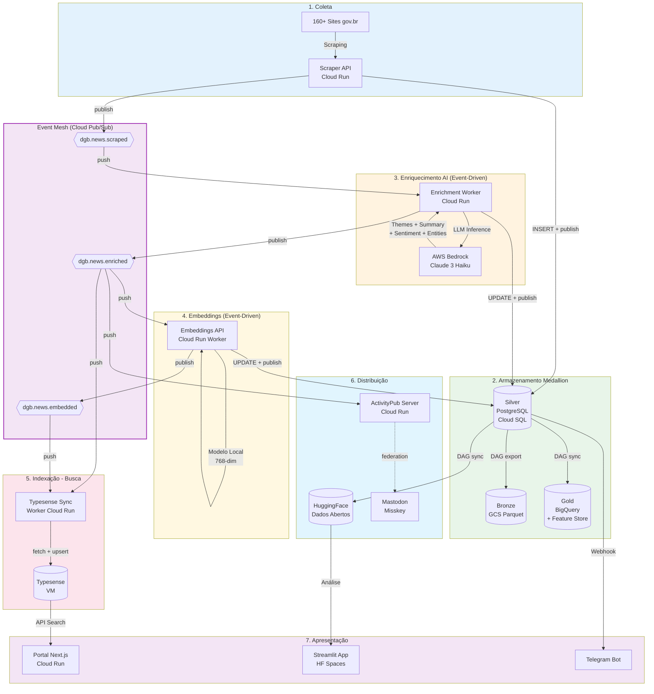
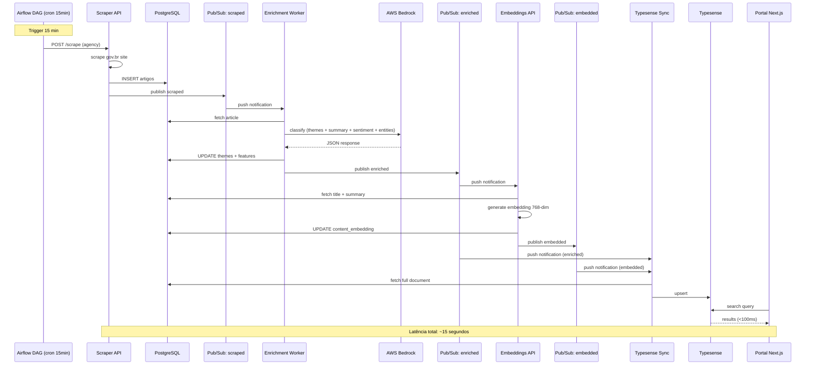
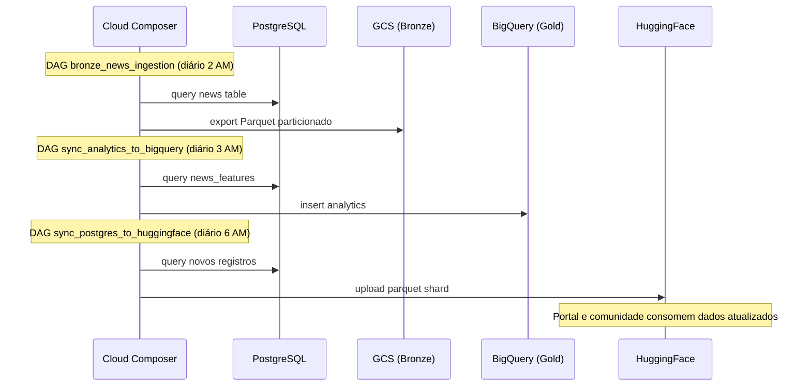

# Visão Geral da Arquitetura

## Resumo

O DestaquesGovbr é uma plataforma de agregação e enriquecimento de notícias governamentais composta por 7 camadas principais, com **arquitetura event-driven** e **pipeline Medallion**:

1. **Coleta** - Raspagem automatizada de ~160 sites gov.br via Scraper API
2. **Armazenamento Medallion** - Bronze (GCS Parquet) → Silver (PostgreSQL) → Gold (BigQuery + Feature Store)
3. **Enriquecimento** - Classificação temática e sumarização via AWS Bedrock (Claude 3 Haiku) com workers event-driven
4. **Embeddings** - Geração de vetores 768-dim para busca semântica via Embeddings API (worker event-driven)
5. **Indexação** - Typesense para busca full-text e vetorial (atualizado via workers Pub/Sub)
6. **Distribuição** - HuggingFace para dados abertos + Federação ActivityPub (Mastodon/Misskey)
7. **Apresentação** - Portal Next.js, Streamlit App e Bots (Telegram)

**Mudança Arquitetural (Fev-Mar 2026)**: Pipeline migrado de **batch** (DAGs cron) para **event-driven** (Pub/Sub), reduzindo latência de **~45 min para ~15 segundos**.

## Diagrama de Arquitetura (Atualizado v1.1)

```mermaid
flowchart TB
    subgraph COLETA["1. Coleta"]
        A[160+ Sites gov.br] -->|Scraping| B[Scraper API<br/>Cloud Run]
    end

    subgraph MEDALLION["2. Armazenamento Medallion"]
        direction LR
        BRONZE[(Bronze<br/>GCS Parquet)]
        SILVER[(Silver<br/>PostgreSQL<br/>Cloud SQL)]
        GOLD[(Gold<br/>BigQuery<br/>+ Feature Store)]
    end

    subgraph ENRIQUECIMENTO["3. Enriquecimento AI (Event-Driven)"]
        D[AWS Bedrock<br/>Claude 3 Haiku]
        EW[Enrichment Worker<br/>Cloud Run]
        EW -->|LLM Inference| D
        D -->|Themes + Summary<br/>+ Sentiment + Entities| EW
    end

    subgraph EMBEDDINGS["4. Embeddings (Event-Driven)"]
        H[Embeddings API<br/>Cloud Run Worker]
        H -->|Modelo Local<br/>768-dim| H
    end

    subgraph INDEXACAO["5. Indexação - Busca"]
        I[(Typesense<br/>VM)]
        TSW[Typesense Sync<br/>Worker Cloud Run]
    end

    subgraph DISTRIBUICAO["6. Distribuição"]
        J[(HuggingFace<br/>Dados Abertos)]
        AP[ActivityPub Server<br/>Cloud Run]
        MASTO[Mastodon<br/>Misskey]
    end

    subgraph APRESENTACAO["7. Apresentação"]
        K[Portal Next.js<br/>Cloud Run]
        L[Streamlit App<br/>HF Spaces]
        TG[Telegram Bot]
    end

    subgraph PUBSUB["Event Mesh (Cloud Pub/Sub)"]
        T1{{dgb.news.scraped}}
        T2{{dgb.news.enriched}}
        T3{{dgb.news.embedded}}
    end

    B -->|INSERT + publish| SILVER
    B -->|publish| T1
    T1 -->|push| EW
    EW -->|UPDATE + publish| SILVER
    EW -->|publish| T2
    T2 -->|push| H
    H -->|UPDATE + publish| SILVER
    H -->|publish| T3
    T2 -->|push| TSW
    T3 -->|push| TSW
    TSW -->|fetch + upsert| I
    T2 -->|push| AP
    AP -.->|federation| MASTO
    SILVER -->|DAG export| BRONZE
    SILVER -->|DAG sync| GOLD
    SILVER -->|DAG sync| J
    I -->|API Search| K
    J -->|Análise| L
    SILVER -->|Webhook| TG

    style COLETA fill:#e3f2fd
    style MEDALLION fill:#e8f5e9
    style ENRIQUECIMENTO fill:#fff3e0
    style EMBEDDINGS fill:#fff8e1
    style INDEXACAO fill:#fce4ec
    style DISTRIBUICAO fill:#e1f5fe
    style APRESENTACAO fill:#f3e5f5
    style PUBSUB fill:#f3e5f5,stroke:#9C27B0,stroke-width:2px
```

## Componentes por Camada

### 1. Coleta (`scraper` repo)

| Componente | Responsabilidade |
|------------|------------------|
| **Scraper API** (Cloud Run) | API REST que expõe endpoints `/scrape` para cada agência |
| WebScraper | Raspagem genérica de sites gov.br |
| EBCScraper | Raspagem especializada da EBC |
| PostgresManager | Insert no PostgreSQL + publicação de eventos Pub/Sub |
| EventPublisher | Publica evento `dgb.news.scraped` após INSERT |

**Trigger**: DAGs Airflow (cron 15 min) chamam `POST /scrape` por agência

**Dados extraídos por notícia:**

| Campo | Descrição |
|-------|-----------|
| `unique_id` | Hash MD5 (agency + published_at + title) |
| `agency_key` | Identificador do órgão (ex: `fazenda`, `educacao`) |
| `published_at` | Data/hora de publicação (ISO 8601, UTC) |
| `updated_datetime` | Data/hora de atualização, quando disponível |
| `scraped_at` | Data/hora da extração |
| `title` | Título da notícia |
| `subtitle` | Subtítulo (quando disponível) |
| `editorial_lead` | Lead editorial / linha fina |
| `url` | URL original da notícia |
| `content` | Conteúdo completo em Markdown |
| `thumbnail_url` | URL da imagem principal |
| `video_url` | URL de vídeo incorporado (quando disponível) |
| `category` | Categoria original do site |
| `tags` | Tags/keywords do site |

### 2. Armazenamento Medallion

**Arquitetura de 3 camadas** (ADR-001):

#### **Bronze Layer** (Dados Brutos)

- **Localização**: Google Cloud Storage bucket `dgb-data-lake/bronze/`
- **Formato**: Parquet particionado por data
- **Lifecycle**: Standard → Nearline (90d) → Coldline (365d)
- **BigQuery**: External tables sobre GCS
- **Uso**: Auditoria, reprocessamento, data lineage

#### **Silver Layer** (Dados Limpos)

- **Instância**: Cloud SQL `destaquesgovbr-postgres` (PostgreSQL 15)
- **Tabelas principais**:
  - `news` - 300k+ notícias normalizadas e enriquecidas
  - `news_features` - Feature Store JSONB (temas, sentiment, entities, embeddings)
  - `agencies` - 156 órgãos governamentais
  - `themes` - 200+ temas (3 níveis hierárquicos)
- **Uso**: Fonte de verdade transacional (OLTP)

→ Veja detalhes em [postgresql.md](postgresql.md)

#### **Gold Layer** (Dados Agregados)

- **BigQuery**: Dataset `dgb_analytics`
- **Conteúdo**: Features agregadas, analytics, pageviews (Umami), métricas editoriais
- **Uso**: OLAP, dashboards, análises avançadas

### 3. Enriquecimento (`data-science` repo)

**Arquitetura Event-Driven:**

| Componente | Tecnologia | Responsabilidade |
|------------|------------|------------------|
| **Enrichment Worker** | Cloud Run (FastAPI) | Recebe eventos `dgb.news.scraped`, classifica via Bedrock, publica `dgb.news.enriched` |
| **AWS Bedrock** | Claude 3 Haiku | LLM para classificação temática + resumo + sentiment + entity extraction |
| NewsClassifier | Python class | Prompts e parsing de resposta Bedrock |
| PostgresManager | Python | Update de temas e features no PostgreSQL |
| PubSubPublisher | Python | Publica eventos enriquecidos |

**Fluxo:**

1. Recebe push de `dgb.news.scraped` (unique_id)
2. Verifica idempotência (`most_specific_theme_id IS NOT NULL` → skip)
3. Busca artigo do PostgreSQL
4. Classifica via Bedrock (temas L1/L2/L3 + resumo + sentiment + entities)
5. Atualiza PostgreSQL (campos `theme_*`, `summary` + `news_features.features` JSONB)
6. Publica `dgb.news.enriched`

**Campos enriquecidos:**

- `theme_1_level_1_code/label` - Tema nível 1 (ex: "01 - Economia")
- `theme_1_level_2_code/label` - Tema nível 2 (ex: "01.01 - Política Econômica")
- `theme_1_level_3_code/label` - Tema nível 3 (ex: "01.01.01 - Política Fiscal")
- `most_specific_theme_code/label` - Tema mais específico disponível
- `summary` - Resumo gerado por LLM
- `news_features.features` (JSONB):
  - `sentiment`: {positive/neutral/negative, score}
  - `entities`: {pessoas, organizações, locais}
  - Extensível sem DDL

**Migração Cogfy → Bedrock (27/02/2026):**

| Aspecto | Cogfy (anterior) | AWS Bedrock (atual) |
|---------|------------------|---------------------|
| **Latência** | Batch 20 min (1000 registros) | ~5s por notícia (event-driven) |
| **Custo** | Alto (SaaS) | ↓ 40% (pay-per-token) |
| **Controle** | Prompts fixos | Controle total de prompts |
| **Features** | Temas + resumo | Temas + resumo + sentiment + entities |

### 4. Embeddings (`embeddings` repo)

**Arquitetura Event-Driven:**

| Componente | Tecnologia | Responsabilidade |
|------------|------------|------------------|
| **Embeddings API** | Cloud Run (FastAPI) | Worker Pub/Sub + endpoint `/generate` público |
| Modelo | `paraphrase-multilingual-mpnet-base-v2` | 768-dim, otimizado para português |
| `/process` endpoint | FastAPI | Recebe `dgb.news.enriched`, gera embedding, publica `dgb.news.embedded` |

**Fluxo:**

1. Recebe push de `dgb.news.enriched`
2. Verifica idempotência (`content_embedding IS NOT NULL` → skip)
3. Busca `title + summary + content` do PostgreSQL
4. Prepara texto via `prepare_text_for_embedding()`
5. Gera embedding 768-dim (modelo local, sem HTTP hop)
6. Atualiza `content_embedding` no PostgreSQL
7. Publica `dgb.news.embedded`

**Características:**

- Vetores de **768 dimensões**
- Input: `title + summary` (fallback para `content`)
- Armazenados em `news.content_embedding` (tipo `VECTOR` pgvector)
- Modelo carregado em memória (evita HTTP overhead)

### 5. Indexação (Typesense)

**Arquitetura Event-Driven:**

| Componente | Tecnologia | Responsabilidade |
|------------|------------|------------------|
| **Typesense** | VM Compute Engine | Motor de busca full-text + vetorial |
| **Typesense Sync Worker** | Cloud Run (FastAPI) | Recebe eventos `enriched` + `embedded`, faz upsert |
| TypesenseClient | Python | Conexão com Typesense |

**Fluxo:**

1. Recebe push de `dgb.news.enriched` OU `dgb.news.embedded`
2. Busca documento completo do PostgreSQL
3. Prepara documento via `prepare_document()` (inclui temas, summary, embedding)
4. Upsert no Typesense (idempotente)

**Collection**: `news`

Configurado para:

- Busca full-text em `title`, `subtitle`, `content`
- Busca vetorial via `content_embedding` (768-dim, HNSW index)
- Filtros facetados por `agency_key`, `theme_l1`, `theme_l2`, `theme_l3`, `published_at`
- Ordenação por relevância, data e score de priorização

**Latência de Atualização**: ~15 segundos (scraping → indexação) vs ~45 minutos (batch anterior)

### 6. Distribuição

#### **HuggingFace**

**Dataset principal**: [nitaibezerra/govbrnews](https://huggingface.co/datasets/nitaibezerra/govbrnews)

- ~300.000+ documentos
- Sincronização diária via DAG Airflow `sync_postgres_to_huggingface` (6 AM UTC)
- Abordagem incremental (parquet shards)
- Versionamento automático pelo HuggingFace

→ Veja detalhes em [workflows/airflow-dags.md](../workflows/airflow-dags.md)

#### **Federação ActivityPub** (`activitypub-server` repo)

**Componente**: ActivityPub Server (Cloud Run, FastAPI)

**Fluxo Event-Driven:**

1. Recebe push de `dgb.news.enriched`
2. Busca artigo do PostgreSQL
3. Cria `Note` ActivityPub (formato Mastodon/Misskey)
4. Publica na outbox do servidor
5. Distribui para followers via protocolo ActivityPub

**Protocolos**: ActivityPub (W3C), WebFinger, HTTP Signatures

**Interoperabilidade**: Mastodon, Misskey, Pixelfed, outros servidores federados

**Usuário**: `@destaques@activitypub.destaquesgovbr.gov.br` (exemplo)

### 7. Apresentação

| App | Tecnologia | URL | Descrição |
|-----|------------|-----|-----------|
| **Portal** | Next.js 15 + Typesense | [portal-klvx64dufq-rj.a.run.app](https://portal-klvx64dufq-rj.a.run.app/) | Interface web principal com busca, clippings, widgets |
| **Streamlit** | Python + Altair | [HuggingFace Spaces](https://huggingface.co/spaces/nitaibezerra/govbrnews) | Análises exploratórias sobre o dataset |
| **Telegram Bot** | Python + Aiogram | - | Bot para scraping sob demanda e alertas |

→ Detalhes do portal em [../modulos/portal.md](../modulos/portal.md)

## Event Mesh (Cloud Pub/Sub)

**Topics criados (infra Terraform):**

| Topic | Publisher | Subscribers | Payload |
|-------|-----------|-------------|---------|
| `dgb.news.scraped` | Scraper API | Enrichment Worker, Typesense Sync | `unique_id`, `agency_key`, `published_at`, `scraped_at` |
| `dgb.news.enriched` | Enrichment Worker | Embeddings API, Typesense Sync, ActivityPub Server, Push Notifications | `unique_id`, `enriched_at`, `most_specific_theme_code`, `has_summary` |
| `dgb.news.embedded` | Embeddings API | Typesense Sync | `unique_id`, `embedded_at`, `embedding_dim` |

**Dead-Letter Queues (DLQ)**: Cada topic tem DLQ correspondente para mensagens que falharam após máximo de tentativas.

**Retry Policy**: Exponential backoff (10s → 600s)

**Authentication**: OIDC tokens (Cloud Run → Pub/Sub)

→ Detalhes em [pubsub-workers.md](pubsub-workers.md)

## Fluxo de Dados Event-Driven (Atual)

```mermaid
sequenceDiagram
    participant Airflow as Airflow DAG (cron 15min)
    participant Scraper as Scraper API
    participant PG as PostgreSQL
    participant PS1 as Pub/Sub: scraped
    participant EW as Enrichment Worker
    participant Bedrock as AWS Bedrock
    participant PS2 as Pub/Sub: enriched
    participant EAPI as Embeddings API
    participant PS3 as Pub/Sub: embedded
    participant TSW as Typesense Sync
    participant TS as Typesense
    participant Portal as Portal Next.js

    Note over Airflow: Trigger 15 min

    Airflow->>Scraper: POST /scrape (agency)
    Scraper->>Scraper: scrape gov.br site
    Scraper->>PG: INSERT artigos
    Scraper->>PS1: publish scraped

    PS1->>EW: push notification
    EW->>PG: fetch article
    EW->>Bedrock: classify (themes + summary + sentiment + entities)
    Bedrock-->>EW: JSON response
    EW->>PG: UPDATE themes + features
    EW->>PS2: publish enriched

    PS2->>EAPI: push notification
    EAPI->>PG: fetch title + summary
    EAPI->>EAPI: generate embedding 768-dim
    EAPI->>PG: UPDATE content_embedding
    EAPI->>PS3: publish embedded

    PS2->>TSW: push notification (enriched)
    PS3->>TSW: push notification (embedded)
    TSW->>PG: fetch full document
    TSW->>TS: upsert

    Portal->>TS: search query
    TS-->>Portal: results (<100ms)

    Note over Scraper,Portal: Latência total: ~15 segundos
```

## Fluxo Batch Complementar

Alguns processos ainda rodam em batch (DAGs Airflow) por natureza não-crítica:

```mermaid
sequenceDiagram
    participant Airflow as Cloud Composer
    participant PG as PostgreSQL
    participant GCS as GCS (Bronze)
    participant BQ as BigQuery (Gold)
    participant HF as HuggingFace

    Note over Airflow: DAG bronze_news_ingestion (diário 2 AM)
    Airflow->>PG: query news table
    Airflow->>GCS: export Parquet particionado

    Note over Airflow: DAG sync_analytics_to_bigquery (diário 3 AM)
    Airflow->>PG: query news_features
    Airflow->>BQ: insert analytics

    Note over Airflow: DAG sync_postgres_to_huggingface (diário 6 AM)
    Airflow->>PG: query novos registros
    Airflow->>HF: upload parquet shard

    Note over HF: Portal e comunidade consomem dados atualizados
```

## Tecnologias Principais

### Backend (Data Platform)

- **Python 3.11+** com Poetry
- **PostgreSQL 15** (Cloud SQL) com psycopg2 e pgvector
- **AWS Bedrock SDK** (boto3) para Claude 3 Haiku
- **Google Cloud Pub/Sub** para event mesh
- **FastAPI** para workers Cloud Run
- **BeautifulSoup4** para parsing HTML
- **datasets** + **huggingface_hub** para sync HF
- **Apache Airflow 3** (Cloud Composer)

### Frontend (Portal)

- **Next.js 15** com App Router
- **TypeScript 5**
- **Typesense** para busca
- **shadcn/ui** + Tailwind CSS
- **React Query** para data fetching
- **NextAuth.js v5** para autenticação

### Infraestrutura

- **GCP** - Cloud Run (8 services), Compute Engine (Typesense), Cloud SQL, Cloud Composer, Cloud Pub/Sub, GCS, BigQuery
- **AWS** - Bedrock (Claude 3 Haiku)
- **Terraform** - IaC (infra repo)
- **Docker** - Containerização
- **GitHub Actions** - CI/CD
- **Apache Airflow** - Orquestração de pipelines batch

## Custos Estimados (Atualizado Abr 2026)

| Componente | Custo/mês | Mudança |
|------------|-----------|---------|
| Cloud SQL (PostgreSQL) | ~$48 | - |
| Compute Engine (Typesense) | ~$64 | - |
| Cloud Run (8 services) | ~$25 | +$10 (workers) |
| Cloud Composer (Airflow) | ~$100-150 | - |
| Cloud Pub/Sub | ~$2 | +$2 (novo) |
| GCS (Bronze layer) | ~$2 | +$2 (novo) |
| BigQuery (Gold layer) | ~$2 | +$2 (novo) |
| AWS Bedrock (Claude Haiku) | ~$8-12 | -$30 (vs Cogfy) |
| **Total** | **~$250-305** | **+$20-25 (+8%)** |

**Nota**: Custo incremental justificado por:
- Latência ↓ 99.97% (45min → 15s)
- Custo LLM ↓ 40% (Bedrock vs Cogfy)
- 4 features extras (sentiment, entities, embeddings near-real-time, federação)
- Escalabilidade automática (workers scale-to-zero)

## Próximos Passos

- [ ] Implementar reconciliação automática via DAG (safety net para eventos perdidos)
- [ ] Adicionar tracing distribuído (OpenTelemetry)
- [ ] Métricas de latência por worker (Prometheus + Grafana)
- [ ] Alertas proativos (Pub/Sub DLQ → notificação Slack)
- [ ] Gov.Br SSO em produção (aguardando domínio .gov.br)

## Links Relacionados

→ [fluxo-de-dados.md](fluxo-de-dados.md) - Detalhes do pipeline completo
→ [componentes-estruturantes.md](componentes-estruturantes.md) - Árvore temática e órgãos
→ [pubsub-workers.md](pubsub-workers.md) - Arquitetura event-driven detalhada
→ [adrs/adr-001-arquitetura-dados-medallion.md](adrs/adr-001-arquitetura-dados-medallion.md) - Decisão arquitetural Medallion