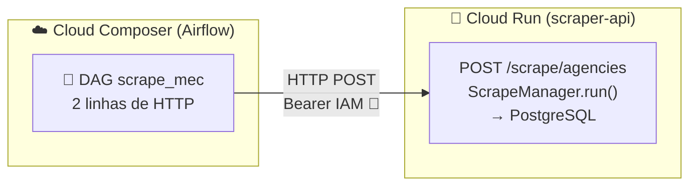
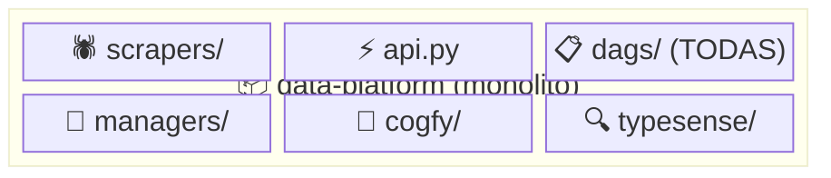
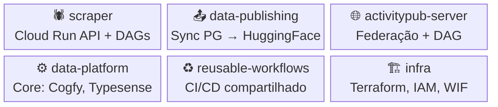

# 🏗️ 6 dias, 36 PRs, 3 repos novos: desmembrando o monolito data-platform

Na quinta passada, o data-platform era um monolito: scrapers, DAGs, sync de datasets e integração com LLM — tudo num repo só 😅. Hoje, uma semana depois, cada domínio vive no seu repo, deploya suas próprias DAGs e tem autonomia de release. Pelo caminho, o servidor ActivityPub ganhou pipeline de publicação e entramos no Fediverso 🌐. Foram **36 PRs mergeados** em **9 repos**, **3 repos novos** criados, **4 issues fechadas** e **5 avançadas** — tudo sem parar o pipeline em produção.

<!-- more -->

Este post conta essa história: as decisões, os erros, as esperas de 20 minutos ⏳ e o momento em que percebemos que estávamos codificando um padrão novo.

---

## 🗺️ Contexto: o que é o DGB

O [Destaques Gov BR](https://github.com/destaquesgovbr) agrega notícias de ~158 órgãos do governo federal. Um scraper coleta as publicações, um pipeline enriquece via LLM (classificação temática, embeddings), e um portal público exibe tudo com busca semântica. A infraestrutura roda na GCP: Cloud SQL (PostgreSQL), Cloud Composer (Airflow), Cloud Run e Typesense.

Até a semana passada, quase toda essa lógica vivia em um único repositório: `data-platform`. 👀

---

## ☀️ Domingo: scraper no Airflow (e a frustração que mudou a arquitetura)

Tudo começou com a issue [`data-platform#57`](https://github.com/destaquesgovbr/data-platform/issues/57) — "Migrar Scraper para Airflow com DAG por Órgão". O scraping rodava via GitHub Actions, sequencial, uma vez por dia. O plano ([`MIGRAR-SCRAPER-AIRFLOW.md`](https://github.com/destaquesgovbr/data-platform/blob/main/_plan/MIGRAR-SCRAPER-AIRFLOW.md)) desenhava DAGs dinâmicas, uma por agência, com schedule de 15 minutos.

Os primeiros PRs foram direto ao ponto: [`data-platform#76`](https://github.com/destaquesgovbr/data-platform/pull/76) migrou o scraper para o Airflow. E aí começaram os fixes — [`#77`](https://github.com/destaquesgovbr/data-platform/pull/77), [`#78`](https://github.com/destaquesgovbr/data-platform/pull/78), [`#79`](https://github.com/destaquesgovbr/data-platform/pull/79) — cada um corrigindo algo que só aparece em produção: formato do `requirements.txt`, ordem dos argumentos do `gsutil rsync`, dependências faltando 🤦. O Composer é implacável: cada atualização de requirements leva 10-20 minutos. Deploy, esperar, descobrir o erro, fix, esperar de novo.

Foi justamente nessas esperas de 20 minutos que veio a percepção mais importante da semana 💡: **instalar o scraper inteiro como dependência do Composer é frágil**. O Composer deveria orquestrar, não executar. O plano [`SCRAPER-CLOUD-RUN-API.md`](https://github.com/destaquesgovbr/data-platform/blob/main/_plan/SCRAPER-CLOUD-RUN-API.md) redesenhou tudo:

DAGs viram chamadas HTTP de duas linhas. Workers do Airflow ficam leves. Scraper roda em container isolado com scale-to-zero 🎯. Um PR no data-platform ([`#80`](https://github.com/destaquesgovbr/data-platform/pull/80)) e outro no infra ([`infra#78`](https://github.com/destaquesgovbr/infra/pull/78)) para o Terraform, e a nova arquitetura estava rodando.

---

## 📦 Segunda: nasce o repo `scraper`

Com a API funcionando no Cloud Run, o scraper já não pertencia ao data-platform. O plano [`EXTRAIR-SCRAPER-REPO.md`](https://github.com/destaquesgovbr/data-platform/blob/main/_plan/EXTRAIR-SCRAPER-REPO.md) mapeou a cirurgia: novo repo, Workload Identity Federation, deploy de DAGs em subdiretório separado no bucket GCS do Composer.

🆕 **Novo repo**: [`destaquesgovbr/scraper`](https://github.com/destaquesgovbr/scraper)

A extração exigiu mudanças coordenadas em três repos simultâneos. No infra: WIF binding ([`infra#82`](https://github.com/destaquesgovbr/infra/pull/82)), ajuste de concorrência ([`infra#80`](https://github.com/destaquesgovbr/infra/pull/80)), remoção do pandas do Composer ([`infra#83`](https://github.com/destaquesgovbr/infra/pull/83)). No data-platform: migrar DAGs para subdiretório ([`#81`](https://github.com/destaquesgovbr/data-platform/pull/81)), remover código extraído ([`#82`](https://github.com/destaquesgovbr/data-platform/pull/82)), limpar step de requirements ([`#83`](https://github.com/destaquesgovbr/data-platform/pull/83)). No scraper: CLAUDE.md documentando tudo ([`scraper#1`](https://github.com/destaquesgovbr/scraper/pull/1)).

O padrão ficou claro: **cada repo deploya suas DAGs num subdiretório próprio do Composer via `gsutil rsync`**. O data-platform usa `data-platform/`, o scraper usa `scraper/`. Simples, mas precisava funcionar com Workload Identity Federation, permissões GCS e GitHub Actions — tudo coordenado 🤝.

---

## 🔧 Terça: reusable workflows, data-publishing e o padrão que virou skill

### ♻️ DRY no deploy

Com dois repos deployando DAGs no mesmo bucket, copiar o workflow de deploy era questão de tempo. Antes de ter um terceiro, criamos o reusable workflow ([`reusable-workflows#3`](https://github.com/destaquesgovbr/reusable-workflows/pull/3)): qualquer repo chama com 2-3 parâmetros e ganha deploy no Composer. A adoção foi imediata — [`data-platform#85`](https://github.com/destaquesgovbr/data-platform/pull/85), [`scraper#2`](https://github.com/destaquesgovbr/scraper/pull/2) e [`scraper#3`](https://github.com/destaquesgovbr/scraper/pull/3) migraram no mesmo dia.

### 📤 Segundo desmembramento: data-publishing

O plano [`PLAN-data-publishing-migration.md`](https://github.com/destaquesgovbr/data-platform/blob/main/_plan/PLAN-data-publishing-migration.md) extraiu a DAG de sync PostgreSQL → HuggingFace para um repo próprio. Isso resolveu, por um caminho inesperado, a issue [`data-platform#28`](https://github.com/destaquesgovbr/data-platform/issues/28) — que pedia KubernetesPodOperator para isolar dependências pesadas. A solução acabou sendo mais elegante: repo dedicado com plugins no Composer, sem Kubernetes ✨.

🆕 **Novo repo**: [`destaquesgovbr/data-publishing`](https://github.com/destaquesgovbr/data-publishing)

Os PRs de finalização limparam o data-platform: remoção da DAG de teste ([`#86`](https://github.com/destaquesgovbr/data-platform/pull/86)), remoção do sync HuggingFace ([`#87`](https://github.com/destaquesgovbr/data-platform/pull/87)), WIF no infra ([`infra#85`](https://github.com/destaquesgovbr/infra/pull/85)), e atualização da documentação ([`docs#31`](https://github.com/destaquesgovbr/docs/pull/31)).

### 🧠 O momento meta: codificando o padrão

Com três repos seguindo o mesmo padrão de DAGs (scraper, data-publishing, activitypub-server), ficou claro que tínhamos uma convenção madura. Em vez de deixar esse conhecimento implícito, codificamos tudo numa **skill do Claude Code** 🤖:

[`data-platform#88`](https://github.com/destaquesgovbr/data-platform/pull/88) — `/criar-dag`, um guia de ~470 linhas que inclui: referência completa da arquitetura Airflow do projeto (connections, schema PostgreSQL, pipeline de dados), templates para plugin + DAG + workflow + testes, e passo-a-passo de setup na infra.

Começamos a semana criando DAGs manualmente. Terminamos codificando o padrão para que DAGs futuras nasçam prontas 🚀.

---

## 🌐 O outro trilho: ActivityPub e o Fediverso

Em paralelo à decomposição do monolito, o [`activitypub-server`](https://github.com/destaquesgovbr/activitypub-server) (criado em 13/fev) ganhava sua peça final: a integração com o pipeline de dados. O servidor já existia, mas como ele saberia que existem notícias novas? 🤔

A resposta: uma DAG no Airflow. O PR central ([`activitypub-server#1`](https://github.com/destaquesgovbr/activitypub-server/pull/1) — Phase 6) adicionou coluna `news_payload JSONB` na fila de publicação e a DAG `federation_publish` que roda a cada 10 minutos. No infra, três PRs prepararam o terreno: remoção da variável PORT reservada ([`infra#79`](https://github.com/destaquesgovbr/infra/pull/79)), fix de conectividade ([`infra#81`](https://github.com/destaquesgovbr/infra/pull/81)) e secrets para o banco ([`infra#84`](https://github.com/destaquesgovbr/infra/pull/84)).

Com a DAG em produção, veio o ciclo clássico de observar e otimizar 🔁. Em 24 horas, seis PRs de ajuste: batch loop ([`#2`](https://github.com/destaquesgovbr/activitypub-server/pull/2)), max_active_runs=1 ([`#3`](https://github.com/destaquesgovbr/activitypub-server/pull/3)), batch INSERT ([`#5`](https://github.com/destaquesgovbr/activitypub-server/pull/5)), migração para reusable workflow ([`#6`](https://github.com/destaquesgovbr/activitypub-server/pull/6)), ambiente local com Astro CLI ([`#7`](https://github.com/destaquesgovbr/activitypub-server/pull/7)) e remoção do limite de fila ([`#8`](https://github.com/destaquesgovbr/activitypub-server/pull/8)). A sequência batch loop → max_active_runs → batch INSERT é o tipo de história que nenhum plano prevê — e tá tudo bem 😄.

O Astro CLI ([`#7`](https://github.com/destaquesgovbr/activitypub-server/pull/7)) merece nota: avança a issue [`data-platform#42`](https://github.com/destaquesgovbr/data-platform/issues/42) e cria o padrão de ambiente Airflow local que será replicado nos outros repos.

---

## 🎮 Organizando a sala de controle

Enquanto os repos de dados eram decompostos, o repo [`project`](https://github.com/destaquesgovbr/project) ganhava forma como sala de controle do DGB. A skill `/enviar-telegram` ([`project#1`](https://github.com/destaquesgovbr/project/pull/1)) foi a primeira a chegar — permite enviar resumos de sprint, daily e backlog direto para o canal da equipe no Telegram 📲.

E no portal, a documentação dos feeds RSS/Atom/JSON ([`portal#80`](https://github.com/destaquesgovbr/portal/pull/80)) finalizou uma peça que faltava para consumidores externos da API.

---

## 🔀 O antes e depois

### Antes (20/fev)

### Depois (26/fev)

Cada repo tem seu próprio `CLAUDE.md`, deploya suas DAGs num subdiretório do Composer, usa o reusable workflow e tem autonomia completa de release ✅.

---

## ✅ Issues resolvidas pelo caminho

Uma surpresa positiva da semana: ao revisar o backlog, descobrimos que várias issues mapeadas foram resolvidas como efeito colateral das refatorações — nenhuma atacada diretamente 🎯.

### 🟢 Fechadas

| Issue | Título | Como foi resolvida |
|-------|--------|-------------------|
| [`data-platform#57`](https://github.com/destaquesgovbr/data-platform/issues/57) | Migrar Scraper para Airflow | Implementação direta → extração para repo `scraper` |
| [`data-platform#28`](https://github.com/destaquesgovbr/data-platform/issues/28) | Sync HF em ambiente isolado | Extração para `data-publishing` com plugins (sem K8s!) |
| [`data-platform#22`](https://github.com/destaquesgovbr/data-platform/issues/22) | DAG de exportação HuggingFace | Refatorada e migrada para `data-publishing` |
| [`docs#30`](https://github.com/destaquesgovbr/docs/issues/30) | Criar repo data-science | Repo criado em 13/fev com 14 issues de pesquisa |

### 🟡 Avançadas

| Issue | Título | Progresso |
|-------|--------|-----------|
| [`data-platform#42`](https://github.com/destaquesgovbr/data-platform/issues/42) | Astro CLI para dev local | ~70% — padrão pronto no activitypub-server, falta replicar |
| [`data-platform#45`](https://github.com/destaquesgovbr/data-platform/issues/45) | Remover código morto HF | ~50% — falta limpar StorageAdapter |
| [`data-platform#73`](https://github.com/destaquesgovbr/data-platform/issues/73) | Monitoramento do scraper | ~30% — Airflow dá visibilidade por DAG, faltam alertas |
| [`docs#15`](https://github.com/destaquesgovbr/docs/issues/15) | Documentar DAG sync HF | ~40% — atualizar docs com nova arquitetura |
| [`data-platform#64`](https://github.com/destaquesgovbr/data-platform/issues/64) | Campo `active` para agências | Habilitada via pause/unpause de DAGs no Airflow |

---

## 📊 Números

| Métrica | Valor |
|---------|-------|
| 🔀 PRs mergeados | 36 |
| 📁 Repos tocados | 9 |
| 🆕 Repos novos | 3 (scraper, data-publishing, data-science) |
| ✅ Issues fechadas | 4 |
| 🟡 Issues avançadas | 5 |
| 📝 Planos escritos | 4 |
| 🤖 Skills criadas | 2 (/enviar-telegram, /criar-dag) |
| 📅 Dias | 6 |

---

## 💡 Lições

**1. 📋 Planejar antes de codar.** Cada refatoração teve um `_plan/*.md` com arquitetura alvo, sequência de migração e critérios de verificação. Nenhum plano sobreviveu intacto ao contato com produção, mas todos evitaram decisões erradas que custariam horas.

**2. 🔄 Migrar sem downtime é uma sequência, não um evento.** Criar novo → validar → pausar antigo → remover. Sempre nessa ordem. Nunca quebramos o pipeline em produção.

**3. ♻️ Reusable workflows são multiplicadores.** Um workflow parametrizado economiza meia hora de configuração em cada repo novo. Com três repos adotando em uma semana, já se pagou.

**4. 🎯 Orquestrar, não executar.** Mover execução pesada para Cloud Run e manter DAGs leves (duas linhas de HTTP) foi a decisão de arquitetura mais impactante. Nasceu da frustração com o Composer — às vezes a melhor ideia vem enquanto você espera ⏳.

**5. 🔁 O ciclo deploy-observar-otimizar é inevitável.** Os PRs #2 a #8 do activitypub-server são a prova: nenhum design prevê tudo. O importante é que o ciclo seja rápido.

**6. 🤖 Codificar padrões, não só usar.** Quando um padrão se repete três vezes, vale transformar em skill ou template. A `/criar-dag` nasceu depois de criarmos DAGs em três repos — agora o próximo dev (ou o Claude Code) replica o padrão sozinho.

**7. 🏛️ Boa arquitetura resolve problemas que você nem estava olhando.** Das quatro issues fechadas, nenhuma foi atacada diretamente. Todas caíram como efeito colateral de decisões arquiteturais. Isso diz algo sobre o valor de refatorar com intenção.

---

*Todos os PRs, issues e planos estão linkados ao longo do texto. O código é aberto — explore à vontade 🙌*
