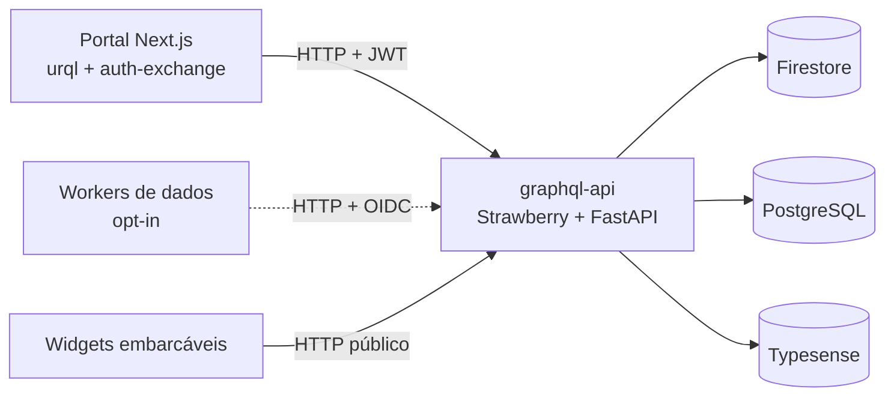

# Uma fachada GraphQL para o DGB: arquitetura e um novo paradigma de dados

Por meses, cada parte da plataforma falou direto com os backends de dados: o portal lia o Firestore via Firebase Admin, consultava o PostgreSQL para temas e órgãos, batia no Typesense para busca — e os workers liam o Postgres direto via `DATABASE_URL`. Esse post conta a decisão de colocar uma **fachada GraphQL única** no meio disso, como ela ficou por dentro, e — principalmente — convida o time a explorar a documentação nova e se apropriar do paradigma que ela inaugura. É um relato de design para quem vai construir em cima dela.

<!-- more -->

!!! tip "Explore a documentação profunda do serviço"
    Este post é o panorama. O detalhe vive na **documentação do graphql-api**,
    versionada junto do código e sempre em sincronia com o schema:

    **→ <https://destaquesgovbr.github.io/graphql-api/>**

    Lá tem arquitetura, datasources, autenticação, subscriptions/SSE, exemplos
    de query e a **referência de schema gerada do código**. E há um
    [**playground GraphiQL**](https://destaquesgovbr-graphql-api-klvx64dufq-rj.a.run.app/graphql)
    para explorar o schema ao vivo, sem instalar nada. Vale abrir e brincar.

---

## Por que uma fachada

O incômodo era o acoplamento. Cada consumidor conhecia o formato de cada backend: o camelCase e os caminhos de coleção do Firestore, o SQL do `govbrnews`, o índice do Typesense. Mudar um backend vazava para vários repos. Pior: a autenticação e as regras de autoria viviam reimplementadas em cada rota REST do portal, e o "contrato" entre cliente e dados era implícito — divergências só apareciam em runtime.

A decisão (formalizada no [ADR-002](../../arquitetura/adrs/adr-002-fachada-graphql.md)) foi introduzir um serviço — o `graphql-api` — como **ponto único de acesso a dados**, com schema tipado, auth centralizada e um lugar só para evoluir. GraphQL, e não REST por endpoint ou gRPC, porque o consumidor principal é o browser (Next.js), que se beneficia de seleção de campos, introspecção e subscriptions.

O serviço foi provisionado em [infra#177](https://github.com/destaquesgovbr/infra/pull/177) (Cloud Run + Artifact Registry + IAM + env vars via Terraform) e o portal migrado em [portal#224](https://github.com/destaquesgovbr/portal/pull/224), atrás de feature flags.

A mudança não é só técnica — é de **paradigma**. Antes a pergunta era "qual backend tem esse dado e como eu chego nele?". Agora é "qual campo do schema eu preciso?". O *como* virou problema de um serviço só.

---

## A arquitetura por dentro

Escolhas que valem registrar (cada uma com a página de doc onde aprofundar):

- **Code-first com Strawberry.** O schema são classes Python decoradas; o SDL é *derivado* do código, não mantido à mão. A [referência publicada](https://destaquesgovbr.github.io/graphql-api/reference/schema/) é gerada a cada build, então não envelhece. → [Arquitetura](https://destaquesgovbr.github.io/graphql-api/arquitetura/)
- **Datasources separados, async e sync convivendo.** Postgres é async (`asyncpg`); Firestore e Typesense usam libs síncronas. Strawberry resolve os dois. **DataLoaders** por request matam o N+1 (ex.: `mySubscription`/`releases` de N clippings numa única ida ao Firestore; labels de tema/órgão numa única facet query no Typesense). → [Datasources](https://destaquesgovbr.github.io/graphql-api/datasources/)
- **Modelo subscriptions-first.** Clippings não vivem mais em `users/{uid}/clippings`; vivem numa coleção top-level `clippings/`, e a relação usuário↔clipping é mediada por documentos de `subscriptions` com `role` (`AUTHOR`/`SUBSCRIBER`). É o que permite o marketplace — o mesmo clipping seguido por vários usuários, sem duplicação. → [Datasources › modelo subscriptions-first](https://destaquesgovbr.github.io/graphql-api/datasources/)
- **Falha silenciosa de datasource no startup** é deliberada: sobe o app mesmo com uma integração faltando; o resolver dependente é que falha em runtime.

### Auth em duas camadas

O `get_context()` autentica dois tipos de chamador: **usuário** (JWT do Keycloak, validado contra o JWKS do realm; id = `sub`) e **service account** (ID token OIDC do Google, para os workers chamarem a superfície interna). Token ausente/inválido deixa `ctx.user = None` — queries públicas seguem funcionando; só campos guardados por `IsAuthenticated` falham. Há ainda OIDC **de saída**: a subscription do agente faz passthrough do SSE para o clipping worker (protegido por IAM). → [Autenticação](https://destaquesgovbr.github.io/graphql-api/auth/)

### O agente, via SSE

A única subscription (`generateRecortes`) transmite o raciocínio do agente de IA em tempo real. Usamos **Server-Sent Events** num endpoint dedicado — `/graphql/stream` — e não WebSocket: o fluxo é unidirecional, de vida curta, e atravessa o Cloud Run melhor. O `graphql-api` só repassa o stream do worker, onde o agente roda de fato. → [Subscriptions & SSE](https://destaquesgovbr.github.io/graphql-api/subscriptions-sse/)

---

## Como começar a usar

A melhor forma de se apropriar do paradigma é mexer:

1. **Abra o [playground GraphiQL](https://destaquesgovbr-graphql-api-klvx64dufq-rj.a.run.app/graphql)** e rode uma query pública (ex.: `{ themes { code label } }`) — autocomplete e introspecção já mostram o schema inteiro.
2. **Leia os [exemplos](https://destaquesgovbr.github.io/graphql-api/exemplos/)** — queries reais de artigos, clippings, marketplace, push e widgets, com os _gotchas_ destacados (o scalar de id é `String`, não `ID`; subscriptions vão em `/graphql/stream`).
3. **Para dado autenticado**, mande o JWT do Keycloak no header `Authorization: Bearer …` (o `access_token` da sua sessão do portal).
4. **No código novo**, prefira a fachada a tocar qualquer backend direto. Se faltar um campo, a evolução é num lugar só — o schema.

Quanto mais o time pensar "isso é uma query no schema" em vez de "isso é uma leitura no Firestore/Postgres", mais a plataforma colhe o desacoplamento.

---

## Números

| Métrica | Valor |
|--------|-------|
| Testes graphql-api (pytest) | 312 |
| Testes portal (vitest) | 65 |
| Feature flags de rollout | 5 (`clippings`, `marketplace`, `agent`, `push`, `widgets`) |
| PRs principais | graphql-api #1/#4/#5/#6 · portal #224/#236 · infra #177/#183/#184 · data-platform #168 |

---

## Follow-ups: desacoplar o resto

O portal já fala GraphQL. O paradigma só se completa quando **nenhum** consumidor toca o banco direto. Os próximos passos estão rastreados no Epic [**docs#46 — Desacoplamento GraphQL (pós-R1)**](https://github.com/destaquesgovbr/docs/issues/46), em ordem de impacto:

### 1. Tirar os workers de dados do Postgres direto

A superfície interna que eles precisam **já existe** no schema (`newsById`, `newsBatch`, `newsForTypesense`, `newsBatchForBigquery`, `upsertFeatures`, `batchUpsertFeatures`, `updateTypesenseField`) — veja em [exemplos › queries internas](https://destaquesgovbr.github.io/graphql-api/exemplos/) — e [data-platform#168](https://github.com/destaquesgovbr/data-platform/pull/168) já tornou a migração **opt-in**. Falta promover a default e cortar o acesso direto.

| Worker | Acesso hoje | Operação GraphQL | Issue |
|--------|-------------|------------------|-------|
| **feature-worker** | `DATABASE_URL` → `news` (asyncpg) | `upsertFeatures` / `batchUpsertFeatures` | [data-platform#171](https://github.com/destaquesgovbr/data-platform/issues/171) |
| **typesense-sync-worker** | `DATABASE_URL` → JOIN `news`+`themes`+`features`+embeddings | `newsForTypesense` | [data-platform#172](https://github.com/destaquesgovbr/data-platform/issues/172) |
| **bronze-writer** | `DATABASE_URL` → `news`+`themes` → GCS | `newsById` / `newsBatchForBigquery` | [data-platform#173](https://github.com/destaquesgovbr/data-platform/issues/173) |
| **umami-sync** | `DATABASE_URL` → analytics | — | **não migrar** — domínio distinto, baixo acoplamento |

Receita por worker (uma de cada vez, com validação de paridade entre os dois caminhos):

1. Ligar o opt-in de GraphQL do worker em staging e comparar a saída com o caminho SQL.
2. Promover GraphQL a default; **remover `DATABASE_URL`** do serviço no Cloud Run (Terraform).
3. **Revogar o IAM Cloud SQL** da service account do worker.
4. Apagar o código de acesso direto (`asyncpg`) do worker.

### 2. Encerrar o período de transição no portal

Enquanto as flags não estão 100% e estáveis, o portal mantém dois caminhos — e o legado mascara problemas. Cleanup (RUNBOOK-R1 §9), rastreado em [portal#237](https://github.com/destaquesgovbr/portal/issues/237):

- **Remover as rotas REST legadas** (`/api/clipping`, `/api/clippings`, `/api/push`, `/api/widgets`).
- **Tirar o SSR que lê o Firestore direto** (`firebase-admin`) nas páginas de detalhe/edição de clipping (`/minha-conta/clipping/[id]` e `[id]/editar`) e na galeria. Hoje elas leem a coleção legada e produzem "falso verde" — um clipping criado pela fachada pode não aparecer pelo caminho SSR.
- **Simplificar os facades** `src/services/*/index.ts` para só-GraphQL (sumir com o branch REST↔GraphQL e com a corrida de flag no primeiro paint).
- **Remover a mutation deprecada** `followMarketplaceListing` (substituída por `subscribeToClipping`).

### 3. Higiene de infraestrutura

- **Revogar o binding IAM de dev** no clipping worker, trocando por uma service account de dev impersonável ([infra#185](https://github.com/destaquesgovbr/infra/issues/185)).
- **Restringir o CORS** do graphql-api em produção (hoje `*` para suportar widgets embarcáveis) à lista de origens conhecidas onde fizer sentido ([infra#186](https://github.com/destaquesgovbr/infra/issues/186)).

### 4. Daqui pra frente

Todo **consumidor novo** — Panorama/Streamlit, bots, integrações externas, novos serviços — deve nascer falando GraphQL, não tocando o banco. É a regra que mantém o ganho: **um só caminho para os dados do DGB**, e ele passa pela fachada.

---

## Lições

- **O contrato é o schema, não o backend.** Pensar em campos do schema (e não em "onde está o dado") é o que desacopla de verdade. Gere o SDL do código para que o contrato nunca minta.
- **Migração por flag + fallback compra segurança, mas tem prazo de validade.** O caminho legado salva o rollout e depois precisa sair — senão ele mascara o estado real.
- **A fachada vale o custo.** Uma camada a mais de latência, sim — mas um único lugar para auth, tipos e evolução. Para uma plataforma com vários consumidores, é troca boa.
- **Documentação viva é parte da arquitetura.** A referência gerada do código e o playground não são enfeite: são o que faz o time se apropriar do paradigma. [Explore](https://destaquesgovbr.github.io/graphql-api/).
