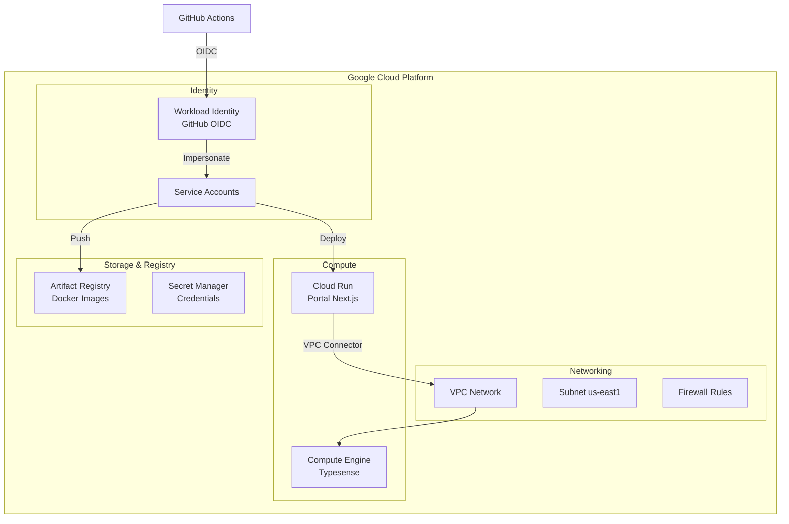
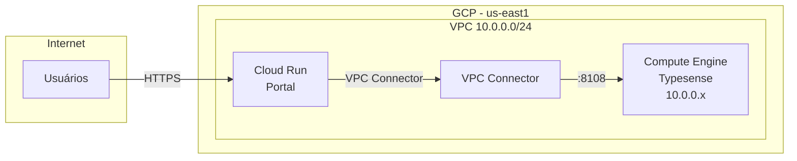
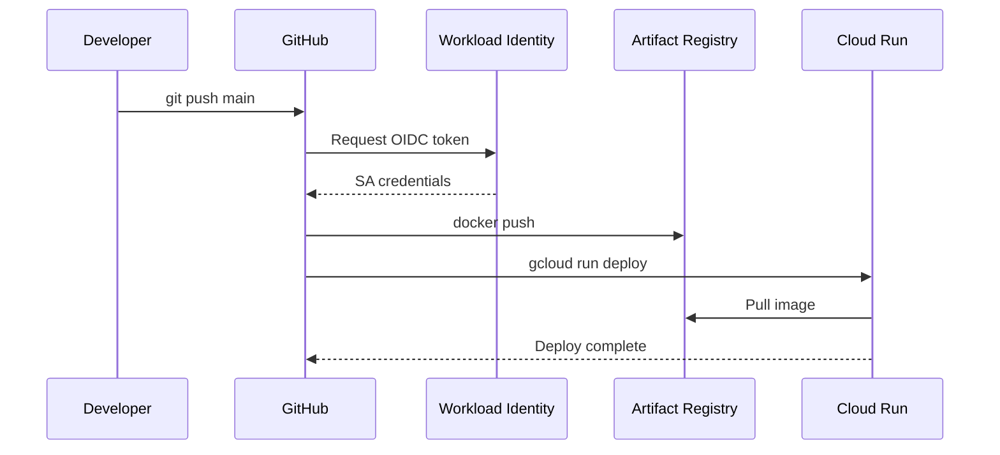

# Arquitetura GCP

> Infraestrutura do DestaquesGovbr no Google Cloud Platform.

**Repositório**: [github.com/destaquesgovbr/destaquesgovbr-infra](https://github.com/destaquesgovbr/destaquesgovbr-infra) (privado)

## Visão Geral

A infraestrutura é gerenciada via **Terraform** e consiste em:



---

## Componentes

### 1. Cloud Run (Portal)

| Propriedade | Valor |
|-------------|-------|
| Serviço | `destaquesgovbr-portal` |
| Região | `us-east1` |
| CPU | 1 |
| Memória | 512Mi |
| Min instances | 0 |
| Max instances | 10 |
| Concurrency | 80 |

**Características:**
- Serverless (escala automática)
- VPC Connector para acesso ao Typesense
- HTTPS automático

### 2. Compute Engine (Typesense)

| Propriedade | Valor |
|-------------|-------|
| Nome | `typesense-server` |
| Tipo | `e2-medium` |
| Região | `us-east1-b` |
| Disco | 50GB SSD |
| IP | Interno (VPC) |

**Características:**
- VM dedicada para Typesense
- Persistência de dados em disco
- Acesso via VPC (não exposto à internet)

### 3. Artifact Registry

| Propriedade | Valor |
|-------------|-------|
| Repositório | `destaquesgovbr` |
| Região | `us-east1` |
| Formato | Docker |

**Imagens:**
- `portal` - Imagem do portal Next.js

### 4. Secret Manager

Secrets armazenadas:

- `typesense-api-key` - API Key do Typesense
- Outras credenciais sensíveis

### 5. VPC Network

| Propriedade | Valor |
|-------------|-------|
| Nome | `destaquesgovbr-vpc` |
| Subnet | `10.0.0.0/24` |
| Região | `us-east1` |

**Firewall Rules:**
- SSH interno
- Typesense (8108) interno
- HTTPS (443) externo para Cloud Run

---

## Diagrama de Rede



---

## Custos Estimados

| Componente | Custo/mês |
|------------|-----------|
| Compute Engine (Typesense) | ~$55 |
| Cloud Run (Portal) | ~$12-17 |
| Artifact Registry | ~$1 |
| VPC Connector | ~$2 |
| **Total** | **~$70-75** |

> Valores aproximados. Podem variar com uso.

---

## Regiões e Zonas

| Recurso | Região/Zona |
|---------|-------------|
| VPC | global |
| Subnet | us-east1 |
| Cloud Run | us-east1 |
| Compute Engine | us-east1-b |
| Artifact Registry | us-east1 |

**Por que us-east1?**
- Menor latência para Brasil
- Disponibilidade de recursos
- Custo competitivo

---

## Fluxo de Deploy



---

## Acesso SSH ao Typesense

```bash
# Via gcloud
gcloud compute ssh typesense-server --zone=us-east1-b

# Verificar Typesense
curl http://localhost:8108/health
```

---

## Monitoramento

### Cloud Run

```bash
# Status do serviço
gcloud run services describe destaquesgovbr-portal --region=us-east1

# Logs
gcloud run services logs read destaquesgovbr-portal --region=us-east1

# Métricas (via Console)
# Console > Cloud Run > destaquesgovbr-portal > Metrics
```

### Compute Engine

```bash
# Status da VM
gcloud compute instances describe typesense-server --zone=us-east1-b

# Logs do sistema
gcloud compute ssh typesense-server --zone=us-east1-b -- sudo journalctl -u typesense

# Métricas (via Console)
# Console > Compute Engine > typesense-server > Monitoring
```

---

## Backup e Recuperação

### Typesense Data

```bash
# SSH no servidor
gcloud compute ssh typesense-server --zone=us-east1-b

# Backup do diretório de dados
sudo tar -czvf /tmp/typesense-backup.tar.gz /var/lib/typesense/data

# Download do backup
gcloud compute scp typesense-server:/tmp/typesense-backup.tar.gz . --zone=us-east1-b
```

### Recuperação

1. Parar Typesense
2. Restaurar dados do backup
3. Reiniciar Typesense
4. Verificar integridade

---

## Escalabilidade

### Cloud Run (Portal)

- **Automático**: Escala de 0 a 10 instâncias
- **Cold start**: ~2-3 segundos
- **Ajustes**: Via Terraform ou Console

### Typesense

- **Manual**: Upgrade de máquina se necessário
- **Atual**: e2-medium (2 vCPU, 4GB RAM)
- **Recomendado para crescimento**: e2-standard-4

---

## Segurança

### Rede

- Typesense **não exposto** à internet
- Acesso apenas via VPC Connector
- Firewall restritivo

### Identidade

- Workload Identity Federation (sem service account keys)
- Princípio do menor privilégio
- Rotação automática de credenciais

### Secrets

- Armazenados no Secret Manager
- Versionamento automático
- Acesso auditado

---

## Links Relacionados

- [Terraform Guide](./terraform-guide.md) - Como gerenciar a infraestrutura
- [Secrets e IAM](./secrets-iam.md) - Permissões e credenciais
- [Deploy Portal](../workflows/portal-deploy.md) - Workflow de deploy
- [Typesense Data](../workflows/typesense-data.md) - Carga de dados
