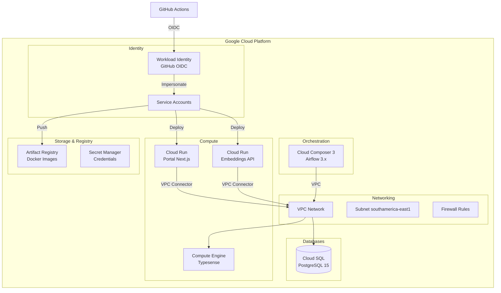

# Arquitetura GCP

> Infraestrutura do DestaquesGovbr no Google Cloud Platform.

**Repositório**: [github.com/destaquesgovbr/infra](https://github.com/destaquesgovbr/infra) (privado)

## Visão Geral

A infraestrutura é gerenciada via **Terraform** e consiste em:



---

## Componentes

### 1. Cloud SQL (PostgreSQL) - Fonte de Verdade

| Propriedade | Valor |
|-------------|-------|
| Instância | `destaquesgovbr-postgres` |
| Versão | PostgreSQL 15 |
| Região | `southamerica-east1` |
| Tier | `db-f1-micro` (upgrade planejado) |
| vCPU | 1 |
| Memória | 3.75 GB |
| Disco | 50GB SSD (auto-resize até 500GB) |
| Backup | Diário com PITR 7 dias |

**Características:**
- Fonte de verdade central do sistema
- Private IP (acesso apenas via VPC)
- Backups automáticos diários
- Point-in-time recovery (7 dias)

→ Veja detalhes em [PostgreSQL](../arquitetura/postgresql.md)

### 2. Cloud Composer (Airflow)

| Propriedade | Valor |
|-------------|-------|
| Ambiente | `destaquesgovbr-composer` |
| Versão | Composer 3 / Airflow 3.x |
| Região | `southamerica-east1` |
| Tipo | Small |

**DAGs:**
- `sync_postgres_to_huggingface` - Sync diário para HuggingFace (6AM UTC)

**Características:**
- Orquestração de pipelines de dados
- Monitoramento e alertas integrados
- Retry automático de tarefas

→ Veja detalhes em [Airflow DAGs](../workflows/airflow-dags.md)

### 3. Cloud Run (Portal)

| Propriedade | Valor |
|-------------|-------|
| Serviço | `portal` |
| Região | `southamerica-east1` |
| CPU | 1 |
| Memória | 512Mi |
| Min instances | 0 |
| Max instances | 10 |
| Concurrency | 80 |

**Características:**
- Serverless (escala automática)
- VPC Connector para acesso ao Typesense
- HTTPS automático

### 4. Cloud Run (Embeddings API)

| Propriedade | Valor |
|-------------|-------|
| Serviço | `embeddings-api` |
| Região | `southamerica-east1` |
| CPU | 2 |
| Memória | 4Gi |
| Min instances | 0 |
| Max instances | 5 |

**Características:**
- Modelo: `paraphrase-multilingual-mpnet-base-v2`
- Vetores 768-dim
- VPC Connector para acesso ao PostgreSQL
- GPU opcional para maior throughput

### 5. Compute Engine (Typesense)

| Propriedade | Valor |
|-------------|-------|
| Nome | `typesense-server` |
| Tipo | `e2-medium` |
| Região | `southamerica-east1-a` |
| Disco | 50GB SSD |
| IP | Interno (VPC) |

**Características:**
- VM dedicada para Typesense
- Suporte a busca vetorial (768-dim)
- Persistência de dados em disco
- Acesso via VPC (não exposto à internet)

### 6. Artifact Registry

| Propriedade | Valor |
|-------------|-------|
| Repositório | `destaquesgovbr` |
| Região | `southamerica-east1` |
| Formato | Docker |

**Imagens:**
- `portal` - Imagem do portal Next.js
- `data-platform` - Imagem do data platform
- `embeddings-api` - Imagem da API de embeddings

### 7. Secret Manager

Secrets armazenadas:

| Secret | Descrição |
|--------|-----------|
| `postgres-host` | IP privado do Cloud SQL |
| `postgres-password` | Senha do banco |
| `typesense-api-key` | API Key do Typesense |
| `cogfy-api-key` | API Key do Cogfy |
| `cogfy-collection-id` | ID da collection Cogfy |
| `hf-token` | Token HuggingFace (write) |

### 8. VPC Network

| Propriedade | Valor |
|-------------|-------|
| Nome | `destaquesgovbr-vpc` |
| Subnet | `10.0.0.0/24` |
| Região | `southamerica-east1` |

**Firewall Rules:**
- SSH interno
- Typesense (8108) interno
- PostgreSQL (5432) interno
- HTTPS (443) externo para Cloud Run

---

## Diagrama de Rede


---

## Custos Estimados

| Componente | Custo/mês |
|------------|-----------|
| Cloud SQL (PostgreSQL) | ~$48 |
| Cloud Composer (Airflow) | ~$100-150 |
| Compute Engine (Typesense) | ~$64 |
| Cloud Run (Portal) | ~$10 |
| Cloud Run (Embeddings API) | ~$5 |
| Artifact Registry | ~$1 |
| VPC Connector | ~$2 |
| Secret Manager | ~$1 |
| **Total** | **~$230-280** |

> Valores aproximados. Podem variar com uso.

---

## Regiões e Zonas

| Recurso | Região/Zona |
|---------|-------------|
| VPC | global |
| Subnet | southamerica-east1 |
| Cloud SQL | southamerica-east1 |
| Cloud Run | southamerica-east1 |
| Cloud Composer | southamerica-east1 |
| Compute Engine | southamerica-east1-a |
| Artifact Registry | southamerica-east1 |

**Por que southamerica-east1 (São Paulo)?**
- Menor latência para usuários brasileiros
- Conformidade com dados do governo
- Disponibilidade de recursos

---

## Fluxo de Deploy


---

## Acesso SSH ao Typesense

```bash
# Via gcloud
gcloud compute ssh typesense-server --zone=southamerica-east1-a

# Verificar Typesense
curl http://localhost:8108/health
```

---

## Acesso ao PostgreSQL

```bash
# Via Cloud SQL Proxy (desenvolvimento local)
cloud_sql_proxy -instances=PROJECT_ID:southamerica-east1:destaquesgovbr-postgres=tcp:5432

# Conectar
psql -h localhost -U admin -d destaquesgovbr

# Via gcloud (admin)
gcloud sql connect destaquesgovbr-postgres --user=admin
```

---

## Acesso ao Composer (Airflow)

```bash
# Abrir UI do Airflow
gcloud composer environments describe destaquesgovbr-composer \
  --location=southamerica-east1 \
  --format='value(config.airflowUri)'

# Listar DAGs
gcloud composer environments run destaquesgovbr-composer \
  --location=southamerica-east1 \
  dags list

# Trigger manual de DAG
gcloud composer environments run destaquesgovbr-composer \
  --location=southamerica-east1 \
  dags trigger -- sync_postgres_to_huggingface
```

---

## Monitoramento

### Cloud SQL

```bash
# Status da instância
gcloud sql instances describe destaquesgovbr-postgres

# Métricas (via Console)
# Console > SQL > destaquesgovbr-postgres > Monitoring
```

### Cloud Run

```bash
# Status do serviço
gcloud run services describe portal --region=southamerica-east1

# Logs
gcloud run services logs read portal --region=southamerica-east1
```

### Cloud Composer

```bash
# Status do ambiente
gcloud composer environments describe destaquesgovbr-composer \
  --location=southamerica-east1

# Logs (via Console)
# Console > Composer > destaquesgovbr-composer > Logs
```

### Compute Engine

```bash
# Status da VM
gcloud compute instances describe typesense-server --zone=southamerica-east1-a

# Logs do sistema
gcloud compute ssh typesense-server --zone=southamerica-east1-a -- sudo journalctl -u typesense
```

---

## Backup e Recuperação

### PostgreSQL (Cloud SQL)

```bash
# Backups são automáticos (diários)
# Listar backups
gcloud sql backups list --instance=destaquesgovbr-postgres

# Restaurar de um backup
gcloud sql backups restore BACKUP_ID \
  --restore-instance=destaquesgovbr-postgres \
  --backup-instance=destaquesgovbr-postgres
```

### Typesense Data

```bash
# SSH no servidor
gcloud compute ssh typesense-server --zone=southamerica-east1-a

# Backup do diretório de dados
sudo tar -czvf /tmp/typesense-backup.tar.gz /var/lib/typesense/data

# Download do backup
gcloud compute scp typesense-server:/tmp/typesense-backup.tar.gz . --zone=southamerica-east1-a
```

---

## Escalabilidade

### Cloud SQL

- **Vertical**: Upgrade de tier (db-f1-micro → db-g1-small → db-custom)
- **Read replicas**: Disponível se necessário
- **Disk auto-resize**: Habilitado (até 500GB)

### Cloud Composer

- **Horizontal**: Adicionar workers
- **Vertical**: Upgrade de tipo de ambiente

### Cloud Run

- **Automático**: Escala de 0 a N instâncias
- **Cold start**: ~2-3 segundos
- **Ajustes**: Via Terraform ou Console

### Typesense

- **Manual**: Upgrade de máquina se necessário
- **Atual**: e2-medium (2 vCPU, 4GB RAM)
- **Recomendado para crescimento**: e2-standard-4

---

## Segurança

### Rede

- Typesense **não exposto** à internet
- PostgreSQL **não exposto** à internet
- Acesso apenas via VPC Connector
- Firewall restritivo

### Identidade

- Workload Identity Federation (sem service account keys)
- Princípio do menor privilégio
- Rotação automática de credenciais

### Secrets

- Armazenados no Secret Manager
- Versionamento automático
- Acesso auditado

### Dados

- Backups automáticos do Cloud SQL
- Criptografia em repouso (padrão GCP)
- Criptografia em trânsito (TLS)

---

## Terraform (Arquivos Principais)

| Arquivo | Conteúdo |
|---------|----------|
| `main.tf` | Providers e configurações globais |
| `network.tf` | VPC, subnets, firewall |
| `cloud_sql.tf` | PostgreSQL |
| `composer.tf` | Cloud Composer |
| `cloud_run.tf` | Portal e Embeddings API |
| `compute.tf` | Typesense VM |
| `iam.tf` | Service accounts e Workload Identity |
| `secrets.tf` | Secret Manager |
| `artifact_registry.tf` | Registry Docker |

---

## Links Relacionados

- [PostgreSQL](../arquitetura/postgresql.md) - Banco de dados central
- [Terraform Guide](./terraform-guide.md) - Como gerenciar a infraestrutura
- [Secrets e IAM](./secrets-iam.md) - Permissões e credenciais
- [Deploy Portal](../workflows/portal-deploy.md) - Workflow de deploy
- [Typesense Data](../workflows/typesense-data.md) - Carga de dados
- [Airflow DAGs](../workflows/airflow-dags.md) - Pipelines de orquestração
