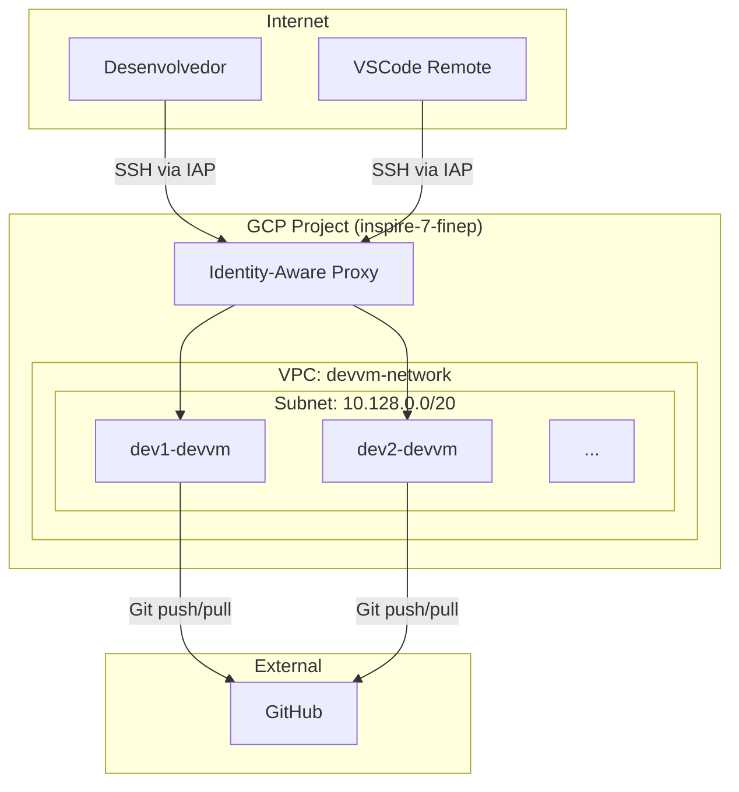
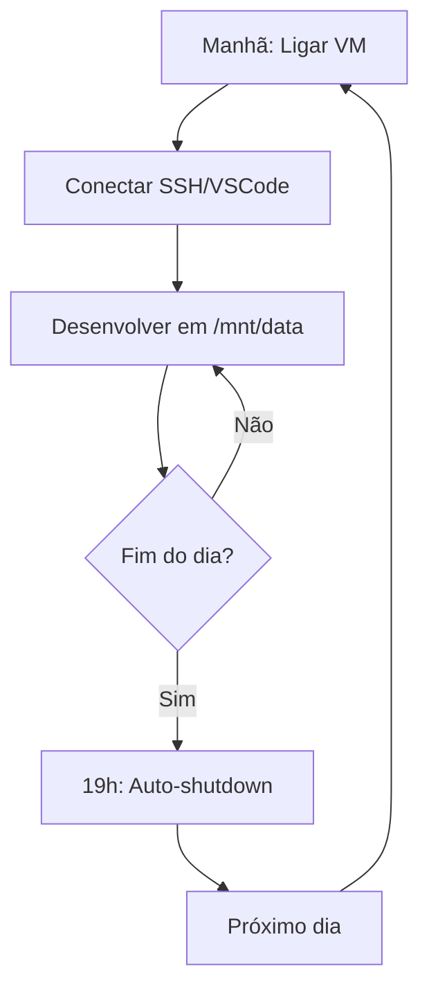

# VMs de Desenvolvimento para Desenvolvimento

> Ambientes de desenvolvimento isolados no GCP para a equipe.

**Repositório**: [github.com/destaquesgovbr/infra](https://github.com/destaquesgovbr/infra) (privado)

## Visão Geral

As devvms são VMs individuais no GCP criadas para cada desenvolvedor:

| Recurso | Especificação |
|---------|---------------|
| Sistema | Ubuntu 22.04 LTS |
| Disco Boot | 20GB SSD |
| Disco Dados | 50GB SSD (`/mnt/data`) |
| Acesso | IAP Tunnel (sem IP público) |
| Auto-shutdown | 19:00 (Brasília) |
| Região | southamerica-east1 (São Paulo) |

### Por que usar devvm?

- **Ambiente padronizado**: Mesma configuração para toda equipe
- **Persistência**: Projetos em `/mnt/data` sobrevivem reinicializações
- **VSCode Remote**: Desenvolva como se fosse local
- **Segurança**: Sem IP público, acesso apenas via IAP
- **Economia**: Auto-shutdown às 19h reduz custos em ~40%

---

## Arquitetura



---

## Como Solicitar uma Dev VM

!!! info "Gerenciado via Terraform"
    As devvms são criadas automaticamente via CI/CD quando você abre um PR.

### Passo 1: Clone o Repositório

```bash
git clone https://github.com/destaquesgovbr/infra.git
cd infra
```

### Passo 2: Crie uma Branch

```bash
git checkout main
git pull origin main
git checkout -b feat/devvm-seu-nome
```

### Passo 3: Adicione sua Configuração

Edite `terraform/terraform.tfvars`:

```hcl
devvms = {
  # Dev VMes existentes...
  nitai = {
    instance = {
      machine_type = "e2-standard-4"
      owner_email  = "nitaibezerra@gmail.com"
    }
  }

  # Adicione a sua aqui ↓
  seu-nome = {
    instance = {
      machine_type = "e2-standard-4"
      owner_email  = "seu-email@exemplo.com"
    }
  }
}
```

### Passo 4: Commit e Push

```bash
git add terraform/terraform.tfvars
git commit -m "feat: add devvm for seu-nome"
git push origin feat/devvm-seu-nome
```

### Passo 5: Abra um Pull Request

1. Acesse o repositório no GitHub
2. Clique em "New Pull Request"
3. Selecione sua branch
4. Aguarde o `terraform plan` automático no PR

### Passo 6: Merge e Deploy

Após aprovação:

1. Faça o merge
2. O `terraform apply` executa automaticamente
3. Em ~3 minutos sua VM estará pronta

---

## Machine Types

| Tipo | vCPUs | RAM | Custo/mês* | Recomendação |
|------|-------|-----|------------|--------------|
| `e2-medium` | 2 | 4GB | ~$25 | Edição de código simples |
| `e2-standard-2` | 2 | 8GB | ~$50 | Dev geral |
| `e2-standard-4` | 4 | 16GB | ~$100 | **Recomendado** - Dev com Docker/builds |

*Custos 24/7. Com auto-shutdown, ~40% menor.

### Configurações Avançadas

```hcl
seu-nome = {
  instance = {
    machine_type      = "e2-standard-4"
    owner_email       = "seu-email@exemplo.com"
    boot_disk_size_gb = 30   # Default: 20
    data_disk_size_gb = 100  # Default: 50
  }
}
```

---

## Conectar via SSH

### Comando Básico

```bash
gcloud compute ssh seu-nome-devvm \
  --zone=southamerica-east1-a \
  --tunnel-through-iap
```

### Verificar Status

```bash
# Ver se está rodando
gcloud compute instances describe seu-nome-devvm \
  --zone=southamerica-east1-a \
  --format="value(status)"
```

### Ligar VM (se desligada)

```bash
gcloud compute instances start seu-nome-devvm \
  --zone=southamerica-east1-a
```

---

## Disco de Dados

O disco persistente está em `/mnt/data`:

```bash
# Verificar espaço
df -h /mnt/data

# Criar pasta para projetos
mkdir -p /mnt/data/projects
cd /mnt/data/projects

# Clonar repositórios
git clone https://github.com/destaquesgovbr/scraper.git
```

!!! warning "Importante"
    Sempre use `/mnt/data` para projetos e dados. O disco boot pode ser recriado.

---

## Auto-Shutdown

As VMs desligam automaticamente às **19:00** (horário de Brasília) para economia.

### Ligar pela Manhã

```bash
gcloud compute instances start seu-nome-devvm \
  --zone=southamerica-east1-a
```

### Desligar Manualmente

```bash
gcloud compute instances stop seu-nome-devvm \
  --zone=southamerica-east1-a
```

---

## Fluxo de Trabalho



---

## Troubleshooting

### VM não conecta

1. Verificar se está rodando:
   ```bash
   gcloud compute instances describe seu-nome-devvm \
     --zone=southamerica-east1-a --format="value(status)"
   ```

2. Se `TERMINATED`, ligar:
   ```bash
   gcloud compute instances start seu-nome-devvm \
     --zone=southamerica-east1-a
   ```

### Permission denied

```bash
# Verificar conta logada
gcloud auth list

# Reautenticar
gcloud auth login
```

### Disco cheio

```bash
# Ver uso
df -h

# Limpar dados temporários
rm -rf /tmp/*
```

### Precisa de mais recursos

Edite `terraform.tfvars` e abra um PR para alterar `machine_type` ou `data_disk_size_gb`.

---

## Links Relacionados

- [Setup VSCode Remote](../onboarding/setup-devvm.md) - Configurar VSCode
- [Terraform Guide](./terraform-guide.md) - Como funciona o Terraform
- [Arquitetura GCP](./arquitetura-gcp.md) - Visão geral
