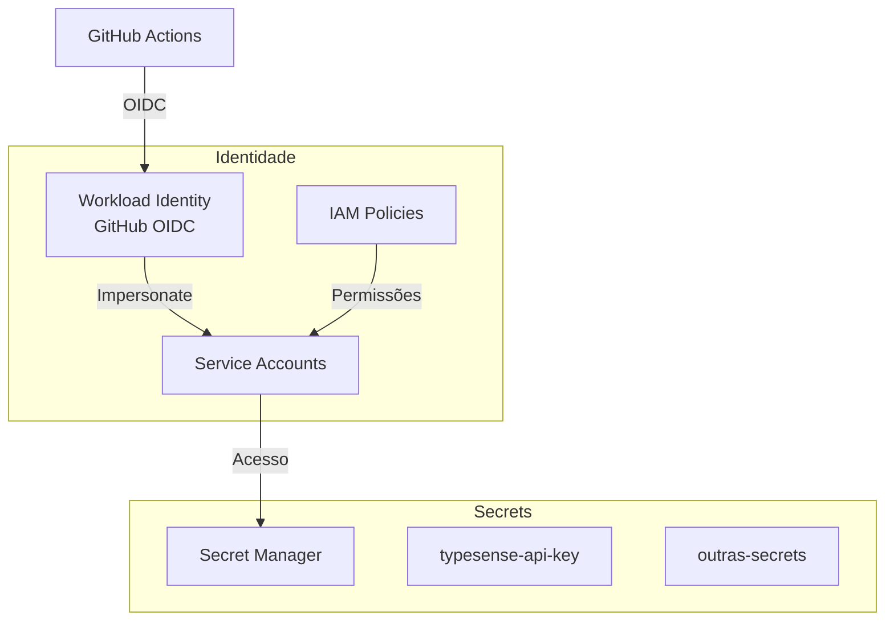
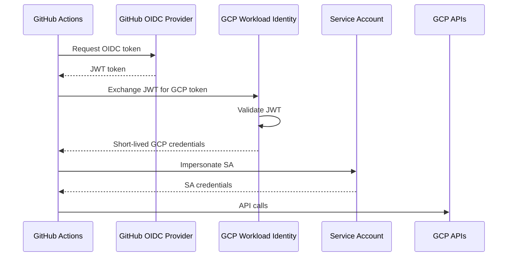

# Secrets e IAM

> Gerenciamento de credenciais e permissões no GCP.

## Visão Geral

O projeto usa:

- **Secret Manager** para armazenar credenciais sensíveis
- **IAM** para controle de acesso
- **Workload Identity Federation** para autenticação sem chaves



---

## Secret Manager

### Secrets Armazenadas

| Secret | Descrição | Usado por |
|--------|-----------|-----------|
| `typesense-api-key` | API Key do Typesense | Portal, Workflows |

### Criar Secret

```bash
# Via gcloud
echo -n "minha-api-key" | gcloud secrets create typesense-api-key \
  --data-file=- \
  --replication-policy="automatic"
```

### Via Terraform

```hcl
resource "google_secret_manager_secret" "typesense_api_key" {
  secret_id = "typesense-api-key"

  replication {
    auto {}
  }
}

resource "google_secret_manager_secret_version" "typesense_api_key" {
  secret      = google_secret_manager_secret.typesense_api_key.id
  secret_data = var.typesense_api_key
}
```

### Acessar Secret

```bash
# Via gcloud
gcloud secrets versions access latest --secret=typesense-api-key

# Em código Python
from google.cloud import secretmanager

client = secretmanager.SecretManagerServiceClient()
response = client.access_secret_version(
    name="projects/PROJECT/secrets/typesense-api-key/versions/latest"
)
secret = response.payload.data.decode("UTF-8")
```

### No Cloud Run

```hcl
env {
  name = "TYPESENSE_API_KEY"
  value_source {
    secret_key_ref {
      secret  = google_secret_manager_secret.typesense_api_key.id
      version = "latest"
    }
  }
}
```

---

## Service Accounts

### Listagem

| Service Account | Uso |
|-----------------|-----|
| `github-actions@PROJECT.iam.gserviceaccount.com` | Deploy via GitHub |
| `typesense-server@PROJECT.iam.gserviceaccount.com` | VM do Typesense |
| `portal-runner@PROJECT.iam.gserviceaccount.com` | Cloud Run |

### Criar Service Account

```bash
gcloud iam service-accounts create github-actions \
  --display-name="GitHub Actions"
```

### Via Terraform

```hcl
resource "google_service_account" "github_actions" {
  account_id   = "github-actions"
  display_name = "GitHub Actions SA"
}
```

---

## IAM Roles

### Roles por Service Account

#### `github-actions`

```hcl
# Artifact Registry
resource "google_project_iam_member" "github_ar" {
  project = var.project_id
  role    = "roles/artifactregistry.writer"
  member  = "serviceAccount:${google_service_account.github_actions.email}"
}

# Cloud Run
resource "google_project_iam_member" "github_run" {
  project = var.project_id
  role    = "roles/run.developer"
  member  = "serviceAccount:${google_service_account.github_actions.email}"
}

# Service Account User (para deploy)
resource "google_project_iam_member" "github_sa_user" {
  project = var.project_id
  role    = "roles/iam.serviceAccountUser"
  member  = "serviceAccount:${google_service_account.github_actions.email}"
}
```

#### `portal-runner`

```hcl
# Secret Manager (leitura)
resource "google_secret_manager_secret_iam_member" "portal_secret" {
  secret_id = google_secret_manager_secret.typesense_api_key.id
  role      = "roles/secretmanager.secretAccessor"
  member    = "serviceAccount:${google_service_account.portal_runner.email}"
}
```

---

## Workload Identity Federation

### Conceito

Permite que GitHub Actions autentique no GCP **sem service account keys**:



### Configuração

```hcl
# Pool
resource "google_iam_workload_identity_pool" "github" {
  workload_identity_pool_id = "github-pool"
}

# Provider
resource "google_iam_workload_identity_pool_provider" "github" {
  workload_identity_pool_id          = google_iam_workload_identity_pool.github.workload_identity_pool_id
  workload_identity_pool_provider_id = "github-provider"

  attribute_mapping = {
    "google.subject"       = "assertion.sub"
    "attribute.repository" = "assertion.repository"
  }

  # Restringir a repositórios da org
  attribute_condition = "assertion.repository_owner == 'destaquesgovbr'"

  oidc {
    issuer_uri = "https://token.actions.githubusercontent.com"
  }
}

# Permitir impersonation
resource "google_service_account_iam_binding" "workload_identity" {
  service_account_id = google_service_account.github_actions.name
  role               = "roles/iam.workloadIdentityUser"

  members = [
    "principalSet://iam.googleapis.com/${google_iam_workload_identity_pool.github.name}/attribute.repository/destaquesgovbr/portal"
  ]
}
```

### Uso no GitHub Actions

```yaml
- name: Authenticate to Google Cloud
  uses: google-github-actions/auth@v2
  with:
    workload_identity_provider: projects/123456/locations/global/workloadIdentityPools/github-pool/providers/github-provider
    service_account: github-actions@project.iam.gserviceaccount.com
```

---

## GitHub Secrets

### Configurar Secrets no Repositório

```bash
# Via GitHub CLI
gh secret set GCP_PROJECT --body "project-id"
gh secret set WIF_PROVIDER --body "projects/123/locations/global/workloadIdentityPools/github-pool/providers/github-provider"
gh secret set WIF_SERVICE_ACCOUNT --body "github-actions@project.iam.gserviceaccount.com"
```

### Secrets por Repositório

#### `portal`

| Secret | Descrição |
|--------|-----------|
| `GCP_PROJECT` | ID do projeto GCP |
| `WIF_PROVIDER` | Provider do Workload Identity |
| `WIF_SERVICE_ACCOUNT` | Service account para deploy |
| `TYPESENSE_HOST` | IP interno do Typesense |
| `TYPESENSE_PORT` | Porta (8108) |
| `TYPESENSE_API_KEY` | API Key do Typesense |

#### `scraper`

| Secret | Descrição |
|--------|-----------|
| `HF_TOKEN` | Token HuggingFace (write) |
| `COGFY_API_KEY` | API Key do Cogfy |
| `COGFY_COLLECTION_ID` | ID da collection Cogfy |

#### `infra`

| Secret | Descrição |
|--------|-----------|
| `TYPESENSE_HOST` | IP do Typesense |
| `TYPESENSE_PORT` | Porta |
| `TYPESENSE_API_KEY` | API Key |

---

## Princípio do Menor Privilégio

### Boas Práticas

1. **Conceder apenas permissões necessárias**
2. **Usar roles predefinidos** em vez de permissões individuais
3. **Evitar roles amplos** como Owner ou Editor
4. **Revisar periodicamente** as permissões
5. **Usar Workload Identity** em vez de service account keys

### Exemplo de Revisão

```bash
# Listar bindings de um projeto
gcloud projects get-iam-policy PROJECT_ID

# Listar permissões de uma service account
gcloud iam service-accounts get-iam-policy SA_EMAIL
```

---

## Auditoria

### Cloud Audit Logs

Habilitado automaticamente para:

- Admin Activity (sempre)
- Data Access (configurável)

### Ver logs de acesso

```bash
gcloud logging read "protoPayload.serviceName=secretmanager.googleapis.com" --limit=10
```

---

## Rotação de Secrets

### Rotação Manual

```bash
# Criar nova versão
echo -n "nova-api-key" | gcloud secrets versions add typesense-api-key --data-file=-

# Desabilitar versão antiga
gcloud secrets versions disable OLD_VERSION --secret=typesense-api-key
```

### Rotação Automática (Futuro)

```hcl
resource "google_secret_manager_secret" "api_key" {
  secret_id = "api-key"

  rotation {
    rotation_period    = "2592000s"  # 30 dias
    next_rotation_time = "2024-01-01T00:00:00Z"
  }
}
```

---

## Troubleshooting

### Erro de permissão no GitHub Actions

```
Error: Required 'run.services.get' permission
```

**Solução**: Adicionar role ao service account:

```bash
gcloud projects add-iam-policy-binding PROJECT_ID \
  --member="serviceAccount:github-actions@PROJECT.iam.gserviceaccount.com" \
  --role="roles/run.developer"
```

### Secret não encontrado

```
Error: Secret [projects/PROJECT/secrets/NAME] not found
```

**Solução**: Verificar se secret existe e SA tem acesso:

```bash
gcloud secrets list
gcloud secrets get-iam-policy SECRET_NAME
```

### Workload Identity falha

```
Error: Unable to exchange token
```

**Solução**:

1. Verificar `attribute_condition` no provider
2. Verificar nome do repositório no binding
3. Verificar permissões `roles/iam.workloadIdentityUser`

---

## Links Relacionados

- [Arquitetura GCP](./arquitetura-gcp.md) - Visão geral
- [Terraform Guide](./terraform-guide.md) - IaC
- [Deploy Portal](../workflows/portal-deploy.md) - Uso do Workload Identity
