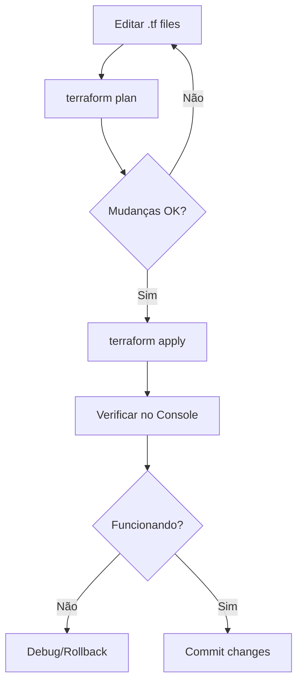

# Guia Terraform

> Como gerenciar a infraestrutura GCP com Terraform.

**Repositório**: [github.com/destaquesgovbr/infra](https://github.com/destaquesgovbr/infra) (privado)

## Visão Geral

A infraestrutura é gerenciada como código (IaC) usando Terraform:

```
infra/
├── terraform/
│   ├── main.tf              # Provider e networking
│   ├── variables.tf         # Variáveis de entrada
│   ├── outputs.tf           # Outputs
│   ├── typesense.tf         # Compute Engine
│   ├── portal.tf            # Cloud Run
│   ├── artifact-registry.tf # Container Registry
│   ├── workload-identity.tf # GitHub OIDC
│   └── terraform.tfvars     # Valores (não commitado)
├── Makefile                 # Comandos auxiliares
└── README.md
```

---

## Pré-requisitos

| Ferramenta | Versão | Instalação |
|------------|--------|------------|
| Terraform | 1.5+ | [terraform.io](https://www.terraform.io/downloads) |
| gcloud CLI | latest | [cloud.google.com](https://cloud.google.com/sdk/docs/install) |
| Acesso GCP | Owner/Editor | Solicitar ao admin |

### Verificação

```bash
terraform --version  # v1.5.x ou superior
gcloud --version     # Google Cloud SDK
gcloud auth list     # Conta autenticada
```

---

## Configuração Inicial

### 1. Autenticação GCP

```bash
# Login com sua conta
gcloud auth login

# Configurar projeto padrão
gcloud config set project PROJECT_ID

# Criar credenciais de aplicação
gcloud auth application-default login
```

### 2. Criar `terraform.tfvars`

```hcl
# terraform/terraform.tfvars
project_id = "seu-projeto-gcp"
region     = "us-east1"
zone       = "us-east1-b"

# GitHub (para Workload Identity)
github_org  = "destaquesgovbr"
github_repo = "portal"
```

### 3. Inicializar Terraform

```bash
cd terraform
terraform init
```

---

## Estrutura dos Arquivos

### `main.tf` - Provider e Networking

```hcl
terraform {
  required_version = ">= 1.5.0"

  required_providers {
    google = {
      source  = "hashicorp/google"
      version = "~> 5.0"
    }
  }

  backend "gcs" {
    bucket = "destaquesgovbr-terraform-state"
    prefix = "terraform/state"
  }
}

provider "google" {
  project = var.project_id
  region  = var.region
}

# VPC Network
resource "google_compute_network" "main" {
  name                    = "destaquesgovbr-vpc"
  auto_create_subnetworks = false
}

# Subnet
resource "google_compute_subnetwork" "main" {
  name          = "destaquesgovbr-subnet"
  ip_cidr_range = "10.0.0.0/24"
  region        = var.region
  network       = google_compute_network.main.id
}
```

### `typesense.tf` - Compute Engine

```hcl
resource "google_compute_instance" "typesense" {
  name         = "typesense-server"
  machine_type = "e2-medium"
  zone         = var.zone

  boot_disk {
    initialize_params {
      image = "debian-cloud/debian-11"
      size  = 50
      type  = "pd-ssd"
    }
  }

  network_interface {
    network    = google_compute_network.main.name
    subnetwork = google_compute_subnetwork.main.name
  }

  metadata_startup_script = file("scripts/typesense-startup.sh")

  tags = ["typesense"]

  service_account {
    email  = google_service_account.typesense.email
    scopes = ["cloud-platform"]
  }
}

# Firewall - Typesense interno
resource "google_compute_firewall" "typesense" {
  name    = "allow-typesense"
  network = google_compute_network.main.name

  allow {
    protocol = "tcp"
    ports    = ["8108"]
  }

  source_ranges = ["10.0.0.0/24"]
  target_tags   = ["typesense"]
}
```

### `portal.tf` - Cloud Run

```hcl
resource "google_cloud_run_v2_service" "portal" {
  name     = "portal"
  location = var.region

  template {
    containers {
      image = "us-east1-docker.pkg.dev/${var.project_id}/destaquesgovbr/portal:latest"

      resources {
        limits = {
          cpu    = "1"
          memory = "512Mi"
        }
      }

      env {
        name  = "TYPESENSE_HOST"
        value = google_compute_instance.typesense.network_interface[0].network_ip
      }
      env {
        name  = "TYPESENSE_PORT"
        value = "8108"
      }
      env {
        name = "TYPESENSE_API_KEY"
        value_source {
          secret_key_ref {
            secret  = google_secret_manager_secret.typesense_api_key.id
            version = "latest"
          }
        }
      }
    }

    vpc_access {
      connector = google_vpc_access_connector.main.id
      egress    = "ALL_TRAFFIC"
    }

    scaling {
      min_instance_count = 0
      max_instance_count = 10
    }
  }

  traffic {
    percent = 100
    type    = "TRAFFIC_TARGET_ALLOCATION_TYPE_LATEST"
  }
}

# VPC Connector
resource "google_vpc_access_connector" "main" {
  name          = "vpc-connector"
  region        = var.region
  ip_cidr_range = "10.8.0.0/28"
  network       = google_compute_network.main.name
}

# IAM - Permitir acesso público
resource "google_cloud_run_v2_service_iam_member" "public" {
  name     = google_cloud_run_v2_service.portal.name
  location = var.region
  role     = "roles/run.invoker"
  member   = "allUsers"
}
```

### `workload-identity.tf` - GitHub OIDC

```hcl
# Pool de Workload Identity
resource "google_iam_workload_identity_pool" "github" {
  workload_identity_pool_id = "github-pool"
  display_name              = "GitHub Actions Pool"
}

# Provider OIDC
resource "google_iam_workload_identity_pool_provider" "github" {
  workload_identity_pool_id          = google_iam_workload_identity_pool.github.workload_identity_pool_id
  workload_identity_pool_provider_id = "github-provider"
  display_name                       = "GitHub Provider"

  attribute_mapping = {
    "google.subject"       = "assertion.sub"
    "attribute.actor"      = "assertion.actor"
    "attribute.repository" = "assertion.repository"
  }

  attribute_condition = "assertion.repository_owner == '${var.github_org}'"

  oidc {
    issuer_uri = "https://token.actions.githubusercontent.com"
  }
}

# Service Account para GitHub Actions
resource "google_service_account" "github_actions" {
  account_id   = "github-actions"
  display_name = "GitHub Actions SA"
}

# Binding - permitir impersonation
resource "google_service_account_iam_binding" "github_actions" {
  service_account_id = google_service_account.github_actions.name
  role               = "roles/iam.workloadIdentityUser"

  members = [
    "principalSet://iam.googleapis.com/${google_iam_workload_identity_pool.github.name}/attribute.repository/${var.github_org}/${var.github_repo}"
  ]
}
```

---

## Comandos Principais

### Via Makefile

```bash
# Inicializar
make init

# Ver plano de mudanças
make plan

# Aplicar mudanças
make apply

# Destruir (CUIDADO!)
make destroy
```

### Via Terraform CLI

```bash
cd terraform

# Inicializar
terraform init

# Ver plano
terraform plan

# Aplicar
terraform apply

# Destruir (CUIDADO!)
terraform destroy
```

---

## Fluxo de Trabalho



---

## Outputs

```hcl
# outputs.tf
output "portal_url" {
  value = google_cloud_run_v2_service.portal.uri
}

output "typesense_internal_ip" {
  value = google_compute_instance.typesense.network_interface[0].network_ip
}

output "wif_provider" {
  value = google_iam_workload_identity_pool_provider.github.name
}
```

### Ver outputs

```bash
terraform output
terraform output portal_url
```

---

## Estado Remoto

O estado do Terraform é armazenado em GCS:

```hcl
backend "gcs" {
  bucket = "destaquesgovbr-terraform-state"
  prefix = "terraform/state"
}
```

### Criar bucket de estado

```bash
gsutil mb -l us-east1 gs://destaquesgovbr-terraform-state
gsutil versioning set on gs://destaquesgovbr-terraform-state
```

---

## Troubleshooting

### Erro de permissão

```
Error: Error creating Network: googleapi: Error 403: Required 'compute.networks.create'
```

**Solução**: Verificar permissões da conta GCP.

### Estado travado

```
Error: Error locking state: Error acquiring the state lock
```

**Solução**:

```bash
terraform force-unlock LOCK_ID
```

### Drift de configuração

```bash
# Verificar diferenças
terraform plan

# Importar recurso existente
terraform import google_compute_instance.typesense projects/PROJECT/zones/ZONE/instances/NAME
```

---

## Boas Práticas

1. **Nunca commitar** `terraform.tfvars` com valores sensíveis
2. **Sempre rodar** `terraform plan` antes de `apply`
3. **Usar** variáveis para valores que mudam
4. **Documentar** recursos com comentários
5. **Versionar** providers no `required_providers`

---

## Links Relacionados

- [Arquitetura GCP](./arquitetura-gcp.md) - Visão geral da infraestrutura
- [Secrets e IAM](./secrets-iam.md) - Permissões
- [Deploy Portal](../workflows/portal-deploy.md) - Uso do Workload Identity
