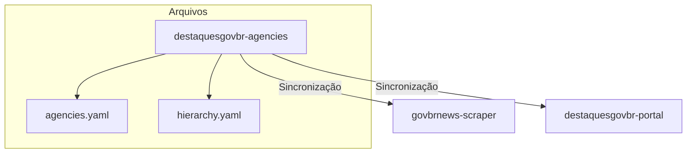
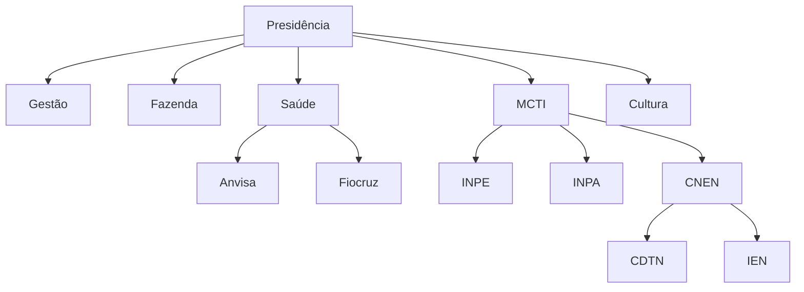
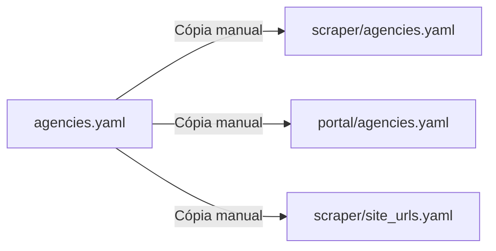
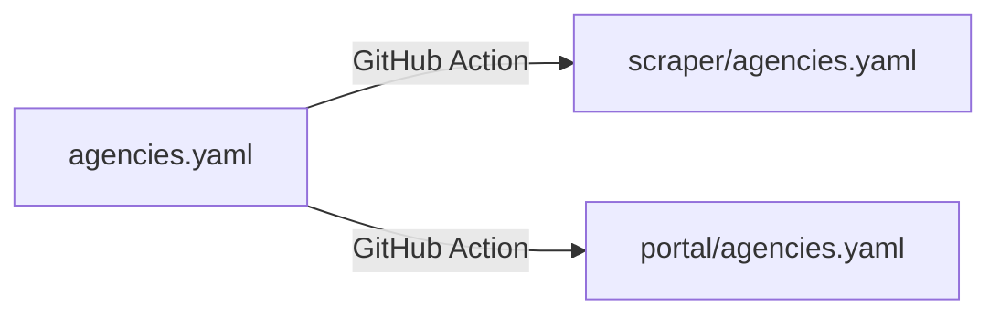

# Módulo: Agencies (destaquesgovbr-agencies)

> Catálogo centralizado de órgãos governamentais.

**Repositório**: [github.com/destaquesgovbr/destaquesgovbr-agencies](https://github.com/destaquesgovbr/destaquesgovbr-agencies)

## Visão Geral

O repositório `destaquesgovbr-agencies` é a **fonte centralizada** de dados sobre os órgãos governamentais do Brasil, contendo:

- **156 órgãos** catalogados
- **29 tipos** diferentes (Ministério, Agência, Instituto, etc.)
- **Hierarquia organizacional** completa



---

## Estrutura do Repositório

```
destaquesgovbr-agencies/
├── agencies.yaml        # Dados completos dos órgãos
├── hierarchy.yaml       # Árvore hierárquica
└── README.md
```

---

## Schema dos Dados

### `agencies.yaml`

```yaml
sources:
  <agency_key>:
    name: <nome_oficial>
    parent: <agency_key_pai>      # Órgão superior
    type: <tipo>                   # Ministério, Agência, etc.
    url: <url_noticias>           # URL do feed de notícias
```

### Exemplo

```yaml
sources:
  presidencia:
    name: Presidência da República
    parent: null
    type: Presidência
    url: https://www.gov.br/planalto/pt-br/acompanhe-o-planalto/noticias

  gestao:
    name: Ministério da Gestão e da Inovação em Serviços Públicos
    parent: presidencia
    type: Ministério
    url: https://www.gov.br/gestao/pt-br/assuntos/noticias

  inpe:
    name: Instituto Nacional de Pesquisas Espaciais
    parent: mcti
    type: Instituto
    url: https://www.gov.br/inpe/pt-br/assuntos/noticias

  anvisa:
    name: Agência Nacional de Vigilância Sanitária
    parent: saude
    type: Agência Reguladora
    url: https://www.gov.br/anvisa/pt-br/assuntos/noticias-anvisa
```

---

## Hierarquia Organizacional

### `hierarchy.yaml`

```yaml
presidencia:
  - gestao
  - fazenda
  - saude:
      - anvisa
      - fiocruz
      - hemocentros
  - mcti:
      - inpe
      - inpa
      - cnen:
          - cdtn
          - ien
          - ipen
  - cultura:
      - iphan
      - funarte
      - biblioteca-nacional
```

### Visualização



---

## Estatísticas

| Métrica | Valor |
|---------|-------|
| Total de órgãos | 156 |
| Tipos únicos | 29 |
| Ministérios | ~30 |
| Agências Reguladoras | ~10 |
| Institutos | ~40 |
| Fundações | ~20 |

### Principais Órgãos Pais

| Órgão | Subordinados |
|-------|--------------|
| MCTI | 21 |
| Gestão | 12 |
| Cultura | 8 |
| Saúde | 7 |
| Fazenda | 5 |

---

## Tipos de Órgãos

```yaml
tipos:
  - Presidência
  - Ministério
  - Secretaria
  - Agência Reguladora
  - Autarquia
  - Fundação
  - Instituto
  - Empresa Pública
  - Sociedade de Economia Mista
  - Conselho
  - Comissão
  # ... 29 tipos no total
```

---

## Uso no Sistema

### 1. Scraper

O scraper usa os dados para:

- Determinar **quais sites raspar** (URLs)
- Identificar a **agência** de cada notícia
- Mapear **IDs para nomes** completos

```python
# govbrnews-scraper/src/scraper/agencies.yaml
agencies:
  gestao: Ministério da Gestão e da Inovação em Serviços Públicos
```

### 2. Portal

O portal usa para:

- **Filtros** de busca por órgão
- **Páginas** dedicadas (`/orgaos/[agencyKey]`)
- **Navegação** hierárquica

```yaml
# destaquesgovbr-portal/src/lib/agencies.yaml
sources:
  gestao:
    name: Ministério da Gestão...
    parent: presidencia
    type: Ministério
```

### 3. Typesense

Indexação com campo `agency` para filtros:

```json
{
  "agency": "gestao",
  "title": "Nova política de gestão..."
}
```

---

## Sincronização

### Situação Atual (Manual)



**Processo:**
1. Editar `destaquesgovbr-agencies/agencies.yaml`
2. Copiar manualmente para `govbrnews-scraper`
3. Copiar manualmente para `destaquesgovbr-portal`
4. Atualizar `site_urls.yaml` se necessário

### Situação Futura (Automática)



**Meta:**
- Push em `destaquesgovbr-agencies` dispara workflow
- Workflow atualiza automaticamente scraper e portal
- PRs automáticos ou commits diretos

---

## Como Adicionar Novo Órgão

### 1. Editar `agencies.yaml`

```yaml
sources:
  # Adicionar novo órgão
  novo-orgao:
    name: Nome Oficial do Novo Órgão
    parent: orgao-pai        # ou null se não tiver
    type: Tipo do Órgão
    url: https://www.gov.br/novo-orgao/pt-br/noticias
```

### 2. Atualizar `hierarchy.yaml` (se aplicável)

```yaml
orgao-pai:
  - outros-subordinados
  - novo-orgao              # Adicionar aqui
```

### 3. Sincronizar (manual por enquanto)

```bash
# Copiar para scraper
cp agencies.yaml ../govbrnews-scraper/src/scraper/agencies.yaml

# Copiar para portal
cp agencies.yaml ../destaquesgovbr-portal/src/lib/agencies.yaml

# Atualizar site_urls.yaml no scraper
```

### 4. Testar

```bash
# No scraper
python src/main.py scrape --start-date $(date +%Y-%m-%d) --end-date $(date +%Y-%m-%d)
```

---

## Como Remover Órgão

### 1. Remover de `agencies.yaml`

### 2. Remover de `hierarchy.yaml`

### 3. Remover de `site_urls.yaml` no scraper

### 4. Sincronizar

> **Nota**: Notícias existentes no dataset permanecem. Apenas novas raspagens são afetadas.

---

## Como Alterar Hierarquia

### Exemplo: Mover órgão para outro pai

```yaml
# Antes
mcti:
  - inpe

# Depois (mover INPE para outro ministério)
outro-ministerio:
  - inpe
```

### Atualizar `agencies.yaml`

```yaml
inpe:
  name: Instituto Nacional de Pesquisas Espaciais
  parent: outro-ministerio    # Atualizar parent
  type: Instituto
```

---

## Validação

### Verificações Importantes

- [ ] Todos os `parent` existem no arquivo
- [ ] Não há ciclos na hierarquia
- [ ] URLs são válidas e acessíveis
- [ ] Nomes estão corretos e oficiais
- [ ] Tipos são consistentes

### Script de Validação (futuro)

```python
def validate_agencies():
    """Valida consistência do arquivo agencies.yaml"""
    # Verificar parents existem
    # Verificar URLs acessíveis
    # Verificar tipos válidos
    pass
```

---

## Links Relacionados

- [Componentes Estruturantes](../arquitetura/componentes-estruturantes.md) - Visão geral
- [Módulo Scraper](./scraper.md) - Uso no scraper
- [Módulo Portal](./portal.md) - Uso no portal
- [Árvore Temática](./arvore-tematica.md) - Outro componente estruturante
