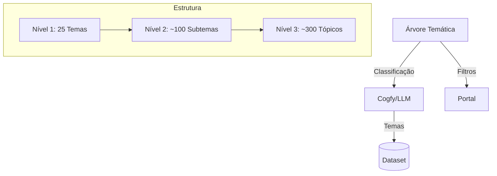
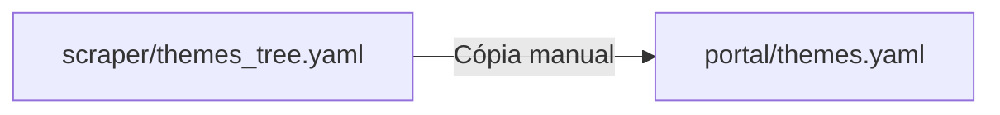
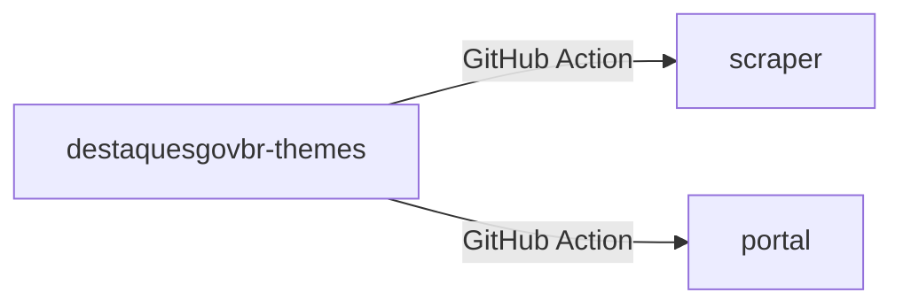
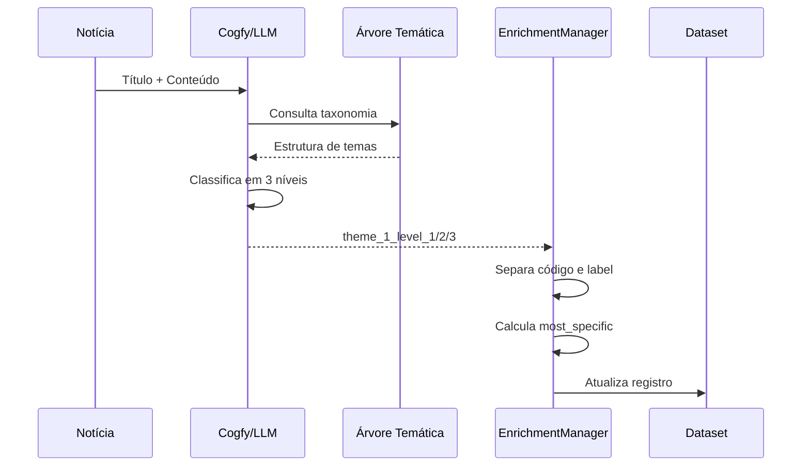

# Módulo: Árvore Temática

> Taxonomia hierárquica para classificação automática de notícias.

## Visão Geral

A árvore temática é uma **taxonomia de 25 temas principais** organizada em **3 níveis hierárquicos**, usada para classificar automaticamente as notícias governamentais via LLM.



---

## Estrutura Hierárquica

```
Nível 1 (Tema)      → Nível 2 (Subtema)       → Nível 3 (Tópico)
01 - Economia       → 01.01 - Pol. Econômica  → 01.01.01 - Pol. Fiscal
                    → 01.02 - Fiscalização    → 01.02.01 - Fisc. Econômica
02 - Educação       → 02.01 - Ensino Básico   → 02.01.01 - Ed. Infantil
...
```

---

## Lista Completa de Temas (Nível 1)

| Código | Tema |
|--------|------|
| 01 | Economia e Finanças |
| 02 | Educação |
| 03 | Saúde |
| 04 | Segurança Pública |
| 05 | Meio Ambiente e Sustentabilidade |
| 06 | Ciência, Tecnologia e Inovação |
| 07 | Infraestrutura e Transportes |
| 08 | Cultura, Artes e Patrimônio |
| 09 | Esportes e Lazer |
| 10 | Agricultura, Pecuária e Abastecimento |
| 11 | Indústria e Comércio |
| 12 | Relações Internacionais e Diplomacia |
| 13 | Justiça e Direitos Humanos |
| 14 | Trabalho e Emprego |
| 15 | Desenvolvimento Social |
| 16 | Turismo |
| 17 | Energia e Recursos Minerais |
| 18 | Comunicações e Mídia |
| 19 | Defesa e Forças Armadas |
| 20 | Políticas Públicas e Governança |
| 21 | Legislação e Regulamentação |
| 22 | Eventos Oficiais e Cerimônias |
| 23 | Estatísticas e Dados Públicos |
| 24 | Minorias e Grupos Especiais |
| 25 | Habitação e Urbanismo |

---

## Exemplo Detalhado: Tema 01

```yaml
01 - Economia e Finanças:
  01.01 - Política Econômica:
    - 01.01.01 - Política Fiscal
    - 01.01.02 - Autonomia Econômica
    - 01.01.03 - Análise Econômica
  01.02 - Fiscalização e Tributação:
    - 01.02.01 - Fiscalização Econômica
    - 01.02.02 - Tributação e Impostos
  01.03 - Sistema Financeiro:
    - 01.03.01 - Bancos e Instituições Financeiras
    - 01.03.02 - Mercado de Capitais
  01.04 - Orçamento Público:
    - 01.04.01 - Lei Orçamentária
    - 01.04.02 - Execução Orçamentária
```

---

## Arquivos de Configuração

### Localização

| Repositório | Arquivo | Formato |
|-------------|---------|---------|
| scraper | `src/enrichment/themes_tree.yaml` | YAML plano |
| portal | `src/lib/themes.yaml` | YAML estruturado |

### Formato no Scraper

```yaml
# scraper/src/enrichment/themes_tree.yaml
01 - Economia e Finanças:
  01.01 - Política Econômica:
    - 01.01.01 - Política Fiscal
    - 01.01.02 - Autonomia Econômica
    - 01.01.03 - Análise Econômica
  01.02 - Fiscalização e Tributação:
    - 01.02.01 - Fiscalização Econômica
    - 01.02.02 - Tributação e Impostos

02 - Educação:
  02.01 - Ensino Básico:
    - 02.01.01 - Educação Infantil
    - 02.01.02 - Ensino Fundamental
```

### Formato no Portal

```yaml
# portal/src/lib/themes.yaml
themes:
  - label: Economia e Finanças
    code: "01"
    children:
      - label: Política Econômica
        code: "01.01"
        children:
          - label: Política Fiscal
            code: "01.01.01"
          - label: Autonomia Econômica
            code: "01.01.02"
      - label: Fiscalização e Tributação
        code: "01.02"
        children:
          - label: Fiscalização Econômica
            code: "01.02.01"
```

---

## Uso no Sistema

### 1. Classificação via Cogfy/LLM

O Cogfy recebe a árvore temática e classifica cada notícia:

```
Entrada: Título + Conteúdo da notícia
Saída:
  - theme_1_level_1: "01 - Economia e Finanças"
  - theme_1_level_2: "01.01 - Política Econômica"
  - theme_1_level_3: "01.01.01 - Política Fiscal"
```

### 2. Mapeamento no Enriquecimento

O `EnrichmentManager` separa código e label:

```python
# Entrada do Cogfy
theme_1_level_1 = "01 - Economia e Finanças"

# Após mapeamento
theme_1_level_1_code = "01"
theme_1_level_1_label = "Economia e Finanças"
```

### 3. Cálculo do Tema Mais Específico

```python
def get_most_specific_theme(row):
    """Retorna o tema mais específico disponível."""
    if row.get("theme_1_level_3_code"):
        return row["theme_1_level_3_code"], row["theme_1_level_3_label"]
    elif row.get("theme_1_level_2_code"):
        return row["theme_1_level_2_code"], row["theme_1_level_2_label"]
    else:
        return row["theme_1_level_1_code"], row["theme_1_level_1_label"]
```

### 4. Filtros no Portal

```typescript
// Filtro por tema nível 1
const results = await searchNews({
  filters: { theme_1_level_1_code: ["01", "03"] }
})

// Navegação por tema
<Link href="/temas/economia-e-financas">
  Economia e Finanças
</Link>
```

---

## Campos no Dataset

| Campo | Tipo | Exemplo |
|-------|------|---------|
| `theme_1_level_1_code` | string | "01" |
| `theme_1_level_1_label` | string | "Economia e Finanças" |
| `theme_1_level_2_code` | string | "01.01" |
| `theme_1_level_2_label` | string | "Política Econômica" |
| `theme_1_level_3_code` | string | "01.01.01" |
| `theme_1_level_3_label` | string | "Política Fiscal" |
| `most_specific_theme_code` | string | "01.01.01" |
| `most_specific_theme_label` | string | "Política Fiscal" |

---

## Sincronização

### Situação Atual (Manual)



### Situação Futura



**Meta**: Criar repositório dedicado `destaquesgovbr-themes` para centralizar e automatizar sincronização.

---

## Como Adicionar Novo Tema

### 1. Identificar necessidade

- Analisar notícias não classificadas adequadamente
- Verificar se tema existente não cobre o assunto

### 2. Definir estrutura

```yaml
26 - Novo Tema:
  26.01 - Subtema A:
    - 26.01.01 - Tópico 1
    - 26.01.02 - Tópico 2
  26.02 - Subtema B:
    - 26.02.01 - Tópico 3
```

### 3. Atualizar arquivos

1. Editar `scraper/src/enrichment/themes_tree.yaml`
2. Editar `portal/src/lib/themes.yaml`
3. Atualizar configuração no Cogfy (via interface web)

### 4. Testar

- Verificar se LLM classifica corretamente
- Verificar se filtros funcionam no portal

---

## Como Adicionar Subtema/Tópico

### Exemplo: Adicionar tópico ao tema 01

```yaml
01 - Economia e Finanças:
  01.01 - Política Econômica:
    - 01.01.01 - Política Fiscal
    - 01.01.02 - Autonomia Econômica
    - 01.01.03 - Análise Econômica
    - 01.01.04 - Novo Tópico        # Adicionar aqui
```

### Convenção de códigos

- Nível 1: `XX` (01-25)
- Nível 2: `XX.YY` (01.01, 01.02, ...)
- Nível 3: `XX.YY.ZZ` (01.01.01, 01.01.02, ...)

---

## Considerações de Design

### Por que 3 níveis?

- **Nível 1**: Visão macro, filtros rápidos
- **Nível 2**: Detalhamento intermediário
- **Nível 3**: Especificidade máxima, análises profundas

### Por que 25 temas?

- Cobertura ampla de áreas governamentais
- Quantidade gerenciável para navegação
- Balanceamento entre granularidade e usabilidade

### Limitações atuais

- Apenas 1 tema por notícia (`theme_1`)
- Preparado para múltiplos temas no futuro (`theme_2`, `theme_3`)

---

## Diagrama de Fluxo de Classificação



---

## Links Relacionados

- [Componentes Estruturantes](../arquitetura/componentes-estruturantes.md)
- [Integração Cogfy](./cogfy-integracao.md)
- [Módulo Scraper](./scraper.md)
- [Catálogo de Órgãos](./agencies.md)
