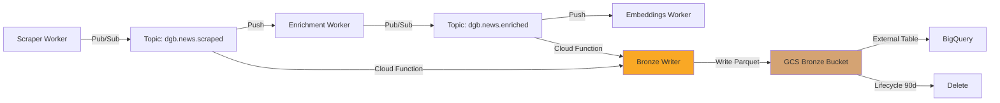
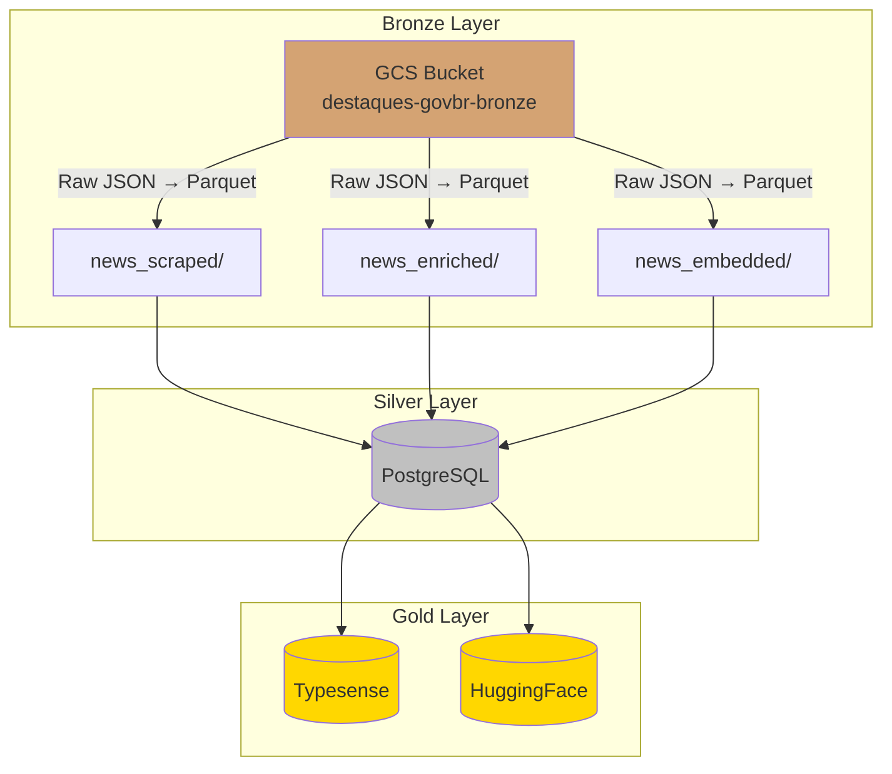

# Bronze Layer - Google Cloud Storage

**Camada de dados brutos (Raw Layer)** da arquitetura Medallion no DestaquesGovbr.

---

## Visão Geral

A **Bronze Layer** armazena dados brutos em formato Parquet no **Google Cloud Storage (GCS)**, servindo como repositório imutável de todos os eventos do sistema antes de qualquer transformação.

### Características

- ✅ **Formato**: Apache Parquet (colunar, comprimido)
- ✅ **Storage**: Google Cloud Storage (GCS)
- ✅ **Imutabilidade**: Dados nunca são modificados após escrita
- ✅ **Particionamento**: Por data (`year=YYYY/month=MM/day=DD`)
- ✅ **Retenção**: 90 dias (lifecycle policy)
- ✅ **Acesso**: BigQuery External Tables para queries SQL
- ✅ **Custo**: ~$0.02/GB/mês (GCS Standard)

---

## Arquitetura

### Fluxo de Dados



### Camada Bronze no Medallion



---

## Estrutura do Bucket GCS

### Hierarquia

```
gs://destaques-govbr-bronze/
├── news_scraped/
│   ├── year=2026/
│   │   ├── month=01/
│   │   │   ├── day=01/
│   │   │   │   ├── part-00000.parquet
│   │   │   │   ├── part-00001.parquet
│   │   │   │   └── ...
│   │   │   ├── day=02/
│   │   │   └── ...
│   │   ├── month=02/
│   │   └── ...
│   └── ...
├── news_enriched/
│   └── year=2026/month=MM/day=DD/part-XXXXX.parquet
└── news_embedded/
    └── year=2026/month=MM/day=DD/part-XXXXX.parquet
```

### Schema Parquet

#### news_scraped/

| Campo | Tipo | Descrição |
|-------|------|-----------|
| `unique_id` | STRING | ID único da notícia |
| `title` | STRING | Título original |
| `content` | STRING | Conteúdo completo |
| `url` | STRING | URL fonte |
| `published_at` | TIMESTAMP | Data de publicação |
| `agency_id` | STRING | ID do órgão (ex: "mgi") |
| `scraped_at` | TIMESTAMP | Data de coleta |
| `trace_id` | STRING | Rastreamento do evento |

#### news_enriched/

Herda todos os campos de `news_scraped/` e adiciona:

| Campo | Tipo | Descrição |
|-------|------|-----------|
| `theme_l1_code` | STRING | Código do tema L1 (ex: "01") |
| `theme_l2_code` | STRING | Código do tema L2 (ex: "01.01") |
| `theme_l3_code` | STRING | Código do tema L3 (ex: "01.01.01") |
| `summary` | STRING | Resumo LLM-gerado |
| `enriched_at` | TIMESTAMP | Data de enriquecimento |
| `model_id` | STRING | Modelo AWS Bedrock usado |

#### news_embedded/

Herda todos os campos de `news_enriched/` e adiciona:

| Campo | Tipo | Descrição |
|-------|------|-----------|
| `content_embedding` | ARRAY<FLOAT> | Vetor 768-dim |
| `embedded_at` | TIMESTAMP | Data de embedding |
| `embedding_model` | STRING | Modelo usado (mpnet-base-v2) |

---

## Cloud Function: Bronze Writer

### Função

A **Bronze Writer** é uma Cloud Function acionada por Pub/Sub que escreve eventos em formato Parquet no GCS.

### Código Exemplo

```python
# functions/bronze_writer/main.py
import base64
import json
import io
from datetime import datetime
from google.cloud import storage
import pyarrow as pa
import pyarrow.parquet as pq

def write_to_bronze(event, context):
    """
    Escreve evento Pub/Sub na Bronze Layer.
    
    Acionador: Pub/Sub topics (dgb.news.scraped, dgb.news.enriched)
    """
    # 1. Decodificar mensagem Pub/Sub
    pubsub_message = base64.b64decode(event['data']).decode('utf-8')
    data = json.loads(pubsub_message)
    
    # 2. Determinar prefixo baseado no topic
    topic_name = context.resource['name']
    if 'scraped' in topic_name:
        prefix = 'news_scraped'
    elif 'enriched' in topic_name:
        prefix = 'news_enriched'
    elif 'embedded' in topic_name:
        prefix = 'news_embedded'
    else:
        raise ValueError(f"Unknown topic: {topic_name}")
    
    # 3. Extrair partição da data
    published_at = datetime.fromisoformat(data['published_at'])
    year = published_at.year
    month = published_at.month
    day = published_at.day
    
    # 4. Construir path do arquivo
    partition_path = f"{prefix}/year={year}/month={month:02d}/day={day:02d}"
    filename = f"part-{context.event_id[:8]}.parquet"
    blob_path = f"{partition_path}/{filename}"
    
    # 5. Converter para Parquet
    table = pa.Table.from_pylist([data])
    buffer = io.BytesIO()
    pq.write_table(table, buffer)
    
    # 6. Escrever no GCS
    storage_client = storage.Client()
    bucket = storage_client.bucket('destaques-govbr-bronze')
    blob = bucket.blob(blob_path)
    blob.upload_from_file(buffer, rewind=True, content_type='application/octet-stream')
    
    print(f"Written to gs://destaques-govbr-bronze/{blob_path}")
    return {'status': 'success', 'path': blob_path}
```

### Deployment

```bash
gcloud functions deploy bronze-writer \
  --runtime=python311 \
  --trigger-topic=dgb.news.scraped \
  --entry-point=write_to_bronze \
  --memory=512MB \
  --timeout=60s \
  --region=southamerica-east1 \
  --set-env-vars=GCS_BUCKET=destaques-govbr-bronze
```

---

## Lifecycle Policy

### Configuração

```json
{
  "lifecycle": {
    "rule": [
      {
        "action": {
          "type": "Delete"
        },
        "condition": {
          "age": 90,
          "matchesPrefix": ["news_scraped/", "news_enriched/", "news_embedded/"]
        }
      }
    ]
  }
}
```

### Aplicar Policy

```bash
# Criar arquivo de configuração
cat > lifecycle.json <<EOF
{
  "lifecycle": {
    "rule": [
      {
        "action": {"type": "Delete"},
        "condition": {
          "age": 90,
          "matchesPrefix": ["news_scraped/", "news_enriched/", "news_embedded/"]
        }
      }
    ]
  }
}
EOF

# Aplicar ao bucket
gsutil lifecycle set lifecycle.json gs://destaques-govbr-bronze
```

### Verificar Policy

```bash
gsutil lifecycle get gs://destaques-govbr-bronze
```

---

## Integração com BigQuery

### Criar External Tables

```sql
-- Tabela externa para news_scraped
CREATE OR REPLACE EXTERNAL TABLE `destaques-govbr.bronze.news_scraped`
OPTIONS (
  format = 'PARQUET',
  uris = ['gs://destaques-govbr-bronze/news_scraped/*/*/*/*.parquet'],
  hive_partition_uri_prefix = 'gs://destaques-govbr-bronze/news_scraped',
  require_hive_partition_filter = FALSE
);

-- Tabela externa para news_enriched
CREATE OR REPLACE EXTERNAL TABLE `destaques-govbr.bronze.news_enriched`
OPTIONS (
  format = 'PARQUET',
  uris = ['gs://destaques-govbr-bronze/news_enriched/*/*/*/*.parquet'],
  hive_partition_uri_prefix = 'gs://destaques-govbr-bronze/news_enriched',
  require_hive_partition_filter = FALSE
);

-- Tabela externa para news_embedded
CREATE OR REPLACE EXTERNAL TABLE `destaques-govbr.bronze.news_embedded`
OPTIONS (
  format = 'PARQUET',
  uris = ['gs://destaques-govbr-bronze/news_embedded/*/*/*/*.parquet'],
  hive_partition_uri_prefix = 'gs://destaques-govbr-bronze/news_embedded',
  require_hive_partition_filter = FALSE
);
```

### Queries de Exemplo

```sql
-- Contar eventos por dia
SELECT
  DATE(published_at) as date,
  COUNT(*) as events
FROM `destaques-govbr.bronze.news_scraped`
WHERE DATE(published_at) >= DATE_SUB(CURRENT_DATE(), INTERVAL 7 DAY)
GROUP BY date
ORDER BY date DESC;

-- Analisar latência de enriquecimento
SELECT
  AVG(TIMESTAMP_DIFF(enriched_at, scraped_at, SECOND)) as avg_latency_seconds,
  MAX(TIMESTAMP_DIFF(enriched_at, scraped_at, SECOND)) as max_latency_seconds
FROM `destaques-govbr.bronze.news_enriched`
WHERE DATE(enriched_at) = CURRENT_DATE();

-- Distribuição de temas (L1)
SELECT
  theme_l1_code,
  COUNT(*) as count
FROM `destaques-govbr.bronze.news_enriched`
WHERE DATE(enriched_at) >= DATE_SUB(CURRENT_DATE(), INTERVAL 30 DAY)
GROUP BY theme_l1_code
ORDER BY count DESC
LIMIT 10;
```

---

## Imutabilidade e Auditoria

### Garantias

1. **Write-Once**: Arquivos nunca são modificados após escrita
2. **Append-Only**: Novos eventos sempre adicionam novos arquivos
3. **Particionamento Temporal**: Cada dia tem seus próprios arquivos
4. **Trace ID**: Cada evento tem `trace_id` único para rastreamento

### Auditoria

```bash
# Listar arquivos de uma partição
gsutil ls gs://destaques-govbr-bronze/news_scraped/year=2026/month=05/day=05/

# Ver metadados de um arquivo
gsutil stat gs://destaques-govbr-bronze/news_scraped/year=2026/month=05/day=05/part-abc12345.parquet

# Contar total de arquivos
gsutil du -sh gs://destaques-govbr-bronze/news_scraped/
```

---

## Recuperação de Desastres

### Cenário 1: Perda de dados na Silver Layer (PostgreSQL)

**Solução**: Reprocessar eventos da Bronze Layer.

```python
# scripts/replay_from_bronze.py
from google.cloud import bigquery

client = bigquery.Client()

# Buscar eventos de um período
query = """
SELECT *
FROM `destaques-govbr.bronze.news_scraped`
WHERE DATE(scraped_at) BETWEEN '2026-05-01' AND '2026-05-05'
ORDER BY scraped_at
"""

for row in client.query(query):
    # Republicar no Pub/Sub
    publish_to_topic('dgb.news.scraped', row)
```

### Cenário 2: Corrupção de dados

**Solução**: GCS mantém versões de objetos (se habilitado).

```bash
# Habilitar versionamento
gsutil versioning set on gs://destaques-govbr-bronze

# Listar versões de um arquivo
gsutil ls -a gs://destaques-govbr-bronze/news_scraped/year=2026/month=05/day=05/part-abc12345.parquet

# Restaurar versão anterior
gsutil cp gs://destaques-govbr-bronze/news_scraped/.../part-abc12345.parquet#1234567890 \
  gs://destaques-govbr-bronze/news_scraped/.../part-abc12345-restored.parquet
```

---

## Custos

### Cálculo

| Item | Valor | Custo Mensal |
|------|-------|--------------|
| **Storage (90 dias)** | ~50 GB | $1.00 |
| **Class A Operations** | ~10k/mês | $0.05 |
| **BigQuery Queries** | ~100 GB/mês | $5.00 |
| **Data Transfer** | ~10 GB egress | $1.20 |
| **Total** | - | **~$7.25/mês** |

**Assumptions**:
- 5.000 notícias/dia × 0.5 KB/notícia (Parquet) = 2.5 MB/dia
- 90 dias × 2.5 MB = 225 MB × 3 tópicos = 675 MB ≈ 1 GB
- Escala conservadora: 50 GB para 90 dias (inclui todos os campos)

---

## Monitoramento

### Métricas Cloud Monitoring

```yaml
# Alertas recomendados
- name: bronze_layer_write_errors
  metric: cloud.googleapis.com/functions/execution/error_count
  filter: resource.function_name="bronze-writer"
  threshold: 10 errors/hour
  
- name: bronze_layer_storage_growth
  metric: storage.googleapis.com/storage/total_bytes
  filter: resource.bucket_name="destaques-govbr-bronze"
  threshold: > 100 GB (revisar lifecycle)
  
- name: bronze_layer_write_latency
  metric: cloud.googleapis.com/functions/execution/duration
  filter: resource.function_name="bronze-writer"
  threshold: P95 > 30s
```

### Dashboard Grafana

```yaml
# Query para monitorar escritas
- expr: |
    rate(gcp_cloudfunctions_function_invocations_total{function_name="bronze-writer"}[5m])
  legendFormat: "Bronze Writes/sec"
  
- expr: |
    histogram_quantile(0.95, 
      rate(gcp_cloudfunctions_function_execution_duration_seconds_bucket[5m]))
  legendFormat: "P95 Latency"
```

---

## Troubleshooting

### Problema: Bronze Writer retorna erro "quota exceeded"

**Causa**: Rate limit de escritas no GCS excedido.

**Solução**:
```bash
# Verificar quota atual
gcloud compute project-info describe --project=destaques-govbr

# Solicitar aumento de quota
# Console GCP → IAM & Admin → Quotas → Cloud Storage API → Request Increase
```

---

### Problema: Arquivos Parquet corrompidos

**Causa**: Falha na escrita (ex: OOM na Cloud Function).

**Solução**:
```python
# Validar arquivo Parquet
import pyarrow.parquet as pq

try:
    table = pq.read_table('gs://destaques-govbr-bronze/news_scraped/.../part-abc.parquet')
    print(f"Valid file: {table.num_rows} rows")
except Exception as e:
    print(f"Corrupted file: {e}")
    # Deletar e reprocessar
```

---

### Problema: BigQuery External Table não encontra arquivos

**Causa**: Padrão de URI incorreto ou partições não atualizadas.

**Solução**:
```sql
-- Recriar tabela com padrão correto
DROP EXTERNAL TABLE IF EXISTS `destaques-govbr.bronze.news_scraped`;

CREATE EXTERNAL TABLE `destaques-govbr.bronze.news_scraped`
OPTIONS (
  format = 'PARQUET',
  uris = ['gs://destaques-govbr-bronze/news_scraped/*/*/*/*.parquet']
);

-- Verificar
SELECT COUNT(*) FROM `destaques-govbr.bronze.news_scraped` LIMIT 10;
```

---

## Best Practices

### 1. Particionamento

**Recomendação**: Particionar por `published_at` (não `scraped_at`).

**Motivo**: Queries de análise geralmente filtram por data de publicação da notícia, não por quando foi coletada.

### 2. Compressão

**Recomendação**: Usar compressão SNAPPY (padrão Parquet).

**Motivo**: Melhor custo-benefício entre taxa de compressão (~2-3x) e velocidade de leitura.

### 3. Tamanho de Arquivos

**Recomendação**: Arquivos de 64-128 MB (uncompressed).

**Motivo**: Otimiza leitura paralela no BigQuery e evita small files problem.

### 4. Schema Evolution

**Recomendação**: Adicionar campos novos no final do schema.

**Motivo**: Compatibilidade com arquivos existentes (Parquet suporta schema evolution).

---

## Referências

### Interna
- [Fluxo de Dados](../arquitetura/fluxo-de-dados.md)
- [News Enrichment Worker](./news-enrichment-worker.md)
- [Pub/Sub Dead-Letter Queue](../workflows/pub-sub-deadletter.md)
- [Airflow DAGs](../workflows/airflow-dags.md)

### Externa
- [Apache Parquet Documentation](https://parquet.apache.org/docs/)
- [GCS Lifecycle Management](https://cloud.google.com/storage/docs/lifecycle)
- [BigQuery External Tables](https://cloud.google.com/bigquery/docs/external-tables)
- [Cloud Functions Triggers](https://cloud.google.com/functions/docs/calling/pubsub)

---

**Última atualização**: 06/05/2026  
**Responsável**: Equipe Data Platform - DestaquesGovbr