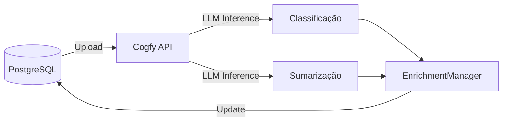
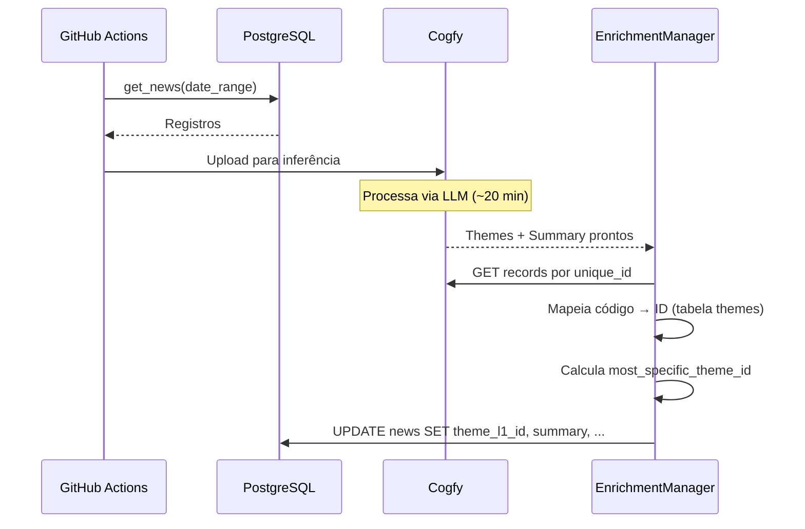

# Módulo: Integração Cogfy

> Classificação temática e sumarização via LLM.

## Visão Geral

O **Cogfy** é uma plataforma SaaS que fornece inferência LLM para:

- **Classificação temática** em 3 níveis hierárquicos
- **Geração de resumos** automáticos



---

## Fluxo de Integração

### 1. Upload para Cogfy

```python
# src/data_platform/cogfy/upload_manager.py
def upload_to_cogfy(start_date: date, end_date: date):
    """Envia notícias para processamento no Cogfy."""
    # 1. Carregar artigos do PostgreSQL
    articles = postgres_manager.get_news_by_date_range(start_date, end_date)

    # 2. Converter para formato Cogfy
    records = [
        {
            "unique_id": row["unique_id"],
            "title": row["title"],
            "content": row["content"][:5000],  # Limite de caracteres
        }
        for row in articles
    ]

    # 3. Enviar em batches
    cogfy_manager.upload_records(records, batch_size=1000)
```

### 2. Aguardar Processamento

O Cogfy processa via LLM, o que leva aproximadamente **20 minutos** para um batch típico.

```yaml
# No workflow GitHub Actions
- name: Wait for Cogfy processing
  run: sleep 1200  # 20 minutos
```

### 3. Buscar Resultados e Atualizar PostgreSQL

```python
# src/data_platform/cogfy/enrichment_manager.py
def enrich(start_date: date, end_date: date) -> int:
    """Busca resultados do Cogfy e atualiza PostgreSQL."""
    # 1. Buscar artigos sem enriquecimento
    articles = postgres_manager.get_news_without_enrichment(start_date, end_date)

    # 2. Para cada artigo, buscar no Cogfy
    for article in articles:
        cogfy_data = cogfy_manager.get_record(article["unique_id"])

        # 3. Mapear códigos para labels
        theme_l1_code, theme_l1_label = parse_theme(cogfy_data.get("theme_1_level_1"))
        theme_l2_code, theme_l2_label = parse_theme(cogfy_data.get("theme_1_level_2"))
        theme_l3_code, theme_l3_label = parse_theme(cogfy_data.get("theme_1_level_3"))

        # 4. Calcular most_specific_theme (L3 > L2 > L1)
        most_specific = theme_l3_code or theme_l2_code or theme_l1_code

        # 5. Atualizar PostgreSQL
        postgres_manager.update_enrichment(
            unique_id=article["unique_id"],
            theme_l1_id=get_theme_id(theme_l1_code),
            theme_l2_id=get_theme_id(theme_l2_code),
            theme_l3_id=get_theme_id(theme_l3_code),
            most_specific_theme_id=get_theme_id(most_specific),
            summary=cogfy_data.get("summary")
        )
```

---

## Cliente Cogfy (`cogfy_manager.py`)

```python
class CogfyManager:
    """Cliente para API do Cogfy."""

    def __init__(self, api_key: str, collection_id: str):
        self.api_key = api_key
        self.collection_id = collection_id
        self.base_url = "https://api.cogfy.com/v1"

    def upload_records(self, records: list[dict], batch_size: int = 1000) -> list[str]:
        """Envia registros para processamento."""
        record_ids = []
        for batch in chunks(records, batch_size):
            response = requests.post(
                f"{self.base_url}/collections/{self.collection_id}/records",
                headers={"Authorization": f"Bearer {self.api_key}"},
                json={"records": batch}
            )
            record_ids.extend(response.json()["ids"])
        return record_ids

    def get_record(self, unique_id: str) -> dict:
        """Busca registro processado por unique_id."""
        response = requests.get(
            f"{self.base_url}/collections/{self.collection_id}/records",
            headers={"Authorization": f"Bearer {self.api_key}"},
            params={"filter": f"unique_id={unique_id}"}
        )
        records = response.json()["records"]
        return records[0] if records else {}
```

---

## CLI do data-platform

```bash
# Upload para Cogfy
data-platform upload-cogfy --start-date YYYY-MM-DD --end-date YYYY-MM-DD

# Buscar enriquecimento (após ~20 min)
data-platform enrich --start-date YYYY-MM-DD --end-date YYYY-MM-DD
```

---

## Arquivos Principais

| Componente | Localização |
|------------|-------------|
| CogfyManager | `src/data_platform/cogfy/cogfy_manager.py` |
| UploadManager | `src/data_platform/cogfy/upload_manager.py` |
| EnrichmentManager | `src/data_platform/cogfy/enrichment_manager.py` |
| ThemeMapper | `src/data_platform/enrichment/theme_mapper.py` |
| themes_tree.yaml | `src/data_platform/enrichment/themes_tree.yaml` |

---

## Configuração no Cogfy

> **Nota**: A configuração do Cogfy é feita via interface web. Screenshots serão adicionados futuramente.

### Collection

- **Nome**: govbrnews
- **Campos de entrada**: unique_id, title, content
- **Campos de saída**: theme_1_level_1/2/3, summary

### Prompt de Classificação

```
Classifique a notícia abaixo em até 3 níveis temáticos, usando a taxonomia fornecida.

Taxonomia:
01 - Economia e Finanças
  01.01 - Política Econômica
    01.01.01 - Política Fiscal
    ...

Notícia:
Título: {title}
Conteúdo: {content}

Responda no formato:
- Nível 1: XX - Nome
- Nível 2: XX.YY - Nome (se aplicável)
- Nível 3: XX.YY.ZZ - Nome (se aplicável)
```

### Prompt de Sumarização

```
Gere um resumo conciso (2-3 frases) da notícia abaixo, destacando os pontos principais.

Título: {title}
Conteúdo: {content}

Resumo:
```

---

## Mapeamento de Campos

### Entrada (PostgreSQL → Cogfy)

| Campo PostgreSQL | Campo Cogfy | Tipo |
|------------------|-------------|------|
| unique_id | unique_id | string |
| title | title | string |
| content | content | string (max 5000 chars) |

### Saída (Cogfy → PostgreSQL)

| Campo Cogfy | Campo PostgreSQL | Tipo |
|-------------|------------------|------|
| theme_1_level_1 | theme_l1_id (FK) | string → ID lookup |
| theme_1_level_2 | theme_l2_id (FK) | string → ID lookup |
| theme_1_level_3 | theme_l3_id (FK) | string → ID lookup |
| summary | summary | string |

### Processamento de Temas

```python
def parse_theme(theme_str: str) -> tuple[str, str]:
    """Separa código e label do tema."""
    # Entrada: "01 - Economia e Finanças"
    # Saída: ("01", "Economia e Finanças")
    if not theme_str or " - " not in theme_str:
        return None, None
    parts = theme_str.split(" - ", 1)
    return parts[0].strip(), parts[1].strip()

def get_theme_id(code: str) -> int | None:
    """Busca ID do tema no PostgreSQL pelo código."""
    if not code:
        return None
    return postgres_manager.get_theme_id_by_code(code)
```

---

## Variáveis de Ambiente

```bash
# .env
COGFY_API_KEY=sk-xxxxxxxxxxxxxxxxxxxxx
COGFY_COLLECTION_ID=xxxxxxxx-xxxx-xxxx-xxxx-xxxxxxxxxxxx
```

### GitHub Secrets

| Secret | Descrição |
|--------|-----------|
| `COGFY_API_KEY` | API Key do Cogfy |
| `COGFY_COLLECTION_ID` | ID da collection |

---

## Tratamento de Erros

### Notícia não classificada

```python
def enrich_article(article: dict) -> bool:
    """Enriquece artigo com dados do Cogfy."""
    try:
        cogfy_data = cogfy_manager.get_record(article["unique_id"])
        if not cogfy_data:
            logger.warning(f"No Cogfy data for {article['unique_id']}")
            return False
        # ... processar enriquecimento
        return True
    except Exception as e:
        logger.error(f"Error enriching {article['unique_id']}: {e}")
        return False
```

### Retry em falhas de API

```python
@retry(tries=3, delay=5, backoff=2)
def get_record(self, unique_id: str) -> dict:
    """Busca com retry automático."""
    ...
```

---

## Fluxo no Pipeline Diário



---

## Métricas e Monitoramento

### Taxa de classificação

```sql
-- % de notícias classificadas
SELECT
    COUNT(*) FILTER (WHERE theme_l1_id IS NOT NULL) * 100.0 / COUNT(*) as classification_rate
FROM news
WHERE published_at >= NOW() - INTERVAL '7 days';
```

### Distribuição por tema

```sql
-- Top 10 temas mais frequentes
SELECT
    t.label,
    COUNT(*) as count
FROM news n
JOIN themes t ON n.most_specific_theme_id = t.id
GROUP BY t.label
ORDER BY count DESC
LIMIT 10;
```

---

## Limitações Conhecidas

| Limitação | Descrição | Workaround |
|-----------|-----------|------------|
| Tamanho do conteúdo | Max ~5000 caracteres | Truncar content |
| Tempo de processamento | ~20 min por batch | Aguardar no workflow |
| Um tema por notícia | Apenas theme_1 | Preparado para theme_2/3 futuro |
| Rate limiting | Limite de requisições | Batching |

---

## Custos

O Cogfy cobra por:

- **Tokens processados** (entrada + saída)
- **Requisições de API**

> **Nota**: Valores específicos dependem do plano contratado.

---

## Placeholder para Screenshots

> **TODO**: Adicionar screenshots da interface do Cogfy:
>
> - [ ] Configuração da collection
> - [ ] Prompt de classificação
> - [ ] Prompt de sumarização
> - [ ] Dashboard de métricas

---

## Links Relacionados

- [Data Platform](data-platform.md) - Repositório unificado
- [PostgreSQL](../arquitetura/postgresql.md) - Fonte de verdade
- [Fluxo de Dados](../arquitetura/fluxo-de-dados.md) - Pipeline completo
- [Árvore Temática](./arvore-tematica.md) - Taxonomia usada
- [Pipeline Scraper](../workflows/scraper-pipeline.md) - Workflow diário
