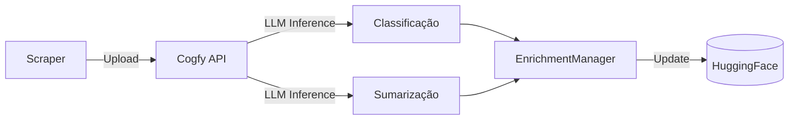
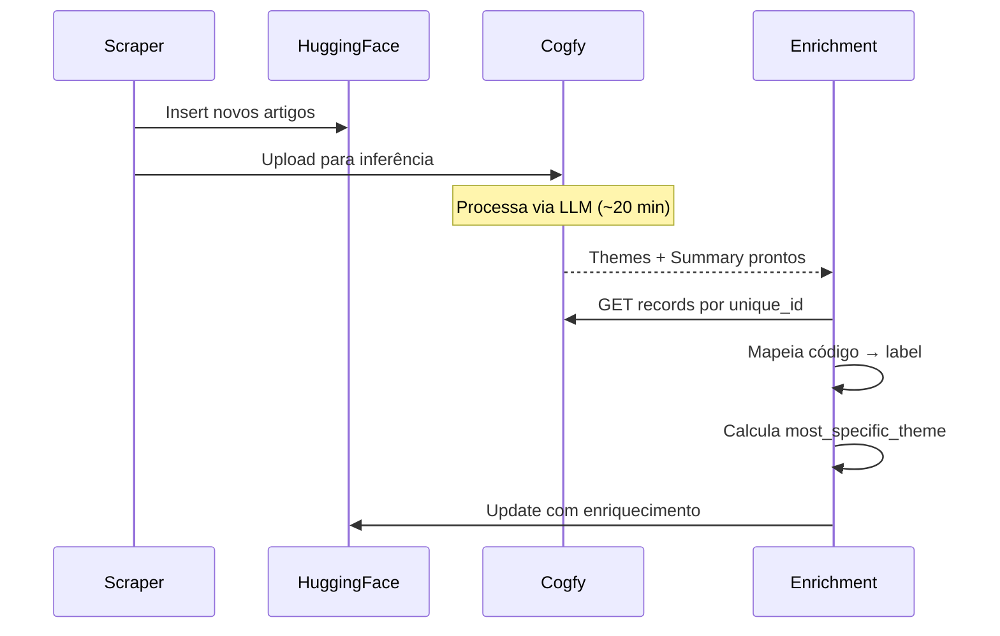

# Módulo: Integração Cogfy

> Classificação temática e sumarização via LLM.

## Visão Geral

O **Cogfy** é uma plataforma SaaS que fornece inferência LLM para:
- **Classificação temática** em 3 níveis hierárquicos
- **Geração de resumos** automáticos



---

## Fluxo de Integração

### 1. Upload para Cogfy

```python
# upload_to_cogfy_manager.py
def upload_to_cogfy(start_date: date, end_date: date):
    """Envia notícias para processamento no Cogfy."""
    # 1. Carregar artigos do HuggingFace
    df = dataset_manager.load_by_date_range(start_date, end_date)

    # 2. Converter para formato Cogfy
    records = [
        {
            "unique_id": row["unique_id"],
            "title": row["title"],
            "content": row["content"][:5000],  # Limite de caracteres
        }
        for _, row in df.iterrows()
    ]

    # 3. Enviar em batches
    cogfy_manager.upload_records(records, batch_size=1000)
```

### 2. Aguardar Processamento

O Cogfy processa via LLM, o que leva aproximadamente **20 minutos** para um batch típico.

```yaml
# No workflow GitHub Actions
- name: Wait for Cogfy processing
  run: sleep 1200  # 20 minutos
```

### 3. Buscar Resultados

```python
# enrichment_manager.py
def fetch_enrichment(unique_id: str) -> dict:
    """Busca resultados processados do Cogfy."""
    record = cogfy_manager.get_record(unique_id)

    return {
        "theme_1_level_1": record.get("theme_1_level_1"),
        "theme_1_level_2": record.get("theme_1_level_2"),
        "theme_1_level_3": record.get("theme_1_level_3"),
        "summary": record.get("summary"),
    }
```

---

## Cliente Cogfy (`cogfy_manager.py`)

```python
class CogfyManager:
    """Cliente para API do Cogfy."""

    def __init__(self, api_key: str, collection_id: str):
        self.api_key = api_key
        self.collection_id = collection_id
        self.base_url = "https://api.cogfy.com/v1"

    def upload_records(self, records: list[dict], batch_size: int = 1000) -> list[str]:
        """Envia registros para processamento."""
        record_ids = []
        for batch in chunks(records, batch_size):
            response = requests.post(
                f"{self.base_url}/collections/{self.collection_id}/records",
                headers={"Authorization": f"Bearer {self.api_key}"},
                json={"records": batch}
            )
            record_ids.extend(response.json()["ids"])
        return record_ids

    def get_record(self, unique_id: str) -> dict:
        """Busca registro processado por unique_id."""
        response = requests.get(
            f"{self.base_url}/collections/{self.collection_id}/records",
            headers={"Authorization": f"Bearer {self.api_key}"},
            params={"filter": f"unique_id={unique_id}"}
        )
        records = response.json()["records"]
        return records[0] if records else {}
```

---

## Configuração no Cogfy

> **Nota**: A configuração do Cogfy é feita via interface web. Screenshots serão adicionados futuramente.

### Collection

- **Nome**: govbrnews
- **Campos de entrada**: unique_id, title, content
- **Campos de saída**: theme_1_level_1/2/3, summary

### Prompt de Classificação

```
Classifique a notícia abaixo em até 3 níveis temáticos, usando a taxonomia fornecida.

Taxonomia:
01 - Economia e Finanças
  01.01 - Política Econômica
    01.01.01 - Política Fiscal
    ...

Notícia:
Título: {title}
Conteúdo: {content}

Responda no formato:
- Nível 1: XX - Nome
- Nível 2: XX.YY - Nome (se aplicável)
- Nível 3: XX.YY.ZZ - Nome (se aplicável)
```

### Prompt de Sumarização

```
Gere um resumo conciso (2-3 frases) da notícia abaixo, destacando os pontos principais.

Título: {title}
Conteúdo: {content}

Resumo:
```

---

## Mapeamento de Campos

### Entrada (Scraper → Cogfy)

| Campo Scraper | Campo Cogfy | Tipo |
|---------------|-------------|------|
| unique_id | unique_id | string |
| title | title | string |
| content | content | string (max 5000 chars) |

### Saída (Cogfy → Dataset)

| Campo Cogfy | Campo Dataset | Tipo |
|-------------|---------------|------|
| theme_1_level_1 | theme_1_level_1_code + label | string → split |
| theme_1_level_2 | theme_1_level_2_code + label | string → split |
| theme_1_level_3 | theme_1_level_3_code + label | string → split |
| summary | summary | string |

### Processamento de Temas

```python
def parse_theme(theme_str: str) -> tuple[str, str]:
    """Separa código e label do tema."""
    # Entrada: "01 - Economia e Finanças"
    # Saída: ("01", "Economia e Finanças")
    if not theme_str or " - " not in theme_str:
        return None, None
    parts = theme_str.split(" - ", 1)
    return parts[0].strip(), parts[1].strip()
```

---

## Variáveis de Ambiente

```bash
# .env
COGFY_API_KEY=sk-xxxxxxxxxxxxxxxxxxxxx
COGFY_COLLECTION_ID=xxxxxxxx-xxxx-xxxx-xxxx-xxxxxxxxxxxx
```

### GitHub Secrets

| Secret | Descrição |
|--------|-----------|
| `COGFY_API_KEY` | API Key do Cogfy |
| `COGFY_COLLECTION_ID` | ID da collection |

---

## Tratamento de Erros

### Notícia não classificada

```python
def enrich_article(row: dict) -> dict:
    """Enriquece artigo com dados do Cogfy."""
    try:
        cogfy_data = cogfy_manager.get_record(row["unique_id"])
        if not cogfy_data:
            logger.warning(f"No Cogfy data for {row['unique_id']}")
            return row  # Retorna sem enriquecimento
        # ... processar enriquecimento
    except Exception as e:
        logger.error(f"Error enriching {row['unique_id']}: {e}")
        return row
```

### Retry em falhas de API

```python
@retry(tries=3, delay=5, backoff=2)
def get_record(self, unique_id: str) -> dict:
    """Busca com retry automático."""
    ...
```

---

## Métricas e Monitoramento

### Taxa de classificação

```python
def calculate_classification_rate(df: pd.DataFrame) -> float:
    """Calcula % de notícias classificadas."""
    classified = df["theme_1_level_1_code"].notna().sum()
    total = len(df)
    return classified / total * 100
```

### Distribuição por tema

```python
def theme_distribution(df: pd.DataFrame) -> dict:
    """Retorna distribuição de notícias por tema."""
    return df["theme_1_level_1_label"].value_counts().to_dict()
```

---

## Limitações Conhecidas

| Limitação | Descrição | Workaround |
|-----------|-----------|------------|
| Tamanho do conteúdo | Max ~5000 caracteres | Truncar content |
| Tempo de processamento | ~20 min por batch | Aguardar no workflow |
| Um tema por notícia | Apenas theme_1 | Preparado para theme_2/3 futuro |
| Rate limiting | Limite de requisições | Batching |

---

## Custos

O Cogfy cobra por:
- **Tokens processados** (entrada + saída)
- **Requisições de API**

> **Nota**: Valores específicos dependem do plano contratado.

---

## Fluxo no Pipeline Diário



---

## Placeholder para Screenshots

> **TODO**: Adicionar screenshots da interface do Cogfy:
> - [ ] Configuração da collection
> - [ ] Prompt de classificação
> - [ ] Prompt de sumarização
> - [ ] Dashboard de métricas

---

## Links Relacionados

- [Fluxo de Dados](../arquitetura/fluxo-de-dados.md) - Pipeline completo
- [Árvore Temática](./arvore-tematica.md) - Taxonomia usada
- [Módulo Scraper](./scraper.md) - Upload e enriquecimento
- [Pipeline Scraper](../workflows/scraper-pipeline.md) - Workflow diário
