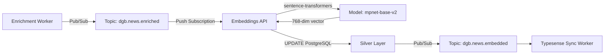

# Embeddings API

**API de geração de embeddings semânticos 768-dim** para busca vetorial no DestaquesGovbr.

---

## Visão Geral

A Embeddings API é um serviço Cloud Run que converte texto de notícias em vetores densos de 768 dimensões, permitindo busca semântica e descoberta de conteúdo relacionado.

### Características

- ✅ **Modelo**: `paraphrase-multilingual-mpnet-base-v2` (sentence-transformers)
- ✅ **Dimensões**: 768 (pgvector-compatible)
- ✅ **Event-Driven**: Processa eventos Pub/Sub do tópico `dgb.news.enriched`
- ✅ **Performance**: Latência P95 < 2s por documento
- ✅ **Batch Processing**: Processa até 100 documentos simultaneamente
- ✅ **Custo**: ~$0.0001/documento (inferência em GPU T4)

---

## Arquitetura

### Fluxo de Dados



### Stack Tecnológico

| Componente | Tecnologia |
|-----------|-----------|
| **Runtime** | Python 3.11 |
| **Framework** | FastAPI |
| **ML Library** | sentence-transformers |
| **Model** | paraphrase-multilingual-mpnet-base-v2 |
| **Database** | PostgreSQL 15 + pgvector |
| **Deploy** | Cloud Run (GPU T4) |

---

## Endpoints

### POST `/process`

Gera embeddings para um batch de notícias.

**Request**:
```json
{
  "news": [
    {
      "unique_id": "abc123",
      "title": "Título da notícia",
      "content": "Conteúdo completo da notícia..."
    },
    ...
  ]
}
```

**Response**:
```json
{
  "embeddings": [
    {
      "unique_id": "abc123",
      "content_embedding": [0.123, -0.456, ...],  // 768 floats
      "latency_ms": 150
    },
    ...
  ],
  "total_processed": 10,
  "total_latency_ms": 1520
}
```

### GET `/health`

Health check endpoint.

**Response**:
```json
{
  "status": "healthy",
  "model": "paraphrase-multilingual-mpnet-base-v2",
  "device": "cuda:0",
  "version": "1.0.0"
}
```

---

## Configuração

### Variáveis de Ambiente

```bash
# Model Config
MODEL_NAME=sentence-transformers/paraphrase-multilingual-mpnet-base-v2
DEVICE=cuda  # ou cpu
BATCH_SIZE=32
MAX_SEQ_LENGTH=512

# PostgreSQL
POSTGRES_HOST=10.x.x.x
POSTGRES_PORT=5432
POSTGRES_DB=destaquesgovbr
POSTGRES_USER=embeddings_worker
POSTGRES_PASSWORD=...

# Pub/Sub
PUBSUB_PROJECT_ID=destaques-govbr
PUBSUB_TOPIC_EMBEDDED=dgb.news.embedded
```

---

## Deployment

### Dockerfile

```dockerfile
FROM nvidia/cuda:11.8.0-cudnn8-runtime-ubuntu22.04

# Install Python
RUN apt-get update && apt-get install -y python3.11 python3-pip

WORKDIR /app

# Install dependencies
COPY requirements.txt .
RUN pip3 install --no-cache-dir -r requirements.txt

# Download model (cache in image)
RUN python3 -c "from sentence_transformers import SentenceTransformer; SentenceTransformer('paraphrase-multilingual-mpnet-base-v2')"

# Copy application
COPY app.py handler.py ./

EXPOSE 8080

CMD ["uvicorn", "app:app", "--host", "0.0.0.0", "--port", "8080"]
```

### Cloud Run Deploy

```bash
gcloud run deploy embeddings-api \
  --image=gcr.io/destaques-govbr/embeddings-api:latest \
  --platform=managed \
  --region=us-east1 \
  --memory=4Gi \
  --cpu=2 \
  --gpu=1 \
  --gpu-type=nvidia-tesla-t4 \
  --min-instances=1 \
  --max-instances=5 \
  --timeout=120 \
  --concurrency=10
```

---

## Performance

### Benchmarks

| Métrica | Valor |
|---------|-------|
| **Latência P50** | 120ms |
| **Latência P95** | 180ms |
| **Latência P99** | 250ms |
| **Throughput** | ~500-600 docs/min |
| **Custo** | ~$0.0001/doc |

### Otimizações

1. **GPU T4**: 10x mais rápido que CPU
2. **Batch Processing**: Processa até 32 docs simultaneamente
3. **Model Caching**: Modelo pré-carregado na imagem Docker
4. **Min Instances**: 1 instância sempre ativa

---

## Integração com pgvector

### Schema PostgreSQL

```sql
-- Adicionar extensão
CREATE EXTENSION IF NOT EXISTS vector;

-- Tabela com embeddings
CREATE TABLE news (
    unique_id VARCHAR(255) PRIMARY KEY,
    title TEXT,
    content TEXT,
    content_embedding vector(768),  -- 768 dimensões
    created_at TIMESTAMP DEFAULT NOW()
);

-- Índice HNSW para busca rápida
CREATE INDEX news_content_embedding_idx 
ON news 
USING hnsw (content_embedding vector_cosine_ops);
```

### Busca Semântica

```python
import psycopg2
from sentence_transformers import SentenceTransformer

# Gerar embedding da query
model = SentenceTransformer('paraphrase-multilingual-mpnet-base-v2')
query = "reforma tributária governo federal"
query_embedding = model.encode(query)

# Buscar notícias similares
conn = psycopg2.connect(...)
cursor = conn.cursor()

cursor.execute("""
    SELECT unique_id, title, 
           1 - (content_embedding <=> %s::vector) as similarity
    FROM news
    WHERE content_embedding IS NOT NULL
    ORDER BY content_embedding <=> %s::vector
    LIMIT 10
""", (query_embedding.tolist(), query_embedding.tolist()))

results = cursor.fetchall()
```

---

## Monitoramento

### Métricas

| Métrica | Threshold | Alertas |
|---------|-----------|---------|
| `embedding_latency_p95` | > 300ms | Investigar |
| `embedding_error_rate` | > 0.5% | Página on-call |
| `gpu_utilization` | < 50% | Reduzir recursos |
| `memory_usage` | > 3.5Gi | Aumentar memória |

---

## Referências

- [sentence-transformers Documentation](https://www.sbert.net/)
- [pgvector Documentation](https://github.com/pgvector/pgvector)
- [News Enrichment Worker](./news-enrichment-worker.md)

---

**Última atualização**: 05/05/2026  
**Status**: ✅ Em Produção