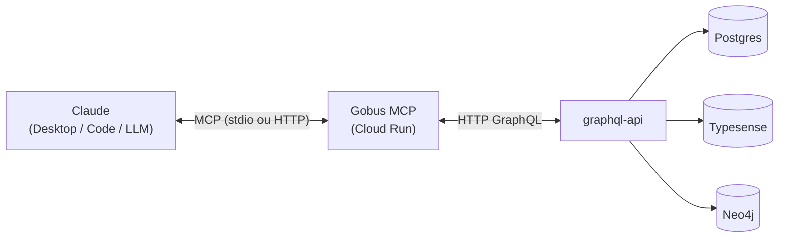

# Gobus MCP

Servidor **MCP (Model Context Protocol)** que expõe o acervo do Destaques Gov.BR — ~300 mil artigos, grafo de entidades NER canonicalizadas e analytics por agência — como tools, resources e prompts consumíveis diretamente por LLMs.

!!! info "Repositório"
    **GitHub**: [destaquesgovbr/gobus-mcp](https://github.com/destaquesgovbr/gobus-mcp)

    **URL (produção)**: [destaquesgovbr-gobus-mcp-klvx64dufq-rj.a.run.app](https://destaquesgovbr-gobus-mcp-klvx64dufq-rj.a.run.app)

## Visão Geral

O Gobus MCP é a camada de acesso ao acervo do Gov.BR para agentes de IA. Um cliente MCP (Claude Desktop, Claude Code, ou qualquer cliente que implemente o protocolo) conecta ao servidor e passa a ter acesso às 300 mil publicações do portal como contexto — sem precisar conhecer GraphQL, Postgres ou Typesense.

Toda leitura de dados passa pela [graphql-api](graphql-api.md): o servidor não abre conexões diretas aos backends. Isso centraliza rate-limiting, autenticação, analytics e validação de schema em um único ponto.



## Capacidades

| Categoria | Quantidade | Exemplos |
|-----------|:----------:|----------|
| Tools     | 7 | `search_news`, `get_entity_profile`, `get_entity_network`, `get_agency_analytics`, `detect_trends` |
| Resources | 3 | `gobus://agencies`, `gobus://themes`, `gobus://platform-stats` |
| Prompts   | 4 | `monitor_agency`, `trace_entity`, `weekly_digest`, `draft_press_release` |

As tools retornam Markdown formatado — pensado para ser lido diretamente pelo LLM sem parsing adicional.

## Papel na plataforma

O Gobus MCP é a interface de IA do Destaques Gov.BR:

- **Assessoras de comunicação** usam via Claude para gerar briefings diários e comparar a cobertura entre agências.
- **Pesquisadores e jornalistas** rastreiam trajetórias de entidades (pessoas, políticas, leis) e mapeiam redes institucionais.
- **Cidadãos** recebem boletins semanais resumidos em linguagem acessível.
- **Equipe de dados** usa os prompts compostos para automatizar análises recorrentes.

## Stack

| Camada | Tecnologia |
|--------|-----------|
| Protocolo | FastMCP 3.x (MCP) |
| Transport | stdio (local) · HTTP streamable-http (Cloud Run) |
| Cliente GraphQL | httpx async |
| Config | pydantic-settings (prefixo `GOBUS_`) |
| Deploy | Cloud Run, env vars via Terraform |

## Conectar ao servidor

=== "Claude Desktop / Code"

    Adicione ao `.mcp.json` do projeto ou ao settings global:

    ```json
    {
      "mcpServers": {
        "gobus": {
          "transport": "http",
          "url": "https://destaquesgovbr-gobus-mcp-klvx64dufq-rj.a.run.app/mcp/"
        }
      }
    }
    ```

=== "Local (stdio)"

    ```json
    {
      "mcpServers": {
        "gobus": {
          "command": "python",
          "args": ["-m", "gobus_mcp"],
          "env": {
            "GOBUS_GRAPHQL_URL": "http://localhost:8000/graphql"
          }
        }
      }
    }
    ```

!!! tip "Documentação profunda"
    A referência completa — todas as tools com parâmetros e exemplos, resources, prompts, arquitetura de transport e guia de deploy — vive co-localizada no repo do serviço:

    **→ [Documentação do Gobus MCP](https://destaquesgovbr.github.io/gobus-mcp/)**
