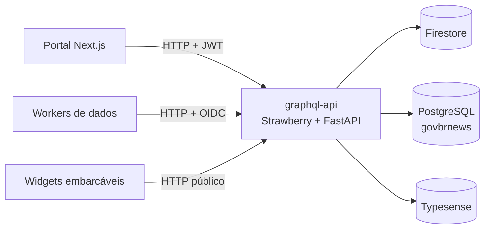

# GraphQL API

API GraphQL **unificada** — a fachada de dados única entre os consumidores da
plataforma (portal, workers de dados) e os backends de persistência.

!!! info "Repositório"
    **GitHub**: [destaquesgovbr/graphql-api](https://github.com/destaquesgovbr/graphql-api)

    **URL (staging)**: [destaquesgovbr-graphql-api-klvx64dufq-rj.a.run.app](https://destaquesgovbr-graphql-api-klvx64dufq-rj.a.run.app/graphql)

## Visão Geral

Antes, o portal e os workers falavam **direto** com cada backend (Firestore via
Firebase Admin, PostgreSQL via SQL, Typesense via SDK). O `graphql-api` introduz
uma fachada tipada única: um schema, um ponto de evolução, auth centralizada.

## Papel na plataforma

- **Portal** consome clippings, marketplace, push, widgets e busca via GraphQL
  (atrás de feature flags `graphql.*`, durante a migração R1).
- **Workers de dados** (feature-worker, typesense-sync-worker, bronze-writer) têm
  uma superfície **interna** (`newsForTypesense`, `upsertFeatures`, …) disponível
  para migrarem do acesso direto ao Postgres — desacoplando ainda mais a
  plataforma.
- **Agente de IA** (geração de recortes) transmite em tempo real via SSE
  (`/graphql/stream`), com passthrough para o clipping worker.

## Stack

| Camada | Tecnologia |
|--------|-----------|
| Schema | Strawberry GraphQL (code-first, Python 3.12) |
| HTTP | FastAPI + Uvicorn |
| Subscriptions | SSE via `/graphql/stream` |
| Auth | JWT (Keycloak, usuários) + OIDC (service accounts) |
| Datasources | asyncpg, firebase-admin, typesense-python |
| Deploy | Cloud Run, env vars via Terraform |

!!! tip "Playground interativo (GraphiQL)"
    A API serve o **GraphiQL** nativo em `GET /graphql` — explore o schema e rode
    queries no browser:
    [playground (staging)](https://destaquesgovbr-graphql-api-klvx64dufq-rj.a.run.app/graphql).

!!! tip "Documentação profunda"
    A referência completa — arquitetura, datasources, auth, subscriptions e o
    **SDL gerado do código** — vive co-localizada no repo do serviço:

    **→ [Documentação profunda do graphql-api](https://destaquesgovbr.github.io/graphql-api/)**

    (gerada por MkDocs a partir de `graphql-api/docs/`; o SDL é exportado do
    schema Strawberry a cada build, sempre em sincronia com o código).
