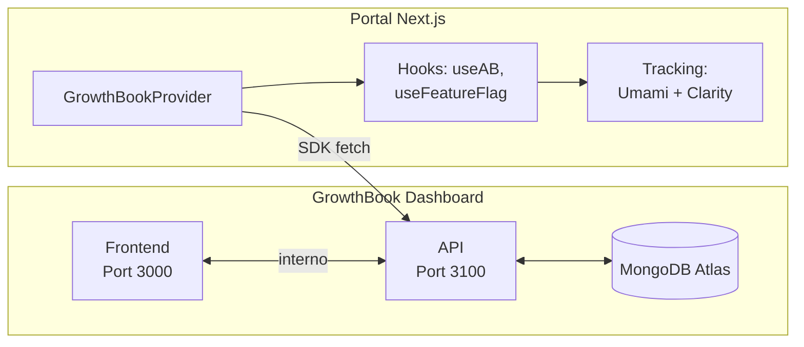

# Módulo: GrowthBook

> Feature flags e testes A/B, self-hosted no GCP Cloud Run com MongoDB Atlas.

## Visão Geral

O GrowthBook é a plataforma de **feature flags** e **A/B testing** do portal DestaquesGovBr. Permite:

- **Feature Flags**: ativar/desativar funcionalidades sem deploy
- **Testes A/B**: comparar variantes de UI e medir conversões
- **Rollout gradual**: liberar features para % dos usuários
- **Targeting**: segmentar por atributos do usuário



---

## Dashboard

### Acesso

```bash
# Obter URL do dashboard
gcloud run services describe destaquesgovbr-growthbook \
  --region=southamerica-east1 \
  --format='value(status.url)'
```

A conta admin é criada no primeiro acesso ao dashboard.

### Conceitos Principais

| Conceito | Descrição |
|----------|-----------|
| **Feature** | Flag booleana ou com variantes (string, número, JSON) |
| **Experiment** | Teste A/B que divide tráfego entre variantes |
| **SDK Connection** | Credenciais para o portal consumir features/experiments |
| **Environment** | Ambientes separados (production, development) |

---

## Integração no Portal

### `GrowthBookProvider`

O provider inicializa o SDK e disponibiliza o contexto para toda a aplicação:

```typescript
// src/ab-testing/GrowthBookProvider.tsx
// - Gera user ID persistente (cookie ab_user_id, 1 ano)
// - Inicializa SDK com streaming habilitado
// - Conecta ao API Host para buscar features
```

O provider é montado em `src/components/common/Providers.tsx`, envolvendo toda a árvore de componentes.

### Variáveis de Ambiente

| Variável | Descrição |
|----------|-----------|
| `NEXT_PUBLIC_GROWTHBOOK_API_HOST` | URL da API GrowthBook (serviço `-api`) |
| `NEXT_PUBLIC_GROWTHBOOK_CLIENT_KEY` | Client Key da SDK Connection |

Configurar no `.env.local` para desenvolvimento:

```bash
NEXT_PUBLIC_GROWTHBOOK_API_HOST=https://destaquesgovbr-growthbook-api-xxx.run.app
NEXT_PUBLIC_GROWTHBOOK_CLIENT_KEY=sdk-xxxxx
```

### Hooks Disponíveis

```typescript
import {
  useAB,
  useFeatureFlag,
  useIsVariant,
  useABConversion,
} from '@/ab-testing/hooks'
```

| Hook | Uso |
|------|-----|
| `useFeatureFlag(key)` | Retorna `true/false` para feature flags |
| `useAB(key, fallback)` | Retorna o valor da variante atribuída |
| `useIsVariant(key, variant)` | Verifica se está em variante específica |
| `useABConversion(key)` | Retorna função para registrar conversão |

---

## Usando Feature Flags

### 1. Criar no Dashboard

1. Acessar GrowthBook Dashboard → **Features**
2. Clicar **Add Feature**
3. Preencher:
   - **Feature Key**: ex. `dark-mode` (kebab-case)
   - **Type**: Boolean
   - **Default Value**: `false` (desligado por padrão)
4. Em **Override Rules**, criar regras por ambiente
5. Salvar

### 2. Usar no Código

```typescript
import { useFeatureFlag } from '@/ab-testing/hooks'

function Header() {
  const isDarkMode = useFeatureFlag('dark-mode')

  return (
    <header className={isDarkMode ? 'bg-gray-900' : 'bg-white'}>
      {/* ... */}
    </header>
  )
}
```

!!! note "Graceful Degradation"
    Se o GrowthBook não estiver configurado (variáveis de ambiente ausentes),
    os hooks retornam o valor de fallback. O portal funciona normalmente sem GrowthBook.

---

## Criando um Experimento A/B

### Passo a Passo

#### 1. Criar Feature com Variantes

No dashboard → **Features** → **Add Feature**:

- **Key**: `hero-layout`
- **Type**: String
- **Values**: `control`, `variant-a`, `variant-b`

#### 2. Adicionar Experiment Rule

Na feature → **Add Rule** → **Experiment**:

- **Tracking Key**: `hero-layout-test`
- **Traffic Split**: 33% / 33% / 34%
- **Variation Values**: `control`, `variant-a`, `variant-b`

#### 3. Implementar no Código

```typescript
import { useAB, useABConversion } from '@/ab-testing/hooks'

function HeroSection() {
  const variant = useAB('hero-layout', 'control')
  const { trackConversion } = useABConversion('hero-layout')

  const handleCTA = () => {
    trackConversion('cta_click')
    // ... ação do botão
  }

  switch (variant) {
    case 'variant-a':
      return <HeroVariantA onCTA={handleCTA} />
    case 'variant-b':
      return <HeroVariantB onCTA={handleCTA} />
    default:
      return <HeroControl onCTA={handleCTA} />
  }
}
```

#### 4. Monitorar Resultados

- Conversões são enviadas automaticamente para **Umami Analytics** e **Microsoft Clarity**
- No Umami, filtrar eventos `experiment_viewed` e `experiment_conversion`
- No Clarity, os segmentos `ab_*` permitem visualizar heatmaps por variante

### Tracking Automático

O `trackingCallback` do GrowthBook envia automaticamente para múltiplas plataformas:

```typescript
// src/ab-testing/tracking.ts
// experiment_viewed → Umami + Clarity (automático ao entrar no experimento)
// experiment_conversion → Umami + Clarity (ao chamar trackConversion)
```

---

## SDK Connection

Para conectar o portal ao GrowthBook:

1. Dashboard → **Settings → SDK Connections**
2. **Add SDK Connection**
3. Selecionar **React** como linguagem
4. Copiar:
   - **Client Key**: `sdk-xxxxx`
   - **API Host**: URL do serviço `destaquesgovbr-growthbook-api`

!!! warning "API Host"
    Use a URL do serviço **-api** (porta 3100), não do frontend.
    O serviço API é o endpoint que o SDK React consome.

---

## Links Relacionados

- [GrowthBook Documentation](https://docs.growthbook.io) — docs oficiais
- [GrowthBook React SDK](https://docs.growthbook.io/lib/react) — referência do SDK
- [Infra: GrowthBook Setup](https://github.com/destaquesgovbr/infra/blob/main/docs/growthbook-setup.md) — configuração operacional
- [Umami Analytics](umami.md) — analytics integrado com A/B testing
- [Portal](portal.md) — integração no frontend
