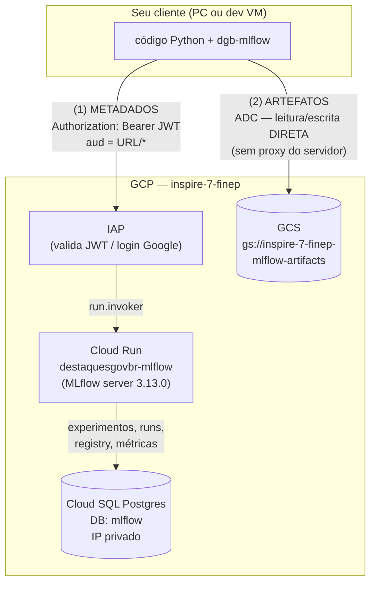

# Módulo: MLflow DGB

> Servidor **MLflow compartilhado** do DestaquesGovBr para tracking de experimentos, Model Registry e features de GenAI. Roda em Cloud Run protegido por IAP.

**Servidor**: `https://destaquesgovbr-mlflow-klvx64dufq-rj.a.run.app`
**Repositório da plataforma**: [destaquesgovbr/ml-platform](https://github.com/destaquesgovbr/ml-platform)

---

## Visão Geral

O **MLflow DGB** é o servidor de MLOps compartilhado do time de Data Science. Ele centraliza, num backend único:

- **Tracking de experimentos**: params, métricas e artefatos de cada run
- **Model Registry**: catálogo versionado de modelos (com aliases de promoção)
- **GenAI**: tracing de chamadas a LLMs, avaliação automatizada e prompt registry

A instância roda em **Cloud Run** (MLflow 3.13.0), com **backend de metadados** em Cloud SQL Postgres (IP privado) e **artefatos** no GCS (`gs://inspire-7-finep-mlflow-artifacts`). O acesso é protegido pelo **IAP** (Identity-Aware Proxy), sem autenticação nativa do MLflow.

!!! info "Onde se encaixa no DGB"
    Diferente do dataset no HuggingFace (que é a camada de **distribuição** de dados abertos), o MLflow é a camada de **experimentação e versionamento de modelos**. Você usa o dataset `govbrnews` para treinar, e o MLflow para registrar o que treinou — params, métricas, o binário do modelo e os traces de LLM.



O ponto central para entender erros: existem **dois caminhos independentes**.

| Caminho | O que carrega | Como autentica |
|---------|---------------|----------------|
| **(1) Metadados** | experimentos, params, métricas, registry | JWT auto-assinado pela SA cliente, via IAP |
| **(2) Artefatos** | modelos, arquivos, imagens | ADC direto no GCS (o servidor **não** faz proxy) |

Um pode funcionar sem o outro: você pode logar params/métricas (metadados OK) mas falhar ao subir o artefato (GCS faltando), e vice-versa.

---

## Pré-requisitos

| Requisito | Detalhe |
|-----------|---------|
| Python | 3.11 |
| `gcloud` CLI | instalado ([guia](https://cloud.google.com/sdk/docs/install)) — necessário no PC |
| Acesso `mlflow_users` | sua conta Google (ou a SA da VM) precisa estar na lista — peça ao administrador da infra |

!!! note "Autenticação é transparente"
    A biblioteca cliente `dgb-mlflow` esconde a complexidade do IAP: ela gera um **JWT auto-assinado** pela service account cliente (via `signJwt`, com `aud = <URL do serviço>/*`) e o injeta em cada request. Você **não** precisa de nenhum IAP client id. O que protege o acesso é a sua identidade Google + estar em `mlflow_users` + o papel `tokenCreator` na SA cliente (tudo concedido pela infra).

---

## Instalação do cliente

A biblioteca `dgb-mlflow` instala-se direto do git e já traz `mlflow` e `google-cloud-storage` como dependências:

```bash
python -m venv .venv && source .venv/bin/activate    # sempre use um venv
pip install "git+https://github.com/destaquesgovbr/ml-platform.git@v0.1.0#subdirectory=client"
```

Em seguida, exporte a **única** variável de ambiente necessária para o modo remoto:

```bash
export DGB_MLFLOW_TRACKING_URI="https://destaquesgovbr-mlflow-klvx64dufq-rj.a.run.app"
```

!!! tip "Coloque no seu shell"
    Adicione a linha do `export` ao seu `~/.bashrc` / `~/.zshrc` (no PC) ou ao `~/.bashrc` da VM, para não repetir a cada sessão. Sem essa variável, o `configure()` cai para tracking local em `sqlite` — útil para dev offline, mas não fala com o servidor remoto.

A diferença entre rodar no seu computador pessoal e numa dev VM está apenas na **autenticação**:

=== "Computador pessoal (PC)"

    No PC você usa as **suas credenciais** Google (ADC) para o GCS e para assinar o JWT do IAP. Autentique o ADC **uma vez**:

    ```bash
    # login normal da CLI (abre o browser)
    gcloud auth login

    # Application Default Credentials — É ESTA que as libs Python usam
    gcloud auth application-default login
    gcloud auth application-default set-quota-project inspire-7-finep
    ```

    > São dois logins diferentes. O `application-default` é o que importa para o Python; sem ele você verá erros de credencial do GCS ao subir artefatos.

=== "Dev VM"

    Na VM **não há** `gcloud auth application-default login`: o ADC vem do **metadata server** automaticamente, e a service account da VM já tem acesso ao bucket e ao `signJwt`. Apenas confirme:

    ```bash
    gcloud auth list                 # deve mostrar a SA da VM como ativa
    gcloud config set project inspire-7-finep
    gcloud auth application-default print-access-token >/dev/null && echo "ADC OK"
    ```

    O código (`configure()` + chamadas `mlflow.*`) é **idêntico** ao do PC.

---

## Primeiro experimento

Chame `dgb_mlflow.configure()` **uma vez**, no início do seu script/notebook, **antes** de usar o `mlflow`. Ele lê o `DGB_MLFLOW_TRACKING_URI`, calcula a audience do JWT, registra o provider de autenticação (token sempre fresco) e aponta o `mlflow` para o servidor.

```python
import dgb_mlflow
dgb_mlflow.configure()      # lê o env; nada mais é necessário

import mlflow
print(mlflow.get_tracking_uri())   # deve imprimir a URL https://...run.app
```

Agora logue o primeiro run — exercitando **os dois caminhos** (metadado + artefato):

=== "PC"

    ```python
    import dgb_mlflow
    dgb_mlflow.configure()

    import mlflow

    mlflow.set_experiment("meu-primeiro-experimento")

    with mlflow.start_run(run_name="hello-dgb"):
        # metadado → vai para o Postgres via servidor (IAP)
        mlflow.log_param("alpha", 0.5)
        mlflow.log_metric("acuracia", 0.91)

        # artefato → vai DIRETO para o GCS (ADC)
        with open("notas.txt", "w") as f:
            f.write("primeiro artefato no MLflow DGB\n")
        mlflow.log_artifact("notas.txt")

    print("Run logado com sucesso!")
    ```

=== "Dev VM"

    ```python
    import dgb_mlflow
    dgb_mlflow.configure()        # na VM, o ADC vem do metadata server e assina o JWT

    import mlflow

    mlflow.set_experiment("teste-na-vm")

    with mlflow.start_run(run_name="hello-vm"):
        mlflow.log_param("alpha", 0.5)        # metadado → Postgres (via IAP)
        mlflow.log_metric("acuracia", 0.93)

        with open("notas-vm.txt", "w") as f:
            f.write("artefato gerado na dev VM\n")
        mlflow.log_artifact("notas-vm.txt")   # artefato → GCS direto (ADC da VM)

    print("Run logado da VM!")
    ```

Se isso rodar sem erro, os dois caminhos (metadados via IAP + artefatos via GCS) estão OK.

!!! tip "Padrão típico do time"
    Da **VM** você costuma **logar** experimentos (cliente Python, identidade = SA da VM); do seu **PC/navegador** você **abre a UI** para visualizar (identidade = sua conta Google). Ambos enxergam os mesmos experimentos, pois compartilham o mesmo backend.

---

## Acessar a UI no browser

A UI roda no browser com a sua identidade **de usuário** (não a da VM). Abra a URL do servidor:

```bash
open "$DGB_MLFLOW_TRACKING_URI"      # macOS; no Linux use xdg-open
```

O IAP vai pedir um **login Google**. Use a mesma conta que está em `mlflow_users`.

!!! warning "Conta externa @gmail é barrada pelo IAP"
    O IAP-on-Cloud-Run **aceita service accounts, mas barra identidades externas à organização** (ex.: `@gmail.com`) no login de browser — mesmo com o binding IAM correto e mesmo em janela anônima. Não é falta de permissão: o acesso **programático** pelo `dgb-mlflow` funciona normalmente, pois usa a SA.

    A solução é um **proxy local** (do repo `ml-platform`) que injeta o token da SA, e você abre a UI em `localhost`:

    ```bash
    cd ml-platform
    gcloud auth login                  # sua conta (já provisionada com tokenCreator)
    python3 scripts/iap_ui_proxy.py
    # abre http://localhost:5000 no browser → UI do MLflow completa
    ```

    O proxy escuta só em `127.0.0.1` (não expõe nada). Contas da organização logam direto na URL, sem proxy.

---

## Model Registry

O **Model Registry** é o catálogo versionado de modelos do time. Os **binários** ficam no GCS (via ADC); os **metadados** (nomes, versões, aliases) ficam no Postgres (via IAP).

### Registrar um modelo

A forma mais direta é logar o modelo **e** registrá-lo no mesmo passo, com `registered_model_name`:

```python
import dgb_mlflow
dgb_mlflow.configure()

import mlflow
import mlflow.sklearn
from sklearn.linear_model import LogisticRegression

mlflow.set_experiment("classificador-noticias")

with mlflow.start_run(run_name="logreg-v1"):
    model = LogisticRegression(max_iter=1000).fit(X_train, y_train)
    mlflow.log_metric("f1", 0.88)

    # loga o artefato no GCS E cria/atualiza a entrada no registry (Postgres)
    mlflow.sklearn.log_model(
        sk_model=model,
        name="modelo",
        registered_model_name="classificador-noticias-govbr",
    )
```

Cada `log_model` com o mesmo `registered_model_name` cria uma **nova versão** (v1, v2, ...). Para registrar um modelo já logado, use a URI do artefato:

```python
result = mlflow.register_model(
    model_uri="runs:/<RUN_ID>/modelo",
    name="classificador-noticias-govbr",
)
print(result.name, result.version)   # ex.: classificador-noticias-govbr 3
```

### Promover com aliases (recomendado)

O padrão moderno usa **aliases** (ponteiros nomeados para uma versão), em vez dos antigos *stages* (hoje *deprecated*). Convenção sugerida para o time: `staging` e `producao`.

```python
from mlflow import MlflowClient
client = MlflowClient()

# aponta o alias "producao" para a versão 3
client.set_registered_model_alias(
    name="classificador-noticias-govbr", alias="producao", version="3",
)

# promover uma nova versão = re-apontar o alias
client.set_registered_model_alias(
    name="classificador-noticias-govbr", alias="producao", version="5",
)
```

### Carregar um modelo

Carregue **por alias** (segue sempre o que estiver promovido) ou **por versão** (reprodutibilidade). O download do binário vem do GCS automaticamente.

```python
import mlflow.pyfunc

# por alias (recomendado em serving):
modelo = mlflow.pyfunc.load_model("models:/classificador-noticias-govbr@producao")

# por versão fixa:
modelo_v3 = mlflow.pyfunc.load_model("models:/classificador-noticias-govbr/3")

predicoes = modelo.predict(X_novo)
```

!!! note "Fluxo típico"
    1. Treinar e logar com `registered_model_name` → cria a versão N.
    2. Avaliar; se boa, `set_registered_model_alias("staging", N)`.
    3. Validar; aprovado, `set_registered_model_alias("producao", N)`.
    4. Em produção/serving, carregar sempre por `models:/<nome>@producao`.

Walkthrough executável de ponta a ponta: [`ml-platform/examples/traditional/`](https://github.com/destaquesgovbr/ml-platform/tree/main/examples/traditional).

---

## GenAI: tracing, evaluate e prompts

O MLflow tem recursos específicos para **GenAI**, usando o mesmo servidor DGB (metadados via IAP, artefatos no GCS). Instale os extras do provedor que for usar: `pip install mlflow anthropic` ou `pip install mlflow openai`.

### Tracing — rastrear chamadas ao LLM

O tracing captura cada chamada ao modelo (prompt, resposta, latência, tokens) e a anexa ao run, visível na aba **Traces** da UI.

```python
import dgb_mlflow
dgb_mlflow.configure()

import mlflow
import anthropic

mlflow.anthropic.autolog()            # instrumenta o SDK da Anthropic
client = anthropic.Anthropic()        # usa ANTHROPIC_API_KEY do ambiente

mlflow.set_experiment("genai-noticias")

with mlflow.start_run(run_name="resumo-anthropic"):
    resp = client.messages.create(
        model="claude-opus-4-8",
        max_tokens=1024,
        messages=[{
            "role": "user",
            "content": "Resuma em uma frase: a Receita anunciou novo prazo para a malha fina.",
        }],
    )
    print(resp.content[0].text)
# o trace aparece na aba Traces da UI
```

Para um pipeline próprio (sem provedor específico, sem chave de API), use o decorator `@mlflow.trace`:

```python
import mlflow

@mlflow.trace
def classificar_noticia(texto: str) -> str:
    # sua lógica (pipeline HF local, regras, etc.)
    return "economia"

with mlflow.start_run(run_name="classificador-local"):
    classificar_noticia("Banco Central mantém a taxa Selic em 10,5%.")
```

### `mlflow.models.evaluate` — avaliação automatizada

Roda métricas sobre um conjunto de avaliação e registra os resultados no run — de métricas determinísticas até **LLM-as-judge**.

```python
import mlflow
import pandas as pd

dados = pd.DataFrame({
    "inputs": [
        "A inflação subiu 0,5% em maio.",
        "O ministro inaugurou a nova ponte no Pará.",
    ],
    "ground_truth": ["economia", "infraestrutura"],
})

def minha_funcao(df: pd.DataFrame) -> list[str]:
    return [classificar_noticia(t) for t in df["inputs"]]

with mlflow.start_run(run_name="eval-classificacao"):
    resultado = mlflow.models.evaluate(
        model=minha_funcao,
        data=dados,
        targets="ground_truth",
        extra_metrics=[mlflow.metrics.exact_match()],   # métrica determinística
    )
    print(resultado.metrics)
```

### Prompt Registry — versionar prompts

Guarda prompts como artefatos versionados (como o Model Registry, mas para prompts).

```python
import mlflow

prompt = mlflow.register_prompt(
    name="resumo-noticia",
    template="Resuma a seguinte notícia do gov.br em uma frase objetiva:\n\n{{noticia}}",
    commit_message="versão inicial do prompt de resumo",
)
print(f"{prompt.name} v{prompt.version}")

# carregar e usar
p = mlflow.load_prompt("prompts:/resumo-noticia/1")
texto = p.format(noticia="A Receita prorrogou o prazo de entrega da declaração.")
```

Exemplo completo e executável (com testes offline determinísticos): [`ml-platform/examples/genai/`](https://github.com/destaquesgovbr/ml-platform/tree/main/examples/genai).

---

## Dev local (offline)

Você não precisa do servidor remoto para desenvolver e rodar testes. Sem o `DGB_MLFLOW_TRACKING_URI`, o `configure()` cai automaticamente para tracking local em SQLite. Ou suba um servidor local com UI:

```bash
mlflow server --backend-store-uri sqlite:///mlflow.db --default-artifact-root ./mlruns
# UI em http://127.0.0.1:5000 — sem IAP nem GCS
```

---

## Troubleshooting (resumo)

Lembre o princípio central: identificar **qual caminho falhou** (metadados via IAP ou artefatos via GCS) resolve a maioria dos casos.

| Sintoma | Causa provável | Correção |
|---------|----------------|----------|
| **401** `Invalid JWT audience` nos metadados | audience errada (`MLFLOW_TRACKING_TOKEN` manual) | `unset MLFLOW_TRACKING_TOKEN` e deixe o `configure()` gerenciar |
| **403** do IAP nos metadados | conta fora de `mlflow_users` ou sem `tokenCreator` na SA cliente | peça à infra para incluir seu email / conceder o papel |
| Metadados OK, mas **artefato não sobe** | ADC ausente ou sem acesso ao bucket | `gcloud auth application-default login` + papel `storage.objectUser` |
| Funciona ~1h e depois dá 401/403 | token estático fixado manualmente | não fixe o token; o `configure()` regenera a cada request |
| UI dá **"You don't have access"** com conta `@gmail` | IAP barra identidade externa no browser | use o proxy `python3 scripts/iap_ui_proxy.py` (ver acima) |
| `get_tracking_uri()` mostra `sqlite://` sem querer | `DGB_MLFLOW_TRACKING_URI` não exportada | exporte a variável antes de `configure()` |

Guia detalhado: [`ml-platform/docs/06-troubleshooting.md`](https://github.com/destaquesgovbr/ml-platform/blob/main/docs/06-troubleshooting.md).

---

## Links relacionados

- [Slides: MLflow no DGB](../apresentacoes/mlflow-no-dgb/index.md) — apresentação (20 slides) da plataforma
- [Repositório `ml-platform`](https://github.com/destaquesgovbr/ml-platform) — código do servidor, cliente e exemplos
- [Documentação completa do MLflow DGB](https://github.com/destaquesgovbr/ml-platform/tree/main/docs) — 7 tutoriais (PC, VM, IAP, registry, GenAI, troubleshooting)
- [Exemplos executáveis](https://github.com/destaquesgovbr/ml-platform/tree/main/examples) — ML tradicional e GenAI
- [Setup Data Science](../onboarding/setup-datascience.md) — preparar o ambiente Python e acessar o dataset
- [VMs de Desenvolvimento](../infraestrutura/devvm.md) — sobre as dev VMs do projeto
- [Visão Geral da Arquitetura](../arquitetura/visao-geral.md)
