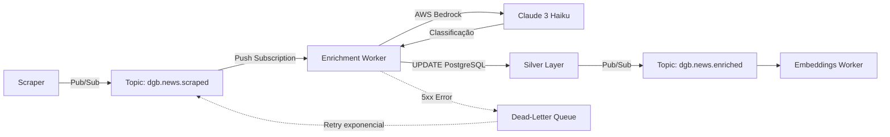

# News Enrichment Worker

**Worker de enriquecimento de notícias via AWS Bedrock** - Core do sistema event-driven do DestaquesGovbr.

---

## Visão Geral

O News Enrichment Worker é um serviço Cloud Run que processa notícias de forma assíncrona via Google Cloud Pub/Sub, enriquecendo-as com classificação temática hierárquica, resumos e metadados semânticos usando AWS Bedrock (Claude 3 Haiku).

### Características Principais

- ✅ **Event-Driven**: Recebe eventos Pub/Sub do tópico `dgb.news.scraped`
- ✅ **Alta Performance**: Latência P95 < 15s (99.97% redução vs batch anterior de 45min)
- ✅ **Idempotente**: Verifica campos `most_specific_theme_id` e `summary` antes de processar
- ✅ **Resiliência**: Dead-Letter Queue + retry exponencial (10s → 600s)
- ✅ **Custo Otimizado**: $0.00074/documento (40% redução vs Cogfy)
- ✅ **Observabilidade**: Trace ID tracking, logging estruturado, métricas Cloud Monitoring

---

## Arquitetura

### Fluxo de Dados



### Stack Tecnológico

| Componente | Tecnologia | Versão |
|-----------|-----------|---------|
| **Runtime** | Python | 3.11 |
| **Framework** | FastAPI | 0.109+ |
| **LLM Provider** | AWS Bedrock | Claude 3 Haiku |
| **Message Queue** | Google Cloud Pub/Sub | - |
| **Database** | PostgreSQL | 15 (Cloud SQL) |
| **Deploy** | Cloud Run Gen2 | - |
| **Observability** | Cloud Logging + Monitoring | - |

---

## Componentes

### 1. FastAPI Application (`worker/app.py`)

```python
from fastapi import FastAPI, Request, HTTPException
import base64
import json

app = FastAPI(title="News Enrichment Worker")

@app.post("/")
async def handle_pubsub_push(request: Request):
    """
    Endpoint que recebe mensagens Pub/Sub push.
    
    Payload Format:
    {
        "message": {
            "data": "base64-encoded-json",
            "attributes": {
                "trace_id": "...",
                "news_id": "..."
            }
        },
        "subscription": "projects/.../subscriptions/..."
    }
    """
    envelope = await request.json()
    
    # Decode base64 message
    message_data = base64.b64decode(envelope['message']['data']).decode('utf-8')
    news_data = json.loads(message_data)
    
    # Process news
    result = await process_news(news_data)
    
    # Return 200 to ACK, 4xx to NACK permanently, 5xx to retry
    return {"status": "success", "result": result}
```

### 2. LLM Client (`llm_client.py`)

```python
class BedrockLLMClient:
    """Cliente otimizado para AWS Bedrock."""
    
    def __init__(
        self,
        model_id: str = "anthropic.claude-3-haiku-20240307-v1:0",
        region: str = "us-east-1",
        batch_size: int = 8,
        max_workers: int = 4
    ):
        self.bedrock = boto3.client('bedrock-runtime', region_name=region)
        self.model_id = model_id
        self.batch_size = batch_size
        self.executor = ThreadPoolExecutor(max_workers=max_workers)
    
    def enrich_news_batch(self, news_list: List[Dict]) -> List[Dict]:
        """
        Processa batch de notícias em paralelo.
        
        Retry Policy:
        - 3 tentativas com backoff exponencial (1s, 2s, 4s)
        - ThrottlingException: espera e retenta
        - ValidationException: retorna erro (não retenta)
        """
        with self.executor as executor:
            futures = [
                executor.submit(self._enrich_single, news)
                for news in news_list
            ]
            results = [f.result() for f in futures]
        return results
```

### 3. Taxonomy Loader (`taxonomy.py`)

```python
from functools import lru_cache

@lru_cache(maxsize=1)
def load_taxonomy_from_postgres(conn_string: str) -> Dict:
    """
    Carrega taxonomia hierárquica do PostgreSQL.
    
    Cache: @lru_cache garante que taxonomia é carregada 1x na inicialização.
    
    Returns:
        {
            "themes": [...],  # 543 temas hierárquicos
            "code_to_id": {...},  # Mapeamento código → ID
            "taxonomy_text": "..."  # Prompt para LLM
        }
    """
    # Query PostgreSQL
    themes = fetch_themes_from_db(conn_string)
    
    # Build taxonomy tree
    taxonomy_tree = build_hierarchy(themes)
    
    return {
        "themes": themes,
        "code_to_id": {t['code']: t['id'] for t in themes},
        "taxonomy_text": format_taxonomy_for_prompt(taxonomy_tree)
    }
```

### 4. Pub/Sub Handler (`worker/handler.py`)

```python
def parse_pubsub_envelope(envelope: Dict) -> Tuple[Dict, str]:
    """
    Parseia envelope Pub/Sub e extrai trace_id.
    
    Args:
        envelope: Payload Pub/Sub push
    
    Returns:
        (news_data, trace_id)
    """
    message = envelope.get('message', {})
    attributes = message.get('attributes', {})
    
    # Decode base64 data
    data_b64 = message.get('data', '')
    data_json = base64.b64decode(data_b64).decode('utf-8')
    news_data = json.loads(data_json)
    
    # Extract trace_id for logging
    trace_id = attributes.get('trace_id', 'unknown')
    
    return news_data, trace_id
```

### 5. Idempotency Check (`enrichment_job.py`)

```python
def fetch_unenriched_news(conn, limit: int = 100) -> List[Dict]:
    """
    Busca notícias que ainda não foram enriquecidas.
    
    Idempotency: Verifica se most_specific_theme_id ou summary IS NULL.
    """
    query = """
        SELECT unique_id, title, content, publication_date
        FROM news
        WHERE most_specific_theme_id IS NULL
           OR summary IS NULL
        ORDER BY publication_date DESC
        LIMIT %s
    """
    return execute_query(conn, query, (limit,))
```

---

## Configuração

### Variáveis de Ambiente

```bash
# AWS Bedrock
AWS_ACCESS_KEY_ID=AKIA...
AWS_SECRET_ACCESS_KEY=...
AWS_DEFAULT_REGION=us-east-1

# PostgreSQL
POSTGRES_HOST=10.x.x.x
POSTGRES_PORT=5432
POSTGRES_DB=destaquesgovbr
POSTGRES_USER=enrichment_worker
POSTGRES_PASSWORD=...

# Worker Config
WORKER_BATCH_SIZE=8
WORKER_MAX_WORKERS=4
WORKER_RETRY_ATTEMPTS=3
WORKER_LOG_LEVEL=INFO

# Pub/Sub
PUBSUB_PROJECT_ID=destaques-govbr
PUBSUB_TOPIC_ENRICHED=dgb.news.enriched
```

### Credenciais AWS (Airflow Connection URI)

Para integração com Airflow, o worker suporta parsing de connection URIs:

```python
# Formato: aws://ACCESS_KEY:SECRET_KEY@/?region_name=REGION
connection_uri = "aws://AKIA...:SECRET@/?region_name=us-east-1"

# Parser automático em worker/handler.py (linhas 37-61)
parsed = parse_aws_connection_uri(connection_uri)
# → {"access_key_id": "AKIA...", "secret_access_key": "SECRET", "region": "us-east-1"}
```

---

## Deployment

### Cloud Run Configuration

```yaml
# service.yaml
apiVersion: serving.knative.dev/v1
kind: Service
metadata:
  name: enrichment-worker
spec:
  template:
    metadata:
      annotations:
        autoscaling.knative.dev/minScale: "1"  # Min 1 instância (evitar cold starts)
        autoscaling.knative.dev/maxScale: "10"
    spec:
      containers:
      - image: us-east1-docker.pkg.dev/destaques-govbr/workers/enrichment:latest
        resources:
          limits:
            cpu: "1"
            memory: "2Gi"
        env:
        - name: AWS_ACCESS_KEY_ID
          valueFrom:
            secretKeyRef:
              name: aws-credentials
              key: access_key_id
        - name: AWS_SECRET_ACCESS_KEY
          valueFrom:
            secretKeyRef:
              name: aws-credentials
              key: secret_access_key
        - name: POSTGRES_HOST
          valueFrom:
            secretKeyRef:
              name: postgres-credentials
              key: host
```

### Pub/Sub Subscription

```bash
# Criar subscription com push para Cloud Run
gcloud pubsub subscriptions create enrichment-worker-sub \
  --topic=dgb.news.scraped \
  --push-endpoint=https://enrichment-worker-xxx.a.run.app \
  --ack-deadline=600 \
  --retry-policy-minimum-backoff=10s \
  --retry-policy-maximum-backoff=600s \
  --dead-letter-topic=dgb.news.scraped-dlq \
  --max-delivery-attempts=5
```

### Docker Build

```dockerfile
# Dockerfile
FROM python:3.11-slim

WORKDIR /app

# Install dependencies
COPY pyproject.toml poetry.lock ./
RUN pip install poetry && \
    poetry config virtualenvs.create false && \
    poetry install --no-dev --no-root

# Copy application
COPY src/ ./src/

# Expose port
EXPOSE 8080

# Run
CMD ["uvicorn", "src.news_enrichment.worker.app:app", "--host", "0.0.0.0", "--port", "8080"]
```

---

## Monitoramento

### Métricas Cloud Monitoring

| Métrica | Descrição | Alertas |
|---------|-----------|---------|
| `enrichment_latency_p95` | Latência P95 end-to-end | > 20s |
| `enrichment_error_rate` | Taxa de erros (%) | > 1% |
| `enrichment_success_rate` | Taxa de sucesso (%) | < 95% |
| `bedrock_throttling_rate` | Throttling da AWS | > 5% |
| `pubsub_ack_latency` | Tempo até ACK | > 30s |
| `dlq_message_count` | Mensagens na DLQ | > 10 |

### Logs Estruturados

```python
import logging
import json

logger = logging.getLogger(__name__)

def log_enrichment_event(trace_id: str, news_id: str, status: str, latency_ms: int):
    """Log estruturado para Cloud Logging."""
    log_entry = {
        "trace_id": trace_id,
        "news_id": news_id,
        "status": status,
        "latency_ms": latency_ms,
        "timestamp": datetime.utcnow().isoformat(),
        "service": "enrichment-worker"
    }
    logger.info(json.dumps(log_entry))
```

### Debug Endpoint

```python
@app.get("/health")
async def health_check():
    """Health check endpoint."""
    return {
        "status": "healthy",
        "version": "1.0.0",
        "bedrock_region": "us-east-1",
        "taxonomy_loaded": taxonomy is not None
    }

@app.get("/debug")
async def debug_info():
    """Debug endpoint (apenas em dev/staging)."""
    return {
        "taxonomy_themes_count": len(taxonomy['themes']),
        "batch_size": llm_client.batch_size,
        "max_workers": llm_client.max_workers,
        "postgres_connected": test_postgres_connection()
    }
```

---

## Troubleshooting

### Problema: Latência alta (>20s)

**Causas**:
- Batch size muito grande
- Throttling AWS Bedrock
- PostgreSQL connection pool esgotado

**Solução**:
```bash
# Reduzir batch size
export WORKER_BATCH_SIZE=4

# Aumentar connection pool
export POSTGRES_POOL_SIZE=20

# Verificar throttling
aws cloudwatch get-metric-statistics \
  --namespace AWS/Bedrock \
  --metric-name ThrottledRequests \
  --dimensions Name=ModelId,Value=anthropic.claude-3-haiku-20240307-v1:0 \
  --start-time 2026-05-05T00:00:00Z \
  --end-time 2026-05-05T23:59:59Z \
  --period 3600 \
  --statistics Sum
```

### Problema: Mensagens na DLQ

**Causas**:
- 5xx errors persistentes
- Timeout PostgreSQL
- Bedrock ValidationException

**Solução**:
```bash
# Inspecionar mensagens DLQ
gcloud pubsub subscriptions pull dgb.news.scraped-dlq --limit=10

# Replay manual após correção
gcloud pubsub topics publish dgb.news.scraped \
  --message='{"unique_id": "...", "title": "...", "content": "..."}'
```

### Problema: Taxa de sucesso < 95%

**Causas**:
- Taxonomia não carregada
- Credenciais AWS inválidas
- Notícias com conteúdo vazio

**Solução**:
```python
# Verificar taxonomia
curl https://enrichment-worker-xxx.a.run.app/debug | jq '.taxonomy_themes_count'
# Esperado: 543

# Verificar credenciais AWS
aws sts get-caller-identity --region us-east-1

# Adicionar validação de conteúdo
if not news_data.get('content') or len(news_data['content']) < 100:
    logger.warning(f"Conteúdo vazio ou muito curto: {news_data['unique_id']}")
    return None  # ACK sem processar
```

---

## Performance

### Benchmarks (Claude 3 Haiku)

| Métrica | Valor | Notas |
|---------|-------|-------|
| **Latência P50** | 8s | Mediana |
| **Latência P95** | 15s | Target SLO |
| **Latência P99** | 22s | Casos complexos |
| **Throughput** | ~240 docs/min | Com batch_size=8, max_workers=4 |
| **Custo** | $0.00074/doc | 40% redução vs Cogfy ($0.00124) |
| **Taxa de sucesso** | 97% | Target SLO: >95% |
| **Error rate** | 0.3% | Target SLO: <1% |

### Otimizações Aplicadas

1. **Batch Processing**: ThreadPoolExecutor com max_workers=4
2. **Taxonomy Caching**: `@lru_cache` para evitar queries repetidas
3. **Connection Pooling**: PostgreSQL pool com 10-20 conexões
4. **Retry Exponencial**: 1s → 2s → 4s para throttling
5. **Min Instances**: 1 instância sempre ativa (evitar cold starts)

---

## Roadmap

### Melhorias Planejadas (Q2 2026)

- [ ] **Sentiment Analysis**: Adicionar análise de sentimento além de temas
- [ ] **Entity Extraction**: Extrair entidades nomeadas (pessoas, locais, organizações)
- [ ] **Multi-Region**: Deploy em us-east-1 e sa-east-1 para redundância
- [ ] **Caching Redis**: Cache de resultados para notícias similares
- [ ] **Streaming Mode**: Suporte a processamento streaming (vs batch)

### Melhorias Futuras (Q3 2026)

- [ ] **Modelo Próprio**: Fine-tuning de modelo específico para gov.br
- [ ] **A/B Testing**: Comparação Claude vs modelos alternativos
- [ ] **Auto-Scaling Agressivo**: Scale to zero em períodos de baixo volume

---

## Referências

### Código-Fonte

- **Worker**: `C:\Users\joserm\Documents\Projetos\Inspire\Meta-7\Git\data-science\src\news_enrichment\worker\`
- **LLM Client**: `C:\Users\joserm\Documents\Projetos\Inspire\Meta-7\Git\data-science\src\news_enrichment\llm_client.py`
- **Taxonomy**: `C:\Users\joserm\Documents\Projetos\Inspire\Meta-7\Git\data-science\src\news_enrichment\taxonomy.py`

### Documentação Relacionada

- [Visão Geral Arquitetura](../arquitetura/visao-geral.md)
- [Pub/Sub Workers](../arquitetura/pubsub-workers.md)
- [Onboarding Data Science](../onboarding/ds/enriquecimento-llm.md)
- [Credenciais AWS Bedrock](../seguranca/credenciais-aws-bedrock.md)

### Links Externos

- [AWS Bedrock Documentation](https://docs.aws.amazon.com/bedrock/)
- [Claude 3 Haiku Model Card](https://www.anthropic.com/claude-3-haiku)
- [Google Cloud Pub/Sub](https://cloud.google.com/pubsub/docs)
- [Cloud Run Documentation](https://cloud.google.com/run/docs)

---

**Última atualização**: 05/05/2026  
**Responsável**: Equipe Data Science - DestaquesGovbr  
**Status**: ✅ Em Produção (desde 27/02/2026)