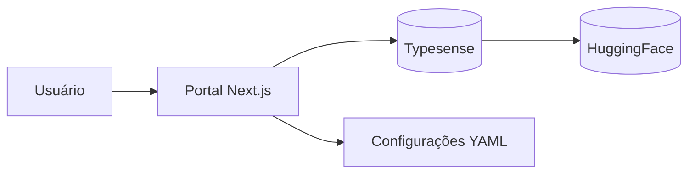

# Módulo: Portal (destaquesgovbr-portal)

> Portal web para busca e navegação de notícias governamentais.

**Repositório**: [github.com/destaquesgovbr/destaquesgovbr-portal](https://github.com/destaquesgovbr/destaquesgovbr-portal)

**URL Produção**: [destaquesgovbr-portal-klvx64dufq-rj.a.run.app](https://destaquesgovbr-portal-klvx64dufq-rj.a.run.app/) *(URL provisória - Cloud Run/GCP)*

## Visão Geral

O portal é a interface principal do DestaquesGovbr, oferecendo:

- **Busca full-text** com Typesense
- **Filtros** por órgão, tema e data
- **Navegação** por temas e órgãos
- **Páginas individuais** de notícias



---

## Stack Tecnológico

| Tecnologia | Versão | Uso |
|------------|--------|-----|
| Next.js | 15 | Framework React (App Router) |
| TypeScript | 5 | Tipagem estática |
| Typesense | - | Busca full-text |
| shadcn/ui | - | Componentes UI |
| Tailwind CSS | 3 | Estilização |
| React Query | 5 | Data fetching |
| Biome | - | Lint + Format |

---

## Estrutura do Repositório

```
destaquesgovbr-portal/
├── src/
│   ├── app/                         # App Router (Next.js 15)
│   │   ├── page.tsx                 # Homepage
│   │   ├── layout.tsx               # Layout principal
│   │   ├── globals.css              # Estilos globais
│   │   ├── temas/
│   │   │   └── [themeLabel]/        # Páginas por tema
│   │   │       └── page.tsx
│   │   ├── orgaos/
│   │   │   └── [agencyKey]/         # Páginas por órgão
│   │   │       └── page.tsx
│   │   ├── noticias/
│   │   │   └── [id]/                # Página de notícia
│   │   │       └── page.tsx
│   │   └── api/                     # API Routes
│   ├── components/
│   │   ├── ui/                      # Componentes shadcn/ui
│   │   ├── search/                  # Busca e filtros
│   │   ├── news/                    # Cards e listas de notícias
│   │   ├── layout/                  # Header, Footer, Nav
│   │   └── filters/                 # Filtros de busca
│   ├── lib/
│   │   ├── typesense-client.ts      # Cliente Typesense
│   │   ├── themes.yaml              # Árvore temática
│   │   ├── agencies.yaml            # Catálogo de órgãos
│   │   ├── prioritization.yaml      # Config de priorização
│   │   └── utils.ts                 # Utilitários
│   ├── hooks/                       # React hooks customizados
│   └── types/                       # Definições TypeScript
├── public/                          # Assets estáticos
├── .github/workflows/
│   └── deploy-production.yml        # Deploy Cloud Run
├── package.json
├── tailwind.config.ts
├── next.config.ts
├── tsconfig.json
└── Dockerfile
```

---

## Páginas Principais

### Homepage (`/`)

- Lista de notícias mais recentes
- Busca com autocomplete
- Filtros rápidos por tema
- Notícias priorizadas (destaques)

### Página de Tema (`/temas/[themeLabel]`)

- Notícias filtradas por tema
- Breadcrumb de navegação
- Subtemas disponíveis

### Página de Órgão (`/orgaos/[agencyKey]`)

- Notícias do órgão específico
- Informações do órgão
- Órgãos relacionados (hierarquia)

### Página de Notícia (`/noticias/[id]`)

- Conteúdo completo
- Metadados (data, órgão, tema)
- Notícias relacionadas

---

## Componentes Principais

### SearchBar

```tsx
// Barra de busca com autocomplete
<SearchBar
  placeholder="Buscar notícias..."
  onSearch={(query) => handleSearch(query)}
  suggestions={suggestions}
/>
```

### NewsCard

```tsx
// Card de notícia
<NewsCard
  title={news.title}
  summary={news.summary}
  agency={news.agency}
  publishedAt={news.published_at}
  theme={news.theme_1_level_1_label}
  imageUrl={news.image}
  href={`/noticias/${news.unique_id}`}
/>
```

### FilterPanel

```tsx
// Painel de filtros
<FilterPanel
  agencies={agencies}
  themes={themes}
  selectedAgencies={selected.agencies}
  selectedThemes={selected.themes}
  dateRange={dateRange}
  onFilterChange={handleFilterChange}
/>
```

---

## Cliente Typesense

### Configuração (`typesense-client.ts`)

```typescript
import Typesense from "typesense"

const client = new Typesense.Client({
  nodes: [{
    host: process.env.TYPESENSE_HOST,
    port: Number(process.env.TYPESENSE_PORT),
    protocol: process.env.TYPESENSE_PROTOCOL,
  }],
  apiKey: process.env.TYPESENSE_API_KEY,
  connectionTimeoutSeconds: 2,
})
```

### Função de Busca

```typescript
interface SearchParams {
  query: string
  filters?: {
    agency?: string[]
    theme_1_level_1_code?: string[]
    dateFrom?: number
    dateTo?: number
  }
  page?: number
  perPage?: number
  sortBy?: string
}

async function searchNews(params: SearchParams): Promise<SearchResult> {
  const { query, filters, page = 1, perPage = 20 } = params

  // Construir filter_by
  const filterClauses: string[] = []
  if (filters?.agency?.length) {
    filterClauses.push(`agency:[${filters.agency.join(",")}]`)
  }
  if (filters?.theme_1_level_1_code?.length) {
    filterClauses.push(`theme_1_level_1_code:[${filters.theme_1_level_1_code.join(",")}]`)
  }
  if (filters?.dateFrom) {
    filterClauses.push(`published_at:>=${filters.dateFrom}`)
  }

  const result = await client
    .collections("news")
    .documents()
    .search({
      q: query || "*",
      query_by: "title,content,summary",
      filter_by: filterClauses.join(" && ") || undefined,
      sort_by: "published_at:desc",
      page,
      per_page: perPage,
      highlight_fields: "title,summary",
    })

  return result
}
```

---

## Schema do Documento Typesense

```typescript
interface NewsDocument {
  id: string                        // unique_id
  unique_id: string
  agency: string                    // ex: "gestao"
  title: string
  url: string
  image?: string
  content: string                   // Markdown
  published_at: number              // Unix timestamp
  category?: string
  tags?: string[]

  // Campos enriquecidos
  theme_1_level_1_code?: string     // ex: "01"
  theme_1_level_1_label?: string    // ex: "Economia e Finanças"
  theme_1_level_2_code?: string
  theme_1_level_2_label?: string
  theme_1_level_3_code?: string
  theme_1_level_3_label?: string
  most_specific_theme_code?: string
  most_specific_theme_label?: string
  summary?: string                  // Resumo AI
}
```

---

## Arquivos de Configuração

### `themes.yaml` - Árvore Temática

```yaml
themes:
  - label: Economia e Finanças
    code: "01"
    children:
      - label: Política Econômica
        code: "01.01"
        children:
          - label: Política Fiscal
            code: "01.01.01"
          - label: Autonomia Econômica
            code: "01.01.02"
```

### `agencies.yaml` - Catálogo de Órgãos

```yaml
sources:
  gestao:
    name: Ministério da Gestão e da Inovação em Serviços Públicos
    parent: presidencia
    type: Ministério

  inpe:
    name: Instituto Nacional de Pesquisas Espaciais
    parent: mcti
    type: Instituto
```

### `prioritization.yaml` - Priorização

```yaml
# Órgãos com notícias priorizadas no topo
priority_agencies:
  - presidencia
  - gestao
  - fazenda
  - saude

# Temas em destaque
priority_themes:
  - "01"  # Economia
  - "03"  # Saúde
  - "20"  # Políticas Públicas
```

---

## Server Components vs Client Components

### Server Components (padrão)

```tsx
// app/temas/[themeLabel]/page.tsx
export default async function ThemePage({ params }: Props) {
  // Busca no servidor
  const news = await searchNews({
    query: "*",
    filters: { theme_1_level_1_label: [params.themeLabel] }
  })

  return <NewsList news={news.hits} />
}
```

### Client Components

```tsx
"use client"

// components/search/SearchBar.tsx
export function SearchBar() {
  const [query, setQuery] = useState("")

  // Interatividade no cliente
  return (
    <input
      value={query}
      onChange={(e) => setQuery(e.target.value)}
    />
  )
}
```

---

## Variáveis de Ambiente

```bash
# .env.local (desenvolvimento)
TYPESENSE_HOST=localhost
TYPESENSE_PORT=8108
TYPESENSE_PROTOCOL=http
TYPESENSE_API_KEY=xyz
TYPESENSE_COLLECTION_NAME=news

# Produção (via Secret Manager)
TYPESENSE_HOST=<ip-interno>
TYPESENSE_PORT=8108
TYPESENSE_PROTOCOL=http
TYPESENSE_API_KEY=<api-key-producao>
```

---

## Comandos de Desenvolvimento

```bash
# Instalar dependências
npm install

# Desenvolvimento
npm run dev

# Build de produção
npm run build

# Rodar build local
npm run start

# Lint
npm run lint

# Formatar
npm run format

# Type check
npm run type-check
# ou
npx tsc --noEmit
```

---

## Componentes shadcn/ui

### Adicionar componente

```bash
npx shadcn@latest add button
npx shadcn@latest add card
npx shadcn@latest add input
npx shadcn@latest add select
```

### Usar componente

```tsx
import { Button } from "@/components/ui/button"
import { Card, CardHeader, CardTitle, CardContent } from "@/components/ui/card"
import { Input } from "@/components/ui/input"

export function Example() {
  return (
    <Card>
      <CardHeader>
        <CardTitle>Buscar</CardTitle>
      </CardHeader>
      <CardContent>
        <Input placeholder="Digite sua busca..." />
        <Button>Buscar</Button>
      </CardContent>
    </Card>
  )
}
```

---

## Deploy

### Automático (GitHub Actions)

Push para `main` → Deploy automático via `deploy-production.yml`

### Manual

```bash
# Build Docker
docker build -t destaquesgovbr-portal .

# Push para Artifact Registry
docker tag destaquesgovbr-portal gcr.io/PROJECT_ID/destaquesgovbr-portal
docker push gcr.io/PROJECT_ID/destaquesgovbr-portal

# Deploy Cloud Run
gcloud run deploy destaquesgovbr-portal \
  --image gcr.io/PROJECT_ID/destaquesgovbr-portal \
  --region us-east1
```

---

## Links Relacionados

- [Visão Geral da Arquitetura](../arquitetura/visao-geral.md)
- [Setup Frontend](../onboarding/setup-frontend.md) - Guia de desenvolvimento
- [Typesense Local](./typesense-local.md) - Ambiente de desenvolvimento
- [Deploy do Portal](../workflows/portal-deploy.md) - GitHub Actions
