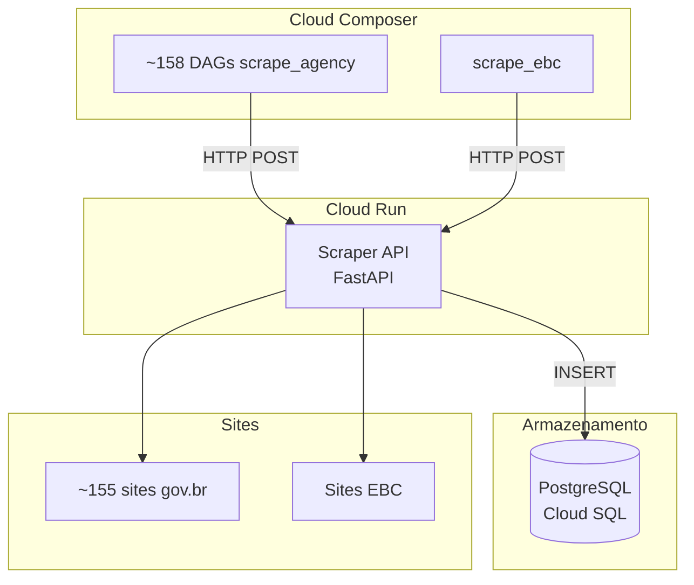

# Módulo: Scraper

!!! info "Repositório"
    **GitHub**: [destaquesgovbr/scraper](https://github.com/destaquesgovbr/scraper)

---

## Visão Geral

O **scraper** é um repositório standalone que coleta notícias de ~155 agências governamentais (gov.br) e da EBC (Agência Brasil, TV Brasil, etc.).

A coleta é orquestrada por **DAGs Airflow** (Cloud Composer) que chamam uma **API FastAPI** hospedada no Cloud Run. Os dados são inseridos diretamente no PostgreSQL (insert-only).

```
DAGs Airflow (a cada 15min)
    → HTTP POST para Cloud Run API
        → Scraper faz fetch do site gov.br
            → Parse HTML → Markdown
                → INSERT no PostgreSQL
```

## Arquitetura



## Estrutura do Repositório

```
scraper/
├── src/govbr_scraper/
│   ├── api.py                    # FastAPI (Cloud Run)
│   ├── scrapers/
│   │   ├── webscraper.py         # Scraper gov.br
│   │   ├── scrape_manager.py     # Coordenador gov.br
│   │   ├── ebc_webscraper.py     # Scraper EBC
│   │   ├── ebc_scrape_manager.py # Coordenador EBC
│   │   └── config/
│   │       └── site_urls.yaml    # URLs por agência
│   ├── storage/
│   │   ├── storage_adapter.py
│   │   └── postgres_manager.py
│   └── models/
│       └── news.py               # Modelos Pydantic
├── dags/                          # DAGs Airflow
│   ├── scrape_agencies.py         # ~158 DAGs dinâmicas
│   ├── scrape_ebc.py              # 1 DAG EBC
│   └── config/
│       └── site_urls.yaml
├── docker/Dockerfile
└── .github/workflows/
    ├── scraper-api-deploy.yaml
    ├── composer-deploy-dags.yaml
    └── tests.yaml
```

## API Endpoints

A API roda no Cloud Run e é chamada pelas DAGs Airflow.

| Método | Endpoint | Descrição |
|--------|----------|-----------|
| `POST` | `/scrape/agencies` | Raspa sites gov.br (aceita lista de agências, datas) |
| `POST` | `/scrape/ebc` | Raspa sites EBC |
| `GET` | `/health` | Health check |

### Request: `/scrape/agencies`

```json
{
  "start_date": "2025-01-01",
  "end_date": "2025-01-02",
  "agencies": ["mec", "mds"],
  "allow_update": false,
  "sequential": true
}
```

## DAGs Airflow

| DAG | Quantidade | Schedule | Descrição |
|-----|-----------|----------|-----------|
| `scrape_{agency_key}` | ~158 | A cada 15min | 1 DAG por agência gov.br |
| `scrape_ebc` | 1 | A cada 15min | Sites EBC |

Cada DAG:

- Chama a API no Cloud Run via HTTP POST
- Retry: 2x com backoff de 5min
- Timeout: 15min por execução

→ Veja [Airflow DAGs](../workflows/airflow-dags.md) para detalhes de deploy e configuração.

## Variáveis de Ambiente

```bash
DATABASE_URL=postgresql://...   # PostgreSQL connection string
STORAGE_BACKEND=postgres        # Sempre postgres
LOG_LEVEL=INFO                  # Loguru level
```

## Deploy

| Componente | Destino | Workflow |
|-----------|---------|----------|
| **API** | Cloud Run | `scraper-api-deploy.yaml` |
| **DAGs** | Cloud Composer (`{bucket}/scraper/`) | `composer-deploy-dags.yaml` |

→ Veja [Docker Builds](../workflows/docker-builds.md) para detalhes de build da imagem.

## Desenvolvimento Local

```bash
# Instalar dependências
poetry install

# Rodar testes
poetry run pytest

# Rodar API localmente
poetry run uvicorn govbr_scraper.api:app --reload
```

## Links Relacionados

- **[Data Platform](data-platform.md)** — Enriquecimento, embeddings e indexação (pipeline pós-scraping)
- **[Pipeline de Dados](../workflows/scraper-pipeline.md)** — Visão completa do pipeline scraping + enrichment
- **[PostgreSQL](../arquitetura/postgresql.md)** — Banco de dados central
