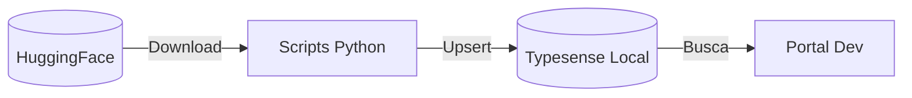

# Módulo: Typesense Local (typesense)

> Ambiente de desenvolvimento local para busca full-text.

**Repositório**: [github.com/destaquesgovbr/typesense](https://github.com/destaquesgovbr/typesense)

## Visão Geral

O repositório `typesense` fornece:

- **Docker Compose** para rodar Typesense localmente
- **Scripts Python** para carregar dados do HuggingFace
- **Configuração** da collection `news`



---

## Estrutura do Repositório

```
typesense/
├── docker-compose.yml       # Typesense container
├── python/
│   ├── scripts/
│   │   └── load_data.py     # Script de carga
│   ├── requirements.txt     # Dependências Python
│   └── config.py            # Configurações
└── README.md
```

---

## Quick Start

### 1. Clonar repositório

```bash
git clone https://github.com/destaquesgovbr/typesense.git
cd typesense
```

### 2. Subir Typesense

```bash
docker compose up -d
```

### 3. Verificar se está rodando

```bash
curl http://localhost:8108/health
# Resposta: {"ok":true}
```

### 4. Carregar dados

```bash
cd python
pip install -r requirements.txt
python scripts/load_data.py --mode incremental --days 7
```

### 5. Testar busca

```bash
curl "http://localhost:8108/collections/news/documents/search?q=economia&query_by=title" \
  -H "X-TYPESENSE-API-KEY: xyz"
```

---

## Docker Compose

```yaml
# docker-compose.yml
version: '3.8'

services:
  typesense:
    image: typesense/typesense:0.25.2
    container_name: typesense
    ports:
      - "8108:8108"
    environment:
      - TYPESENSE_API_KEY=xyz
      - TYPESENSE_DATA_DIR=/data
    volumes:
      - typesense-data:/data
    restart: unless-stopped

volumes:
  typesense-data:
```

### Comandos Docker

```bash
# Subir
docker compose up -d

# Ver logs
docker compose logs -f typesense

# Parar
docker compose down

# Remover dados (reset completo)
docker compose down -v
```

---

## Script de Carga (`load_data.py`)

### Modos de operação

| Modo | Descrição | Uso |
|------|-----------|-----|
| `incremental` | Carrega últimos N dias | Desenvolvimento diário |
| `full` | Carrega dataset completo | Reset ou primeira carga |

### Exemplos

```bash
# Carregar últimos 7 dias
python scripts/load_data.py --mode incremental --days 7

# Carregar últimos 30 dias
python scripts/load_data.py --mode incremental --days 30

# Carga completa (demora mais)
python scripts/load_data.py --mode full
```

### Funcionamento interno

```python
def load_incremental(days: int):
    """Carrega dados dos últimos N dias."""
    # 1. Conectar ao Typesense
    # 2. Baixar dataset do HuggingFace
    # 3. Filtrar por data
    # 4. Upsert documentos
    pass

def load_full():
    """Carga completa do dataset."""
    # 1. Deletar collection existente
    # 2. Criar collection com schema
    # 3. Baixar dataset completo
    # 4. Inserir todos os documentos
    pass
```

---

## Schema da Collection

```python
schema = {
    "name": "news",
    "fields": [
        {"name": "unique_id", "type": "string"},
        {"name": "agency", "type": "string", "facet": True},
        {"name": "title", "type": "string"},
        {"name": "url", "type": "string"},
        {"name": "image", "type": "string", "optional": True},
        {"name": "content", "type": "string"},
        {"name": "published_at", "type": "int64", "sort": True},
        {"name": "category", "type": "string", "optional": True, "facet": True},
        {"name": "tags", "type": "string[]", "optional": True},

        # Campos de tema
        {"name": "theme_1_level_1_code", "type": "string", "optional": True, "facet": True},
        {"name": "theme_1_level_1_label", "type": "string", "optional": True, "facet": True},
        {"name": "theme_1_level_2_code", "type": "string", "optional": True, "facet": True},
        {"name": "theme_1_level_2_label", "type": "string", "optional": True},
        {"name": "theme_1_level_3_code", "type": "string", "optional": True, "facet": True},
        {"name": "theme_1_level_3_label", "type": "string", "optional": True},
        {"name": "most_specific_theme_code", "type": "string", "optional": True, "facet": True},
        {"name": "most_specific_theme_label", "type": "string", "optional": True},

        # Resumo AI
        {"name": "summary", "type": "string", "optional": True},
    ],
    "default_sorting_field": "published_at"
}
```

---

## API do Typesense

### Verificar saúde

```bash
curl http://localhost:8108/health
```

### Listar collections

```bash
curl http://localhost:8108/collections \
  -H "X-TYPESENSE-API-KEY: xyz"
```

### Ver estatísticas da collection

```bash
curl http://localhost:8108/collections/news \
  -H "X-TYPESENSE-API-KEY: xyz"
```

### Busca simples

```bash
curl "http://localhost:8108/collections/news/documents/search?q=economia&query_by=title,content" \
  -H "X-TYPESENSE-API-KEY: xyz"
```

### Busca com filtros

```bash
curl "http://localhost:8108/collections/news/documents/search?\
q=*&\
query_by=title,content&\
filter_by=agency:gestao&\
sort_by=published_at:desc&\
per_page=10" \
  -H "X-TYPESENSE-API-KEY: xyz"
```

### Busca por múltiplos valores

```bash
curl "http://localhost:8108/collections/news/documents/search?\
q=*&\
query_by=title&\
filter_by=agency:[gestao,fazenda,saude]&\
filter_by=theme_1_level_1_code:[01,03]" \
  -H "X-TYPESENSE-API-KEY: xyz"
```

---

## Configuração no Portal

### `.env.local`

```bash
TYPESENSE_HOST=localhost
TYPESENSE_PORT=8108
TYPESENSE_PROTOCOL=http
TYPESENSE_API_KEY=xyz
TYPESENSE_COLLECTION_NAME=news
```

### Cliente TypeScript

```typescript
import Typesense from "typesense"

const client = new Typesense.Client({
  nodes: [{
    host: "localhost",
    port: 8108,
    protocol: "http",
  }],
  apiKey: "xyz",
})
```

---

## Troubleshooting

### Container não inicia

```bash
# Ver logs
docker compose logs typesense

# Verificar porta em uso
lsof -i :8108

# Reiniciar
docker compose down && docker compose up -d
```

### Erro de conexão

```
Error: connect ECONNREFUSED 127.0.0.1:8108
```

**Solução**: Verificar se container está rodando:

```bash
docker ps | grep typesense
```

### Busca não retorna resultados

1. Verificar se há dados:

```bash
curl http://localhost:8108/collections/news \
  -H "X-TYPESENSE-API-KEY: xyz"
```

2. Recarregar dados:

```bash
python scripts/load_data.py --mode incremental --days 7
```

### Dados desatualizados

```bash
# Recarregar últimos dias
python scripts/load_data.py --mode incremental --days 30
```

### Reset completo

```bash
# Parar e remover volumes
docker compose down -v

# Subir novamente
docker compose up -d

# Recarregar dados
python scripts/load_data.py --mode full
```

---

## Comparação: Local vs Produção

| Aspecto | Local | Produção |
|---------|-------|----------|
| Host | localhost | IP interno GCP |
| Porta | 8108 | 8108 |
| API Key | xyz | Secret Manager |
| Dados | Últimos N dias | Dataset completo |
| Persistência | Volume Docker | Disco persistente |

---

## Performance

### Requisitos mínimos

- **RAM**: 2GB (4GB recomendado para dataset completo)
- **Disco**: 5GB para dados
- **CPU**: 2 cores

### Otimização local

```bash
# Carregar menos dados para desenvolvimento
python scripts/load_data.py --mode incremental --days 3
```

---

## Links Relacionados

- [Setup Frontend](../onboarding/setup-frontend.md) - Configuração do portal
- [Workflow Typesense Data](../workflows/typesense-data.md) - Carga em produção
- [Módulo Portal](./portal.md) - Uso do Typesense no portal
