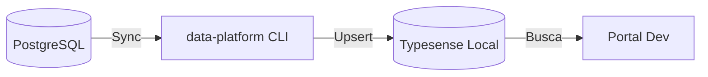

# Módulo: Typesense Local

> Ambiente de desenvolvimento local para busca full-text e vetorial.

!!! info "Módulo Migrado"
    Os scripts de sincronização com Typesense foram migrados para o repositório **data-platform**.
    O repositório `typesense` foi arquivado.

    **Novo repositório**: [github.com/destaquesgovbr/data-platform](https://github.com/destaquesgovbr/data-platform)

## Visão Geral

O Typesense é usado para busca full-text e vetorial no portal. Em desenvolvimento local, você pode usar Docker Compose para rodar uma instância local.



---

## Quick Start

### 1. Subir Typesense com Docker

```bash
# Criar docker-compose.yml
cat > docker-compose.yml << 'EOF'
version: '3.8'

services:
  typesense:
    image: typesense/typesense:0.25.2
    container_name: typesense
    ports:
      - "8108:8108"
    environment:
      - TYPESENSE_API_KEY=xyz
      - TYPESENSE_DATA_DIR=/data
    volumes:
      - typesense-data:/data
    restart: unless-stopped

volumes:
  typesense-data:
EOF

docker compose up -d
```

### 2. Verificar se está rodando

```bash
curl http://localhost:8108/health
# Resposta: {"ok":true}
```

### 3. Carregar dados (via data-platform)

```bash
# No diretório data-platform
data-platform sync-typesense --start-date $(date -v-7d +%Y-%m-%d)
```

### 4. Testar busca

```bash
curl "http://localhost:8108/collections/news/documents/search?q=economia&query_by=title" \
  -H "X-TYPESENSE-API-KEY: xyz"
```

---

## Sincronização com PostgreSQL

A sincronização agora lê do **PostgreSQL** (fonte de verdade) e escreve no Typesense.

### CLI do data-platform

```bash
# Sync incremental (últimos N dias)
data-platform sync-typesense --start-date YYYY-MM-DD

# Sync completo (todos os registros)
data-platform sync-typesense --full-sync
```

### Fluxo Interno

```python
# src/data_platform/jobs/typesense/sync_job.py
def sync_typesense(start_date: date = None, full_sync: bool = False):
    """Sincroniza PostgreSQL → Typesense."""
    # 1. Conectar ao PostgreSQL
    # 2. Conectar ao Typesense
    # 3. Buscar notícias (com embeddings)
    # 4. Converter para schema Typesense
    # 5. Upsert em batches de 5000
    pass
```

---

## Schema da Collection

O schema inclui campos para busca vetorial:

```python
schema = {
    "name": "news",
    "fields": [
        # Identificação
        {"name": "unique_id", "type": "string"},
        {"name": "agency", "type": "string", "facet": True},
        {"name": "agency_name", "type": "string", "facet": True},

        # Conteúdo
        {"name": "title", "type": "string"},
        {"name": "url", "type": "string"},
        {"name": "image", "type": "string", "optional": True},
        {"name": "content", "type": "string"},
        {"name": "summary", "type": "string", "optional": True},

        # Datas
        {"name": "published_at", "type": "int64", "sort": True},

        # Classificação original
        {"name": "category", "type": "string", "optional": True, "facet": True},
        {"name": "tags", "type": "string[]", "optional": True},

        # Temas (enriquecimento Cogfy)
        {"name": "theme_l1_code", "type": "string", "optional": True, "facet": True},
        {"name": "theme_l1_label", "type": "string", "optional": True, "facet": True},
        {"name": "theme_l2_code", "type": "string", "optional": True, "facet": True},
        {"name": "theme_l2_label", "type": "string", "optional": True},
        {"name": "theme_l3_code", "type": "string", "optional": True, "facet": True},
        {"name": "theme_l3_label", "type": "string", "optional": True},
        {"name": "most_specific_theme_code", "type": "string", "optional": True, "facet": True},
        {"name": "most_specific_theme_label", "type": "string", "optional": True},

        # Embedding para busca vetorial
        {
            "name": "content_embedding",
            "type": "float[]",
            "num_dim": 768,
            "optional": True
        },
    ],
    "default_sorting_field": "published_at"
}
```

---

## Busca Vetorial

O Typesense em produção suporta busca semântica via embeddings:

```bash
# Busca vetorial (requer embedding da query)
curl -X POST "http://localhost:8108/multi_search" \
  -H "X-TYPESENSE-API-KEY: xyz" \
  -d '{
    "searches": [{
      "collection": "news",
      "q": "*",
      "vector_query": "content_embedding:([0.1, 0.2, ...], k:10)"
    }]
  }'
```

---

## API do Typesense

### Verificar saúde

```bash
curl http://localhost:8108/health
```

### Listar collections

```bash
curl http://localhost:8108/collections \
  -H "X-TYPESENSE-API-KEY: xyz"
```

### Ver estatísticas da collection

```bash
curl http://localhost:8108/collections/news \
  -H "X-TYPESENSE-API-KEY: xyz"
```

### Busca simples

```bash
curl "http://localhost:8108/collections/news/documents/search?q=economia&query_by=title,content" \
  -H "X-TYPESENSE-API-KEY: xyz"
```

### Busca com filtros

```bash
curl "http://localhost:8108/collections/news/documents/search?\
q=*&\
query_by=title,content&\
filter_by=agency:gestao&\
sort_by=published_at:desc&\
per_page=10" \
  -H "X-TYPESENSE-API-KEY: xyz"
```

### Busca por tema

```bash
curl "http://localhost:8108/collections/news/documents/search?\
q=*&\
query_by=title&\
filter_by=theme_l1_code:01&\
sort_by=published_at:desc" \
  -H "X-TYPESENSE-API-KEY: xyz"
```

---

## Configuração no Portal

### `.env.local`

```bash
TYPESENSE_HOST=localhost
TYPESENSE_PORT=8108
TYPESENSE_PROTOCOL=http
TYPESENSE_API_KEY=xyz
TYPESENSE_COLLECTION_NAME=news
```

### Cliente TypeScript

```typescript
import Typesense from "typesense"

const client = new Typesense.Client({
  nodes: [{
    host: "localhost",
    port: 8108,
    protocol: "http",
  }],
  apiKey: "xyz",
})
```

---

## Troubleshooting

### Container não inicia

```bash
# Ver logs
docker compose logs typesense

# Verificar porta em uso
lsof -i :8108

# Reiniciar
docker compose down && docker compose up -d
```

### Erro de conexão

```
Error: connect ECONNREFUSED 127.0.0.1:8108
```

**Solução**: Verificar se container está rodando:

```bash
docker ps | grep typesense
```

### Busca não retorna resultados

1. Verificar se há dados:

```bash
curl http://localhost:8108/collections/news \
  -H "X-TYPESENSE-API-KEY: xyz"
```

2. Recarregar dados:

```bash
data-platform sync-typesense --start-date $(date -v-7d +%Y-%m-%d)
```

### Reset completo

```bash
# Parar e remover volumes
docker compose down -v

# Subir novamente
docker compose up -d

# Recarregar dados
data-platform sync-typesense --full-sync
```

---

## Comparação: Local vs Produção

| Aspecto | Local | Produção |
|---------|-------|----------|
| Host | localhost | IP interno GCP |
| Porta | 8108 | 8108 |
| API Key | xyz | Secret Manager |
| Dados | Últimos N dias | Dataset completo |
| Embeddings | Opcional | Incluídos |
| Persistência | Volume Docker | Disco persistente |
| Fonte de dados | PostgreSQL | PostgreSQL |

---

## Performance

### Requisitos mínimos

- **RAM**: 2GB (4GB recomendado para dataset completo)
- **Disco**: 5GB para dados
- **CPU**: 2 cores

### Otimização local

```bash
# Carregar menos dados para desenvolvimento
data-platform sync-typesense --start-date $(date -v-3d +%Y-%m-%d)
```

---

## Arquivos Principais (data-platform)

| Componente | Localização |
|------------|-------------|
| TypesenseClient | `src/data_platform/typesense/client.py` |
| TypesenseIndexer | `src/data_platform/typesense/indexer.py` |
| SyncJob | `src/data_platform/jobs/typesense/sync_job.py` |

---

## Links Relacionados

- [Data Platform](data-platform.md) - Repositório unificado
- [PostgreSQL](../arquitetura/postgresql.md) - Fonte de verdade
- [Setup Frontend](../onboarding/setup-frontend.md) - Configuração do portal
- [Workflow Typesense Data](../workflows/typesense-data.md) - Sync em produção
