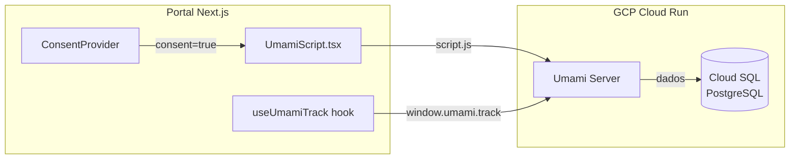

# Módulo: Umami Analytics

> Plataforma de analytics privacy-first, self-hosted no GCP Cloud Run.

!!! info "Por que não Google Analytics?"
    O Umami foi escolhido por ser **privacy-first** (sem cookies de terceiros), **LGPD-compliant** por design,
    **self-hosted** (dados no nosso GCP), e **open-source**. Não compartilha dados com terceiros.

## Visão Geral

O Umami é a plataforma de analytics do portal DestaquesGovBr. Ele coleta métricas de pageviews, eventos customizados e comportamento de navegação — tudo com respeito à privacidade do usuário e dependente de consentimento explícito.



---

## Dashboard

### Acesso

```bash
# Obter URL do dashboard
gcloud run services describe destaquesgovbr-umami \
  --region=southamerica-east1 \
  --format='value(status.url)'
```

!!! warning "Senha Padrão"
    Login padrão: `admin` / `umami`. **Altere a senha no primeiro acesso.**

### Métricas Disponíveis

- **Pageviews** — total e por página
- **Visitantes únicos** — por período
- **Duração da sessão** — tempo médio no site
- **Bounce rate** — taxa de rejeição
- **Referrers** — de onde vem o tráfego
- **Dispositivos** — browser, OS, tamanho de tela
- **Localização** — país e cidade (via IP, sem precisão de GPS)
- **Eventos customizados** — ações rastreadas via código

### Filtros

O dashboard permite filtrar por:

- Período (hoje, 7d, 30d, custom)
- Hostname (produção vs staging)
- URL/página específica
- Referrer, browser, OS, país

---

## Integração no Portal

### Componente `UmamiScript.tsx`

O script do Umami é carregado condicionalmente, apenas quando o usuário **aceita cookies**:

```typescript
// src/components/analytics/UmamiScript.tsx
'use client'
import Script from 'next/script'
import { useConsent } from '@/components/consent/ConsentProvider'

export function UmamiScript() {
  const { hasConsent } = useConsent()

  if (!UMAMI_WEBSITE_ID || !UMAMI_SCRIPT_URL || hasConsent !== true) {
    return null  // Não carrega sem consentimento
  }

  return (
    <Script
      src={UMAMI_SCRIPT_URL}
      data-website-id={UMAMI_WEBSITE_ID}
      strategy="afterInteractive"
    />
  )
}
```

### Variáveis de Ambiente

| Variável | Descrição |
|----------|-----------|
| `NEXT_PUBLIC_UMAMI_WEBSITE_ID` | ID do website cadastrado no Umami |
| `NEXT_PUBLIC_UMAMI_SCRIPT_URL` | URL do `script.js` do Umami |

Configurar no `.env.local` para desenvolvimento:

```bash
NEXT_PUBLIC_UMAMI_WEBSITE_ID=xxxxxxxx-xxxx-xxxx-xxxx-xxxxxxxxxxxx
NEXT_PUBLIC_UMAMI_SCRIPT_URL=https://destaquesgovbr-umami-xxx.run.app/script.js
```

---

## Tracking de Eventos Customizados

Além de pageviews automáticos, é possível rastrear eventos customizados usando o hook `useUmamiTrack`:

### Hook `useUmamiTrack`

```typescript
import { useUmamiTrack } from '@/components/analytics/useUmamiTrack'

function MeuComponente() {
  const { track } = useUmamiTrack()

  const handleClick = () => {
    track('botao_clicado', { secao: 'hero', variante: 'A' })
  }

  return <button onClick={handleClick}>Clique aqui</button>
}
```

### Exemplos de Eventos

```typescript
// Busca realizada
track('search', { query: 'saúde', results_count: 42 })

// Clique em artigo
track('article_click', { article_id: '123', origin: 'home' })

// Mudança de tema/filtro
track('filter_applied', { filter_type: 'theme', value: 'educação' })

// Compartilhamento
track('share', { platform: 'whatsapp', article_id: '456' })
```

### Integração com A/B Testing

O Umami também recebe eventos de experimentos do GrowthBook:

```typescript
// Rastreado automaticamente pelo tracking.ts
track('experiment_viewed', { experiment: 'hero-layout', variant: 'B' })
track('experiment_conversion', { experiment: 'hero-layout', variant: 'B', conversion: 'click' })
```

---

## Multi-site Tracking

O portal usa um **único Website ID** para todos os ambientes:

| Ambiente | Hostname |
|----------|----------|
| Produção | `destaquesgovbr-portal-xxx.run.app` |
| Staging | `destaquesgovbr-portal-staging-xxx.run.app` |
| Preview | `destaquesgovbr-portal-pr-NNN-xxx.run.app` |

Para filtrar dados de um ambiente específico, use o **filtro de hostname** no dashboard do Umami.

!!! note "Vantagem"
    Isso simplifica a configuração — o mesmo Website ID funciona em todos os ambientes sem
    necessidade de variáveis diferentes por ambiente.

---

## Links Relacionados

- [Umami Documentation](https://umami.is/docs) — docs oficiais
- [Umami API Reference](https://umami.is/docs/api) — API para consultas programáticas
- [Infra: Umami Setup](https://github.com/destaquesgovbr/infra/blob/main/docs/umami-setup.md) — configuração operacional
- [GrowthBook](growthbook.md) — A/B testing integrado com Umami
- [Portal](portal.md) — integração no frontend
