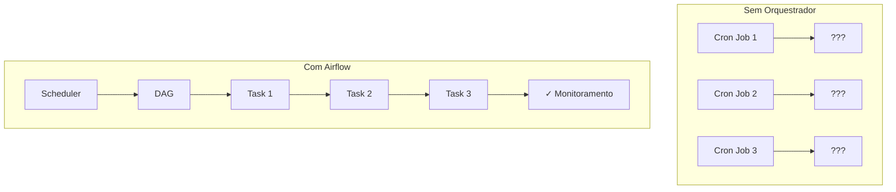
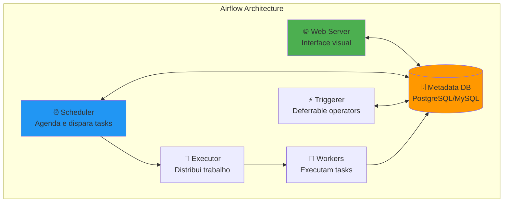
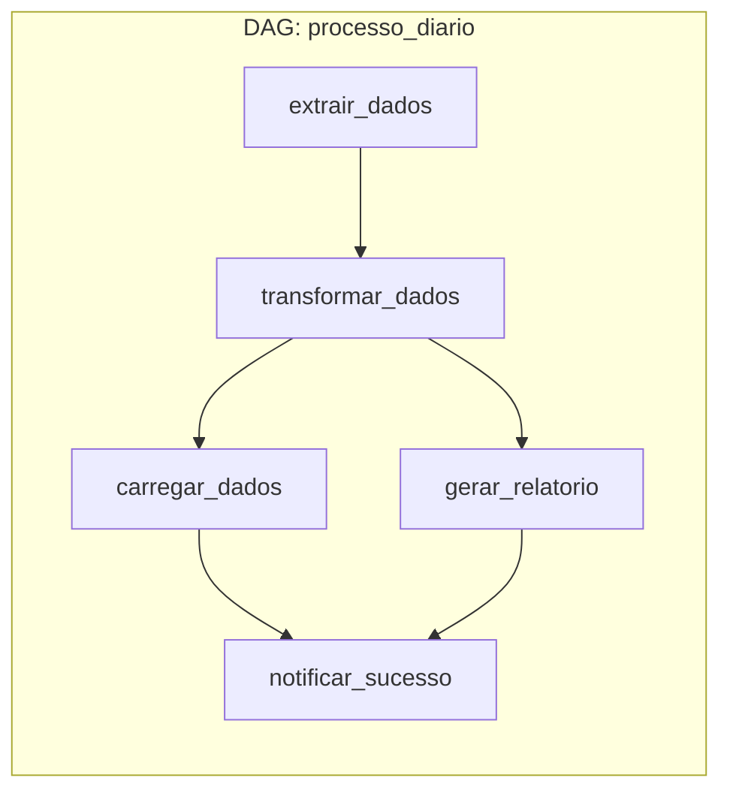
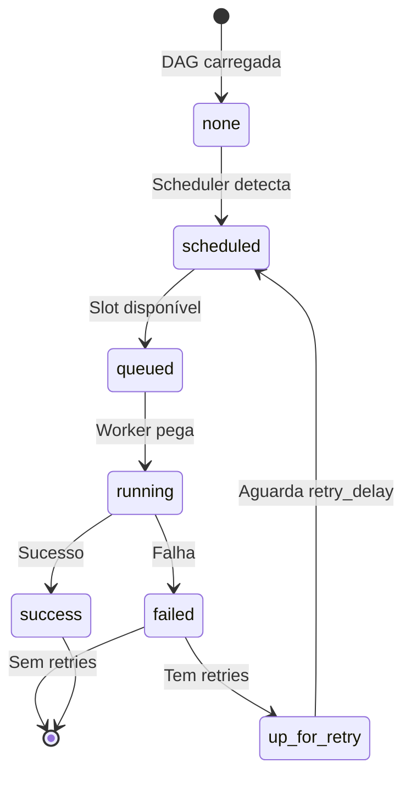
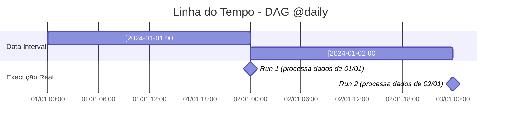
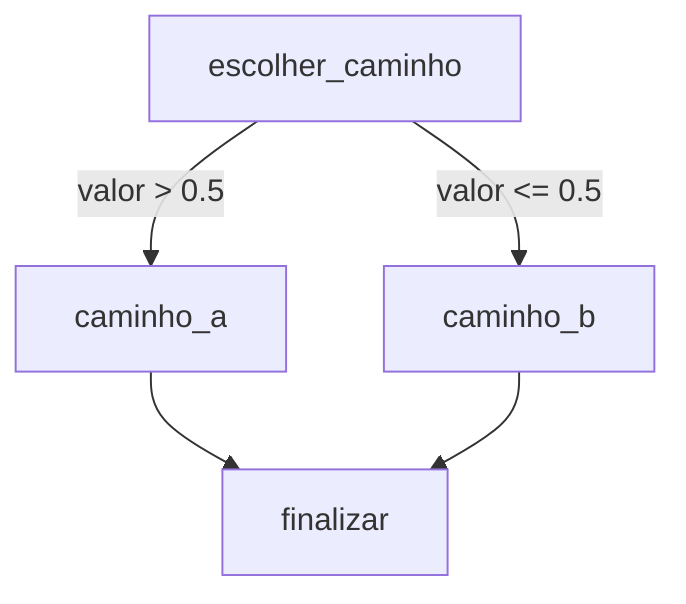
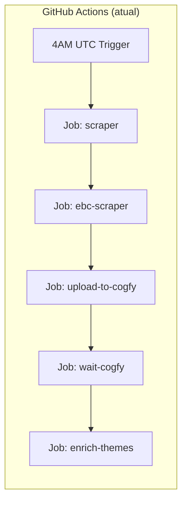
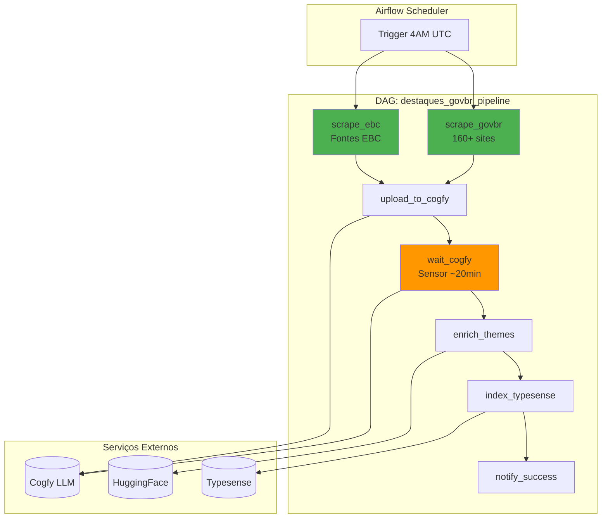

# Tutorial Apache Airflow

> Guia completo para desenvolvedores backend aprenderem Apache Airflow, desde conceitos básicos até a aplicação no DestaquesGovBr.

## Índice

1. [Introdução e Motivação](#introducao-e-motivacao)
2. [Arquitetura e Infraestrutura](#arquitetura-e-infraestrutura)
3. [Setup Local com Astro CLI](#setup-local-com-astro-cli)
4. [Conceitos Fundamentais](#conceitos-fundamentais)
5. [Operadores Essenciais](#operadores-essenciais)
6. [Conceitos Intermediários](#conceitos-intermediarios)
7. [Padrões Avançados](#padroes-avancados)
8. [Boas Práticas](#boas-praticas)
9. [Monitoramento e Debug](#monitoramento-e-debug)
10. [Aplicação no DestaquesGovBr](#aplicacao-no-destaquesgovbr)
11. [Exercícios Práticos](#exercicios-praticos)
12. [Glossário](#glossario)

---

## Introdução e Motivação

### O que é Apache Airflow?

Apache Airflow é uma plataforma open-source para **orquestração de workflows** e **pipelines de dados**. Criado pelo Airbnb em 2014 e doado à Apache Software Foundation em 2016, tornou-se o padrão de mercado para engenharia de dados.

**Principais características:**
- **Workflows como código** (Python)
- **Agendamento** flexível (cron-like)
- **Monitoramento** visual via interface web
- **Extensibilidade** através de operadores e plugins
- **Dependências** declarativas entre tarefas

### Por que Airflow para Pipelines de Dados?



| Problema | Solução Airflow |
|----------|-----------------|
| Scripts cron sem visibilidade | Interface web com histórico completo |
| Falhas silenciosas | Alertas, retries automáticos, logs centralizados |
| Dependências manuais | Dependências declarativas entre tasks |
| Difícil fazer backfill | Backfill nativo com controle de datas |
| Código espalhado | Workflows versionados como código Python |

### Comparação com Alternativas

| Ferramenta | Prós | Contras | Ideal para |
|------------|------|---------|------------|
| **Airflow** | Maduro, comunidade enorme, extensível, padrão de mercado | Curva de aprendizado inicial | Pipelines complexos, produção |
| **Prefect** | Moderno, Pythonic, cloud-native | Menos maduro, comunidade menor | Times pequenos, startups |
| **Dagster** | Type-safe, excelente DX, asset-centric | Comunidade menor, menos integrações | Data mesh, ML pipelines |
| **Luigi** | Simples, leve | Menos features, desenvolvimento lento | Pipelines simples |
| **GitHub Actions** | Já integrado ao CI/CD | Não foi feito para dados, sem backfill | CI/CD, não pipelines de dados |

**Por que escolhemos Airflow?**

1. **Maturidade** - 10+ anos de uso em produção
2. **Comunidade** - 35k+ stars no GitHub, milhares de contribuidores
3. **Ecossistema** - 200+ operadores prontos (AWS, GCP, Databricks, etc.)
4. **Astronomer** - Empresa dedicada com ferramentas excelentes (Astro CLI)
5. **Empregabilidade** - Skill mais requisitada em data engineering

---

## Arquitetura e Infraestrutura

### Componentes Principais



### Explicação dos Componentes

| Componente | Função | Tecnologia |
|------------|--------|------------|
| **Web Server** | Interface para visualização, monitoramento e operações manuais | Flask/Gunicorn |
| **Scheduler** | Lê DAGs, agenda execuções, cria task instances | Processo Python |
| **Executor** | Define como/onde as tasks serão executadas | LocalExecutor, CeleryExecutor, KubernetesExecutor |
| **Workers** | Processos que realmente executam o código das tasks | Celery workers ou pods K8s |
| **Triggerer** | Gerencia deferrable operators (async) - economiza recursos | Processo Python (Airflow 2.2+) |
| **Metadata DB** | Armazena estado de DAGs, tasks, variáveis, conexões | PostgreSQL (recomendado) ou MySQL |

### Modos de Execução (Executors)

| Executor | Descrição | Quando Usar |
|----------|-----------|-------------|
| **SequentialExecutor** | Uma task por vez, mesmo processo | Apenas testes/debug |
| **LocalExecutor** | Múltiplas tasks em paralelo, mesmo servidor | Desenvolvimento, ambientes pequenos |
| **CeleryExecutor** | Workers distribuídos via Celery + Redis/RabbitMQ | Produção com escala horizontal |
| **KubernetesExecutor** | Cada task em um pod isolado | Produção em K8s, isolamento máximo |

> **Para o DestaquesGovBr**: Usaremos **LocalExecutor** no ambiente local (Astro CLI) e **KubernetesExecutor** em produção (Astronomer Cloud ou GKE).

---

## Setup Local com Astro CLI

### O que é Astro CLI?

Astro CLI é a ferramenta oficial da [Astronomer](https://www.astronomer.io/) para desenvolvimento local com Airflow. Ela abstrai toda a complexidade de configurar Docker, bancos de dados e o Airflow em si.

### Pré-requisitos

| Ferramenta | Versão | Verificação |
|------------|--------|-------------|
| Docker | 24+ | `docker --version` |
| Docker Compose | 2.20+ | `docker compose version` |

### Instalação do Astro CLI

=== "macOS (Homebrew)"
    ```bash
    brew install astro
    ```

=== "Linux"
    ```bash
    curl -sSL install.astronomer.io | sudo bash -s
    ```

=== "Windows (WSL2)"
    ```bash
    curl -sSL install.astronomer.io | sudo bash -s
    ```

**Verificar instalação:**
```bash
astro version
# Astro CLI Version: 1.x.x
```

### Criando seu Primeiro Projeto

```bash
# Criar diretório do projeto
mkdir meu-projeto-airflow
cd meu-projeto-airflow

# Inicializar projeto Airflow
astro dev init
```

### Estrutura do Projeto

```
meu-projeto-airflow/
├── dags/                    # 📂 Suas DAGs vão aqui
│   └── example_dag.py       #    DAG de exemplo
├── include/                 # 📂 Arquivos auxiliares (SQL, configs)
├── plugins/                 # 📂 Plugins customizados
├── tests/                   # 📂 Testes das DAGs
│   └── dags/
│       └── test_dag_integrity.py
├── .astro/                  # 📂 Configurações Astro (não editar)
├── .dockerignore
├── .gitignore
├── Dockerfile               # 🐳 Imagem customizada
├── packages.txt             # 📦 Dependências de sistema (apt)
├── requirements.txt         # 📦 Dependências Python (pip)
└── airflow_settings.yaml    # ⚙️ Variables, Connections, Pools
```

### Comandos Principais

```bash
# Iniciar ambiente local (primeira vez demora ~2min)
astro dev start

# Acessar a UI: http://localhost:8080
# Login: admin / admin

# Parar ambiente
astro dev stop

# Reiniciar (após mudar requirements.txt ou Dockerfile)
astro dev restart

# Ver logs em tempo real
astro dev logs -f

# Entrar no container do scheduler (debug)
astro dev bash

# Executar comando dentro do container
astro dev run airflow dags list

# Rodar testes
astro dev pytest
```

### Adicionando Dependências

**Python (requirements.txt):**
```txt
pandas==2.1.0
requests==2.31.0
beautifulsoup4==4.12.0
```

**Sistema (packages.txt):**
```txt
libpq-dev
gcc
```

Após modificar, reinicie:
```bash
astro dev restart
```

---

## Conceitos Fundamentais

### DAG (Directed Acyclic Graph)

Uma DAG é o conceito central do Airflow - um grafo direcionado acíclico que define:
- **Quais tasks** executar
- **Em que ordem** (dependências)
- **Quando** executar (schedule)



### Anatomia de uma DAG

```python
from airflow import DAG
from airflow.operators.python import PythonOperator
from datetime import datetime, timedelta

# Argumentos padrão para todas as tasks da DAG
default_args = {
    'owner': 'data-team',
    'retries': 3,
    'retry_delay': timedelta(minutes=5),
    'email_on_failure': True,
    'email': ['alerts@destaquesgovbr.com'],
}

# Definição da DAG
with DAG(
    dag_id='minha_primeira_dag',           # Identificador único
    description='Minha primeira DAG',       # Descrição
    start_date=datetime(2024, 1, 1),        # Data de início
    schedule='@daily',                      # Agendamento (cron ou preset)
    catchup=False,                          # Não executar datas passadas
    tags=['tutorial', 'exemplo'],           # Tags para organização
    default_args=default_args,
) as dag:

    def extrair():
        print("Extraindo dados...")
        return {"registros": 100}

    def transformar(**context):
        # Acessar dados da task anterior via XCom
        dados = context['ti'].xcom_pull(task_ids='extrair')
        print(f"Transformando {dados['registros']} registros")

    # Definição das tasks
    task_extrair = PythonOperator(
        task_id='extrair',
        python_callable=extrair,
    )

    task_transformar = PythonOperator(
        task_id='transformar',
        python_callable=transformar,
    )

    # Definir dependências
    task_extrair >> task_transformar  # extrair roda antes de transformar
```

### Presets de Schedule

| Preset | Equivalente Cron | Descrição |
|--------|------------------|-----------|
| `@once` | - | Executa apenas uma vez |
| `@hourly` | `0 * * * *` | Todo início de hora |
| `@daily` | `0 0 * * *` | Todo dia à meia-noite |
| `@weekly` | `0 0 * * 0` | Todo domingo à meia-noite |
| `@monthly` | `0 0 1 * *` | Todo dia 1 à meia-noite |
| `@yearly` | `0 0 1 1 *` | Todo 1 de janeiro |
| `None` | - | Apenas trigger manual |

### Dependências entre Tasks

```python
# Usando operadores >> e <<
task_a >> task_b >> task_c  # A -> B -> C

# Equivalente com set_downstream/set_upstream
task_a.set_downstream(task_b)
task_b.set_downstream(task_c)

# Dependências paralelas
task_a >> [task_b, task_c] >> task_d
#     A
#    / \
#   B   C
#    \ /
#     D

# Dependências cruzadas
[task_a, task_b] >> [task_c, task_d]
# A e B devem terminar antes de C e D começarem
```

### Ciclo de Vida de uma Task



---

## Operadores Essenciais

### PythonOperator

Executa uma função Python.

```python
from airflow.operators.python import PythonOperator

def processar_dados(nome, **kwargs):
    """
    **kwargs recebe o contexto do Airflow automaticamente:
    - ti (TaskInstance)
    - ds (execution_date como string YYYY-MM-DD)
    - execution_date, etc.
    """
    print(f"Processando dados para {nome}")
    print(f"Data de execução: {kwargs['ds']}")
    return "resultado"  # Automaticamente salvo como XCom

task = PythonOperator(
    task_id='processar',
    python_callable=processar_dados,
    op_kwargs={'nome': 'DestaquesGovBr'},  # Argumentos extras
)
```

### BashOperator

Executa comandos shell.

```python
from airflow.operators.bash import BashOperator

# Comando simples
task_listar = BashOperator(
    task_id='listar_arquivos',
    bash_command='ls -la /tmp',
)

# Com templates Jinja
task_baixar = BashOperator(
    task_id='baixar_dados',
    bash_command='curl -o /tmp/dados_{{ ds }}.json https://api.exemplo.com/dados',
)

# Script externo
task_script = BashOperator(
    task_id='executar_script',
    bash_command='/opt/scripts/processar.sh {{ ds }} ',  # Espaço final importante!
)
```

### EmptyOperator

Placeholder para organização visual ou checkpoints.

```python
from airflow.operators.empty import EmptyOperator

inicio = EmptyOperator(task_id='inicio')
fim = EmptyOperator(task_id='fim')

inicio >> [task_a, task_b, task_c] >> fim
```

### Sensors

Aguardam uma condição ser satisfeita antes de prosseguir.

```python
from airflow.sensors.filesystem import FileSensor
from airflow.providers.http.sensors.http import HttpSensor

# Aguardar arquivo existir
sensor_arquivo = FileSensor(
    task_id='aguardar_arquivo',
    filepath='/data/input/dados.csv',
    poke_interval=60,      # Verificar a cada 60s
    timeout=3600,          # Timeout após 1 hora
    mode='poke',           # 'poke' (síncrono) ou 'reschedule' (libera slot)
)

# Aguardar API responder
sensor_api = HttpSensor(
    task_id='aguardar_api',
    http_conn_id='api_externa',
    endpoint='/health',
    response_check=lambda response: response.status_code == 200,
    poke_interval=30,
    timeout=600,
)
```

### Tabela de Operadores Comuns

| Operador | Uso | Provider |
|----------|-----|----------|
| `PythonOperator` | Funções Python | Core |
| `BashOperator` | Comandos shell | Core |
| `EmptyOperator` | Placeholder | Core |
| `HttpOperator` | Chamadas HTTP | `apache-airflow-providers-http` |
| `PostgresOperator` | Queries SQL | `apache-airflow-providers-postgres` |
| `S3ToGCSOperator` | Transferência S3→GCS | `apache-airflow-providers-google` |
| `DockerOperator` | Containers Docker | `apache-airflow-providers-docker` |
| `KubernetesPodOperator` | Pods K8s | `apache-airflow-providers-cncf-kubernetes` |

---

## Conceitos Intermediários

### execution_date e Data Intervals

O conceito mais importante (e confuso) do Airflow!



**Conceitos-chave:**

| Termo | Significado |
|-------|-------------|
| `data_interval_start` | Início do período de dados sendo processado |
| `data_interval_end` | Fim do período de dados |
| `logical_date` (antes: `execution_date`) | Igual a `data_interval_start` |
| **Execução real** | Acontece APÓS o `data_interval_end` |

**Exemplo prático:**
- DAG `@daily` com `start_date=2024-01-01`
- Dia 02/01 às 00:00: Airflow executa processando dados de 01/01
- `logical_date = 2024-01-01`
- `data_interval_start = 2024-01-01 00:00`
- `data_interval_end = 2024-01-02 00:00`

### Acessando Datas no Código

```python
from airflow.decorators import task

@task
def processar(**context):
    # Novas variáveis (Airflow 2.2+)
    data_interval_start = context['data_interval_start']  # pendulum datetime
    data_interval_end = context['data_interval_end']
    logical_date = context['logical_date']

    # Templates Jinja (strings)
    ds = context['ds']                  # "2024-01-01"
    ds_nodash = context['ds_nodash']    # "20240101"

    print(f"Processando dados de {data_interval_start} até {data_interval_end}")
```

**Templates Jinja em strings:**
```python
BashOperator(
    task_id='baixar',
    bash_command='wget https://api.com/dados?date={{ ds }}',
)
```

### Catchup e Backfill

**Catchup** (na DAG):
```python
with DAG(
    dag_id='minha_dag',
    start_date=datetime(2024, 1, 1),
    schedule='@daily',
    catchup=True,  # Default: True - executa todas as datas desde start_date
) as dag:
    ...
```

- `catchup=True`: Ao criar/ativar a DAG, executa todas as datas pendentes
- `catchup=False`: Só executa a partir de agora

**Backfill** (via CLI):
```bash
# Executar para um range de datas específico
astro dev run airflow dags backfill \
    -s 2024-01-01 \
    -e 2024-01-31 \
    minha_dag

# Só mostrar o que seria executado (dry-run)
astro dev run airflow dags backfill \
    -s 2024-01-01 \
    -e 2024-01-31 \
    --dry-run \
    minha_dag
```

### XComs (Cross-Communication)

Comunicação entre tasks dentro de uma DAG.

```python
from airflow.decorators import task, dag
from datetime import datetime

@dag(schedule='@daily', start_date=datetime(2024, 1, 1), catchup=False)
def pipeline_xcoms():

    @task
    def extrair():
        dados = [1, 2, 3, 4, 5]
        return dados  # Automaticamente salvo como XCom

    @task
    def transformar(dados):  # Recebe automaticamente com TaskFlow
        return [x * 2 for x in dados]

    @task
    def carregar(dados):
        print(f"Carregando: {dados}")

    # Encadeamento automático via TaskFlow
    dados_extraidos = extrair()
    dados_transformados = transformar(dados_extraidos)
    carregar(dados_transformados)

pipeline_xcoms()
```

**XCom tradicional (sem TaskFlow):**
```python
def extrair(**context):
    dados = [1, 2, 3]
    context['ti'].xcom_push(key='meus_dados', value=dados)

def transformar(**context):
    dados = context['ti'].xcom_pull(task_ids='extrair', key='meus_dados')
    # ou usar key='return_value' para o retorno da função
```

> ⚠️ **Atenção**: XComs são armazenados no banco de dados. Não use para dados grandes (>48KB)! Para dados grandes, use arquivos temporários ou object storage.

### Variables e Connections

**Variables** - Configurações globais:
```python
from airflow.models import Variable

# Definir via UI: Admin > Variables
# Ou via código:
api_key = Variable.get('COGFY_API_KEY')
config = Variable.get('scraper_config', deserialize_json=True)
```

**Connections** - Credenciais de sistemas externos:
```python
from airflow.hooks.base import BaseHook

# Definir via UI: Admin > Connections
# Ou via airflow_settings.yaml no Astro

conn = BaseHook.get_connection('postgres_destaquesgovbr')
print(conn.host, conn.port, conn.login)
```

**airflow_settings.yaml (Astro):**
```yaml
airflow:
  variables:
    - variable_name: ENVIRONMENT
      variable_value: development

  connections:
    - conn_id: postgres_destaquesgovbr
      conn_type: postgres
      conn_host: localhost
      conn_port: 5432
      conn_login: airflow
      conn_password: airflow
      conn_schema: destaquesgovbr
```

### TaskFlow API (@task decorator)

Forma moderna e mais Pythonic de escrever DAGs (Airflow 2.0+):

```python
from airflow.decorators import dag, task
from datetime import datetime

@dag(
    schedule='@daily',
    start_date=datetime(2024, 1, 1),
    catchup=False,
    tags=['taskflow', 'exemplo'],
)
def etl_taskflow():
    """DAG usando TaskFlow API - mais limpa e Pythonic."""

    @task
    def extract():
        """Extrai dados da fonte."""
        return {'usuarios': [1, 2, 3], 'total': 3}

    @task
    def transform(dados: dict):
        """Transforma os dados."""
        return {
            'usuarios_processados': [u * 10 for u in dados['usuarios']],
            'total': dados['total'],
        }

    @task
    def load(dados: dict):
        """Carrega no destino."""
        print(f"Carregando {dados['total']} usuários: {dados['usuarios_processados']}")

    # Encadeamento natural
    dados_brutos = extract()
    dados_transformados = transform(dados_brutos)
    load(dados_transformados)

# Instanciar a DAG
etl_taskflow()
```

---

## Padrões Avançados

### Branching (Execução Condicional)

```python
from airflow.decorators import dag, task
from airflow.operators.empty import EmptyOperator
from datetime import datetime
import random

@dag(schedule='@daily', start_date=datetime(2024, 1, 1), catchup=False)
def dag_branching():

    @task.branch
    def escolher_caminho():
        """Retorna o task_id da próxima task a executar."""
        valor = random.random()
        if valor > 0.5:
            return 'caminho_a'
        else:
            return 'caminho_b'

    @task
    def caminho_a():
        print("Executando caminho A")

    @task
    def caminho_b():
        print("Executando caminho B")

    @task(trigger_rule='none_failed_min_one_success')
    def finalizar():
        """Executa se pelo menos um caminho anterior teve sucesso."""
        print("Finalizando...")

    # Fluxo
    decisao = escolher_caminho()
    task_a = caminho_a()
    task_b = caminho_b()
    fim = finalizar()

    decisao >> [task_a, task_b] >> fim

dag_branching()
```



### Dynamic Task Mapping

Criar tasks dinamicamente baseado em dados (Airflow 2.3+):

```python
from airflow.decorators import dag, task
from datetime import datetime

@dag(schedule='@daily', start_date=datetime(2024, 1, 1), catchup=False)
def dag_dynamic_tasks():

    @task
    def get_lista_orgaos():
        """Retorna lista de órgãos para processar."""
        return [
            {'id': 1, 'nome': 'MEC'},
            {'id': 2, 'nome': 'MS'},
            {'id': 3, 'nome': 'MF'},
        ]

    @task
    def processar_orgao(orgao: dict):
        """Processa um órgão específico."""
        print(f"Processando {orgao['nome']} (ID: {orgao['id']})")
        return f"Processado: {orgao['nome']}"

    @task
    def consolidar(resultados: list):
        """Consolida todos os resultados."""
        print(f"Consolidando {len(resultados)} resultados")
        for r in resultados:
            print(f"  - {r}")

    # Dynamic mapping - cria N tasks automaticamente
    orgaos = get_lista_orgaos()
    resultados = processar_orgao.expand(orgao=orgaos)
    consolidar(resultados)

dag_dynamic_tasks()
```

### Task Groups

Organizar tasks visualmente:

```python
from airflow.decorators import dag, task, task_group
from datetime import datetime

@dag(schedule='@daily', start_date=datetime(2024, 1, 1), catchup=False)
def dag_task_groups():

    @task
    def inicio():
        print("Iniciando pipeline")

    @task_group(group_id='etl_govbr')
    def etl_govbr():
        @task
        def extract_govbr():
            return ['noticia1', 'noticia2']

        @task
        def transform_govbr(dados):
            return [d.upper() for d in dados]

        @task
        def load_govbr(dados):
            print(f"Carregando gov.br: {dados}")

        dados = extract_govbr()
        transformados = transform_govbr(dados)
        load_govbr(transformados)

    @task_group(group_id='etl_ebc')
    def etl_ebc():
        @task
        def extract_ebc():
            return ['ebc1', 'ebc2']

        @task
        def load_ebc(dados):
            print(f"Carregando EBC: {dados}")

        dados = extract_ebc()
        load_ebc(dados)

    @task
    def fim():
        print("Pipeline finalizado")

    inicio() >> [etl_govbr(), etl_ebc()] >> fim()

dag_task_groups()
```

### Trigger Rules

Controle quando uma task deve executar:

| Trigger Rule | Descrição |
|--------------|-----------|
| `all_success` (default) | Todas as tasks anteriores com sucesso |
| `all_failed` | Todas as tasks anteriores falharam |
| `all_done` | Todas terminaram (sucesso ou falha) |
| `one_success` | Pelo menos uma com sucesso |
| `one_failed` | Pelo menos uma falhou |
| `none_failed` | Nenhuma falhou (sucesso ou skipped) |
| `none_failed_min_one_success` | Nenhuma falhou E pelo menos uma com sucesso |
| `none_skipped` | Nenhuma foi skipped |
| `always` | Sempre executa |

```python
@task(trigger_rule='none_failed_min_one_success')
def task_de_limpeza():
    """Executa mesmo se algumas tasks anteriores foram skipped."""
    pass
```

---

## Boas Práticas

### ✅ Fazer

| Prática | Por quê |
|---------|---------|
| **DAGs idempotentes** | Executar múltiplas vezes com mesma data = mesmo resultado |
| **Tasks atômicas** | Cada task faz uma coisa bem |
| **Usar Connections** | Nunca hardcode credenciais no código |
| **Testar DAGs localmente** | `astro dev pytest` antes de deploy |
| **Versionar no Git** | DAGs são código, trate como tal |
| **Usar TaskFlow API** | Código mais limpo e Pythonic |
| **Nomear tasks claramente** | `extrair_noticias_govbr` > `task1` |
| **Documentar DAGs** | Docstrings aparecem na UI |

### ❌ Evitar

| Anti-pattern | Problema | Solução |
|--------------|----------|---------|
| **Código no top-level** | Executa a cada parse do scheduler | Mover para dentro de funções |
| **XComs grandes** | Sobrecarrega banco de dados | Usar arquivos/object storage |
| **Imports pesados no top-level** | Lentidão no parse | Import dentro das funções |
| **Dependências circulares** | DAG inválida | Redesenhar o fluxo |
| **Uma DAG gigante** | Difícil debug e manutenção | Quebrar em múltiplas DAGs |
| **Hardcode de datas** | Quebra backfill | Usar `{{ ds }}` templates |
| **Ignorar retries** | Falhas transientes param pipeline | Configurar retries adequados |

### Exemplo de DAG Bem Estruturada

```python
"""
DAG: scraper_noticias_govbr

Extrai notícias de gov.br diariamente.
Owner: data-team
"""
from airflow.decorators import dag, task
from airflow.models import Variable
from datetime import datetime, timedelta

# Configurações via Variables (não hardcoded)
DEFAULT_ARGS = {
    'owner': 'data-team',
    'retries': 3,
    'retry_delay': timedelta(minutes=5),
    'email_on_failure': True,
}

@dag(
    dag_id='scraper_noticias_govbr',
    description='Extrai notícias de gov.br diariamente',
    schedule='0 4 * * *',  # 4AM UTC
    start_date=datetime(2024, 1, 1),
    catchup=False,
    default_args=DEFAULT_ARGS,
    tags=['scraper', 'govbr', 'producao'],
    doc_md=__doc__,
)
def scraper_noticias_govbr():

    @task
    def extrair(data_interval_start=None, data_interval_end=None):
        # Import dentro da função - não sobrecarrega scheduler
        from meu_scraper import WebScraper

        scraper = WebScraper()
        return scraper.extrair(
            data_inicio=data_interval_start,
            data_fim=data_interval_end,
        )

    @task
    def validar(dados: list):
        if not dados:
            raise ValueError("Nenhum dado extraído!")
        return dados

    @task
    def carregar(dados: list):
        from meu_loader import Loader

        loader = Loader(conn_id='postgres_destaquesgovbr')
        loader.carregar(dados)

    # Pipeline
    dados = extrair()
    dados_validados = validar(dados)
    carregar(dados_validados)

scraper_noticias_govbr()
```

---

## Monitoramento e Debug

### Interface Web do Airflow

Acesse em `http://localhost:8080` (Astro local).

#### Views Principais

| View | O que mostra | Quando usar |
|------|--------------|-------------|
| **Grid** | Timeline de execuções por task | Visão geral de sucesso/falha |
| **Graph** | Grafo de dependências | Entender estrutura da DAG |
| **Calendar** | Histórico mensal | Identificar padrões de falha |
| **Gantt** | Timeline de duração | Identificar gargalos |
| **Code** | Código-fonte da DAG | Debug rápido |

#### Ações Comuns na UI

- **Trigger DAG**: Executar manualmente
- **Clear**: Limpar estado de tasks para re-executar
- **Mark Success/Failed**: Forçar estado
- **View Logs**: Ver output das tasks

### Logs

```bash
# Via Astro CLI
astro dev logs -f                    # Todos os logs
astro dev logs -f scheduler          # Só scheduler
astro dev logs -f webserver          # Só webserver

# Dentro do container
astro dev bash
cat ~/airflow/logs/dag_id=minha_dag/run_id=manual__2024-01-01/task_id=extrair/attempt=1.log
```

### Debug de Tasks

```bash
# Testar task isoladamente
astro dev run airflow tasks test minha_dag extrair 2024-01-01

# Listar DAGs
astro dev run airflow dags list

# Ver próximas execuções
astro dev run airflow dags next-execution minha_dag
```

### Callbacks para Alertas

```python
def alerta_falha(context):
    """Chamado quando task falha."""
    task_instance = context['task_instance']
    dag_id = context['dag'].dag_id

    # Enviar para Slack, email, etc.
    print(f"ALERTA: {dag_id}.{task_instance.task_id} falhou!")

def alerta_sucesso(context):
    """Chamado quando task tem sucesso."""
    print("Task executada com sucesso!")

@task(on_failure_callback=alerta_falha, on_success_callback=alerta_sucesso)
def task_com_alertas():
    pass
```

---

## Aplicação no DestaquesGovBr

### Contexto Atual

Atualmente o pipeline de scraping do DestaquesGovBr é orquestrado via **GitHub Actions**:



**Limitações do modelo atual:**
- Sem interface visual para monitoramento
- Backfill manual e complexo
- Logs espalhados entre runs
- Sem retry automático granular por step
- Difícil processar datas específicas

### Por que Migrar para Airflow?

| Aspecto | GitHub Actions | Airflow |
|---------|----------------|---------|
| **Backfill** | Manual, complexo | Nativo, um comando |
| **Monitoramento** | Logs por run | Dashboard visual |
| **Retries** | Por job inteiro | Por task granular |
| **Dependências** | Sequenciais simples | Grafo complexo |
| **Paralelismo** | Limitado | Dynamic mapping |
| **Histórico** | 90 dias | Ilimitado |

### Arquitetura Proposta



### DAG de Exemplo: Orquestração do Scraper

```python
"""
DAG: destaques_govbr_pipeline

Pipeline completo de scraping e enriquecimento de notícias governamentais.
Executa diariamente às 4AM UTC.

Owner: data-team
Documentação: https://destaquesgovbr.github.io/docs/workflows/scraper-pipeline/
"""
from airflow.decorators import dag, task
from airflow.models import Variable
from airflow.providers.http.sensors.http import HttpSensor
from datetime import datetime, timedelta
import logging

logger = logging.getLogger(__name__)

DEFAULT_ARGS = {
    'owner': 'data-team',
    'retries': 3,
    'retry_delay': timedelta(minutes=5),
    'email_on_failure': True,
    'email': ['alerts@destaquesgovbr.com'],
}

@dag(
    dag_id='destaques_govbr_pipeline',
    description='Pipeline de scraping e enriquecimento de notícias gov.br',
    schedule='0 4 * * *',  # 4AM UTC diariamente
    start_date=datetime(2024, 1, 1),
    catchup=False,
    default_args=DEFAULT_ARGS,
    tags=['scraper', 'destaques-govbr', 'producao'],
    doc_md=__doc__,
    max_active_runs=1,  # Apenas uma execução por vez
)
def destaques_govbr_pipeline():

    @task
    def scrape_govbr(data_interval_start=None, data_interval_end=None):
        """
        Executa scraping de ~160 sites gov.br.

        Usa WebScraper do repositório scraper.
        Salva resultados no HuggingFace Dataset.
        """
        # Import dentro da função para não sobrecarregar scheduler
        from govbrnews_scraper import WebScraper, DatasetManager

        logger.info(f"Iniciando scrape gov.br: {data_interval_start} - {data_interval_end}")

        scraper = WebScraper()
        noticias = scraper.run()

        dataset_manager = DatasetManager()
        dataset_manager.upload(noticias)

        logger.info(f"Scrape gov.br concluído: {len(noticias)} notícias")
        return {'fonte': 'govbr', 'total': len(noticias)}

    @task
    def scrape_ebc(data_interval_start=None, data_interval_end=None):
        """
        Executa scraping de fontes EBC (Agência Brasil, etc).
        """
        from govbrnews_scraper import EBCWebScraper, DatasetManager

        logger.info(f"Iniciando scrape EBC: {data_interval_start} - {data_interval_end}")

        scraper = EBCWebScraper()
        noticias = scraper.run()

        dataset_manager = DatasetManager()
        dataset_manager.upload(noticias)

        logger.info(f"Scrape EBC concluído: {len(noticias)} notícias")
        return {'fonte': 'ebc', 'total': len(noticias)}

    @task
    def upload_to_cogfy(resultados_scraping: list):
        """
        Faz upload das notícias para Cogfy para classificação via LLM.
        """
        from govbrnews_scraper import CogfyManager

        total = sum(r['total'] for r in resultados_scraping)
        logger.info(f"Enviando {total} notícias para Cogfy")

        cogfy = CogfyManager()
        batch_id = cogfy.upload_for_processing()

        logger.info(f"Upload Cogfy concluído. Batch ID: {batch_id}")
        return batch_id

    @task.sensor(
        poke_interval=60,  # Verificar a cada 60s
        timeout=2400,      # Timeout 40min (processamento ~20min + margem)
        mode='reschedule', # Libera slot enquanto aguarda
    )
    def wait_cogfy_processing(batch_id: str):
        """
        Aguarda processamento do Cogfy (~20 minutos).
        Usa Sensor para não bloquear workers.
        """
        from govbrnews_scraper import CogfyManager

        cogfy = CogfyManager()
        status = cogfy.check_batch_status(batch_id)

        logger.info(f"Status Cogfy: {status}")
        return status == 'completed'

    @task
    def enrich_themes():
        """
        Enriquece notícias com temas da árvore temática e sumários.
        """
        from govbrnews_scraper import EnrichmentManager

        logger.info("Iniciando enriquecimento de temas")

        enricher = EnrichmentManager()
        resultados = enricher.run()

        logger.info(f"Enriquecimento concluído: {resultados['processados']} notícias")
        return resultados

    @task
    def index_typesense(resultados_enriquecimento: dict):
        """
        Indexa notícias enriquecidas no Typesense.
        """
        from govbrnews_scraper import TypesenseIndexer

        logger.info("Iniciando indexação Typesense")

        indexer = TypesenseIndexer()
        indexer.run()

        logger.info("Indexação Typesense concluída")

    @task
    def notify_success():
        """
        Notifica sucesso do pipeline via Slack/Email.
        """
        logger.info("Pipeline executado com sucesso!")
        # TODO: Integrar com Slack/Email

    # === DEFINIÇÃO DO FLUXO ===

    # 1. Scraping em paralelo
    govbr_result = scrape_govbr()
    ebc_result = scrape_ebc()

    # 2. Upload para Cogfy (após ambos scrapers)
    batch_id = upload_to_cogfy([govbr_result, ebc_result])

    # 3. Aguardar processamento Cogfy
    cogfy_done = wait_cogfy_processing(batch_id)

    # 4. Enriquecimento (após Cogfy)
    enrichment_result = enrich_themes()

    # 5. Indexação
    index_typesense(enrichment_result)

    # 6. Notificação
    notify_success()

    # Dependências explícitas adicionais
    cogfy_done >> enrichment_result

# Instanciar a DAG
destaques_govbr_pipeline()
```

### Próximos Passos para Adoção

1. **Local**: Configurar Astro CLI no repositório scraper
2. **Adaptar**: Refatorar scripts atuais para formato task
3. **Testar**: Validar pipeline localmente com dados de teste
4. **Deploy**: Configurar Astronomer Cloud ou self-hosted no GKE
5. **Migrar**: Transição gradual de GitHub Actions para Airflow

---

## Exercícios Práticos

### Exercício 1: Hello World (Iniciante)

**Objetivo**: Criar sua primeira DAG.

```python
# dags/exercicio_01_hello.py
# Complete o código:

from airflow.decorators import dag, task
from datetime import datetime

@dag(
    dag_id='exercicio_01_hello',
    schedule=None,  # Apenas trigger manual
    start_date=datetime(2024, 1, 1),
    catchup=False,
    tags=['exercicio'],
)
def exercicio_01():

    @task
    def hello():
        # TODO: Imprima "Hello, Airflow!"
        pass

    hello()

exercicio_01()
```

**Passos:**
1. Crie o arquivo em `dags/exercicio_01_hello.py`
2. Complete a função `hello()`
3. Execute `astro dev start`
4. Acesse http://localhost:8080
5. Trigger a DAG manualmente
6. Verifique os logs

---

### Exercício 2: Tasks em Sequência (Iniciante)

**Objetivo**: Criar DAG com 3 tasks sequenciais.

```python
# dags/exercicio_02_sequencia.py
# Crie 3 tasks: extrair → transformar → carregar

from airflow.decorators import dag, task
from datetime import datetime

@dag(
    dag_id='exercicio_02_sequencia',
    schedule='@daily',
    start_date=datetime(2024, 1, 1),
    catchup=False,
    tags=['exercicio'],
)
def exercicio_02():

    @task
    def extrair():
        # TODO: Retorne uma lista de números [1, 2, 3, 4, 5]
        pass

    @task
    def transformar(dados):
        # TODO: Multiplique cada número por 2
        pass

    @task
    def carregar(dados):
        # TODO: Imprima os dados transformados
        pass

    # TODO: Conecte as tasks

exercicio_02()
```

---

### Exercício 3: XComs (Intermediário)

**Objetivo**: Passar dados entre tasks sem usar TaskFlow.

```python
# dags/exercicio_03_xcoms.py
# Use xcom_push e xcom_pull para passar dados

from airflow import DAG
from airflow.operators.python import PythonOperator
from datetime import datetime

def produtor(**context):
    dados = {'usuarios': 100, 'vendas': 5000}
    # TODO: Use context['ti'].xcom_push() para salvar dados
    pass

def consumidor(**context):
    # TODO: Use context['ti'].xcom_pull() para recuperar dados
    # TODO: Imprima os dados
    pass

with DAG(
    dag_id='exercicio_03_xcoms',
    schedule=None,
    start_date=datetime(2024, 1, 1),
    catchup=False,
    tags=['exercicio'],
) as dag:

    t1 = PythonOperator(
        task_id='produtor',
        python_callable=produtor,
    )

    t2 = PythonOperator(
        task_id='consumidor',
        python_callable=consumidor,
    )

    t1 >> t2
```

---

### Exercício 4: Branching (Intermediário)

**Objetivo**: Criar fluxo condicional.

```python
# dags/exercicio_04_branching.py
# Crie uma DAG que:
# - Verifica se é dia útil (segunda a sexta)
# - Se sim, executa "processar_relatorio"
# - Se não, executa "pular_processamento"
# - Ambos convergem para "finalizar"

from airflow.decorators import dag, task
from datetime import datetime

@dag(
    dag_id='exercicio_04_branching',
    schedule='@daily',
    start_date=datetime(2024, 1, 1),
    catchup=False,
    tags=['exercicio'],
)
def exercicio_04():

    @task.branch
    def verificar_dia(**context):
        # TODO: Verifique se execution_date é dia útil
        # Retorne 'processar_relatorio' ou 'pular_processamento'
        pass

    @task
    def processar_relatorio():
        print("Processando relatório...")

    @task
    def pular_processamento():
        print("Fim de semana - pulando processamento")

    @task(trigger_rule='none_failed_min_one_success')
    def finalizar():
        print("Finalizando DAG")

    # TODO: Conecte as tasks

exercicio_04()
```

---

### Exercício 5: Backfill (Avançado)

**Objetivo**: Processar dados históricos.

```python
# dags/exercicio_05_backfill.py
# Crie uma DAG que processa dados de uma data específica

from airflow.decorators import dag, task
from datetime import datetime

@dag(
    dag_id='exercicio_05_backfill',
    schedule='@daily',
    start_date=datetime(2024, 1, 1),
    catchup=True,  # Importante para backfill!
    tags=['exercicio'],
)
def exercicio_05():

    @task
    def processar_dia(ds=None, data_interval_start=None):
        """
        ds: string da data (YYYY-MM-DD)
        data_interval_start: datetime do início do intervalo
        """
        print(f"Processando dados de: {ds}")
        # Simule processamento baseado na data
        return {'data': ds, 'registros': 100}

    processar_dia()

exercicio_05()
```

**Comandos para testar:**
```bash
# Backfill de janeiro/2024
astro dev run airflow dags backfill \
    -s 2024-01-01 \
    -e 2024-01-31 \
    exercicio_05_backfill

# Verificar execuções
astro dev run airflow dags list-runs -d exercicio_05_backfill
```

---

## Glossário

| Termo | Definição |
|-------|-----------|
| **DAG** | Directed Acyclic Graph - definição de um workflow |
| **Task** | Unidade de trabalho dentro de uma DAG |
| **Operator** | Template de task (PythonOperator, BashOperator, etc.) |
| **Sensor** | Operator que aguarda uma condição |
| **XCom** | Mecanismo de comunicação entre tasks |
| **execution_date** | Data lógica de execução (deprecated, use logical_date) |
| **logical_date** | Data lógica de execução (= data_interval_start) |
| **data_interval** | Período de dados sendo processado |
| **Scheduler** | Componente que agenda e dispara execuções |
| **Executor** | Componente que define como tasks são executadas |
| **Worker** | Processo que executa as tasks |
| **Connection** | Credenciais de sistemas externos |
| **Variable** | Configuração global acessível por todas DAGs |
| **Backfill** | Re-executar DAG para datas passadas |
| **Catchup** | Executar automaticamente datas pendentes ao ativar DAG |
| **TaskFlow API** | Forma moderna de escrever DAGs com decorators |
| **Dynamic Task Mapping** | Criar tasks dinamicamente baseado em dados |
| **Task Group** | Agrupamento visual de tasks |
| **Trigger Rule** | Regra que define quando uma task pode executar |

---

## Recursos Adicionais

- [Documentação Oficial Airflow](https://airflow.apache.org/docs/)
- [Astronomer Learn](https://www.astronomer.io/docs/learn) - Tutoriais excelentes
- [Awesome Apache Airflow](https://github.com/jghoman/awesome-apache-airflow)
- [Airflow Summit](https://airflowsummit.org/) - Conferência anual

---

→ Voltar para [Roteiro de Onboarding](./roteiro-onboarding.md)

→ Próximo: [Setup Backend](./setup-backend.md)
