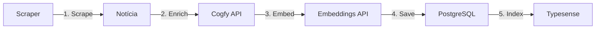
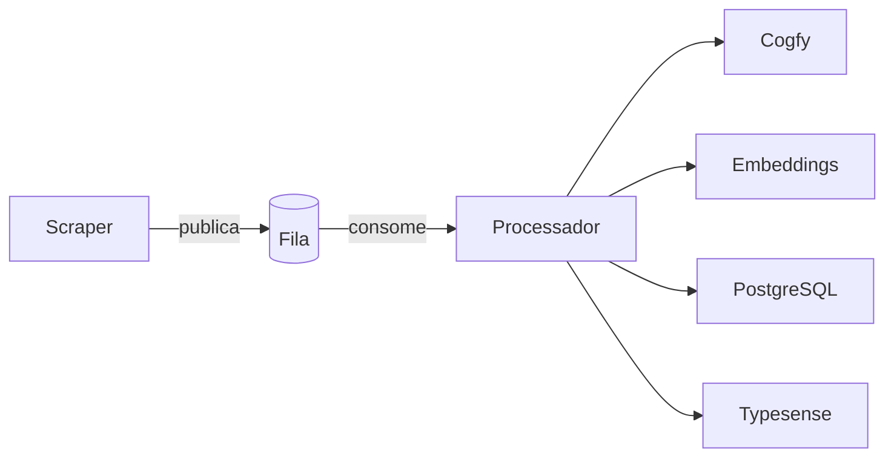
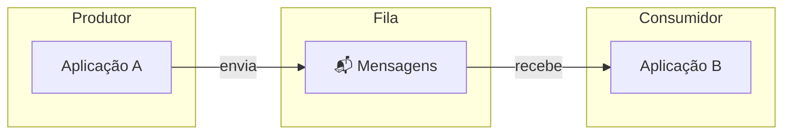
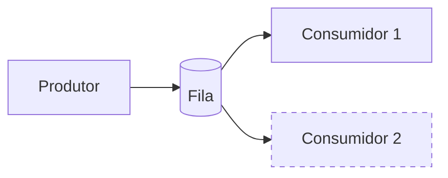
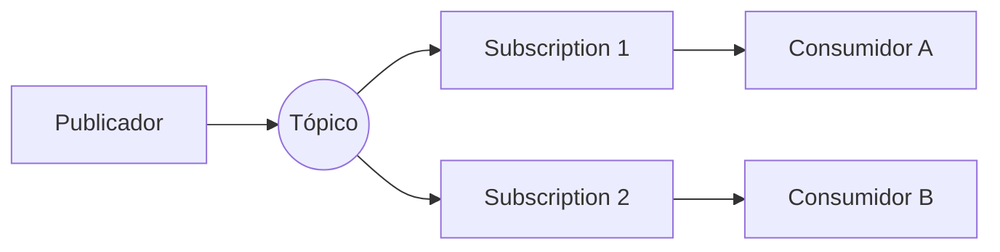
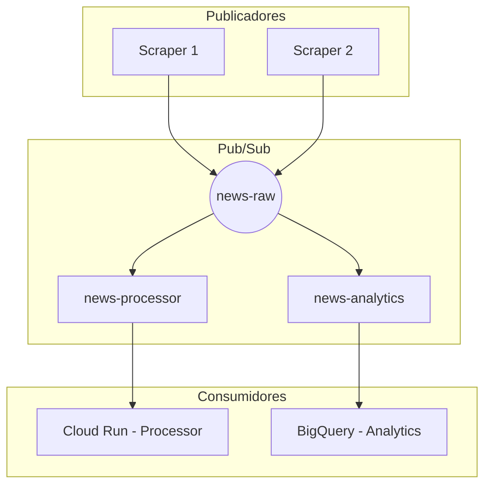
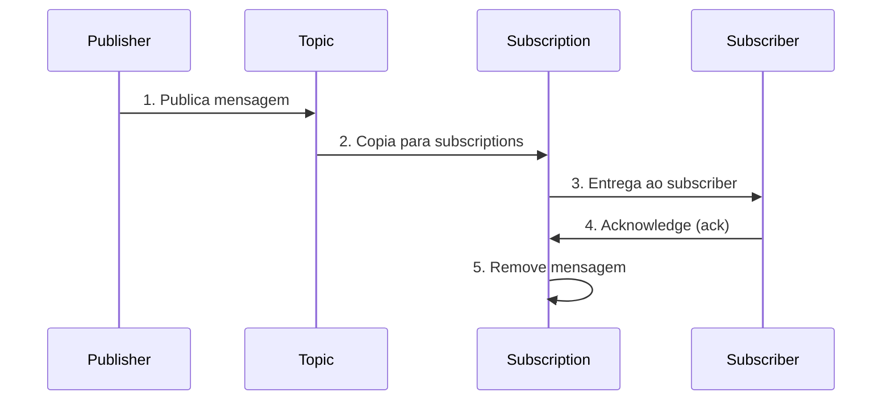
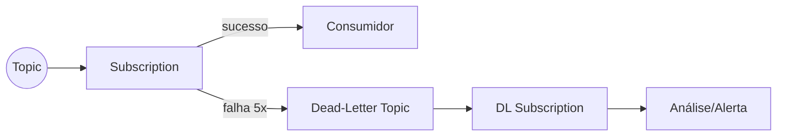
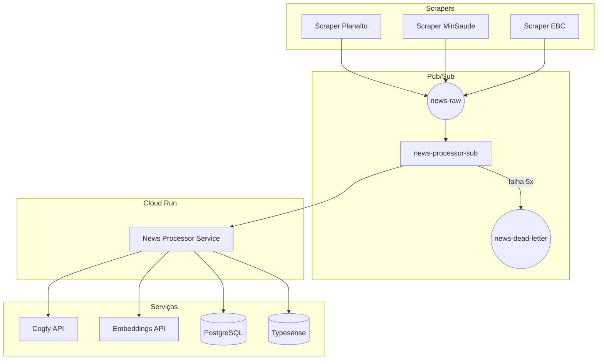

# Cloud Pub/Sub: Filas de Mensagens na Nuvem

> Guia completo para entender e usar Google Cloud Pub/Sub. Do zero ao intermediário, com linguagem simples e exercícios práticos no contexto do DestaquesGovbr.

---

## Objetivos de Aprendizado

Após completar este tutorial, você será capaz de:

- [ ] Entender o que são sistemas de mensageria e filas
- [ ] Explicar quando usar Pub/Sub vs outras soluções
- [ ] Configurar tópicos e subscriptions no GCP
- [ ] Publicar e consumir mensagens com Python
- [ ] Implementar retry e dead-letter queues
- [ ] Aplicar esses conceitos no data-platform

**Tempo estimado**: 4-6 horas

---

## Parte 1: Conceitos Fundamentais

### O Problema: Comunicação Síncrona

Imagine o pipeline atual do scraper:



**Problemas desse modelo:**

| Problema | Consequência |
|----------|--------------|
| Falha em qualquer etapa | Todo o processo falha |
| API lenta | Scraper fica bloqueado esperando |
| Pico de carga | Sistema sobrecarrega |
| Retry manual | Precisa reprocessar tudo |

Isso é chamado de **comunicação síncrona** - cada etapa espera a anterior terminar.

### A Solução: Mensageria Assíncrona

Com mensageria, as etapas se comunicam através de **filas**:



**Vantagens:**

| Antes | Depois |
|-------|--------|
| Falha = erro total | Falha = mensagem fica na fila para retry |
| Bloqueio esperando | Scraper publica e segue em frente |
| Escalabilidade vertical | Escalabilidade horizontal |
| Acoplamento forte | Desacoplamento entre serviços |

### O que é uma Fila de Mensagens?

Pense em uma **caixa de correio**:

1. Você escreve uma carta (mensagem)
2. Coloca na caixa de correio (fila)
3. O carteiro (consumidor) pega quando puder
4. Você não precisa esperar o carteiro



**Características principais:**

- **Assíncrona**: produtor não espera consumidor
- **Persistente**: mensagens sobrevivem a reinícios
- **Ordenada**: (geralmente) FIFO - primeiro a entrar, primeiro a sair
- **Confiável**: mensagens não se perdem

### Padrões de Mensageria

Existem dois padrões principais:

#### 1. Fila Ponto-a-Ponto (Queue)

Uma mensagem é consumida por **um único** consumidor:



> Consumidor 1 OU Consumidor 2 recebe cada mensagem, nunca ambos.

**Exemplo**: Processar pedidos - cada pedido deve ser processado uma vez só.

#### 2. Pub/Sub (Publish-Subscribe)

Uma mensagem é enviada para **múltiplos** consumidores:



> Consumidor A E Consumidor B recebem a mesma mensagem.

**Exemplo**: Notificação de nova notícia - sistema de busca E sistema de alertas recebem.

### Google Cloud Pub/Sub

O **Cloud Pub/Sub** é o serviço de mensageria do Google Cloud. Ele implementa o padrão Pub/Sub (como o nome sugere).



**Conceitos do Pub/Sub:**

| Conceito | Descrição | Analogia |
|----------|-----------|----------|
| **Topic** | Canal onde mensagens são publicadas | Rádio FM |
| **Subscription** | "Assinatura" que recebe cópias das mensagens | Ouvinte sintonizado |
| **Message** | Dados enviados (até 10MB) | Programa de rádio |
| **Publisher** | Quem envia mensagens ao tópico | DJ |
| **Subscriber** | Quem recebe mensagens da subscription | Ouvinte |

#### Fluxo de uma Mensagem



**Importante**: O subscriber deve enviar um **ack** (acknowledgment) para confirmar que processou a mensagem. Sem ack, a mensagem é reenviada após um tempo.

---

## Parte 2: Mão na Massa com GCP

### Pré-requisitos

Antes de começar, você precisa:

- [ ] Conta Google Cloud com acesso ao projeto `destaquesgovbr`
- [ ] `gcloud` CLI instalado ([instruções](https://cloud.google.com/sdk/docs/install))
- [ ] Python 3.11+ com Poetry
- [ ] Acesso ao repositório `data-platform`

### Configurando o Ambiente

#### 1. Autenticar no GCP

```bash
# Login no GCP
gcloud auth login

# Configurar projeto
gcloud config set project destaquesgovbr

# Autenticar para bibliotecas Python
gcloud auth application-default login
```

#### 2. Instalar Bibliotecas Python

```bash
# No repositório data-platform
poetry add google-cloud-pubsub
```

### Criando seu Primeiro Tópico

Vamos criar um tópico de testes para aprender:

#### Via Console Web

1. Acesse [console.cloud.google.com/cloudpubsub](https://console.cloud.google.com/cloudpubsub)
2. Clique em "Create Topic"
3. Nome: `tutorial-test-topic`
4. Marque "Add a default subscription"
5. Clique em "Create"

#### Via CLI

```bash
# Criar tópico
gcloud pubsub topics create tutorial-test-topic

# Criar subscription
gcloud pubsub subscriptions create tutorial-test-sub \
    --topic=tutorial-test-topic \
    --ack-deadline=60
```

#### Via Terraform (produção)

```hcl
resource "google_pubsub_topic" "tutorial_test" {
  name = "tutorial-test-topic"
}

resource "google_pubsub_subscription" "tutorial_test_sub" {
  name  = "tutorial-test-sub"
  topic = google_pubsub_topic.tutorial_test.name

  ack_deadline_seconds = 60
}
```

### Publicando Mensagens

Crie um arquivo `tutorial_publisher.py`:

```python
"""
Tutorial: Publicando mensagens no Pub/Sub.

Execute: python tutorial_publisher.py
"""

import json
from google.cloud import pubsub_v1

# Configuração
PROJECT_ID = "destaquesgovbr"
TOPIC_ID = "tutorial-test-topic"


def publish_message(data: dict) -> str:
    """
    Publica uma mensagem no tópico.

    Args:
        data: Dicionário com os dados da mensagem

    Returns:
        ID da mensagem publicada
    """
    # Cria o cliente publisher
    publisher = pubsub_v1.PublisherClient()

    # Monta o caminho completo do tópico
    topic_path = publisher.topic_path(PROJECT_ID, TOPIC_ID)

    # Converte dados para bytes (obrigatório)
    message_bytes = json.dumps(data).encode("utf-8")

    # Publica a mensagem
    # Atributos são metadados opcionais (úteis para filtros)
    future = publisher.publish(
        topic_path,
        message_bytes,
        source="tutorial",        # atributo customizado
        priority="normal",        # atributo customizado
    )

    # Aguarda confirmação e retorna o ID
    message_id = future.result()
    print(f"✅ Mensagem publicada: {message_id}")

    return message_id


def main():
    """Publica algumas mensagens de teste."""
    # Mensagem simples
    publish_message({
        "titulo": "Governo anuncia novo programa",
        "fonte": "planalto.gov.br",
        "timestamp": "2025-01-15T10:00:00Z",
    })

    # Outra mensagem
    publish_message({
        "titulo": "Ministério divulga relatório",
        "fonte": "gov.br/economia",
        "timestamp": "2025-01-15T11:00:00Z",
    })

    print("\n📤 Todas as mensagens publicadas!")


if __name__ == "__main__":
    main()
```

Execute:

```bash
python tutorial_publisher.py
```

### Consumindo Mensagens

Existem dois modos de consumir mensagens:

#### Modo Pull (Síncrono)

O subscriber "puxa" mensagens quando quiser:

```python
"""
Tutorial: Consumindo mensagens (modo Pull).

Execute: python tutorial_subscriber_pull.py
"""

import json
from google.cloud import pubsub_v1

PROJECT_ID = "destaquesgovbr"
SUBSCRIPTION_ID = "tutorial-test-sub"


def pull_messages(max_messages: int = 10) -> list:
    """
    Puxa mensagens da subscription.

    Args:
        max_messages: Número máximo de mensagens a puxar

    Returns:
        Lista de mensagens processadas
    """
    subscriber = pubsub_v1.SubscriberClient()
    subscription_path = subscriber.subscription_path(PROJECT_ID, SUBSCRIPTION_ID)

    # Pull síncrono
    response = subscriber.pull(
        request={
            "subscription": subscription_path,
            "max_messages": max_messages,
        }
    )

    messages = []
    ack_ids = []

    for received_message in response.received_messages:
        # Decodifica a mensagem
        data = json.loads(received_message.message.data.decode("utf-8"))
        print(f"📥 Recebido: {data}")

        messages.append(data)
        ack_ids.append(received_message.ack_id)

    # Confirma processamento (ack) de todas as mensagens
    if ack_ids:
        subscriber.acknowledge(
            request={
                "subscription": subscription_path,
                "ack_ids": ack_ids,
            }
        )
        print(f"\n✅ {len(ack_ids)} mensagens confirmadas (ack)")

    return messages


if __name__ == "__main__":
    print("Puxando mensagens...\n")
    messages = pull_messages()

    if not messages:
        print("Nenhuma mensagem na fila.")
```

#### Modo Push (Streaming)

O subscriber recebe mensagens automaticamente (mais eficiente para alta carga):

```python
"""
Tutorial: Consumindo mensagens (modo Streaming).

Execute: python tutorial_subscriber_stream.py
Pressione Ctrl+C para parar.
"""

import json
import time
from concurrent.futures import TimeoutError
from google.cloud import pubsub_v1

PROJECT_ID = "destaquesgovbr"
SUBSCRIPTION_ID = "tutorial-test-sub"


def callback(message: pubsub_v1.subscriber.message.Message) -> None:
    """
    Função chamada para cada mensagem recebida.

    Args:
        message: Mensagem do Pub/Sub
    """
    try:
        # Decodifica a mensagem
        data = json.loads(message.data.decode("utf-8"))

        # Acessa atributos (metadados)
        source = message.attributes.get("source", "unknown")
        priority = message.attributes.get("priority", "normal")

        print(f"📥 [{priority}] De {source}: {data}")

        # Simula processamento
        time.sleep(0.5)

        # Confirma que processou com sucesso
        message.ack()
        print("   ✅ Processado!")

    except Exception as e:
        print(f"   ❌ Erro: {e}")
        # Nack = mensagem será reenviada
        message.nack()


def main():
    """Inicia o subscriber em modo streaming."""
    subscriber = pubsub_v1.SubscriberClient()
    subscription_path = subscriber.subscription_path(PROJECT_ID, SUBSCRIPTION_ID)

    # Configura o subscriber
    flow_control = pubsub_v1.types.FlowControl(
        max_messages=10,           # Máximo de mensagens simultâneas
        max_bytes=10 * 1024 * 1024  # 10MB
    )

    # Inicia a subscription
    streaming_pull_future = subscriber.subscribe(
        subscription_path,
        callback=callback,
        flow_control=flow_control,
    )

    print(f"🎧 Escutando mensagens em {subscription_path}...")
    print("Pressione Ctrl+C para parar.\n")

    # Mantém o processo rodando
    try:
        streaming_pull_future.result()
    except TimeoutError:
        streaming_pull_future.cancel()
        streaming_pull_future.result()
    except KeyboardInterrupt:
        streaming_pull_future.cancel()
        print("\n👋 Subscriber encerrado.")


if __name__ == "__main__":
    main()
```

### Exercício 1: Publicar e Consumir

1. Em um terminal, rode o subscriber streaming:
   ```bash
   python tutorial_subscriber_stream.py
   ```

2. Em outro terminal, publique mensagens:
   ```bash
   python tutorial_publisher.py
   ```

3. Observe as mensagens chegando no subscriber.

---

## Parte 3: Recursos Avançados

### Dead-Letter Queues

Mensagens que falham repetidamente são enviadas para uma fila especial:



#### Configurando Dead-Letter

```bash
# Criar tópico de dead-letter
gcloud pubsub topics create news-dead-letter

# Criar subscription com dead-letter
gcloud pubsub subscriptions create news-processor \
    --topic=news-raw \
    --dead-letter-topic=news-dead-letter \
    --max-delivery-attempts=5 \
    --ack-deadline=60
```

### Retry Policy

Configure quanto tempo esperar entre tentativas:

```bash
gcloud pubsub subscriptions update news-processor \
    --min-retry-delay=10s \
    --max-retry-delay=600s
```

Isso cria um **exponential backoff**:

| Tentativa | Delay |
|-----------|-------|
| 1ª | 10s |
| 2ª | 20s |
| 3ª | 40s |
| 4ª | 80s |
| 5ª | 160s |
| 6ª+ | 600s (máximo) |

### Ordenação de Mensagens

Por padrão, Pub/Sub não garante ordem. Para garantir, use **ordering keys**:

```python
# Publicar com ordering key
publisher.publish(
    topic_path,
    message_bytes,
    ordering_key="agency-planalto",  # Mensagens com mesma key são ordenadas
)
```

### Filtragem de Mensagens

Crie subscriptions que recebem apenas mensagens específicas:

```bash
# Subscription que só recebe mensagens do Planalto
gcloud pubsub subscriptions create news-planalto-only \
    --topic=news-raw \
    --message-filter='attributes.agency="planalto"'
```

### Monitoramento

#### Via Console

- [Pub/Sub Monitoring](https://console.cloud.google.com/cloudpubsub/topic/list)
- Métricas: mensagens não-acked, latência, throughput

#### Métricas Importantes

| Métrica | O que significa | Ação se alto |
|---------|-----------------|--------------|
| `unacked_messages` | Mensagens aguardando processamento | Escalar consumidores |
| `oldest_unacked_age` | Idade da mensagem mais antiga | Verificar se consumidor está travado |
| `dead_letter_messages` | Mensagens que falharam | Investigar erros |

---

## Parte 4: Aplicação no Data-Platform

### Arquitetura Proposta



### Estrutura de Mensagem

```json
{
  "unique_id": "abc123def456",
  "agency": "planalto",
  "agency_name": "Palácio do Planalto",
  "title": "Governo anuncia novo programa social",
  "url": "https://planalto.gov.br/noticias/...",
  "content": "O presidente anunciou hoje...",
  "published_at": "2025-01-15T10:00:00-03:00",
  "extracted_at": "2025-01-15T10:05:00-03:00",
  "image_url": "https://...",
  "category": "Economia",
  "tags": ["economia", "social"]
}
```

### Modificando o ScrapeManager

```python
# Antes (scrape_manager.py)
def _process_and_upload_data(self, new_data, allow_update: bool):
    new_data = self._preprocess_data(new_data)
    self.dataset_manager.insert(new_data, allow_update=allow_update)

# Depois
def _process_and_upload_data(self, new_data, allow_update: bool):
    new_data = self._preprocess_data(new_data)
    # Publica na fila em vez de inserir direto
    self.news_publisher.publish(new_data)
```

### NewsPublisher

```python
"""
Publisher de notícias para o Pub/Sub.

src/data_platform/queue/publisher.py
"""

import json
import logging
from typing import List, Dict, Any

from google.cloud import pubsub_v1

logger = logging.getLogger(__name__)


class NewsPublisher:
    """Publica notícias brutas para processamento assíncrono."""

    def __init__(
        self,
        project_id: str = "destaquesgovbr",
        topic_id: str = "news-raw",
    ):
        self.publisher = pubsub_v1.PublisherClient()
        self.topic_path = self.publisher.topic_path(project_id, topic_id)

    def publish(self, news_items: List[Dict[str, Any]]) -> List[str]:
        """
        Publica lista de notícias na fila.

        Args:
            news_items: Lista de dicionários com dados das notícias

        Returns:
            Lista de message IDs publicados
        """
        futures = []

        for item in news_items:
            data = json.dumps(item, ensure_ascii=False, default=str)
            message_bytes = data.encode("utf-8")

            future = self.publisher.publish(
                self.topic_path,
                message_bytes,
                agency=item.get("agency", "unknown"),
                source="scraper",
            )
            futures.append(future)

        # Aguarda confirmação de todas
        message_ids = []
        for future in futures:
            try:
                message_id = future.result(timeout=30)
                message_ids.append(message_id)
            except Exception as e:
                logger.error(f"Erro publicando mensagem: {e}")

        logger.info(f"Publicadas {len(message_ids)}/{len(news_items)} mensagens")
        return message_ids

    def publish_single(self, news_item: Dict[str, Any]) -> str:
        """Publica uma única notícia."""
        return self.publish([news_item])[0]
```

### NewsProcessor

```python
"""
Processador de notícias do Pub/Sub.

src/data_platform/queue/processor.py
"""

import json
import logging
from typing import Dict, Any

from google.cloud import pubsub_v1

from data_platform.managers.postgres_manager import PostgresManager
from data_platform.jobs.embeddings.embedding_generator import EmbeddingGenerator
from data_platform.typesense import get_client, index_documents

logger = logging.getLogger(__name__)


class NewsProcessor:
    """Processa notícias: enrichment → embeddings → PG → Typesense."""

    def __init__(
        self,
        project_id: str = "destaquesgovbr",
        subscription_id: str = "news-raw-processor",
    ):
        self.subscriber = pubsub_v1.SubscriberClient()
        self.subscription_path = self.subscriber.subscription_path(
            project_id, subscription_id
        )

        # Inicializa serviços
        self.postgres = PostgresManager()
        self.embeddings = EmbeddingGenerator()
        self.typesense_client = get_client()

    def process_message(self, message: pubsub_v1.subscriber.message.Message) -> None:
        """
        Processa uma mensagem da fila.

        Args:
            message: Mensagem do Pub/Sub
        """
        unique_id = "unknown"
        try:
            # Decodifica a mensagem
            news_data = json.loads(message.data.decode("utf-8"))
            unique_id = news_data.get("unique_id", "unknown")

            logger.info(f"Processando: {unique_id}")

            # 1. Enrichment de tema (TODO: integrar Cogfy)
            # enriched = self.enrichment.enrich_single(news_data)
            enriched = news_data  # Por enquanto, sem enrichment

            # 2. Gera embedding
            embedding = self._generate_embedding(enriched)
            if embedding:
                enriched["content_embedding"] = embedding

            # 3. Insere no PostgreSQL
            self._save_to_postgres(enriched)

            # 4. Indexa no Typesense
            self._index_to_typesense(enriched)

            # Confirma processamento
            message.ack()
            logger.info(f"✅ Processado: {unique_id}")

        except Exception as e:
            logger.error(f"❌ Erro processando {unique_id}: {e}")
            # Nack = mensagem será reenviada
            message.nack()

    def _generate_embedding(self, news: Dict[str, Any]) -> list | None:
        """Gera embedding para a notícia."""
        try:
            text = self.embeddings._prepare_text_for_embedding(
                title=news.get("title", ""),
                summary=news.get("summary"),
                content=news.get("content"),
            )
            embeddings = self.embeddings._generate_embeddings_batch([text])
            return embeddings[0].tolist()
        except Exception as e:
            logger.warning(f"Erro gerando embedding: {e}")
            return None

    def _save_to_postgres(self, news: Dict[str, Any]) -> None:
        """Salva notícia no PostgreSQL."""
        from data_platform.models.news import NewsInsert

        news_insert = NewsInsert(
            unique_id=news["unique_id"],
            agency_key=news.get("agency"),
            title=news.get("title"),
            url=news.get("url"),
            content=news.get("content"),
            # ... outros campos
        )
        self.postgres.insert([news_insert], allow_update=True)

    def _index_to_typesense(self, news: Dict[str, Any]) -> None:
        """Indexa notícia no Typesense."""
        import pandas as pd
        from data_platform.typesense import index_documents

        df = pd.DataFrame([news])
        index_documents(self.typesense_client, df, mode="incremental", force=True)

    def start(self) -> None:
        """Inicia o processador em modo streaming."""
        logger.info(f"🎧 Iniciando processador: {self.subscription_path}")

        streaming_pull_future = self.subscriber.subscribe(
            self.subscription_path,
            callback=self.process_message,
        )

        try:
            streaming_pull_future.result()
        except KeyboardInterrupt:
            streaming_pull_future.cancel()
            logger.info("Processador encerrado.")
        finally:
            self.postgres.close_all()
```

---

## Parte 5: Exercícios Práticos

### Exercício 2: Criar Tópico e Subscription

1. Crie um tópico chamado `{seu-nome}-test-topic`
2. Crie uma subscription para ele
3. Publique 5 mensagens
4. Consuma as mensagens e confirme o ack

### Exercício 3: Simular Falhas

1. Modifique o subscriber para falhar (nack) em mensagens que contenham "erro"
2. Configure uma dead-letter queue
3. Publique mensagens com e sem "erro"
4. Verifique quais foram para a dead-letter

### Exercício 4: Monitoramento

1. Acesse o console do Pub/Sub
2. Publique 100 mensagens sem consumidor ativo
3. Observe a métrica `unacked_messages` subir
4. Inicie o consumidor e observe a métrica descer

### Exercício 5: Integração com Data-Platform

1. Clone o branch da issue #19
2. Rode os testes do NewsPublisher
3. Publique uma notícia de teste
4. Verifique se foi processada corretamente

---

## Limpeza

Após os exercícios, limpe os recursos de teste:

```bash
# Deletar subscription
gcloud pubsub subscriptions delete tutorial-test-sub

# Deletar tópico
gcloud pubsub topics delete tutorial-test-topic
```

---

## Resumo de Comandos

| Comando | O que faz |
|---------|-----------|
| `gcloud pubsub topics create NOME` | Cria tópico |
| `gcloud pubsub topics list` | Lista tópicos |
| `gcloud pubsub topics delete NOME` | Deleta tópico |
| `gcloud pubsub subscriptions create NOME --topic=TOPICO` | Cria subscription |
| `gcloud pubsub subscriptions list` | Lista subscriptions |
| `gcloud pubsub subscriptions pull SUB --limit=10` | Puxa mensagens (CLI) |

---

## Troubleshooting

### "Permission denied" ao publicar/consumir

```bash
# Verifique se está autenticado
gcloud auth list

# Reautentique
gcloud auth application-default login
```

### Mensagens não chegam no subscriber

1. Verifique se a subscription está vinculada ao tópico correto
2. Verifique se não há filtros configurados
3. Verifique a métrica `unacked_messages`

### Mensagens sendo reenviadas infinitamente

1. Verifique se o `message.ack()` está sendo chamado
2. Verifique se não há exceções silenciosas
3. Configure uma dead-letter queue

---

## Próximos Passos

Após completar este tutorial:

1. **Implementar** a issue [#19 - Arquitetura de Filas](https://github.com/destaquesgovbr/data-platform/issues/19)
2. **Aprofundar** em Cloud Run + Pub/Sub
3. **Estudar** outros serviços GCP (Cloud Functions, Cloud Tasks)

---

## Recursos Adicionais

- [Documentação oficial do Cloud Pub/Sub](https://cloud.google.com/pubsub/docs)
- [Pub/Sub Python Client](https://cloud.google.com/python/docs/reference/pubsub/latest)
- [Patterns & Best Practices](https://cloud.google.com/pubsub/docs/subscriber)
- [Pricing Calculator](https://cloud.google.com/products/calculator)

---

> **Precisa de ajuda?** Consulte o [Troubleshooting](troubleshooting.md) ou pergunte no canal do time.
