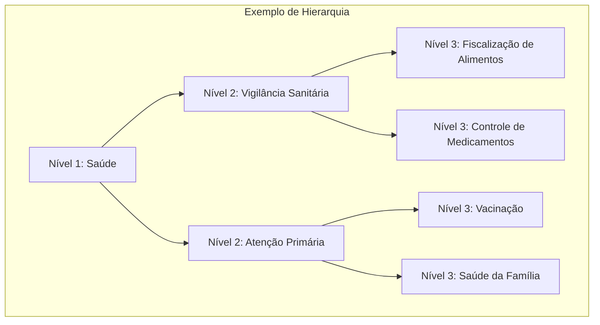

# Análise Temática do Dataset GovBrNews

> Parte 2 do guia de exploração do dataset - Análise de distribuição por tema, temporal e por órgão governamental.

---

**Nível**: Intermediário
**Tempo estimado**: 45-60 minutos
**Pré-requisitos**: Conclusão da [Parte 1](./index.md), Python com Pandas

---

## Parte 2: Análise Temática (Intermediário)

### Distribuição por Tema

O dataset usa um sistema de classificação hierárquica com 3 níveis:



#### Análise de Temas por Nível

```python
import matplotlib.pyplot as plt
import seaborn as sns

# Configurar estilo
plt.style.use('seaborn-v0_8-whitegrid')
fig, axes = plt.subplots(1, 3, figsize=(18, 6))

# Nível 1
theme_1 = df['theme_1_level_1'].value_counts().head(10)
theme_1.plot(kind='barh', ax=axes[0], color='steelblue')
axes[0].set_title('Top 10 Temas - Nível 1')
axes[0].set_xlabel('Quantidade de Notícias')

# Nível 2
theme_2 = df['theme_1_level_2'].value_counts().head(10)
theme_2.plot(kind='barh', ax=axes[1], color='coral')
axes[1].set_title('Top 10 Temas - Nível 2')
axes[1].set_xlabel('Quantidade de Notícias')

# Nível 3
theme_3 = df['theme_1_level_3'].value_counts().head(10)
theme_3.plot(kind='barh', ax=axes[2], color='seagreen')
axes[2].set_title('Top 10 Temas - Nível 3')
axes[2].set_xlabel('Quantidade de Notícias')

plt.tight_layout()
plt.savefig('distribuicao_temas.png', dpi=150, bbox_inches='tight')
plt.show()
```

#### Visualização Interativa com Altair

```python
import altair as alt

# Preparar dados
theme_counts = df['theme_1_level_1'].value_counts().reset_index()
theme_counts.columns = ['tema', 'quantidade']

# Criar gráfico interativo
chart = alt.Chart(theme_counts).mark_bar().encode(
    x=alt.X('quantidade:Q', title='Quantidade de Notícias'),
    y=alt.Y('tema:N', sort='-x', title='Tema'),
    color=alt.Color('quantidade:Q', scale=alt.Scale(scheme='blues')),
    tooltip=['tema', 'quantidade']
).properties(
    title='Distribuição de Notícias por Tema (Nível 1)',
    width=600,
    height=400
).interactive()

chart.save('distribuicao_temas_interativo.html')
chart
```

#### Treemap com Plotly

```python
import plotly.express as px

# Preparar dados hierárquicos
df_treemap = df.groupby(
    ['theme_1_level_1', 'theme_1_level_2']
).size().reset_index(name='count')

fig = px.treemap(
    df_treemap,
    path=['theme_1_level_1', 'theme_1_level_2'],
    values='count',
    title='Hierarquia Temática das Notícias',
    color='count',
    color_continuous_scale='Blues'
)

fig.update_layout(width=900, height=600)
fig.write_html('treemap_temas.html')
fig.show()
```

### Análise Temporal

#### Tendências por Mês/Ano

```python
# Extrair componentes temporais
df['year'] = df['published_at'].dt.year
df['month'] = df['published_at'].dt.month
df['year_month'] = df['published_at'].dt.to_period('M')

# Publicações por mês
monthly_counts = df.groupby('year_month').size()

# Visualizar com Matplotlib
fig, ax = plt.subplots(figsize=(14, 6))
monthly_counts.plot(kind='line', ax=ax, color='steelblue', linewidth=2)
ax.set_title('Volume de Publicações ao Longo do Tempo')
ax.set_xlabel('Período')
ax.set_ylabel('Quantidade de Notícias')
ax.fill_between(range(len(monthly_counts)), monthly_counts.values, alpha=0.3)
plt.xticks(rotation=45)
plt.tight_layout()
plt.savefig('tendencia_temporal.png', dpi=150, bbox_inches='tight')
plt.show()
```

#### Heatmap de Publicações por Tema e Ano

```python
# Criar tabela pivot
pivot_tema_ano = df.pivot_table(
    index='theme_1_level_1',
    columns='year',
    values='unique_id',
    aggfunc='count',
    fill_value=0
)

# Heatmap com Seaborn
fig, ax = plt.subplots(figsize=(12, 10))
sns.heatmap(
    pivot_tema_ano,
    annot=True,
    fmt='d',
    cmap='YlOrRd',
    ax=ax,
    cbar_kws={'label': 'Quantidade'}
)
ax.set_title('Publicações por Tema e Ano')
ax.set_xlabel('Ano')
ax.set_ylabel('Tema')
plt.tight_layout()
plt.savefig('heatmap_tema_ano.png', dpi=150, bbox_inches='tight')
plt.show()
```

#### Visualização Temporal Interativa com Plotly

```python
import plotly.express as px

# Preparar dados mensais por tema
df['year_month_str'] = df['year_month'].astype(str)
monthly_by_theme = df.groupby(
    ['year_month_str', 'theme_1_level_1']
).size().reset_index(name='count')

# Top 5 temas para visualização
top_themes = df['theme_1_level_1'].value_counts().head(5).index.tolist()
monthly_top = monthly_by_theme[
    monthly_by_theme['theme_1_level_1'].isin(top_themes)
]

fig = px.line(
    monthly_top,
    x='year_month_str',
    y='count',
    color='theme_1_level_1',
    title='Evolução Temporal dos Top 5 Temas',
    labels={
        'year_month_str': 'Período',
        'count': 'Quantidade',
        'theme_1_level_1': 'Tema'
    }
)

fig.update_layout(width=1000, height=500, xaxis_tickangle=-45)
fig.write_html('evolucao_temas.html')
fig.show()
```

### Análise por Órgão Governamental

#### Distribuição de Publicações por Órgão

```python
# Top 20 órgãos
top_agencies = df['agency'].value_counts().head(20)

fig, ax = plt.subplots(figsize=(12, 8))
top_agencies.plot(kind='barh', ax=ax, color='darkblue')
ax.set_title('Top 20 Órgãos por Volume de Publicações')
ax.set_xlabel('Quantidade de Notícias')
ax.set_ylabel('Órgão')
ax.invert_yaxis()

# Adicionar valores nas barras
for i, v in enumerate(top_agencies.values):
    ax.text(v + 100, i, f'{v:,}', va='center', fontsize=9)

plt.tight_layout()
plt.savefig('top_orgaos.png', dpi=150, bbox_inches='tight')
plt.show()
```

#### Matriz Órgão x Tema

```python
# Top 10 órgãos e temas
top_10_agencies = df['agency'].value_counts().head(10).index.tolist()
top_10_themes = df['theme_1_level_1'].value_counts().head(10).index.tolist()

# Filtrar dados
df_filtered = df[
    (df['agency'].isin(top_10_agencies)) &
    (df['theme_1_level_1'].isin(top_10_themes))
]

# Criar matriz
matrix = df_filtered.pivot_table(
    index='agency',
    columns='theme_1_level_1',
    values='unique_id',
    aggfunc='count',
    fill_value=0
)

# Heatmap
fig, ax = plt.subplots(figsize=(14, 10))
sns.heatmap(
    matrix,
    annot=True,
    fmt='d',
    cmap='Blues',
    ax=ax,
    linewidths=0.5
)
ax.set_title('Matriz: Órgão x Tema (Top 10)')
plt.xticks(rotation=45, ha='right')
plt.tight_layout()
plt.savefig('matriz_orgao_tema.png', dpi=150, bbox_inches='tight')
plt.show()
```

#### Sunburst Interativo com Plotly

```python
import plotly.express as px

# Preparar dados agregados
df_sunburst = df.groupby(
    ['theme_1_level_1', 'agency']
).size().reset_index(name='count')

# Filtrar para top órgãos
df_sunburst = df_sunburst[df_sunburst['agency'].isin(top_10_agencies)]

fig = px.sunburst(
    df_sunburst,
    path=['theme_1_level_1', 'agency'],
    values='count',
    title='Distribuição Hierárquica: Tema e Órgão',
    color='count',
    color_continuous_scale='Blues'
)

fig.update_layout(width=800, height=800)
fig.write_html('sunburst_tema_orgao.html')
fig.show()
```

---

## Navegação

| Parte | Conteúdo | Nível |
|-------|----------|-------|
| [**Parte 1: Básico**](./index.md) | Estrutura, Carregamento e Análise Exploratória Básica | Iniciante |
| **Parte 2** (esta página) | Distribuição por Tema, Análise Temporal, Órgãos | Intermediário |
| [**Parte 3: Análise de Texto**](./analise-texto.md) | Estatísticas de Texto, Nuvem de Palavras, Exercícios | Intermediário |

---

## Próximos Passos

Continue para a [Parte 3: Análise de Texto](./analise-texto.md) para aprender sobre estatísticas de texto, nuvens de palavras e exercícios práticos.

---

> Anterior: [Parte 1: Básico](./index.md)

> Próximo: [Análise de Texto](./analise-texto.md)
