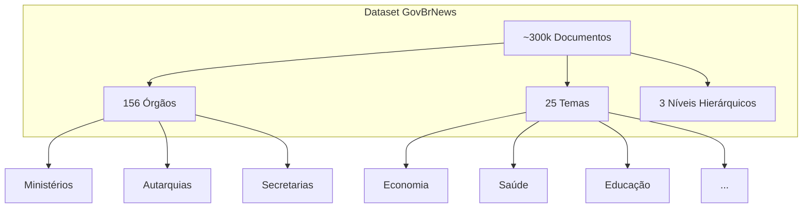
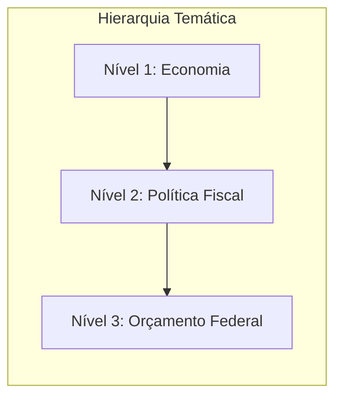

# Explorando o Dataset GovBrNews

> Guia prático para explorar e analisar o dataset de notícias governamentais brasileiras. Do básico ao intermediário, com exemplos em Jupyter Notebook e scripts Python.

---

**Nível**: Iniciante a Intermediário
**Tempo estimado**: 2-3 horas
**Pré-requisitos**: Python básico, familiaridade com Pandas

---

## Visão Geral do Dataset

O dataset `nitaibezerra/govbrnews` contém aproximadamente **300.000 documentos** de notícias oficiais do governo brasileiro, coletados de 156 órgãos governamentais e classificados em 25 temas hierárquicos.



---

## Parte 1: Nível Básico

### Estrutura do Dataset

O dataset possui 26+ colunas organizadas em categorias:

#### Colunas de Identificação

| Coluna | Tipo | Descrição |
|--------|------|-----------|
| `unique_id` | string | Identificador único do documento |
| `agency` | string | Órgão governamental de origem |
| `url` | string | URL original da notícia |

#### Colunas de Conteúdo

| Coluna | Tipo | Descrição |
|--------|------|-----------|
| `title` | string | Título da notícia |
| `subtitle` | string | Subtítulo (quando disponível) |
| `content` | string | Texto completo da notícia |
| `summary` | string | Resumo gerado automaticamente |

#### Colunas Temporais

| Coluna | Tipo | Descrição |
|--------|------|-----------|
| `published_at` | datetime | Data de publicação |
| `scraped_at` | datetime | Data de coleta |

#### Colunas de Classificação Temática

| Coluna | Tipo | Descrição |
|--------|------|-----------|
| `theme_1_level_1` | string | Tema principal - nível 1 |
| `theme_1_level_2` | string | Tema principal - nível 2 |
| `theme_1_level_3` | string | Tema principal - nível 3 |
| `theme_2_level_1` | string | Tema secundário - nível 1 |
| `theme_2_level_2` | string | Tema secundário - nível 2 |
| `theme_2_level_3` | string | Tema secundário - nível 3 |



### Carregando o Dataset

#### Instalação das Dependências

```bash
pip install datasets pandas matplotlib seaborn altair plotly wordcloud
```

#### Carregando com a Biblioteca datasets

=== "Jupyter Notebook"

    ```python
    # Célula 1: Importações
    from datasets import load_dataset
    import pandas as pd

    # Célula 2: Carregar dataset
    dataset = load_dataset("nitaibezerra/govbrnews")

    # Célula 3: Converter para DataFrame
    df = dataset['train'].to_pandas()

    # Célula 4: Verificar tamanho
    print(f"Total de documentos: {len(df):,}")
    print(f"Colunas disponíveis: {df.columns.tolist()}")
    ```

=== "Script Python"

    ```python
    # explorar_dataset.py
    from datasets import load_dataset
    import pandas as pd

    def carregar_dataset():
        """Carrega o dataset GovBrNews do HuggingFace."""
        print("Carregando dataset...")
        dataset = load_dataset("nitaibezerra/govbrnews")
        df = dataset['train'].to_pandas()
        print(f"Dataset carregado: {len(df):,} documentos")
        return df

    if __name__ == "__main__":
        df = carregar_dataset()
        print(df.info())
    ```

**Output esperado:**

```
Carregando dataset...
Dataset carregado: 298,547 documentos
<class 'pandas.core.frame.DataFrame'>
RangeIndex: 298547 entries, 0 to 298546
Columns: 26 entries, unique_id to scraped_at
dtypes: datetime64[ns](2), object(24)
memory usage: 59.2+ MB
```

### Análise Exploratória Básica

#### Primeiras Visualizações dos Dados

```python
# Visualizar primeiras linhas
df.head()

# Informações gerais
df.info()

# Estatísticas descritivas para colunas numéricas
df.describe()

# Verificar valores nulos
df.isnull().sum()
```

#### Estatísticas Descritivas

```python
# Contagem por órgão
print("=== Top 10 Órgãos por Volume ===")
print(df['agency'].value_counts().head(10))

# Contagem por tema nível 1
print("\n=== Distribuição por Tema (Nível 1) ===")
print(df['theme_1_level_1'].value_counts())

# Período temporal
print(f"\n=== Período do Dataset ===")
print(f"Data mais antiga: {df['published_at'].min()}")
print(f"Data mais recente: {df['published_at'].max()}")
```

**Output esperado:**

```
=== Top 10 Órgãos por Volume ===
Ministério da Saúde              45230
Ministério da Economia           38102
Ministério da Educação           29845
Ministério da Justiça            22103
...

=== Distribuição por Tema (Nível 1) ===
Economia           52340
Saúde              48201
Governo            41523
Infraestrutura     35892
...

=== Período do Dataset ===
Data mais antiga: 2019-01-01 00:00:00
Data mais recente: 2024-12-31 23:59:59
```

#### Verificando a Qualidade dos Dados

```python
# Verificar duplicatas
duplicatas = df.duplicated(subset=['unique_id']).sum()
print(f"Documentos duplicados: {duplicatas}")

# Verificar campos vazios
campos_vazios = df[['title', 'content', 'summary']].isnull().sum()
print("\n=== Campos Vazios ===")
print(campos_vazios)

# Verificar tamanho médio do conteúdo
df['content_length'] = df['content'].str.len()
print(f"\nTamanho médio do conteúdo: {df['content_length'].mean():.0f} caracteres")
```

---

## Navegação

Este módulo está dividido em três partes para facilitar o aprendizado:

| Parte | Conteúdo | Nível |
|-------|----------|-------|
| **Parte 1** (esta página) | Estrutura, Carregamento e Análise Exploratória Básica | Iniciante |
| [**Parte 2: Análise Temática**](./analise-tematica.md) | Distribuição por Tema, Análise Temporal, Órgãos | Intermediário |
| [**Parte 3: Análise de Texto**](./analise-texto.md) | Estatísticas de Texto, Nuvem de Palavras, Exercícios | Intermediário |

---

## Próximos Passos

Continue para a [Parte 2: Análise Temática](./analise-tematica.md) para aprender sobre distribuição por tema, análise temporal e órgãos governamentais.

Ou volte para:

- [Setup Data Science](../../setup-datascience.md): Configuração do ambiente
- [Roteiro de Onboarding](../../roteiro-onboarding.md): Visão geral das trilhas

---

> Próximo: [Análise Temática](./analise-tematica.md)
