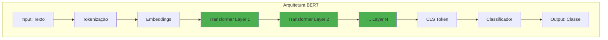
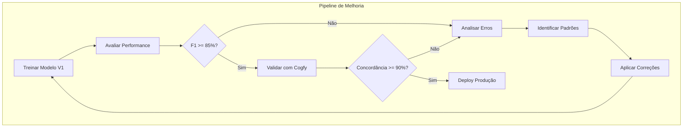

# Deep Learning para Classificação de Texto

> Fine-tuning de BERT, aplicação no DestaquesGovBr, exercícios práticos e troubleshooting.

## Índice

1. [Deep Learning para Texto](#deep-learning-para-texto)
2. [Aplicação no DestaquesGovBr](#aplicacao-no-destaquesgovbr)
3. [Exercícios Práticos](#exercicios-praticos)
4. [Troubleshooting](#troubleshooting)
5. [Glossário](#glossario)

**Navegação:**

- [Anterior: Modelos Clássicos](./modelos-classicos.md)
- [Próximo módulo: Qualidade de Dados](../qualidade-dados/index.md)

---

## Deep Learning para Texto

### Introdução ao BERT

**BERT** (Bidirectional Encoder Representations from Transformers) revolucionou NLP em 2018:



### BERTimbau: BERT para Português

O **BERTimbau** é um modelo BERT pré-treinado especificamente para português brasileiro:

| Modelo | Tamanho | Parâmetros | Uso |
|--------|---------|------------|-----|
| `neuralmind/bert-base-portuguese-cased` | Base | 110M | Recomendado para início |
| `neuralmind/bert-large-portuguese-cased` | Large | 335M | Maior acurácia, mais lento |

### Configurando o Ambiente

```python
# Instalar dependências
# pip install transformers datasets torch accelerate

from transformers import (
    AutoTokenizer,
    AutoModelForSequenceClassification,
    TrainingArguments,
    Trainer,
)
from datasets import Dataset
import torch

# Verificar GPU
device = torch.device('cuda' if torch.cuda.is_available() else 'cpu')
print(f"Usando dispositivo: {device}")
```

### Preparando os Dados para BERT

```python
# Modelo BERTimbau
MODEL_NAME = "neuralmind/bert-base-portuguese-cased"

# Carregar tokenizer
tokenizer = AutoTokenizer.from_pretrained(MODEL_NAME)

# Criar mapeamento de labels
label2id = {label: i for i, label in enumerate(sorted(y.unique()))}
id2label = {i: label for label, i in label2id.items()}
num_labels = len(label2id)

print(f"Número de classes: {num_labels}")
print(f"Mapeamento: {label2id}")

# Preparar datasets
def create_dataset(texts, labels):
    return Dataset.from_dict({
        'text': texts.tolist(),
        'label': [label2id[l] for l in labels.tolist()],
    })

train_dataset = create_dataset(X_train, y_train)
test_dataset = create_dataset(X_test, y_test)

# Tokenizar
def tokenize_function(examples):
    return tokenizer(
        examples['text'],
        padding='max_length',
        truncation=True,
        max_length=512,
    )

train_dataset = train_dataset.map(tokenize_function, batched=True)
test_dataset = test_dataset.map(tokenize_function, batched=True)
```

### Fine-tuning do BERTimbau

```python
from transformers import DataCollatorWithPadding
from sklearn.metrics import accuracy_score, f1_score
import numpy as np

# Carregar modelo pré-treinado
model = AutoModelForSequenceClassification.from_pretrained(
    MODEL_NAME,
    num_labels=num_labels,
    id2label=id2label,
    label2id=label2id,
)
model.to(device)

# Data collator
data_collator = DataCollatorWithPadding(tokenizer=tokenizer)

# Função de métricas
def compute_metrics(eval_pred):
    predictions, labels = eval_pred
    predictions = np.argmax(predictions, axis=1)
    return {
        'accuracy': accuracy_score(labels, predictions),
        'f1_weighted': f1_score(labels, predictions, average='weighted'),
    }

# Configurar treinamento
training_args = TrainingArguments(
    output_dir='./results',
    num_train_epochs=3,
    per_device_train_batch_size=16,
    per_device_eval_batch_size=32,
    warmup_steps=500,
    weight_decay=0.01,
    logging_dir='./logs',
    logging_steps=100,
    eval_strategy='epoch',
    save_strategy='epoch',
    load_best_model_at_end=True,
    metric_for_best_model='f1_weighted',
)

# Criar Trainer
trainer = Trainer(
    model=model,
    args=training_args,
    train_dataset=train_dataset,
    eval_dataset=test_dataset,
    tokenizer=tokenizer,
    data_collator=data_collator,
    compute_metrics=compute_metrics,
)

# Treinar
trainer.train()
```

### Avaliando o Modelo BERT

```python
# Avaliar no conjunto de teste
results = trainer.evaluate()
print(f"\n=== Resultados BERT ===")
print(f"Accuracy: {results['eval_accuracy']:.4f}")
print(f"F1 Weighted: {results['eval_f1_weighted']:.4f}")

# Predições
predictions = trainer.predict(test_dataset)
y_pred_bert = np.argmax(predictions.predictions, axis=1)
y_pred_bert_labels = [id2label[i] for i in y_pred_bert]

# Classification report
print(classification_report(y_test, y_pred_bert_labels))
```

### Salvando o Modelo BERT

```python
# Salvar modelo fine-tuned
model.save_pretrained('./modelo_bert_temas')
tokenizer.save_pretrained('./modelo_bert_temas')

# Carregar modelo salvo
from transformers import pipeline

classifier = pipeline(
    'text-classification',
    model='./modelo_bert_temas',
    tokenizer='./modelo_bert_temas',
)

# Usar para predição
resultado = classifier("Governo anuncia novo programa de educação")
print(f"Tema: {resultado[0]['label']}, Confiança: {resultado[0]['score']:.4f}")
```

### Otimização de Hiperparâmetros (Básico)

```python
from transformers import TrainingArguments

# Hiperparâmetros para experimentar
hiperparametros = {
    'learning_rate': [2e-5, 3e-5, 5e-5],
    'num_train_epochs': [2, 3, 4],
    'per_device_train_batch_size': [8, 16, 32],
    'warmup_ratio': [0.0, 0.1, 0.2],
}

# Exemplo de grid search manual
best_f1 = 0
best_params = {}

for lr in [2e-5, 5e-5]:
    for epochs in [2, 3]:
        training_args = TrainingArguments(
            output_dir=f'./results_lr{lr}_ep{epochs}',
            learning_rate=lr,
            num_train_epochs=epochs,
            per_device_train_batch_size=16,
            eval_strategy='epoch',
            save_strategy='no',  # Não salvar durante grid search
        )

        trainer = Trainer(
            model=model,
            args=training_args,
            train_dataset=train_dataset,
            eval_dataset=test_dataset,
            tokenizer=tokenizer,
            compute_metrics=compute_metrics,
        )

        trainer.train()
        results = trainer.evaluate()

        if results['eval_f1_weighted'] > best_f1:
            best_f1 = results['eval_f1_weighted']
            best_params = {'lr': lr, 'epochs': epochs}

print(f"Melhores parâmetros: {best_params}")
print(f"Melhor F1: {best_f1:.4f}")
```

---

## Aplicação no DestaquesGovBr

### Comparando Modelo Próprio vs Cogfy

```python
# Carregar predições do Cogfy
df_cogfy = df_clean[['id', 'theme_1_level_1_label']].rename(
    columns={'theme_1_level_1_label': 'cogfy_pred'}
)

# Adicionar predições do modelo próprio
df_cogfy['modelo_pred'] = pipeline.predict(df_clean['texto_completo'])

# Comparar
concordancia = (df_cogfy['cogfy_pred'] == df_cogfy['modelo_pred']).mean()
print(f"Concordância Cogfy vs Modelo: {concordancia:.2%}")

# Onde discordam
discordantes = df_cogfy[df_cogfy['cogfy_pred'] != df_cogfy['modelo_pred']]
print(f"\nCasos discordantes: {len(discordantes):,}")
```

### Análise de Erros

```python
# Identificar padrões de erro
from collections import Counter

# Pares de erro mais comuns
erros = df_cogfy[df_cogfy['cogfy_pred'] != df_cogfy['modelo_pred']]
pares_erro = list(zip(erros['cogfy_pred'], erros['modelo_pred']))
erros_comuns = Counter(pares_erro).most_common(10)

print("\n=== Pares de Erro Mais Comuns ===")
print("Cogfy -> Modelo: Frequência")
for (cogfy, modelo), freq in erros_comuns:
    print(f"  {cogfy} -> {modelo}: {freq}")
```

### Estratégias de Melhoria



**Correções Comuns:**

| Problema | Solução |
|----------|---------|
| Classes confundidas | Mais exemplos de treino, ajustar features |
| Baixo recall em classe | Oversampling, class weights |
| Overfitting | Regularização, menos features, dropout |
| Textos ambíguos | Ensemble, threshold de confiança |

### Considerações de Custo

```python
# Calcular economia com modelo próprio

# Custo Cogfy
custo_por_noticia = 0.02  # USD
noticias_por_mes = 10000
custo_cogfy_mes = noticias_por_mes * custo_por_noticia

# Custo modelo próprio (infra)
custo_infra_mes = 50  # USD (GPU ou CPU)

# Economia
economia_mes = custo_cogfy_mes - custo_infra_mes
economia_ano = economia_mes * 12

print(f"=== Análise de Custo ===")
print(f"Cogfy/mês: ${custo_cogfy_mes:.2f}")
print(f"Modelo próprio/mês: ${custo_infra_mes:.2f}")
print(f"Economia/mês: ${economia_mes:.2f}")
print(f"Economia/ano: ${economia_ano:.2f}")
```

| Cenário | Cogfy | Modelo Próprio | Economia |
|---------|-------|----------------|----------|
| 10k notícias/mês | $200 | $50 | $150/mês |
| 50k notícias/mês | $1000 | $100 | $900/mês |
| 100k notícias/mês | $2000 | $200 | $1800/mês |

---

## Exercícios Práticos

### Exercício 1: Classificador TF-IDF + SVM (Intermediário)

**Objetivo:** Treinar classificador de tema nível 1 com pipeline completo.

```python
# exercicios/exercicio_01_svm.py
"""
Exercício 1: Classificador TF-IDF + SVM

Tarefas:
1. Carregar dataset do HuggingFace
2. Preparar texto (limpeza + concatenação título+conteúdo)
3. Split estratificado 80/20
4. Criar pipeline TF-IDF + LinearSVC
5. Treinar e avaliar
6. Salvar modelo

Meta: Acurácia >= 85%
"""

from datasets import load_dataset
from sklearn.pipeline import Pipeline
from sklearn.feature_extraction.text import TfidfVectorizer
from sklearn.svm import LinearSVC
from sklearn.model_selection import train_test_split
from sklearn.metrics import classification_report, accuracy_score
import joblib
import pandas as pd

# TODO: Implementar solução

# 1. Carregar dataset
# dataset = load_dataset(...)

# 2. Preparar texto
# df['texto_completo'] = ...

# 3. Split estratificado
# X_train, X_test, y_train, y_test = train_test_split(...)

# 4. Criar pipeline
# pipeline = Pipeline([...])

# 5. Treinar e avaliar
# pipeline.fit(...)
# y_pred = pipeline.predict(...)
# print(classification_report(...))

# 6. Salvar modelo
# joblib.dump(...)
```

**Solução:**

```python
# exercicios/solucao_01_svm.py

from datasets import load_dataset
from sklearn.pipeline import Pipeline
from sklearn.feature_extraction.text import TfidfVectorizer
from sklearn.svm import LinearSVC
from sklearn.model_selection import train_test_split
from sklearn.metrics import classification_report, accuracy_score
import joblib
import pandas as pd
import re

# 1. Carregar dataset
dataset = load_dataset("nitaibezerra/destaquesgovbr-noticias")
df = pd.DataFrame(dataset['train'])

# 2. Preparar texto
def limpar_texto(texto):
    if not isinstance(texto, str):
        return ""
    texto = texto.lower()
    texto = re.sub(r'https?://\S+', '', texto)
    texto = re.sub(r'\s+', ' ', texto).strip()
    return texto

df['texto_completo'] = (
    df['title'].fillna('') + ' ' +
    df['content'].apply(limpar_texto)
)

# Filtrar dados válidos
df_clean = df.dropna(subset=['theme_1_level_1_label', 'texto_completo'])
X = df_clean['texto_completo']
y = df_clean['theme_1_level_1_label']

# 3. Split estratificado
X_train, X_test, y_train, y_test = train_test_split(
    X, y, test_size=0.2, random_state=42, stratify=y
)

print(f"Treino: {len(X_train):,}, Teste: {len(X_test):,}")

# 4. Criar pipeline
pipeline = Pipeline([
    ('tfidf', TfidfVectorizer(
        max_features=10000,
        ngram_range=(1, 2),
        min_df=5,
        max_df=0.95,
        sublinear_tf=True,
    )),
    ('classifier', LinearSVC(
        C=1.0,
        class_weight='balanced',
        max_iter=10000,
        random_state=42,
    )),
])

# 5. Treinar e avaliar
pipeline.fit(X_train, y_train)
y_pred = pipeline.predict(X_test)

print(f"\nAcurácia: {accuracy_score(y_test, y_pred):.4f}")
print(classification_report(y_test, y_pred))

# 6. Salvar modelo
joblib.dump(pipeline, 'modelo_svm_tema_nivel1.joblib')
print("\nModelo salvo: modelo_svm_tema_nivel1.joblib")
```

---

### Exercício 2: Avaliação por Tema (Intermediário)

**Objetivo:** Identificar temas difíceis de classificar.

```python
# exercicios/exercicio_02_avaliacao.py
"""
Exercício 2: Avaliação por Tema

Tarefas:
1. Usar modelo treinado no Exercício 1
2. Calcular métricas por classe
3. Identificar 5 temas mais difíceis (menor F1)
4. Analisar matriz de confusão
5. Gerar relatório visual

Meta: Identificar padrões de erro
"""

import joblib
from sklearn.metrics import (
    classification_report,
    confusion_matrix,
    ConfusionMatrixDisplay,
    precision_recall_fscore_support,
)
import matplotlib.pyplot as plt
import pandas as pd

# TODO: Implementar solução

# 1. Carregar modelo
# pipeline = joblib.load(...)

# 2. Calcular métricas por classe
# precision, recall, f1, support = precision_recall_fscore_support(...)

# 3. Identificar temas difíceis
# df_metricas = pd.DataFrame(...)
# temas_dificeis = df_metricas.sort_values('F1-Score').head(5)

# 4. Matriz de confusão
# cm = confusion_matrix(...)
# ConfusionMatrixDisplay(...).plot()

# 5. Salvar relatório
# plt.savefig(...)
```

---

### Exercício 3: Fine-tuning BERTimbau (Avançado)

**Objetivo:** Treinar modelo BERT para classificação.

```python
# exercicios/exercicio_03_bert.py
"""
Exercício 3: Fine-tuning BERTimbau

Tarefas:
1. Preparar dataset para HuggingFace
2. Tokenizar com BERTimbau tokenizer
3. Configurar TrainingArguments
4. Treinar com Trainer
5. Avaliar e comparar com SVM

Meta: F1 >= 88%
"""

from transformers import (
    AutoTokenizer,
    AutoModelForSequenceClassification,
    TrainingArguments,
    Trainer,
)
from datasets import Dataset
import torch

# TODO: Implementar solução

# 1. Preparar dataset
# train_dataset = Dataset.from_dict(...)

# 2. Tokenizar
# tokenizer = AutoTokenizer.from_pretrained(...)

# 3. Configurar treinamento
# training_args = TrainingArguments(...)

# 4. Treinar
# trainer = Trainer(...)
# trainer.train()

# 5. Avaliar
# results = trainer.evaluate()
```

---

### Exercício 4: Comparação com Cogfy (Avançado)

**Objetivo:** Comparar modelo próprio com classificação Cogfy.

```python
# exercicios/exercicio_04_comparacao.py
"""
Exercício 4: Comparação Modelo vs Cogfy

Tarefas:
1. Carregar predições Cogfy do dataset
2. Gerar predições do modelo próprio
3. Calcular concordância
4. Analisar casos discordantes
5. Gerar relatório de comparação

Meta: Concordância >= 90%
"""

import pandas as pd
import joblib
from collections import Counter

# TODO: Implementar solução

# 1. Carregar dados
# df = pd.DataFrame(...)

# 2. Predições modelo
# df['modelo_pred'] = pipeline.predict(...)

# 3. Concordância
# concordancia = (df['cogfy'] == df['modelo']).mean()

# 4. Casos discordantes
# discordantes = df[df['cogfy'] != df['modelo']]

# 5. Relatório
# print(f"Concordância: {concordancia:.2%}")
```

---

## Troubleshooting

### Problemas Comuns

#### Erro: "OutOfMemoryError" durante treinamento BERT

```python
# Solução 1: Reduzir batch size
training_args = TrainingArguments(
    per_device_train_batch_size=8,  # Reduzir de 16 para 8
    gradient_accumulation_steps=2,   # Compensar com acumulação
)

# Solução 2: Usar mixed precision (FP16)
training_args = TrainingArguments(
    fp16=True,  # Ativa FP16 (requer GPU com suporte)
)

# Solução 3: Reduzir max_length
tokenizer(
    texts,
    max_length=256,  # Reduzir de 512 para 256
    truncation=True,
)
```

#### Erro: "Underfitting" - Acurácia muito baixa

```python
# Verificar distribuição de classes
print(y_train.value_counts())

# Verificar qualidade dos dados
print(X_train.head(10))

# Aumentar complexidade do modelo
tfidf = TfidfVectorizer(
    max_features=20000,      # Aumentar features
    ngram_range=(1, 3),      # Incluir trigramas
)
```

#### Erro: "Overfitting" - Treino bom, teste ruim

```python
# Aumentar regularização
svm = LinearSVC(C=0.1)  # Reduzir C (mais regularização)

# Cross-validation para detectar
from sklearn.model_selection import cross_val_score
scores = cross_val_score(pipeline, X_train, y_train, cv=5)
print(f"CV Scores: {scores.mean():.4f} +/- {scores.std():.4f}")
```

#### Erro: "Classes desbalanceadas" - Baixo recall em minoritárias

```python
# Usar class_weight
svm = LinearSVC(class_weight='balanced')

# Ou oversampling
from imblearn.over_sampling import SMOTE
smote = SMOTE(random_state=42)
X_resampled, y_resampled = smote.fit_resample(X_train_tfidf, y_train)
```

#### Erro: "Modelo lento para inferência"

```python
# Usar modelo menor
tfidf = TfidfVectorizer(max_features=5000)  # Reduzir features

# Para BERT, usar distilbert
MODEL_NAME = "neuralmind/bert-base-portuguese-cased"
# Considerar usar modelo menor ou quantização
```

### Checklist de Debug

- [ ] Dados limpos e sem nulos
- [ ] Split estratificado correto
- [ ] Labels mapeadas corretamente
- [ ] Vocabulário do TF-IDF adequado
- [ ] Regularização ajustada
- [ ] Cross-validation para validar
- [ ] Métricas por classe analisadas

---

## Glossário

| Termo | Definição |
|-------|-----------|
| **TF-IDF** | Term Frequency-Inverse Document Frequency - técnica de vetorização de texto |
| **Tokenização** | Divisão do texto em unidades (tokens) |
| **Embedding** | Representação densa de texto em vetor numérico |
| **Fine-tuning** | Ajuste de modelo pré-treinado para tarefa específica |
| **Overfitting** | Modelo memoriza treino, generaliza mal |
| **Underfitting** | Modelo não aprende padrões suficientes |
| **Cross-validation** | Validação com múltiplas divisões treino/teste |
| **Precision** | Proporção de positivos preditos que são corretos |
| **Recall** | Proporção de positivos reais que foram encontrados |
| **F1-Score** | Média harmônica de precision e recall |
| **Macro F1** | Média simples do F1 por classe |
| **Weighted F1** | Média ponderada do F1 pelo suporte |
| **BERT** | Bidirectional Encoder Representations from Transformers |
| **BERTimbau** | BERT pré-treinado para português brasileiro |
| **Transformer** | Arquitetura de rede neural com mecanismo de atenção |
| **Transfer Learning** | Usar conhecimento de tarefa anterior em nova tarefa |
| **Batch Size** | Número de exemplos processados por iteração |
| **Learning Rate** | Taxa de atualização dos pesos do modelo |
| **Epoch** | Uma passagem completa pelo dataset de treino |

---

## Recursos Adicionais

- [Scikit-learn Documentation](https://scikit-learn.org/stable/documentation.html)
- [HuggingFace Transformers](https://huggingface.co/docs/transformers/)
- [BERTimbau Paper](https://arxiv.org/abs/2010.01825)
- [Text Classification with Transformers](https://huggingface.co/docs/transformers/tasks/sequence_classification)
- [Imbalanced-learn Documentation](https://imbalanced-learn.org/)

---

## Navegação

- **Anterior:** [Modelos Clássicos](./modelos-classicos.md)
- **Próximo módulo:** [Qualidade de Dados](../qualidade-dados/index.md)

---

## Navegação da Trilha Data Science

- [Setup Data Science](../../setup-datascience.md): Configuração do ambiente
- [Explorando o Dataset](../explorando-dataset/index.md): Análise exploratória
- [NLP Aplicado](../nlp-pipeline/index.md): Processamento de linguagem natural
- **ML para Classificação**
  - [Introdução e Preparação](./index.md)
  - [Modelos Clássicos](./modelos-classicos.md)
  - [Deep Learning](./deep-learning.md) (você está aqui)
- [Qualidade de Dados](../qualidade-dados/index.md): Validação e métricas

---

> Voltar para [Modelos Clássicos](./modelos-classicos.md)

> Próximo: [Qualidade de Dados](../qualidade-dados/index.md)
