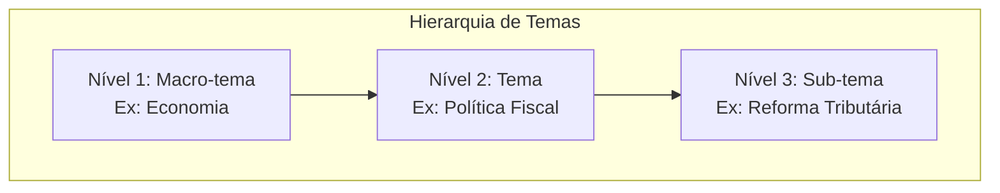
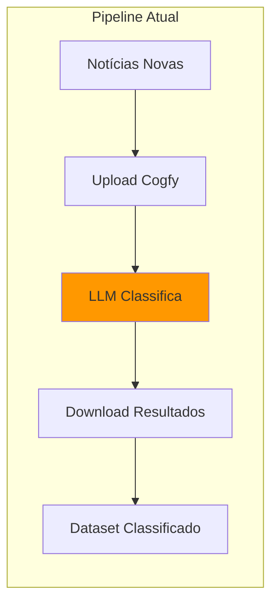
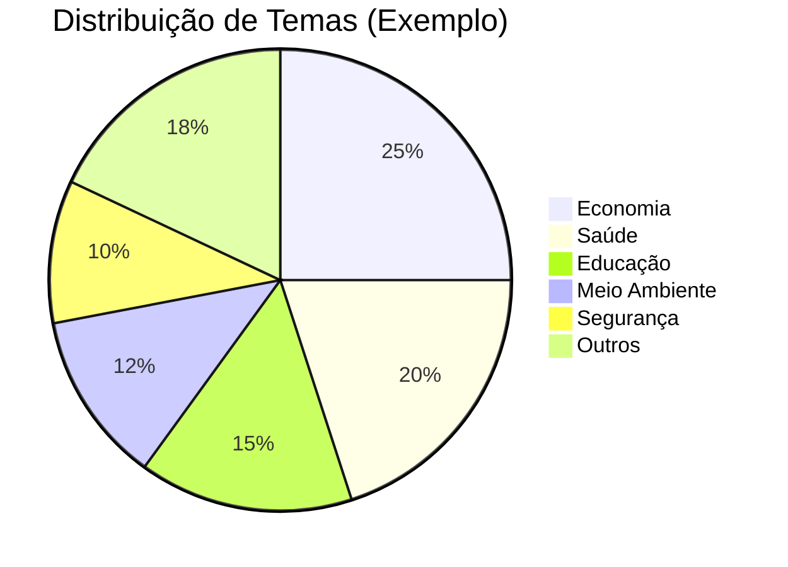
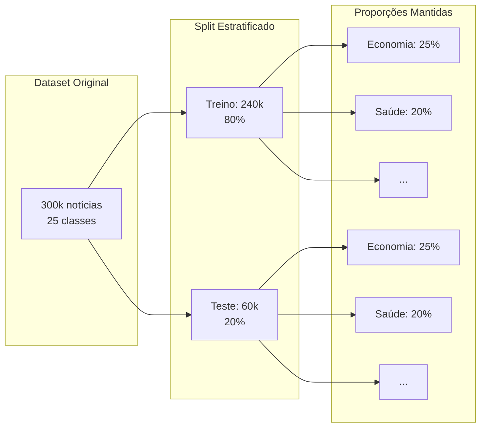

# Classificação de Texto com Machine Learning

> Guia completo para construir classificadores de texto, desde modelos clássicos até deep learning, aplicados ao DestaquesGovBr.

## Índice

1. [Introdução e Contexto](#introducao-e-contexto)
2. [Preparação dos Dados](#preparacao-dos-dados)
3. [Classificação Tradicional (ML Clássico)](#classificacao-tradicional-ml-classico)

**Próximos módulos:**

- [Modelos Clássicos](./modelos-classicos.md): Feature Engineering com TF-IDF e modelos clássicos
- [Deep Learning](./deep-learning.md): Fine-tuning de BERT e aplicação no DestaquesGovBr

---

## Introdução e Contexto

### O Problema de Classificação no DestaquesGovBr

O DestaquesGovBr possui um dataset com aproximadamente **300.000 notícias** classificadas em **25 temas** organizados em uma hierarquia de 3 níveis:



**Campos de classificação no dataset:**

| Campo | Descrição | Exemplo |
|-------|-----------|---------|
| `theme_1_level_1_code` | Código nível 1 | `ECO` |
| `theme_1_level_1_label` | Label nível 1 | `Economia` |
| `theme_1_level_2_code` | Código nível 2 | `ECO-FIS` |
| `theme_1_level_2_label` | Label nível 2 | `Política Fiscal` |
| `theme_1_level_3_code` | Código nível 3 | `ECO-FIS-TRI` |
| `theme_1_level_3_label` | Label nível 3 | `Reforma Tributária` |
| `most_specific_theme` | Tema mais específico disponível | `Reforma Tributária` |

### Classificação Atual via Cogfy

Atualmente, a classificação é feita via **Cogfy** (LLM as a Service):



**Prós do Cogfy:**

- Alta acurácia (LLMs entendem contexto)
- Zero manutenção de modelo
- Funciona out-of-the-box

**Contras do Cogfy:**

- Custo por requisição (~$0.02/notícia)
- Dependência de serviço externo
- Latência (~20min para batch)
- Sem controle sobre o modelo

### Por que Treinar Modelo Próprio?

| Aspecto | Cogfy (LLM) | Modelo Próprio |
|---------|-------------|----------------|
| **Custo mensal** | ~$200 (10k notícias) | ~$0 (após treinamento) |
| **Latência** | 20min batch | <1s por notícia |
| **Controle** | Nenhum | Total |
| **Explicabilidade** | Baixa | Alta (ML clássico) |
| **Manutenção** | Zero | Retraining periódico |
| **Acurácia** | ~95% | 85-92% (objetivo) |

**Objetivo deste tutorial:** Treinar um modelo próprio que atinja **85%+ de acurácia**, permitindo:
1. Redução de custos com Cogfy
2. Classificação em tempo real
3. Backup para quando Cogfy estiver indisponível

---

## Preparação dos Dados

### Carregando o Dataset

```python
import pandas as pd
from datasets import load_dataset

# Carregar dataset do HuggingFace
dataset = load_dataset("nitaibezerra/destaquesgovbr-noticias")

# Converter para DataFrame
df = pd.DataFrame(dataset['train'])

print(f"Total de notícias: {len(df):,}")
print(f"Colunas: {df.columns.tolist()}")
```

### Exploração Inicial

```python
# Distribuição de temas nível 1
print("\n=== Distribuição de Temas Nível 1 ===")
theme_dist = df['theme_1_level_1_label'].value_counts()
print(theme_dist)

# Visualizar distribuição
import matplotlib.pyplot as plt

fig, ax = plt.subplots(figsize=(12, 6))
theme_dist.plot(kind='barh', ax=ax)
ax.set_xlabel('Quantidade de Notícias')
ax.set_title('Distribuição de Temas - Nível 1')
plt.tight_layout()
plt.savefig('distribuicao_temas.png')
```

### Análise de Desbalanceamento



**Identificando classes desbalanceadas:**

```python
# Calcular proporções
total = len(df)
proporcoes = df['theme_1_level_1_label'].value_counts() / total * 100

# Classes minoritárias (<5% do dataset)
classes_minoritarias = proporcoes[proporcoes < 5]
print(f"\nClasses minoritárias (<5%):\n{classes_minoritarias}")

# Classes majoritárias (>15% do dataset)
classes_majoritarias = proporcoes[proporcoes > 15]
print(f"\nClasses majoritárias (>15%):\n{classes_majoritarias}")
```

### Limpeza e Pré-processamento

```python
import re
import unicodedata

def limpar_texto(texto: str) -> str:
    """
    Limpa e normaliza texto para classificação.

    Args:
        texto: Texto bruto da notícia

    Returns:
        Texto limpo e normalizado
    """
    if not isinstance(texto, str):
        return ""

    # Converter para lowercase
    texto = texto.lower()

    # Remover acentos (opcional - depende do modelo)
    # texto = unicodedata.normalize('NFKD', texto)
    # texto = texto.encode('ASCII', 'ignore').decode('ASCII')

    # Remover URLs
    texto = re.sub(r'https?://\S+|www\.\S+', '', texto)

    # Remover emails
    texto = re.sub(r'\S+@\S+', '', texto)

    # Remover números isolados (manter números em palavras)
    texto = re.sub(r'\b\d+\b', '', texto)

    # Remover pontuação excessiva
    texto = re.sub(r'[^\w\s]', ' ', texto)

    # Remover espaços múltiplos
    texto = re.sub(r'\s+', ' ', texto).strip()

    return texto

# Aplicar limpeza
df['texto_limpo'] = df['content'].apply(limpar_texto)

# Verificar resultado
print("Exemplo de limpeza:")
print(f"Original: {df['content'].iloc[0][:200]}...")
print(f"Limpo: {df['texto_limpo'].iloc[0][:200]}...")
```

### Preparando Features

```python
# Combinar título e conteúdo para melhor classificação
df['texto_completo'] = df['title'].fillna('') + ' ' + df['texto_limpo']

# Definir target (nível 1 para começar)
df['target'] = df['theme_1_level_1_label']

# Remover linhas sem classificação
df_clean = df.dropna(subset=['target', 'texto_completo'])
print(f"Registros após limpeza: {len(df_clean):,}")

# Verificar classes únicas
classes = df_clean['target'].unique()
print(f"Total de classes: {len(classes)}")
print(f"Classes: {sorted(classes)}")
```

---

## Classificação Tradicional (ML Clássico)

### Train/Test Split Estratificado

O split estratificado é **essencial** para datasets desbalanceados:

```python
from sklearn.model_selection import train_test_split

# Features e target
X = df_clean['texto_completo']
y = df_clean['target']

# Split estratificado (mantém proporção das classes)
X_train, X_test, y_train, y_test = train_test_split(
    X, y,
    test_size=0.2,           # 20% para teste
    random_state=42,         # Reproducibilidade
    stratify=y               # IMPORTANTE: mantém proporção
)

print(f"Treino: {len(X_train):,} ({len(X_train)/len(X)*100:.1f}%)")
print(f"Teste: {len(X_test):,} ({len(X_test)/len(X)*100:.1f}%)")

# Verificar estratificação
print("\nProporção de classes no treino vs teste:")
for classe in y.unique()[:5]:  # Primeiras 5 classes
    prop_train = (y_train == classe).sum() / len(y_train) * 100
    prop_test = (y_test == classe).sum() / len(y_test) * 100
    print(f"  {classe}: treino={prop_train:.2f}%, teste={prop_test:.2f}%")
```



---

## Navegação

- **Próximo:** [Modelos Clássicos](./modelos-classicos.md) - Feature Engineering com TF-IDF e modelos clássicos detalhados

---

## Navegação da Trilha Data Science

- [Setup Data Science](../../setup-datascience.md): Configuração do ambiente
- [Explorando o Dataset](../explorando-dataset/index.md): Análise exploratória
- [NLP Aplicado](../nlp-pipeline/index.md): Processamento de linguagem natural
- **ML para Classificação** (você está aqui)
  - [Introdução e Preparação](./index.md) (você está aqui)
  - [Modelos Clássicos](./modelos-classicos.md)
  - [Deep Learning](./deep-learning.md)
- [Qualidade de Dados](../qualidade-dados/index.md): Validação e métricas

---

> Voltar para [NLP Aplicado](../nlp-pipeline/index.md)

> Próximo: [Modelos Clássicos](./modelos-classicos.md)
