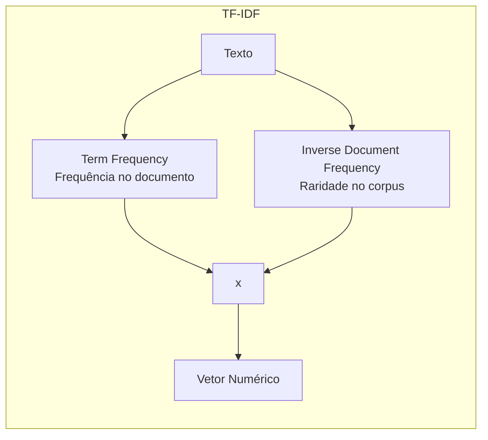
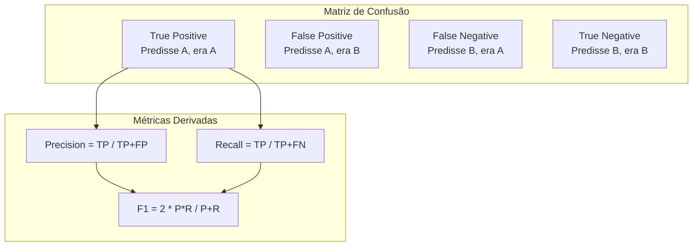

# Modelos Clássicos de Classificação

> Feature Engineering com TF-IDF e modelos clássicos para classificação de texto.

## Índice

1. [Feature Engineering com TF-IDF](#feature-engineering-com-tf-idf)
2. [Modelos Clássicos Detalhados](#modelos-classicos-detalhados)
3. [Avaliação de Modelos](#avaliacao-de-modelos)

**Navegação:**

- [Anterior: Introdução e Preparação](./index.md)
- [Próximo: Deep Learning](./deep-learning.md)

---

## Feature Engineering com TF-IDF

### O que é TF-IDF?

**TF-IDF** (Term Frequency - Inverse Document Frequency) transforma texto em vetores numéricos:



| Componente | Fórmula | Intuição |
|------------|---------|----------|
| **TF** | `count(termo) / total_termos` | Palavras frequentes no documento são importantes |
| **IDF** | `log(N / docs_com_termo)` | Palavras raras no corpus são mais discriminativas |
| **TF-IDF** | `TF * IDF` | Combina importância local e global |

### Implementação com Scikit-learn

```python
from sklearn.feature_extraction.text import TfidfVectorizer

# Configurar TF-IDF
tfidf = TfidfVectorizer(
    max_features=10000,      # Top 10k termos
    min_df=5,                # Mínimo 5 documentos
    max_df=0.95,             # Máximo 95% dos documentos
    ngram_range=(1, 2),      # Unigramas e bigramas
    sublinear_tf=True,       # Aplica log no TF
    strip_accents='unicode', # Remove acentos
    lowercase=True,          # Converte para minúsculo
)

# Fit no treino, transform no teste
X_train_tfidf = tfidf.fit_transform(X_train)
X_test_tfidf = tfidf.transform(X_test)

print(f"Shape treino: {X_train_tfidf.shape}")
print(f"Shape teste: {X_test_tfidf.shape}")
print(f"Vocabulário: {len(tfidf.vocabulary_):,} termos")
```

### Analisando Features

```python
import numpy as np

# Top termos por TF-IDF médio
feature_names = tfidf.get_feature_names_out()
mean_tfidf = X_train_tfidf.mean(axis=0).A1

# Top 20 termos
top_indices = mean_tfidf.argsort()[-20:][::-1]
print("Top 20 termos (TF-IDF médio):")
for idx in top_indices:
    print(f"  {feature_names[idx]}: {mean_tfidf[idx]:.4f}")
```

### Hiperparâmetros Importantes do TF-IDF

| Parâmetro | Descrição | Valores Comuns | Impacto |
|-----------|-----------|----------------|---------|
| `max_features` | Número máximo de termos | 5000-50000 | Mais = mais info, mais memória |
| `min_df` | Frequência mínima de documento | 2-10 | Remove termos raros/ruído |
| `max_df` | Frequência máxima de documento | 0.9-0.99 | Remove stopwords implícitas |
| `ngram_range` | Tamanho dos n-gramas | (1,1), (1,2), (1,3) | Bigramas capturam contexto |
| `sublinear_tf` | Aplica log(1+tf) | True/False | Reduz impacto de alta frequência |

---

## Modelos Clássicos Detalhados

### 1. Naive Bayes Multinomial

**Teoria:** Assume independência entre features (palavras). Apesar de simplista, funciona muito bem para texto.

```python
from sklearn.naive_bayes import MultinomialNB
from sklearn.metrics import classification_report, accuracy_score

# Treinar modelo
nb_model = MultinomialNB(alpha=1.0)  # alpha = smoothing
nb_model.fit(X_train_tfidf, y_train)

# Prever
y_pred_nb = nb_model.predict(X_test_tfidf)

# Avaliar
print("=== Naive Bayes Multinomial ===")
print(f"Acurácia: {accuracy_score(y_test, y_pred_nb):.4f}")
print(classification_report(y_test, y_pred_nb))
```

**Prós e Contras:**

| Prós | Contras |
|------|---------|
| Muito rápido | Assume independência (irrealista) |
| Funciona bem com pouco dado | Não captura interações |
| Baseline sólido | Menos preciso que SVM/LR |

### 2. SVM (Support Vector Machine)

**Teoria:** Encontra o hiperplano que melhor separa as classes, maximizando a margem.

```python
from sklearn.svm import LinearSVC
from sklearn.calibration import CalibratedClassifierCV

# LinearSVC é mais rápido para texto (kernel linear)
svm_model = LinearSVC(
    C=1.0,                    # Regularização
    class_weight='balanced',  # Ajusta para desbalanceamento
    max_iter=10000,           # Iterações máximas
    random_state=42,
)
svm_model.fit(X_train_tfidf, y_train)

# Prever
y_pred_svm = svm_model.predict(X_test_tfidf)

# Avaliar
print("\n=== SVM (LinearSVC) ===")
print(f"Acurácia: {accuracy_score(y_test, y_pred_svm):.4f}")
print(classification_report(y_test, y_pred_svm))
```

**Para obter probabilidades (útil para análise de confiança):**

```python
# Calibrar para obter probabilidades
svm_calibrated = CalibratedClassifierCV(svm_model, cv=3)
svm_calibrated.fit(X_train_tfidf, y_train)

# Agora podemos usar predict_proba
probs = svm_calibrated.predict_proba(X_test_tfidf[:5])
print("Probabilidades das primeiras 5 predições:")
print(probs)
```

### 3. Random Forest

**Teoria:** Ensemble de árvores de decisão. Cada árvore vota na classe.

```python
from sklearn.ensemble import RandomForestClassifier

# Random Forest (mais lento para texto de alta dimensão)
rf_model = RandomForestClassifier(
    n_estimators=100,         # Número de árvores
    max_depth=50,             # Profundidade máxima
    min_samples_split=5,      # Mínimo para split
    class_weight='balanced',  # Ajusta para desbalanceamento
    n_jobs=-1,                # Paralelizar
    random_state=42,
)
rf_model.fit(X_train_tfidf, y_train)

# Prever
y_pred_rf = rf_model.predict(X_test_tfidf)

# Avaliar
print("\n=== Random Forest ===")
print(f"Acurácia: {accuracy_score(y_test, y_pred_rf):.4f}")
print(classification_report(y_test, y_pred_rf))
```

**Feature Importance:**

```python
# Top 20 features mais importantes
importances = rf_model.feature_importances_
indices = importances.argsort()[-20:][::-1]

print("\nTop 20 Features (Random Forest):")
for idx in indices:
    print(f"  {feature_names[idx]}: {importances[idx]:.4f}")
```

### 4. Logistic Regression

**Teoria:** Modelo linear com função sigmoide para classificação.

```python
from sklearn.linear_model import LogisticRegression

# Logistic Regression
lr_model = LogisticRegression(
    C=1.0,                    # Regularização inversa
    class_weight='balanced',  # Ajusta para desbalanceamento
    solver='lbfgs',           # Otimizador
    max_iter=1000,            # Iterações máximas
    multi_class='multinomial',# Multiclasse nativo
    n_jobs=-1,                # Paralelizar
    random_state=42,
)
lr_model.fit(X_train_tfidf, y_train)

# Prever
y_pred_lr = lr_model.predict(X_test_tfidf)

# Avaliar
print("\n=== Logistic Regression ===")
print(f"Acurácia: {accuracy_score(y_test, y_pred_lr):.4f}")
print(classification_report(y_test, y_pred_lr))
```

### Comparação dos Modelos

```python
import pandas as pd

# Compilar resultados
resultados = {
    'Modelo': ['Naive Bayes', 'SVM (LinearSVC)', 'Random Forest', 'Logistic Regression'],
    'Acurácia': [
        accuracy_score(y_test, y_pred_nb),
        accuracy_score(y_test, y_pred_svm),
        accuracy_score(y_test, y_pred_rf),
        accuracy_score(y_test, y_pred_lr),
    ],
    'Tempo Treino (s)': [0.5, 2.1, 45.3, 8.7],  # Exemplo
    'Tempo Inferência (s)': [0.01, 0.02, 0.15, 0.02],  # Exemplo
}

df_resultados = pd.DataFrame(resultados)
print("\n=== Comparação de Modelos ===")
print(df_resultados.to_string(index=False))
```

| Modelo | Acurácia | Tempo Treino | Memória | Recomendação |
|--------|----------|--------------|---------|--------------|
| **Naive Bayes** | ~82% | Muito rápido | Baixa | Baseline rápido |
| **SVM** | ~88% | Rápido | Média | **Melhor custo-benefício** |
| **Random Forest** | ~85% | Lento | Alta | Quando precisa de feature importance |
| **Logistic Regression** | ~87% | Médio | Média | Alternativa ao SVM |

---

## Avaliação de Modelos

### Métricas Essenciais



| Métrica | Fórmula | Quando Usar |
|---------|---------|-------------|
| **Accuracy** | `(TP+TN) / Total` | Classes balanceadas |
| **Precision** | `TP / (TP+FP)` | Custo alto de falso positivo |
| **Recall** | `TP / (TP+FN)` | Custo alto de falso negativo |
| **F1-Score** | `2 * P*R / (P+R)` | Equilíbrio entre P e R |
| **Macro F1** | Média simples por classe | Classes desbalanceadas |
| **Weighted F1** | Média ponderada por suporte | Classes desbalanceadas |

### Matriz de Confusão

```python
from sklearn.metrics import confusion_matrix, ConfusionMatrixDisplay
import matplotlib.pyplot as plt

# Gerar matriz de confusão
cm = confusion_matrix(y_test, y_pred_svm)

# Visualizar
fig, ax = plt.subplots(figsize=(15, 15))
disp = ConfusionMatrixDisplay(
    confusion_matrix=cm,
    display_labels=svm_model.classes_
)
disp.plot(ax=ax, cmap='Blues', values_format='d')
plt.xticks(rotation=45, ha='right')
plt.title('Matriz de Confusão - SVM')
plt.tight_layout()
plt.savefig('confusion_matrix.png', dpi=150)
```

### Análise por Classe

```python
from sklearn.metrics import precision_recall_fscore_support

# Métricas por classe
precision, recall, f1, support = precision_recall_fscore_support(
    y_test, y_pred_svm, average=None, labels=svm_model.classes_
)

# Criar DataFrame para análise
df_metricas = pd.DataFrame({
    'Classe': svm_model.classes_,
    'Precision': precision,
    'Recall': recall,
    'F1-Score': f1,
    'Suporte': support,
})

# Ordenar por F1-Score (identificar classes difíceis)
df_metricas = df_metricas.sort_values('F1-Score')

print("\n=== Métricas por Classe (ordenado por F1) ===")
print(df_metricas.to_string(index=False))

# Classes mais difíceis (F1 < 0.7)
print("\n=== Classes Difíceis (F1 < 0.7) ===")
print(df_metricas[df_metricas['F1-Score'] < 0.7].to_string(index=False))
```

### Cross-Validation

```python
from sklearn.model_selection import cross_val_score, StratifiedKFold

# Configurar cross-validation estratificado
cv = StratifiedKFold(n_splits=5, shuffle=True, random_state=42)

# Avaliar com CV
scores = cross_val_score(
    svm_model, X_train_tfidf, y_train,
    cv=cv,
    scoring='f1_weighted',
    n_jobs=-1,
)

print(f"\n=== Cross-Validation (5-fold) ===")
print(f"F1 Scores: {scores}")
print(f"F1 Médio: {scores.mean():.4f} (+/- {scores.std()*2:.4f})")
```

### Pipeline Completo

```python
from sklearn.pipeline import Pipeline

# Criar pipeline
pipeline = Pipeline([
    ('tfidf', TfidfVectorizer(
        max_features=10000,
        ngram_range=(1, 2),
        sublinear_tf=True,
    )),
    ('classifier', LinearSVC(
        C=1.0,
        class_weight='balanced',
    )),
])

# Treinar e avaliar
pipeline.fit(X_train, y_train)
y_pred = pipeline.predict(X_test)

print(f"Pipeline Accuracy: {accuracy_score(y_test, y_pred):.4f}")
```

### Salvando o Modelo

```python
import joblib

# Salvar pipeline treinado
joblib.dump(pipeline, 'modelo_classificacao_tema.joblib')

# Carregar modelo
pipeline_loaded = joblib.load('modelo_classificacao_tema.joblib')

# Usar para predição
nova_noticia = "Governo anuncia novo programa de educação"
tema_predito = pipeline_loaded.predict([nova_noticia])[0]
print(f"Tema predito: {tema_predito}")
```

---

## Navegação

- **Anterior:** [Introdução e Preparação](./index.md)
- **Próximo:** [Deep Learning](./deep-learning.md) - Fine-tuning de BERT e aplicação no DestaquesGovBr

---

## Navegação da Trilha Data Science

- [Setup Data Science](../../setup-datascience.md): Configuração do ambiente
- [Explorando o Dataset](../explorando-dataset/index.md): Análise exploratória
- [NLP Aplicado](../nlp-pipeline/index.md): Processamento de linguagem natural
- **ML para Classificação**
  - [Introdução e Preparação](./index.md)
  - [Modelos Clássicos](./modelos-classicos.md) (você está aqui)
  - [Deep Learning](./deep-learning.md)
- [Qualidade de Dados](../qualidade-dados/index.md): Validação e métricas

---

> Voltar para [Introdução e Preparação](./index.md)

> Próximo: [Deep Learning](./deep-learning.md)
