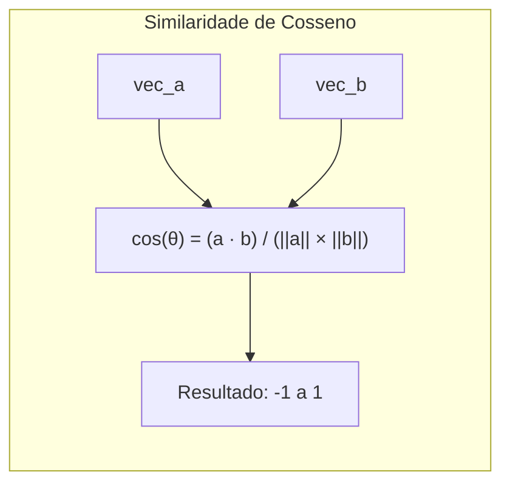
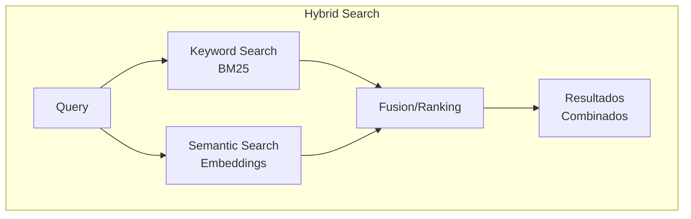

# Busca Semantica

> Parte 3 do modulo de NLP: Similaridade de cosseno, implementacao de busca semantica, comparacao com busca keyword e integracao com Typesense.

## Visao Geral

| Informacao | Detalhe |
|------------|---------|
| **Nivel** | Avancado |
| **Tempo Estimado** | 1.5 horas |
| **Pre-requisitos** | [Fundamentos de NLP](index.md), [Embeddings](embeddings.md) |

---

## Indice

1. [Similaridade de Cosseno](#similaridade-de-cosseno)
2. [Implementando Busca Semantica](#implementando-busca-semantica-simples)
3. [Comparacao: Keyword vs Semantica](#comparacao-busca-keyword-vs-semantica)
4. [Integracao com Typesense](#integracao-com-typesense-hybrid-search)
5. [Exercicios Praticos](#exercicios-praticos)
6. [Troubleshooting](#troubleshooting)
7. [Recursos Adicionais](#recursos-adicionais)

---

## Similaridade de Cosseno

A similaridade de cosseno mede o angulo entre dois vetores, ignorando magnitude. Perfeita para embeddings.



**Interpretacao:**

| Valor | Significado |
|-------|-------------|
| 1.0 | Identicos |
| 0.7-0.9 | Muito similares |
| 0.5-0.7 | Relacionados |
| 0.3-0.5 | Pouco relacionados |
| < 0.3 | Nao relacionados |

```python
import numpy as np

def cosine_similarity(vec_a: np.ndarray, vec_b: np.ndarray) -> float:
    """Calcula similaridade de cosseno entre dois vetores."""
    dot_product = np.dot(vec_a, vec_b)
    norm_a = np.linalg.norm(vec_a)
    norm_b = np.linalg.norm(vec_b)
    return dot_product / (norm_a * norm_b)

# Exemplo
emb_saude1 = model.encode(["passage: vacinacao contra covid"])[0]
emb_saude2 = model.encode(["passage: imunizacao coronavirus"])[0]
emb_educacao = model.encode(["passage: resultados do ENEM"])[0]

print(f"Saude 1 vs Saude 2: {cosine_similarity(emb_saude1, emb_saude2):.3f}")  # ~0.85
print(f"Saude 1 vs Educacao: {cosine_similarity(emb_saude1, emb_educacao):.3f}")  # ~0.35
```

---

## Implementando Busca Semantica Simples

```python
from sentence_transformers import SentenceTransformer
import numpy as np
from typing import List, Tuple
from dataclasses import dataclass

@dataclass
class Noticia:
    id: str
    titulo: str
    conteudo: str
    orgao: str
    data: str

class BuscaSemantica:
    """Sistema de busca semantica para noticias."""

    def __init__(self, model_name: str = "intfloat/multilingual-e5-base"):
        self.model = SentenceTransformer(model_name)
        self.noticias: List[Noticia] = []
        self.embeddings: np.ndarray = np.array([])

    def indexar(self, noticias: List[Noticia]):
        """Indexa lista de noticias."""
        self.noticias = noticias

        # Combinar titulo e conteudo para embedding
        textos = [
            f"passage: {n.titulo}. {n.conteudo[:500]}"  # Limitar conteudo
            for n in noticias
        ]

        self.embeddings = self.model.encode(
            textos,
            show_progress_bar=True,
            batch_size=32,
            normalize_embeddings=True,  # Normalizar para cosseno
        )

        print(f"Indexadas {len(noticias)} noticias")

    def buscar(self, query: str, top_k: int = 5) -> List[Tuple[float, Noticia]]:
        """Busca noticias semanticamente similares a query."""
        # Gerar embedding da query
        query_emb = self.model.encode(
            [f"query: {query}"],
            normalize_embeddings=True,
        )[0]

        # Calcular similaridades
        similarities = np.dot(self.embeddings, query_emb)

        # Ordenar por similaridade
        top_indices = np.argsort(similarities)[::-1][:top_k]

        resultados = []
        for idx in top_indices:
            score = float(similarities[idx])
            resultados.append((score, self.noticias[idx]))

        return resultados

# Exemplo de uso
buscador = BuscaSemantica()

# Dados de exemplo
noticias_exemplo = [
    Noticia("1", "Ministerio da Saude lanca campanha de vacinacao",
            "O Ministerio da Saude anunciou hoje o inicio da campanha nacional de vacinacao...",
            "MS", "2024-01-15"),
    Noticia("2", "Governo amplia programa de imunizacao infantil",
            "O governo federal ampliou o programa de imunizacao para criancas...",
            "MS", "2024-01-14"),
    Noticia("3", "ENEM 2024: MEC divulga calendario de provas",
            "O Ministerio da Educacao divulgou as datas do Exame Nacional...",
            "MEC", "2024-01-13"),
    Noticia("4", "PIB brasileiro cresce 2% no ultimo trimestre",
            "A economia brasileira registrou crescimento de 2% no PIB...",
            "MF", "2024-01-12"),
    Noticia("5", "Nova politica de saude mental no SUS",
            "O SUS ganha nova politica de atencao a saude mental...",
            "MS", "2024-01-11"),
]

buscador.indexar(noticias_exemplo)

# Buscar
resultados = buscador.buscar("vacinas para criancas", top_k=3)

print("\nResultados para 'vacinas para criancas':")
for score, noticia in resultados:
    print(f"  Score: {score:.3f} | [{noticia.orgao}] {noticia.titulo}")

# Output esperado:
# Score: 0.823 | [MS] Governo amplia programa de imunizacao infantil
# Score: 0.756 | [MS] Ministerio da Saude lanca campanha de vacinacao
# Score: 0.534 | [MS] Nova politica de saude mental no SUS
```

---

## Comparacao: Busca Keyword vs Semantica

```python
from sklearn.feature_extraction.text import TfidfVectorizer
from sklearn.metrics.pairwise import cosine_similarity as sklearn_cosine

class ComparadorBusca:
    """Compara busca keyword (TF-IDF) vs semantica."""

    def __init__(self):
        self.model = SentenceTransformer("intfloat/multilingual-e5-base")
        self.tfidf = TfidfVectorizer()
        self.documentos: List[str] = []

    def indexar(self, documentos: List[str]):
        self.documentos = documentos

        # TF-IDF
        self.tfidf_matrix = self.tfidf.fit_transform(documentos)

        # Embeddings semanticos
        self.embeddings = self.model.encode(
            [f"passage: {d}" for d in documentos],
            normalize_embeddings=True,
        )

    def buscar_keyword(self, query: str, top_k: int = 3) -> List[Tuple[float, str]]:
        """Busca usando TF-IDF."""
        query_vec = self.tfidf.transform([query])
        similarities = sklearn_cosine(query_vec, self.tfidf_matrix)[0]
        top_indices = np.argsort(similarities)[::-1][:top_k]

        return [(float(similarities[idx]), self.documentos[idx]) for idx in top_indices]

    def buscar_semantica(self, query: str, top_k: int = 3) -> List[Tuple[float, str]]:
        """Busca usando embeddings."""
        query_emb = self.model.encode([f"query: {query}"], normalize_embeddings=True)[0]
        similarities = np.dot(self.embeddings, query_emb)
        top_indices = np.argsort(similarities)[::-1][:top_k]

        return [(float(similarities[idx]), self.documentos[idx]) for idx in top_indices]

# Demonstracao
comparador = ComparadorBusca()

docs = [
    "O Ministerio da Saude anunciou vacinacao",
    "Governo amplia programa de imunizacao",  # Sinonimo de vacinacao
    "Politicas de saude publica para 2024",
    "ENEM divulga resultados das provas",
    "Economia cresce no primeiro trimestre",
]

comparador.indexar(docs)

query = "vacinas do governo"

print(f"Query: '{query}'\n")

print("Busca KEYWORD (TF-IDF):")
for score, doc in comparador.buscar_keyword(query):
    print(f"  {score:.3f} | {doc}")

print("\nBusca SEMANTICA (Embeddings):")
for score, doc in comparador.buscar_semantica(query):
    print(f"  {score:.3f} | {doc}")

# Output tipico:
# Busca KEYWORD (TF-IDF):
#   0.321 | O Ministerio da Saude anunciou vacinacao
#   0.245 | Governo amplia programa de imunizacao
#   0.123 | Politicas de saude publica para 2024
#
# Busca SEMANTICA (Embeddings):
#   0.812 | Governo amplia programa de imunizacao
#   0.756 | O Ministerio da Saude anunciou vacinacao
#   0.623 | Politicas de saude publica para 2024
```

**Observacao:** A busca semantica ranqueia melhor "programa de imunizacao" mesmo sem a palavra "vacinas", pois entende que sao conceitos relacionados.

---

## Integracao com Typesense (Hybrid Search)

Typesense suporta **busca hibrida** combinando keyword (BM25) com semantica (embeddings).



### Configuracao do Schema com Embeddings

```python
import typesense

client = typesense.Client({
    'nodes': [{'host': 'localhost', 'port': '8108', 'protocol': 'http'}],
    'api_key': 'xyz',
})

# Schema com campo de embedding
schema = {
    'name': 'noticias',
    'fields': [
        {'name': 'id', 'type': 'string'},
        {'name': 'titulo', 'type': 'string'},
        {'name': 'conteudo', 'type': 'string'},
        {'name': 'orgao', 'type': 'string', 'facet': True},
        {'name': 'data', 'type': 'int64'},
        # Campo de embedding para busca semantica
        {
            'name': 'embedding',
            'type': 'float[]',
            'num_dim': 768,  # Dimensao do modelo E5-base
            'vec_dist_metric': 'cosine',  # Metrica de distancia
        },
    ],
    'default_sorting_field': 'data',
}

client.collections.create(schema)
```

### Indexando Documentos com Embeddings

```python
from sentence_transformers import SentenceTransformer

model = SentenceTransformer("intfloat/multilingual-e5-base")

def preparar_documento(noticia: dict) -> dict:
    """Prepara documento com embedding para indexacao."""
    # Gerar embedding
    texto = f"passage: {noticia['titulo']}. {noticia['conteudo'][:500]}"
    embedding = model.encode([texto], normalize_embeddings=True)[0].tolist()

    return {
        'id': noticia['id'],
        'titulo': noticia['titulo'],
        'conteudo': noticia['conteudo'],
        'orgao': noticia['orgao'],
        'data': noticia['data_timestamp'],
        'embedding': embedding,
    }

# Indexar batch
documentos_preparados = [preparar_documento(n) for n in noticias]
client.collections['noticias'].documents.import_(documentos_preparados)
```

### Busca Hibrida

```python
def buscar_hibrido(query: str, top_k: int = 10) -> list:
    """
    Busca hibrida combinando keyword e semantica.

    Args:
        query: Texto da busca
        top_k: Numero de resultados

    Returns:
        Lista de documentos ranqueados
    """
    # Gerar embedding da query
    query_embedding = model.encode(
        [f"query: {query}"],
        normalize_embeddings=True,
    )[0].tolist()

    # Busca hibrida no Typesense
    resultados = client.collections['noticias'].documents.search({
        'q': query,
        'query_by': 'titulo,conteudo',
        'vector_query': f'embedding:({query_embedding}, k:{top_k})',
        'exclude_fields': 'embedding',  # Nao retornar embedding no resultado
        'per_page': top_k,
    })

    return resultados['hits']

# Exemplo
resultados = buscar_hibrido("politicas de vacinacao infantil")

for hit in resultados:
    doc = hit['document']
    # Typesense retorna scores separados
    text_score = hit.get('text_match', 0)
    vector_score = hit.get('vector_distance', 0)
    hybrid_score = hit.get('hybrid_search_info', {}).get('rank_fusion_score', 0)

    print(f"[{doc['orgao']}] {doc['titulo']}")
    print(f"  Text: {text_score:.0f} | Vector: {vector_score:.3f} | Hybrid: {hybrid_score:.3f}\n")
```

### Pipeline Completo de Indexacao

```python
from sentence_transformers import SentenceTransformer
from typing import Generator
import typesense
from tqdm import tqdm

class TypesenseHybridIndexer:
    """Indexador hibrido para Typesense com embeddings."""

    def __init__(
        self,
        typesense_host: str = "localhost",
        typesense_port: str = "8108",
        typesense_api_key: str = "xyz",
        embedding_model: str = "intfloat/multilingual-e5-base",
        collection_name: str = "noticias",
    ):
        self.client = typesense.Client({
            'nodes': [{'host': typesense_host, 'port': typesense_port, 'protocol': 'http'}],
            'api_key': typesense_api_key,
        })
        self.model = SentenceTransformer(embedding_model)
        self.collection_name = collection_name
        self.dimension = self.model.get_sentence_embedding_dimension()

    def criar_collection(self, force: bool = False):
        """Cria collection no Typesense."""
        if force:
            try:
                self.client.collections[self.collection_name].delete()
            except Exception:
                pass

        schema = {
            'name': self.collection_name,
            'fields': [
                {'name': 'id', 'type': 'string'},
                {'name': 'titulo', 'type': 'string'},
                {'name': 'conteudo', 'type': 'string'},
                {'name': 'orgao', 'type': 'string', 'facet': True},
                {'name': 'tema', 'type': 'string', 'facet': True, 'optional': True},
                {'name': 'data', 'type': 'int64'},
                {'name': 'embedding', 'type': 'float[]', 'num_dim': self.dimension},
            ],
            'default_sorting_field': 'data',
        }

        self.client.collections.create(schema)
        print(f"Collection '{self.collection_name}' criada com sucesso")

    def gerar_embeddings_batch(
        self,
        noticias: list[dict],
        batch_size: int = 32,
    ) -> Generator[tuple[dict, list[float]], None, None]:
        """Gera embeddings em batches."""
        for i in tqdm(range(0, len(noticias), batch_size), desc="Gerando embeddings"):
            batch = noticias[i:i+batch_size]

            textos = [
                f"passage: {n['titulo']}. {n.get('conteudo', '')[:500]}"
                for n in batch
            ]

            embeddings = self.model.encode(
                textos,
                normalize_embeddings=True,
                show_progress_bar=False,
            )

            for noticia, emb in zip(batch, embeddings):
                yield noticia, emb.tolist()

    def indexar(self, noticias: list[dict], batch_size: int = 100):
        """Indexa noticias com embeddings."""
        documentos = []

        for noticia, embedding in self.gerar_embeddings_batch(noticias):
            doc = {
                'id': noticia['id'],
                'titulo': noticia['titulo'],
                'conteudo': noticia.get('conteudo', ''),
                'orgao': noticia.get('orgao', ''),
                'tema': noticia.get('tema', ''),
                'data': noticia.get('data_timestamp', 0),
                'embedding': embedding,
            }
            documentos.append(doc)

            # Importar em batches
            if len(documentos) >= batch_size:
                self._importar_batch(documentos)
                documentos = []

        # Importar restante
        if documentos:
            self._importar_batch(documentos)

        print(f"Indexacao concluida: {len(noticias)} documentos")

    def _importar_batch(self, documentos: list[dict]):
        """Importa batch de documentos."""
        self.client.collections[self.collection_name].documents.import_(
            documentos,
            {'action': 'upsert'},
        )

# Uso
indexer = TypesenseHybridIndexer()
indexer.criar_collection(force=True)
indexer.indexar(lista_de_noticias)
```

---

## Exercicios Praticos

### Exercicio 1: Pre-processar Noticias (Intermediario)

**Objetivo:** Pre-processar 1000 noticias do dataset e comparar diferentes tecnicas.

**Tempo estimado:** 45 minutos

```python
# exercicio_01_preprocessamento.py
"""
Exercicio 1: Pre-processamento de Noticias

Objetivos:
1. Carregar 1000 noticias do dataset HuggingFace
2. Implementar pipeline de pre-processamento
3. Comparar stemming vs lemmatizacao
4. Analisar distribuicao de tokens
"""

from datasets import load_dataset
import spacy
from nltk.stem import RSLPStemmer
from collections import Counter
import matplotlib.pyplot as plt

# TODO: Carregar dataset
# dataset = load_dataset("nitaibezerra/govbrnews", split="train[:1000]")

# TODO: Implementar funcao de pre-processamento
def preprocessar(texto: str, usar_lemma: bool = True) -> list[str]:
    """
    Pre-processa texto aplicando:
    1. Tokenizacao
    2. Remocao de stopwords
    3. Lemmatizacao ou Stemming
    """
    pass

# TODO: Processar noticias e coletar estatisticas
# - Numero medio de tokens por noticia
# - Palavras mais frequentes (top 50)
# - Comparar tamanho antes/depois do pre-processamento

# TODO: Criar visualizacao com matplotlib
# - Histograma de tamanho de documentos
# - Nuvem de palavras (opcional)
```

**Resultado esperado:**

```
Estatisticas do Pre-processamento:
- Noticias processadas: 1000
- Tokens medio (antes): 245
- Tokens medio (apos stemming): 98
- Tokens medio (apos lemma): 102
- Reducao media: 58%

Top 10 palavras mais frequentes:
1. governo (4523)
2. ministerio (3214)
3. federal (2876)
...
```

---

### Exercicio 2: Gerar Embeddings (Intermediario)

**Objetivo:** Gerar embeddings para uma amostra do dataset e analisar o espaco vetorial.

**Tempo estimado:** 60 minutos

```python
# exercicio_02_embeddings.py
"""
Exercicio 2: Geracao e Analise de Embeddings

Objetivos:
1. Gerar embeddings para 500 noticias
2. Visualizar embeddings com t-SNE/UMAP
3. Identificar clusters por tema/orgao
4. Calcular similaridades intra e inter-clusters
"""

from sentence_transformers import SentenceTransformer
from sklearn.manifold import TSNE
import matplotlib.pyplot as plt
import numpy as np

# TODO: Carregar modelo
# model = SentenceTransformer("intfloat/multilingual-e5-base")

# TODO: Gerar embeddings
def gerar_embeddings(textos: list[str]) -> np.ndarray:
    """Gera embeddings para lista de textos."""
    pass

# TODO: Reduzir dimensionalidade com t-SNE
def visualizar_embeddings(embeddings: np.ndarray, labels: list[str]):
    """
    Visualiza embeddings em 2D usando t-SNE.
    Colore pontos por label (ex: orgao ou tema).
    """
    pass

# TODO: Calcular similaridade media entre noticias do mesmo orgao
def analisar_clusters(embeddings: np.ndarray, orgaos: list[str]) -> dict:
    """
    Calcula similaridade media intra e inter-cluster.
    Retorna metricas de coesao.
    """
    pass
```

**Resultado esperado:**

![Visualizacao t-SNE mostrando clusters por tema]

```
Analise de Clusters por Orgao:
- Ministerio da Saude: coesao interna 0.72, separacao 0.34
- Ministerio da Educacao: coesao interna 0.68, separacao 0.31
- Ministerio da Fazenda: coesao interna 0.75, separacao 0.28
```

---

### Exercicio 3: Implementar Busca Semantica (Avancado)

**Objetivo:** Criar sistema de busca semantica funcional.

**Tempo estimado:** 90 minutos

```python
# exercicio_03_busca_semantica.py
"""
Exercicio 3: Sistema de Busca Semantica

Objetivos:
1. Indexar 2000 noticias com embeddings
2. Implementar busca com ranking por similaridade
3. Adicionar filtros (orgao, data)
4. Avaliar qualidade com queries de teste
"""

from dataclasses import dataclass
from typing import Optional
from datetime import datetime

@dataclass
class ResultadoBusca:
    id: str
    titulo: str
    score: float
    orgao: str
    data: datetime

class BuscaSemanticaCompleta:
    """Sistema de busca semantica com filtros."""

    def __init__(self, model_name: str = "intfloat/multilingual-e5-base"):
        # TODO: Inicializar modelo e estruturas
        pass

    def indexar(self, noticias: list[dict]):
        """Indexa noticias com embeddings."""
        # TODO: Implementar
        pass

    def buscar(
        self,
        query: str,
        top_k: int = 10,
        orgao: Optional[str] = None,
        data_inicio: Optional[datetime] = None,
        data_fim: Optional[datetime] = None,
    ) -> list[ResultadoBusca]:
        """
        Busca semantica com filtros opcionais.

        Args:
            query: Texto da busca
            top_k: Numero maximo de resultados
            orgao: Filtrar por orgao (ex: "MS", "MEC")
            data_inicio: Data minima
            data_fim: Data maxima
        """
        # TODO: Implementar
        pass

    def avaliar(self, queries_teste: list[tuple[str, list[str]]]) -> dict:
        """
        Avalia qualidade da busca.

        Args:
            queries_teste: Lista de (query, [ids_relevantes])

        Returns:
            Metricas: precision@k, recall@k, MRR
        """
        # TODO: Implementar
        pass

# Queries de teste
QUERIES_TESTE = [
    ("vacinacao covid", ["noticia_123", "noticia_456"]),
    ("politica educacional", ["noticia_789", "noticia_012"]),
    ("economia brasileira", ["noticia_345", "noticia_678"]),
]
```

**Resultado esperado:**

```
Avaliacao da Busca Semantica:
- Precision@5: 0.73
- Recall@10: 0.85
- MRR: 0.81

Exemplos de busca:
Query: "vacinacao infantil"
1. [0.892] MS - Campanha de vacinacao para criancas
2. [0.845] MS - Calendario de imunizacao 2024
3. [0.756] MS - Novas vacinas no SUS
```

---

### Exercicio 4: Encontrar Noticias Similares (Avancado)

**Objetivo:** Dado um texto de entrada, encontrar as noticias mais similares no dataset.

**Tempo estimado:** 60 minutos

```python
# exercicio_04_noticias_similares.py
"""
Exercicio 4: Sistema de Noticias Similares

Objetivos:
1. Implementar funcao "find_similar"
2. Suportar entrada como texto livre ou ID de noticia
3. Excluir duplicatas/quase-duplicatas
4. Criar API simples (FastAPI ou Gradio)
"""

class NoticiasSimilares:
    """Encontra noticias similares no dataset."""

    def __init__(self):
        # TODO: Inicializar
        pass

    def por_texto(self, texto: str, top_k: int = 5) -> list[dict]:
        """Encontra noticias similares a um texto livre."""
        # TODO: Implementar
        pass

    def por_id(self, noticia_id: str, top_k: int = 5) -> list[dict]:
        """Encontra noticias similares a uma noticia existente."""
        # TODO: Implementar
        pass

    def detectar_duplicatas(self, threshold: float = 0.95) -> list[tuple[str, str]]:
        """Detecta pares de noticias que sao potencialmente duplicatas."""
        # TODO: Implementar
        pass

# API com Gradio (opcional)
import gradio as gr

def criar_interface():
    """Cria interface Gradio para demonstracao."""
    # TODO: Implementar interface
    pass
```

**Resultado esperado:**

```
Noticias similares a: "O governo federal anunciou novas medidas economicas"

1. [0.912] Governo lanca pacote de acoes para economia
   Orgao: MF | Data: 2024-01-15

2. [0.867] Novas politicas economicas do governo Lula
   Orgao: MF | Data: 2024-01-14

3. [0.834] Medidas fiscais para impulsionar crescimento
   Orgao: MF | Data: 2024-01-13
```

---

## Troubleshooting

### Problemas Comuns

#### Erro: "Model not found" ao carregar spaCy

```
OSError: [E050] Can't find model 'pt_core_news_sm'
```

**Solucao:**

```bash
python -m spacy download pt_core_news_sm
```

#### Erro: "Out of Memory" ao gerar embeddings

```
torch.cuda.OutOfMemoryError: CUDA out of memory
```

**Solucoes:**

1. Reduzir batch size:
   ```python
   model.encode(textos, batch_size=8)  # Reduzir de 32 para 8
   ```

2. Usar modelo menor:
   ```python
   model = SentenceTransformer("intfloat/multilingual-e5-small")  # 118M vs 278M
   ```

3. Forcar uso de CPU:
   ```python
   model = SentenceTransformer("intfloat/multilingual-e5-base", device="cpu")
   ```

#### Embeddings com dimensao incorreta

```
ValueError: embedding dimension mismatch: expected 768, got 384
```

**Solucao:** Verificar modelo usado e atualizar schema:

```python
# Verificar dimensao do modelo
print(model.get_sentence_embedding_dimension())  # 768 para base, 384 para small
```

#### Busca retornando resultados irrelevantes

**Possiveis causas e solucoes:**

1. **Texto muito curto**: Adicionar contexto
   ```python
   # Ruim
   query = "vacinacao"
   # Melhor
   query = "noticias sobre campanha de vacinacao do governo"
   ```

2. **Prefixo incorreto para E5**:
   ```python
   # Correto
   query_emb = model.encode(["query: texto da busca"])
   doc_emb = model.encode(["passage: texto do documento"])
   ```

3. **Embeddings nao normalizados**:
   ```python
   embeddings = model.encode(textos, normalize_embeddings=True)
   ```

#### Typesense: Busca hibrida retorna erro

```
Error: Vector query field 'embedding' not found
```

**Solucao:** Verificar se campo foi criado corretamente:

```python
schema = client.collections['noticias'].retrieve()
print([f['name'] for f in schema['fields']])
# Deve incluir 'embedding'
```

### Dicas de Performance

| Tecnica | Impacto | Implementacao |
|---------|---------|---------------|
| Batch processing | 5-10x mais rapido | `model.encode(lista, batch_size=32)` |
| Normalizar na geracao | Evita calculo repetido | `normalize_embeddings=True` |
| Cache de embeddings | Evita regeracao | Salvar em disco com np.save() |
| Modelo menor | 2-3x mais rapido | Usar E5-small vs E5-large |
| Indices FAISS | O(log n) vs O(n) | Usar IVF para >100k docs |

---

## Recursos Adicionais

### Documentacao Oficial

- [spaCy - Portugues](https://spacy.io/models/pt)
- [Sentence Transformers](https://www.sbert.net/)
- [HuggingFace Transformers](https://huggingface.co/docs/transformers)
- [Typesense Vector Search](https://typesense.org/docs/0.25.0/api/vector-search.html)

### Modelos Recomendados

| Modelo | Uso | Dimensao | Tamanho |
|--------|-----|----------|---------|
| `pt_core_news_sm` | NLP basico (spaCy) | - | 15MB |
| `pt_core_news_lg` | NLP avancado (spaCy) | - | 560MB |
| `neuralmind/bert-base-portuguese-cased` | Classificacao, NER | 768 | 430MB |
| `intfloat/multilingual-e5-small` | Embeddings rapidos | 384 | 470MB |
| `intfloat/multilingual-e5-base` | Embeddings balanceados | 768 | 1.1GB |
| `intfloat/multilingual-e5-large` | Embeddings precisos | 1024 | 2.2GB |

### Artigos e Tutoriais

- [BERTimbau: Pre-trained BERT Models for Brazilian Portuguese](https://arxiv.org/abs/2007.13534)
- [Text Embeddings by Weakly-Supervised Contrastive Pre-training (E5)](https://arxiv.org/abs/2212.03533)
- [Sentence-BERT: Sentence Embeddings using Siamese BERT-Networks](https://arxiv.org/abs/1908.10084)

### Datasets para Pratica

- [GovBRNews Dataset](https://huggingface.co/datasets/nitaibezerra/govbrnews)
- [BrWaC - Brazilian Portuguese Corpus](https://www.inf.ufrgs.br/pln/wiki/index.php?title=BrWaC)
- [Portuguese Wikipedia Dump](https://dumps.wikimedia.org/ptwiki/)

---

## Navegacao da Trilha Data Science

- [Setup Data Science](../../setup-datascience.md): Configuracao do ambiente
- [Explorando o Dataset](../explorando-dataset/index.md): Analise exploratoria
- **NLP Aplicado** (voce esta aqui)
- [ML para Classificacao](../ml-classificacao/index.md): Machine Learning
- [Qualidade de Dados](../qualidade-dados/index.md): Validacao e metricas

---

| Anterior | Proximo |
|----------|---------|
| [Embeddings](embeddings.md) | [ML para Classificacao](../ml-classificacao/index.md) |

---

> **Proximo modulo:** [ML para Classificacao](../ml-classificacao/index.md) - Aprenda Machine Learning aplicado a classificacao de noticias
