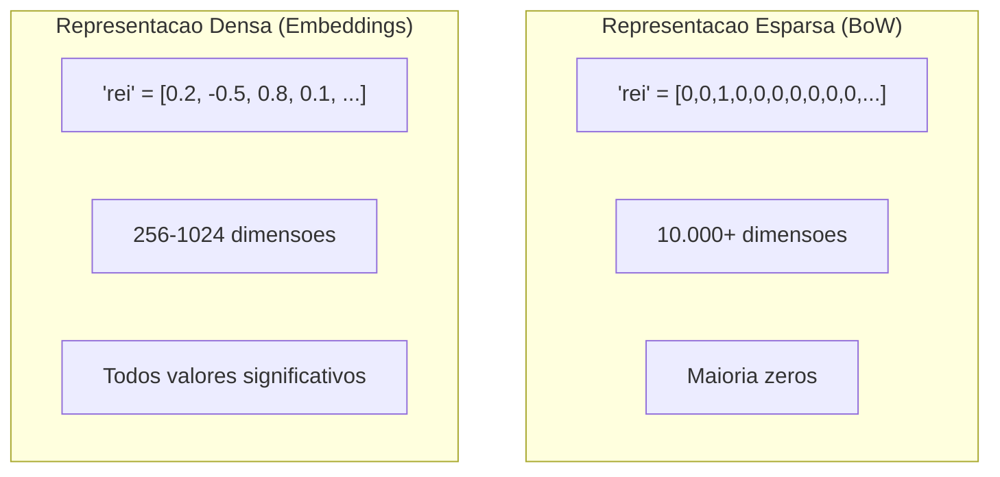

# Embeddings para NLP

> Parte 2 do modulo de NLP: Representacao vetorial densa de texto, modelos para portugues e armazenamento/indexacao de embeddings.

## Visao Geral

| Informacao | Detalhe |
|------------|---------|
| **Nivel** | Intermediario |
| **Tempo Estimado** | 1 hora |
| **Pre-requisitos** | [Fundamentos de NLP](index.md) |

---

## Indice

1. [O que sao Embeddings?](#o-que-sao-embeddings)
2. [Por que usar Embeddings no DestaquesGovBr?](#por-que-usar-embeddings-no-destaquesgovbr)
3. [Modelos para Portugues](#modelos-para-portugues)
4. [Gerando Embeddings com Sentence Transformers](#gerando-embeddings-com-sentence-transformers)
5. [Armazenamento e Indexacao](#armazenamento-e-indexacao-de-embeddings)

---

## O que sao Embeddings?

Embeddings sao representacoes numericas densas de texto em espaco vetorial. Diferente de BoW/TF-IDF (vetores esparsos), embeddings capturam **significado semantico**.



**Propriedade fundamental:** Textos semanticamente similares tem embeddings proximos no espaco vetorial.

```
embed("rei") ≈ embed("monarca") ≈ embed("soberano")
embed("cachorro") ≈ embed("cao") ≈ embed("canino")
```

**Operacoes vetoriais capturam relacoes:**

```
embed("rei") - embed("homem") + embed("mulher") ≈ embed("rainha")
```

---

## Por que usar Embeddings no DestaquesGovBr?

| Caso de Uso | Sem Embeddings | Com Embeddings |
|-------------|----------------|----------------|
| Busca por "medidas economicas" | Encontra apenas docs com essas palavras exatas | Encontra tambem "acoes financeiras", "politica monetaria" |
| Noticias similares | Compara palavras em comum | Compara significado geral |
| Clustering | Baseado em termos | Baseado em temas |
| Deduplicacao | Texto identico | Mesmo conteudo com palavras diferentes |

---

## Modelos para Portugues

### BERTimbau

BERT treinado em portugues brasileiro pela NeuralMind.

```python
from transformers import AutoTokenizer, AutoModel
import torch

# Carregar modelo
tokenizer = AutoTokenizer.from_pretrained("neuralmind/bert-base-portuguese-cased")
model = AutoModel.from_pretrained("neuralmind/bert-base-portuguese-cased")

def get_embedding_bertimbau(texto: str) -> list[float]:
    """Gera embedding usando BERTimbau."""
    inputs = tokenizer(texto, return_tensors="pt", truncation=True, max_length=512)

    with torch.no_grad():
        outputs = model(**inputs)

    # Usar CLS token como representacao do texto
    embedding = outputs.last_hidden_state[:, 0, :].squeeze().tolist()
    return embedding

# Exemplo
texto = "O Ministerio da Saude anunciou novas medidas de vacinacao"
emb = get_embedding_bertimbau(texto)
print(f"Dimensao: {len(emb)}")  # 768
print(f"Primeiros 5 valores: {emb[:5]}")
```

### Multilingual E5

Modelo multilingue otimizado para retrieval. Excelente para busca semantica.

```python
from sentence_transformers import SentenceTransformer

# Carregar modelo
model = SentenceTransformer("intfloat/multilingual-e5-base")

def get_embedding_e5(texto: str, is_query: bool = False) -> list[float]:
    """
    Gera embedding usando E5.

    Args:
        texto: Texto para gerar embedding
        is_query: True se for query de busca, False se for documento
    """
    # E5 requer prefixo especifico
    if is_query:
        texto = f"query: {texto}"
    else:
        texto = f"passage: {texto}"

    embedding = model.encode(texto)
    return embedding.tolist()

# Exemplo
doc = "O Ministerio da Saude anunciou novas medidas de vacinacao"
query = "vacinacao ministerio"

emb_doc = get_embedding_e5(doc, is_query=False)
emb_query = get_embedding_e5(query, is_query=True)

print(f"Dimensao documento: {len(emb_doc)}")  # 768
print(f"Dimensao query: {len(emb_query)}")  # 768
```

---

## Gerando Embeddings com Sentence Transformers

[Sentence Transformers](https://www.sbert.net/) e a biblioteca padrao para gerar embeddings de frases e paragrafos.

```bash
pip install sentence-transformers
```

```python
from sentence_transformers import SentenceTransformer
import numpy as np

# Modelos recomendados para portugues
MODELOS_PT = {
    "multilingual-e5-small": "intfloat/multilingual-e5-small",    # 118M params, 384 dim
    "multilingual-e5-base": "intfloat/multilingual-e5-base",      # 278M params, 768 dim
    "multilingual-e5-large": "intfloat/multilingual-e5-large",    # 560M params, 1024 dim
    "paraphrase-multilingual": "sentence-transformers/paraphrase-multilingual-mpnet-base-v2",  # 278M, 768 dim
}

# Carregar modelo (escolha baseada em recursos disponiveis)
model = SentenceTransformer(MODELOS_PT["multilingual-e5-base"])

# Gerar embeddings para multiplos textos
noticias = [
    "O Ministerio da Saude anunciou novas medidas de vacinacao",
    "Governo federal amplia programa de imunizacao",
    "Ministerio da Educacao divulga resultados do ENEM",
    "Economia brasileira cresce 2% no trimestre",
]

# Gerar embeddings em batch (muito mais eficiente)
embeddings = model.encode(
    [f"passage: {n}" for n in noticias],  # Prefixo para E5
    show_progress_bar=True,
    batch_size=32,
)

print(f"Shape: {embeddings.shape}")  # (4, 768)
print(f"Tipo: {type(embeddings)}")   # numpy.ndarray
```

---

## Armazenamento e Indexacao de Embeddings

Para busca eficiente em milhoes de embeddings, precisamos de indices especializados.

### Opcao 1: NumPy (desenvolvimento/pequena escala)

```python
import numpy as np
from typing import List, Tuple

class EmbeddingStore:
    """Armazenamento simples de embeddings com NumPy."""

    def __init__(self, dimension: int = 768):
        self.dimension = dimension
        self.embeddings: np.ndarray = np.array([])
        self.documents: List[dict] = []

    def add(self, embedding: np.ndarray, document: dict):
        """Adiciona embedding e documento associado."""
        if self.embeddings.size == 0:
            self.embeddings = embedding.reshape(1, -1)
        else:
            self.embeddings = np.vstack([self.embeddings, embedding])
        self.documents.append(document)

    def search(self, query_embedding: np.ndarray, top_k: int = 5) -> List[Tuple[float, dict]]:
        """Busca os top_k documentos mais similares."""
        # Similaridade de cosseno
        query_norm = query_embedding / np.linalg.norm(query_embedding)
        embeddings_norm = self.embeddings / np.linalg.norm(self.embeddings, axis=1, keepdims=True)

        similarities = np.dot(embeddings_norm, query_norm)
        top_indices = np.argsort(similarities)[::-1][:top_k]

        results = []
        for idx in top_indices:
            results.append((float(similarities[idx]), self.documents[idx]))

        return results

    def save(self, path: str):
        """Salva embeddings em disco."""
        np.save(f"{path}_embeddings.npy", self.embeddings)
        import json
        with open(f"{path}_documents.json", "w") as f:
            json.dump(self.documents, f)

    def load(self, path: str):
        """Carrega embeddings do disco."""
        self.embeddings = np.load(f"{path}_embeddings.npy")
        import json
        with open(f"{path}_documents.json") as f:
            self.documents = json.load(f)

# Exemplo de uso
store = EmbeddingStore()

for i, noticia in enumerate(noticias):
    store.add(embeddings[i], {"id": i, "texto": noticia})

# Buscar
query_emb = model.encode(["query: vacinacao governo"])[0]
resultados = store.search(query_emb, top_k=2)

for score, doc in resultados:
    print(f"Score: {score:.3f} | {doc['texto'][:50]}...")
```

### Opcao 2: FAISS (producao/media escala)

[FAISS](https://github.com/facebookresearch/faiss) e a biblioteca do Facebook para busca de vizinhos mais proximos.

```bash
pip install faiss-cpu  # ou faiss-gpu para GPU
```

```python
import faiss
import numpy as np

class FAISSStore:
    """Armazenamento de embeddings com FAISS."""

    def __init__(self, dimension: int = 768):
        self.dimension = dimension
        # Indice de produto interno (equivalente a cosseno para vetores normalizados)
        self.index = faiss.IndexFlatIP(dimension)
        self.documents: List[dict] = []

    def add_batch(self, embeddings: np.ndarray, documents: List[dict]):
        """Adiciona batch de embeddings."""
        # Normalizar para usar produto interno como cosseno
        faiss.normalize_L2(embeddings)
        self.index.add(embeddings.astype(np.float32))
        self.documents.extend(documents)

    def search(self, query_embedding: np.ndarray, top_k: int = 5) -> List[Tuple[float, dict]]:
        """Busca os top_k documentos mais similares."""
        query = query_embedding.reshape(1, -1).astype(np.float32)
        faiss.normalize_L2(query)

        scores, indices = self.index.search(query, top_k)

        results = []
        for score, idx in zip(scores[0], indices[0]):
            if idx >= 0:  # FAISS retorna -1 para slots vazios
                results.append((float(score), self.documents[idx]))

        return results

    def save(self, path: str):
        """Salva indice FAISS em disco."""
        faiss.write_index(self.index, f"{path}.faiss")
        import json
        with open(f"{path}_documents.json", "w") as f:
            json.dump(self.documents, f)

    def load(self, path: str):
        """Carrega indice FAISS do disco."""
        self.index = faiss.read_index(f"{path}.faiss")
        import json
        with open(f"{path}_documents.json") as f:
            self.documents = json.load(f)

# Exemplo de uso
store = FAISSStore()

documents = [{"id": i, "texto": n} for i, n in enumerate(noticias)]
store.add_batch(embeddings.copy(), documents)

query_emb = model.encode(["query: vacinacao governo"])[0]
resultados = store.search(query_emb, top_k=2)

for score, doc in resultados:
    print(f"Score: {score:.3f} | {doc['texto'][:50]}...")
```

---

## Comparacao de Opcoes de Armazenamento

| Opcao | Escala | Velocidade | Complexidade | Uso |
|-------|--------|------------|--------------|-----|
| **NumPy** | < 10k docs | O(n) | Baixa | Desenvolvimento, prototipacao |
| **FAISS** | 10k - 10M docs | O(log n) | Media | Producao, busca rapida |
| **Typesense** | < 1M docs | O(log n) | Media | Busca hibrida integrada |
| **Pinecone/Weaviate** | > 10M docs | O(log n) | Alta | Escala massiva, gerenciado |

---

## Navegacao

| Anterior | Proximo |
|----------|---------|
| [Fundamentos de NLP](index.md) | [Busca Semantica](busca-semantica.md) |

---

> **Proximo:** [Busca Semantica](busca-semantica.md) - Implemente busca semantica e integracao com Typesense
