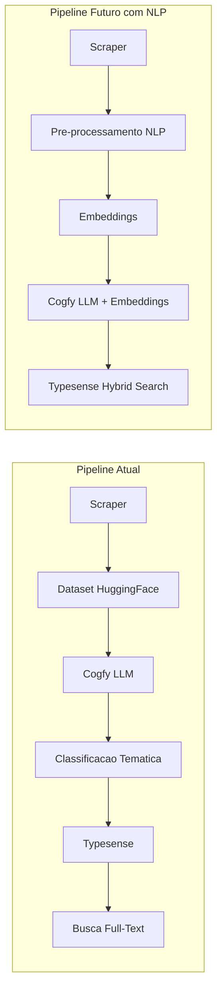
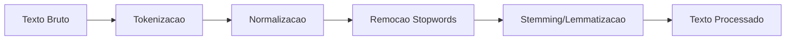
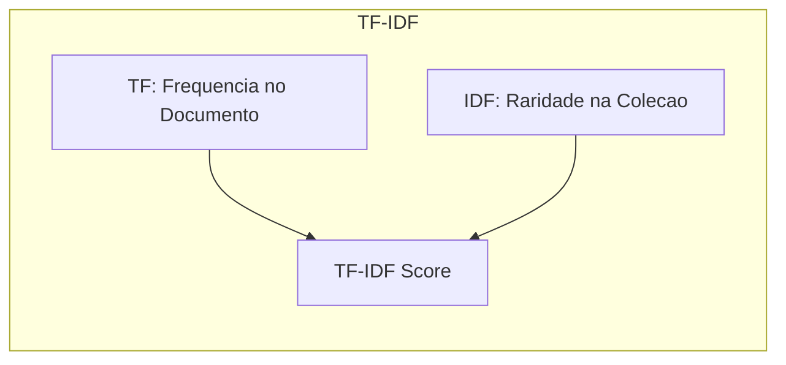

# Pipeline de NLP para Noticias Governamentais

> Guia completo de Processamento de Linguagem Natural (NLP) para desenvolvedores, desde fundamentos ate busca semantica avancada, aplicado ao contexto do DestaquesGovBr.

## Visao Geral

| Informacao | Detalhe |
|------------|---------|
| **Nivel** | Intermediario → Avancado |
| **Tempo Estimado** | 3-4 horas |
| **Pre-requisitos** | Python intermediario, conceitos basicos de ML |
| **Formato** | Jupyter Notebooks (exploracao) + Scripts Python (producao) |

---

## Indice do Modulo

Este modulo esta dividido em 3 partes:

1. **[Fundamentos de NLP](index.md)** (voce esta aqui) - Pre-processamento, Tokenizacao, Representacao de Texto
2. **[Embeddings](embeddings.md)** - Representacao vetorial densa, modelos para portugues
3. **[Busca Semantica](busca-semantica.md)** - Similaridade, busca hibrida, integracao Typesense

---

## Introducao e Motivacao

### O que e NLP?

**Natural Language Processing (NLP)** e a area da inteligencia artificial que permite computadores entenderem, interpretarem e gerarem linguagem humana. No contexto do DestaquesGovBr, usamos NLP para:

- **Classificacao tematica** de noticias governamentais
- **Busca full-text e semantica** no Typesense
- **Extracao de entidades** (orgaos, pessoas, locais)
- **Sumarizacao automatica** de conteudo

### Contexto do DestaquesGovBr



| Caracteristica | Valor |
|----------------|-------|
| **Dataset** | Noticias governamentais em portugues brasileiro |
| **Classificacao** | Via Cogfy (LLM) com arvore tematica |
| **Campo de conteudo** | `content` em formato Markdown |
| **Busca atual** | Full-text via Typesense |
| **Objetivo** | Adicionar busca semantica hibrida |

### Por que NLP no DestaquesGovBr?

| Limitacao Atual | Solucao NLP |
|-----------------|-------------|
| Busca apenas por palavras-chave exatas | Busca semantica encontra conceitos relacionados |
| Dificuldade com sinonimos | Embeddings capturam similaridade semantica |
| Sem agrupamento automatico | Clustering de noticias por similaridade |
| Dependencia total do LLM para classificacao | NLP local como fallback/complemento |

---

## Parte 1: Fundamentos de NLP

### Pre-processamento de Texto em Portugues

O pre-processamento e crucial para NLP. Textos brutos precisam ser limpos e normalizados antes do processamento.



#### Tokenizacao

Tokenizacao divide o texto em unidades menores (tokens), geralmente palavras ou subpalavras.

```python
# Usando spaCy para tokenizacao em portugues
import spacy

# Carregar modelo para portugues
nlp = spacy.load("pt_core_news_sm")

texto = "O Ministerio da Saude anunciou novas medidas para vacinacao."
doc = nlp(texto)

# Tokens
tokens = [token.text for token in doc]
print(tokens)
# Output: ['O', 'Ministerio', 'da', 'Saude', 'anunciou', 'novas', 'medidas', 'para', 'vacinacao', '.']

# Tokens sem pontuacao
tokens_limpos = [token.text for token in doc if not token.is_punct]
print(tokens_limpos)
# Output: ['O', 'Ministerio', 'da', 'Saude', 'anunciou', 'novas', 'medidas', 'para', 'vacinacao']
```

**Usando NLTK:**

```python
import nltk
nltk.download('punkt')

from nltk.tokenize import word_tokenize

texto = "O Ministerio da Saude anunciou novas medidas para vacinacao."
tokens = word_tokenize(texto, language='portuguese')
print(tokens)
# Output: ['O', 'Ministerio', 'da', 'Saude', 'anunciou', 'novas', 'medidas', 'para', 'vacinacao', '.']
```

#### Remocao de Stopwords

Stopwords sao palavras muito frequentes que geralmente nao carregam significado semantico (artigos, preposicoes, etc.).

```python
# Lista de stopwords em portugues brasileiro
STOPWORDS_PTBR = {
    # Artigos
    'o', 'a', 'os', 'as', 'um', 'uma', 'uns', 'umas',
    # Preposicoes
    'de', 'da', 'do', 'das', 'dos', 'em', 'na', 'no', 'nas', 'nos',
    'por', 'para', 'com', 'sem', 'sob', 'sobre', 'entre', 'ate',
    # Conjuncoes
    'e', 'ou', 'mas', 'porem', 'contudo', 'todavia', 'entretanto',
    'que', 'se', 'como', 'quando', 'enquanto', 'porque', 'pois',
    # Pronomes
    'eu', 'tu', 'ele', 'ela', 'nos', 'vos', 'eles', 'elas',
    'me', 'te', 'se', 'lhe', 'nos', 'vos', 'lhes',
    'meu', 'minha', 'teu', 'tua', 'seu', 'sua', 'nosso', 'nossa',
    'este', 'esta', 'esse', 'essa', 'aquele', 'aquela',
    'isto', 'isso', 'aquilo',
    # Verbos auxiliares
    'ser', 'estar', 'ter', 'haver', 'ir', 'vir',
    'foi', 'eram', 'sera', 'esta', 'estao', 'tem', 'tinha', 'ha',
    # Adverbios comuns
    'nao', 'sim', 'muito', 'pouco', 'mais', 'menos', 'bem', 'mal',
    'ja', 'ainda', 'sempre', 'nunca', 'tambem', 'so', 'apenas',
    # Outros
    'ao', 'aos', 'pela', 'pelo', 'pelas', 'pelos',
}

def remover_stopwords(tokens: list[str]) -> list[str]:
    """Remove stopwords de uma lista de tokens."""
    return [t for t in tokens if t.lower() not in STOPWORDS_PTBR]

# Exemplo
tokens = ['O', 'Ministerio', 'da', 'Saude', 'anunciou', 'novas', 'medidas']
tokens_limpos = remover_stopwords(tokens)
print(tokens_limpos)
# Output: ['Ministerio', 'Saude', 'anunciou', 'novas', 'medidas']
```

**Usando spaCy:**

```python
import spacy

nlp = spacy.load("pt_core_news_sm")
texto = "O Ministerio da Saude anunciou novas medidas para vacinacao."
doc = nlp(texto)

# Tokens sem stopwords
tokens_sem_stopwords = [token.text for token in doc if not token.is_stop and not token.is_punct]
print(tokens_sem_stopwords)
# Output: ['Ministerio', 'Saude', 'anunciou', 'novas', 'medidas', 'vacinacao']
```

#### Stemming vs Lemmatizacao

| Tecnica | Descricao | Exemplo | Vantagem | Desvantagem |
|---------|-----------|---------|----------|-------------|
| **Stemming** | Corta sufixos para obter raiz | "correndo" → "corr" | Rapido, simples | Pode gerar palavras invalidas |
| **Lemmatizacao** | Encontra forma canonica | "correndo" → "correr" | Palavras validas | Mais lento, requer modelo |

```python
# Stemming com NLTK (RSLPStemmer para portugues)
from nltk.stem import RSLPStemmer

stemmer = RSLPStemmer()

palavras = ['correndo', 'correr', 'corri', 'anunciou', 'anunciando', 'ministerios']
stems = [stemmer.stem(p) for p in palavras]
print(list(zip(palavras, stems)))
# Output: [('correndo', 'corr'), ('correr', 'corr'), ('corri', 'corr'),
#          ('anunciou', 'anunci'), ('anunciando', 'anunci'), ('ministerios', 'ministeri')]
```

```python
# Lemmatizacao com spaCy
import spacy

nlp = spacy.load("pt_core_news_sm")

texto = "Os ministerios anunciaram novas medidas governamentais"
doc = nlp(texto)

lemmas = [(token.text, token.lemma_) for token in doc]
print(lemmas)
# Output: [('Os', 'o'), ('ministerios', 'ministerio'), ('anunciaram', 'anunciar'),
#          ('novas', 'novo'), ('medidas', 'medida'), ('governamentais', 'governamental')]
```

**Recomendacao para DestaquesGovBr:**

> Para **busca e indexacao**, use **stemming** (mais rapido, menor armazenamento).
> Para **analise semantica e classificacao**, use **lemmatizacao** (mais preciso).

### Representacao de Texto

#### Bag of Words (BoW)

Representa texto como vetor de frequencia de palavras. Ignora ordem e gramatica.

```python
from sklearn.feature_extraction.text import CountVectorizer

documentos = [
    "O Ministerio da Saude anunciou vacinacao",
    "Governo federal lanca programa de saude",
    "Ministerio da Educacao divulga resultados do ENEM",
]

# Criar vetorizador
vectorizer = CountVectorizer()
X = vectorizer.fit_transform(documentos)

# Ver vocabulario
print("Vocabulario:", vectorizer.get_feature_names_out())
# Output: ['anunciou', 'da', 'divulga', 'do', 'educacao', 'enem', 'federal',
#          'governo', 'lanca', 'ministerio', 'programa', 'resultados', 'saude', 'vacinacao']

# Ver matriz
print("Matriz BoW:")
print(X.toarray())
# Output:
# [[1 1 0 0 0 0 0 0 0 1 0 0 1 1]
#  [0 0 0 0 0 0 1 1 1 0 1 0 1 0]
#  [0 1 1 1 1 1 0 0 0 1 0 1 0 0]]
```

#### TF-IDF (Term Frequency-Inverse Document Frequency)

Pesa termos pela frequencia no documento vs frequencia na colecao. Termos raros ganham mais peso.



**Formula:**

$$TF\text{-}IDF(t, d) = TF(t, d) \times \log\left(\frac{N}{DF(t)}\right)$$

Onde:
- $TF(t, d)$ = frequencia do termo $t$ no documento $d$
- $N$ = numero total de documentos
- $DF(t)$ = numero de documentos contendo o termo $t$

```python
from sklearn.feature_extraction.text import TfidfVectorizer

documentos = [
    "O Ministerio da Saude anunciou vacinacao",
    "Governo federal lanca programa de saude",
    "Ministerio da Educacao divulga resultados do ENEM",
]

# Criar vetorizador TF-IDF
tfidf = TfidfVectorizer()
X = tfidf.fit_transform(documentos)

# Ver vocabulario com pesos
feature_names = tfidf.get_feature_names_out()
print("Matriz TF-IDF (documento 0):")
for idx, score in enumerate(X[0].toarray()[0]):
    if score > 0:
        print(f"  {feature_names[idx]}: {score:.3f}")
# Output:
#   anunciou: 0.447
#   da: 0.330
#   ministerio: 0.330
#   saude: 0.330
#   vacinacao: 0.447

# Note: "anunciou" e "vacinacao" tem peso maior (aparecem so neste doc)
# "ministerio", "da", "saude" tem peso menor (aparecem em outros docs)
```

### Bibliotecas Essenciais

#### spaCy

Framework industrial para NLP. Excelente para producao.

```bash
# Instalacao
pip install spacy

# Baixar modelo portugues
python -m spacy download pt_core_news_sm   # Pequeno (15MB)
python -m spacy download pt_core_news_md   # Medio (45MB)
python -m spacy download pt_core_news_lg   # Grande (560MB)
```

```python
import spacy

nlp = spacy.load("pt_core_news_sm")

texto = "O presidente Lula visitou Brasilia ontem."
doc = nlp(texto)

# Analise completa
for token in doc:
    print(f"{token.text:12} | POS: {token.pos_:6} | DEP: {token.dep_:10} | LEMMA: {token.lemma_}")

# Output:
# O            | POS: DET    | DEP: det        | LEMMA: o
# presidente   | POS: NOUN   | DEP: nsubj      | LEMMA: presidente
# Lula         | POS: PROPN  | DEP: appos      | LEMMA: Lula
# visitou      | POS: VERB   | DEP: ROOT       | LEMMA: visitar
# Brasilia     | POS: PROPN  | DEP: obj        | LEMMA: Brasilia
# ontem        | POS: ADV    | DEP: advmod     | LEMMA: ontem
# .            | POS: PUNCT  | DEP: punct      | LEMMA: .

# Entidades nomeadas
for ent in doc.ents:
    print(f"{ent.text} -> {ent.label_}")
# Output:
# Lula -> PER
# Brasilia -> LOC
```

#### NLTK

Biblioteca academica com muitos recursos para portugues.

```bash
pip install nltk
```

```python
import nltk

# Baixar recursos necessarios
nltk.download('punkt')
nltk.download('stopwords')
nltk.download('rslp')  # Stemmer portugues
nltk.download('mac_morpho')  # Corpus portugues

from nltk.corpus import stopwords
from nltk.tokenize import word_tokenize
from nltk.stem import RSLPStemmer

# Stopwords em portugues
stops_pt = set(stopwords.words('portuguese'))
print(f"NLTK tem {len(stops_pt)} stopwords para portugues")

# Pipeline completo
texto = "Os ministerios do governo anunciaram novas medidas"
tokens = word_tokenize(texto, language='portuguese')
tokens_sem_stops = [t for t in tokens if t.lower() not in stops_pt]
stemmer = RSLPStemmer()
stems = [stemmer.stem(t) for t in tokens_sem_stops]

print(f"Original: {tokens}")
print(f"Sem stopwords: {tokens_sem_stops}")
print(f"Stems: {stems}")
```

#### HuggingFace Transformers

Biblioteca para modelos de deep learning (BERT, GPT, etc.).

```bash
pip install transformers torch
```

```python
from transformers import pipeline

# Pipeline de classificacao de sentimento
classifier = pipeline("sentiment-analysis", model="neuralmind/bert-base-portuguese-cased")

textos = [
    "O governo anunciou otimas medidas para a economia",
    "Crise economica preocupa ministros do governo",
]

for texto in textos:
    resultado = classifier(texto)
    print(f"Texto: {texto[:50]}...")
    print(f"Sentimento: {resultado[0]['label']} (score: {resultado[0]['score']:.3f})")
```

---

## Navegacao

| Anterior | Proximo |
|----------|---------|
| [Explorando o Dataset](../explorando-dataset/index.md) | [Embeddings](embeddings.md) |

---

> **Proximo:** [Embeddings](embeddings.md) - Aprenda sobre representacao vetorial densa e modelos para portugues
