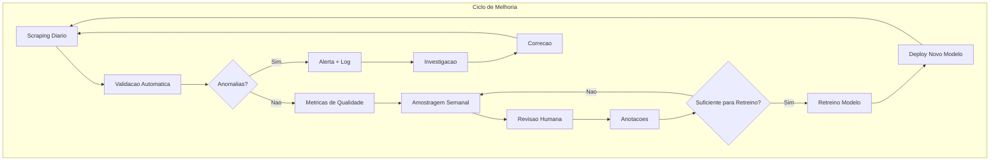

# Feedback Loop

> Sistema completo de feedback loop para melhoria continua do pipeline, incluindo amostragem para revisao humana, anotacao de dados, melhoria continua e relatorios de qualidade.

---

## Parte 1: Amostragem para Revisao Humana

```python
# feedback/sampler.py
import pandas as pd
import numpy as np
from typing import List, Dict, Any, Optional
from datetime import datetime

class HumanReviewSampler:
    """
    Amostragem inteligente para revisao humana.

    Estrategias:
    1. Aleatorio estratificado por orgao
    2. Documentos com baixa confianca
    3. Novos temas/orgaos
    4. Casos de borda (muito curto, muito longo)
    """

    def __init__(self, df: pd.DataFrame):
        self.df = df

    def stratified_sample(
        self,
        n_per_agency: int = 5,
        agencies: Optional[List[str]] = None
    ) -> pd.DataFrame:
        """Amostra estratificada por orgao."""
        if agencies:
            df_filtered = self.df[self.df['agency'].isin(agencies)]
        else:
            df_filtered = self.df

        samples = []
        for agency in df_filtered['agency'].unique():
            agency_docs = df_filtered[df_filtered['agency'] == agency]
            n = min(n_per_agency, len(agency_docs))
            samples.append(agency_docs.sample(n))

        return pd.concat(samples) if samples else pd.DataFrame()

    def low_confidence_sample(
        self,
        n: int = 50,
        confidence_col: str = 'cogfy_confidence'
    ) -> pd.DataFrame:
        """Amostra documentos com baixa confianca de classificacao."""
        if confidence_col not in self.df.columns:
            # Se nao houver coluna de confianca, usar heuristica
            # Documentos sem tema ou com muitos temas
            def confidence_proxy(row):
                themes = row.get('themes', [])
                if not themes:
                    return 0.0
                if len(themes) > 5:
                    return 0.3
                return 0.8

            self.df['_confidence'] = self.df.apply(confidence_proxy, axis=1)
            confidence_col = '_confidence'

        return self.df.nsmallest(n, confidence_col)

    def edge_cases_sample(self, n: int = 30) -> pd.DataFrame:
        """Amostra casos de borda para revisao."""
        samples = []

        # Titulos muito curtos
        short_titles = self.df[self.df['title'].str.len() < 30].head(n // 3)
        samples.append(short_titles)

        # Bodies muito curtos
        if 'body' in self.df.columns:
            short_body = self.df[
                (self.df['body'].notna()) &
                (self.df['body'].str.len() < 200)
            ].head(n // 3)
            samples.append(short_body)

        # Muitos temas (possivel erro)
        if 'themes' in self.df.columns:
            many_themes = self.df[
                self.df['themes'].apply(
                    lambda x: len(x) > 5 if isinstance(x, list) else False
                )
            ].head(n // 3)
            samples.append(many_themes)

        return pd.concat(samples).drop_duplicates() if samples else pd.DataFrame()

    def create_review_batch(
        self,
        total_size: int = 100
    ) -> Dict[str, pd.DataFrame]:
        """Cria lote balanceado para revisao."""
        return {
            'stratified': self.stratified_sample(n_per_agency=total_size // 20),
            'low_confidence': self.low_confidence_sample(n=total_size // 3),
            'edge_cases': self.edge_cases_sample(n=total_size // 3),
        }

    def export_for_annotation(
        self,
        sample: pd.DataFrame,
        output_path: str,
        columns: Optional[List[str]] = None
    ):
        """Exporta amostra para anotacao."""
        if columns is None:
            columns = ['unique_id', 'agency', 'title', 'body', 'themes', 'cogfy_classification', 'url']

        export_cols = [c for c in columns if c in sample.columns]

        # Adicionar colunas para anotacao
        sample_export = sample[export_cols].copy()
        sample_export['human_classification'] = ''
        sample_export['human_themes'] = ''
        sample_export['quality_score'] = ''  # 1-5
        sample_export['notes'] = ''

        sample_export.to_csv(output_path, index=False)
        print(f"Exportado {len(sample_export)} documentos para {output_path}")

# Uso
df = pd.read_parquet("documents.parquet")
sampler = HumanReviewSampler(df)

# Criar lote de revisao
batch = sampler.create_review_batch(total_size=100)
print(f"Estratificado: {len(batch['stratified'])}")
print(f"Baixa confianca: {len(batch['low_confidence'])}")
print(f"Casos de borda: {len(batch['edge_cases'])}")

# Exportar para CSV
sampler.export_for_annotation(
    pd.concat(batch.values()).drop_duplicates(),
    "review_batch_20240115.csv"
)
```

---

## Parte 2: Anotacao de Dados para Retreino

```python
# feedback/annotation_manager.py
import pandas as pd
from typing import Dict, List, Any, Optional
from datetime import datetime
import json

class AnnotationManager:
    """Gerencia anotacoes humanas para retreino do modelo."""

    def __init__(self, annotations_path: str = "annotations/"):
        self.annotations_path = annotations_path
        self.annotations: List[Dict[str, Any]] = []

    def load_annotations(self, filepath: str) -> pd.DataFrame:
        """Carrega anotacoes de CSV."""
        df = pd.read_csv(filepath)

        # Validar colunas obrigatorias
        required = ['unique_id', 'human_classification', 'quality_score']
        missing = [c for c in required if c not in df.columns]
        if missing:
            raise ValueError(f"Colunas faltando: {missing}")

        # Filtrar apenas linhas anotadas
        annotated = df[
            (df['human_classification'].notna()) &
            (df['human_classification'] != '')
        ]

        return annotated

    def compute_agreement(
        self,
        df: pd.DataFrame,
        model_col: str = 'cogfy_classification',
        human_col: str = 'human_classification'
    ) -> Dict[str, float]:
        """Calcula concordancia modelo vs humano."""
        valid = df[(df[model_col].notna()) & (df[human_col].notna())]

        if len(valid) == 0:
            return {'agreement': 0, 'sample_size': 0}

        exact_match = (valid[model_col] == valid[human_col]).mean()

        return {
            'exact_agreement': exact_match,
            'sample_size': len(valid),
        }

    def identify_disagreements(
        self,
        df: pd.DataFrame,
        model_col: str = 'cogfy_classification',
        human_col: str = 'human_classification'
    ) -> pd.DataFrame:
        """Identifica casos de discordancia para analise."""
        valid = df[(df[model_col].notna()) & (df[human_col].notna())]
        disagreements = valid[valid[model_col] != valid[human_col]]

        return disagreements[[
            'unique_id', 'title', model_col, human_col, 'quality_score', 'notes'
        ]]

    def generate_training_data(
        self,
        df: pd.DataFrame,
        min_quality_score: int = 4
    ) -> List[Dict[str, str]]:
        """
        Gera dados de treinamento a partir de anotacoes.

        Formato: [{"text": "...", "label": "..."}]
        """
        high_quality = df[df['quality_score'] >= min_quality_score]

        training_data = []
        for _, row in high_quality.iterrows():
            training_data.append({
                'unique_id': row['unique_id'],
                'text': row.get('title', '') + ' ' + row.get('body', ''),
                'label': row['human_classification'],
                'themes': row.get('human_themes', row.get('themes', [])),
            })

        return training_data

    def save_training_dataset(
        self,
        training_data: List[Dict],
        output_path: str
    ):
        """Salva dataset de treinamento."""
        with open(output_path, 'w', encoding='utf-8') as f:
            json.dump(training_data, f, ensure_ascii=False, indent=2)

        print(f"Salvo {len(training_data)} exemplos em {output_path}")

    def get_annotation_stats(self, df: pd.DataFrame) -> Dict[str, Any]:
        """Estatisticas de anotacao."""
        return {
            'total_annotated': len(df),
            'quality_distribution': df['quality_score'].value_counts().to_dict(),
            'mean_quality': df['quality_score'].mean(),
            'by_agency': df['agency'].value_counts().to_dict(),
        }

# Uso
manager = AnnotationManager()

# Carregar anotacoes
annotations = manager.load_annotations("review_batch_20240115_annotated.csv")
print(f"Anotacoes carregadas: {len(annotations)}")

# Verificar concordancia
agreement = manager.compute_agreement(annotations)
print(f"Concordancia modelo/humano: {agreement['exact_agreement']:.1%}")

# Gerar dados de treino
training_data = manager.generate_training_data(annotations, min_quality_score=4)
manager.save_training_dataset(training_data, "training_data_20240115.json")
```

---

## Parte 3: Melhoria Continua do Pipeline



```python
# feedback/continuous_improvement.py
from typing import Dict, Any, List
from datetime import datetime, timedelta
import pandas as pd
from dataclasses import dataclass

@dataclass
class ImprovementCycle:
    """Registro de um ciclo de melhoria."""
    cycle_id: str
    start_date: datetime
    end_date: datetime
    annotations_count: int
    model_version_before: str
    model_version_after: str
    agreement_before: float
    agreement_after: float
    issues_fixed: List[str]

class ContinuousImprovement:
    """Gerencia o ciclo de melhoria continua."""

    def __init__(self):
        self.cycles: List[ImprovementCycle] = []
        self.current_metrics: Dict[str, float] = {}

    def should_trigger_review(
        self,
        current_metrics: Dict[str, Any],
        thresholds: Dict[str, float] = None
    ) -> Dict[str, Any]:
        """
        Determina se deve disparar ciclo de revisao.

        Criterios:
        - Cobertura de classificacao < 90%
        - Taxa de erro > 5%
        - Drift detectado
        - Tempo desde ultima revisao > 7 dias
        """
        if thresholds is None:
            thresholds = {
                'min_coverage': 0.90,
                'max_error_rate': 0.05,
                'max_days_since_review': 7,
            }

        triggers = []

        # Cobertura baixa
        coverage = current_metrics.get('classification_coverage', 1.0)
        if coverage < thresholds['min_coverage']:
            triggers.append({
                'reason': 'low_coverage',
                'value': coverage,
                'threshold': thresholds['min_coverage'],
            })

        # Taxa de erro alta
        error_rate = current_metrics.get('error_rate', 0.0)
        if error_rate > thresholds['max_error_rate']:
            triggers.append({
                'reason': 'high_error_rate',
                'value': error_rate,
                'threshold': thresholds['max_error_rate'],
            })

        # Drift detectado
        if current_metrics.get('drift_detected', False):
            triggers.append({
                'reason': 'drift_detected',
                'details': current_metrics.get('drift_details', {}),
            })

        return {
            'should_review': len(triggers) > 0,
            'triggers': triggers,
            'priority': 'high' if len(triggers) > 1 else 'medium',
        }

    def generate_improvement_report(
        self,
        start_date: datetime,
        end_date: datetime
    ) -> Dict[str, Any]:
        """Gera relatorio de melhorias no periodo."""
        cycles_in_period = [
            c for c in self.cycles
            if start_date <= c.start_date <= end_date
        ]

        if not cycles_in_period:
            return {'message': 'Nenhum ciclo de melhoria no periodo'}

        total_annotations = sum(c.annotations_count for c in cycles_in_period)
        avg_improvement = sum(
            c.agreement_after - c.agreement_before
            for c in cycles_in_period
        ) / len(cycles_in_period)

        return {
            'period': {
                'start': start_date.isoformat(),
                'end': end_date.isoformat(),
            },
            'cycles_count': len(cycles_in_period),
            'total_annotations': total_annotations,
            'average_agreement_improvement': avg_improvement,
            'issues_fixed': [
                issue
                for c in cycles_in_period
                for issue in c.issues_fixed
            ],
        }

    def track_metrics_over_time(
        self,
        metrics_history: List[Dict[str, Any]]
    ) -> pd.DataFrame:
        """Cria DataFrame com evolucao das metricas."""
        return pd.DataFrame(metrics_history)

# Uso
improvement = ContinuousImprovement()

current_metrics = {
    'classification_coverage': 0.85,  # Abaixo do threshold
    'error_rate': 0.03,
    'drift_detected': True,
    'drift_details': {'type': 'agency_drift'},
}

decision = improvement.should_trigger_review(current_metrics)
if decision['should_review']:
    print(f"DISPARAR REVISAO - Prioridade: {decision['priority']}")
    for trigger in decision['triggers']:
        print(f"  - {trigger['reason']}")
```

---

## Parte 4: Relatorios de Qualidade

```python
# feedback/quality_report.py
import pandas as pd
from typing import Dict, Any
from datetime import datetime
import json

class QualityReportGenerator:
    """Gera relatorios de qualidade do pipeline."""

    def __init__(self, df: pd.DataFrame):
        self.df = df
        self.report_date = datetime.now()

    def generate_daily_report(self) -> Dict[str, Any]:
        """Relatorio diario de qualidade."""
        today = self.report_date.date()
        today_df = self.df[self.df['scraped_at'].dt.date == today]

        return {
            'report_type': 'daily',
            'date': str(today),
            'generated_at': self.report_date.isoformat(),
            'summary': {
                'documents_scraped': len(today_df),
                'unique_agencies': today_df['agency'].nunique(),
                'with_classification': today_df['cogfy_classification'].notna().sum(),
                'with_summary': today_df['cogfy_summary'].notna().sum(),
            },
            'coverage': {
                'classification_rate': today_df['cogfy_classification'].notna().mean(),
                'summary_rate': today_df['cogfy_summary'].notna().mean(),
            },
            'by_agency': today_df.groupby('agency').size().to_dict(),
        }

    def generate_weekly_report(self) -> Dict[str, Any]:
        """Relatorio semanal de qualidade."""
        from datetime import timedelta

        week_start = self.report_date - timedelta(days=7)
        week_df = self.df[self.df['scraped_at'] >= week_start]

        daily_counts = week_df.groupby(
            week_df['scraped_at'].dt.date
        ).size()

        return {
            'report_type': 'weekly',
            'period': {
                'start': str(week_start.date()),
                'end': str(self.report_date.date()),
            },
            'generated_at': self.report_date.isoformat(),
            'summary': {
                'total_documents': len(week_df),
                'daily_average': daily_counts.mean(),
                'daily_min': daily_counts.min(),
                'daily_max': daily_counts.max(),
            },
            'quality_metrics': {
                'classification_coverage': week_df['cogfy_classification'].notna().mean(),
                'summary_coverage': week_df['cogfy_summary'].notna().mean(),
                'duplicate_rate': week_df.duplicated('unique_id').mean(),
            },
            'trend': {
                'daily_counts': {str(k): v for k, v in daily_counts.items()},
            },
        }

    def generate_html_report(self, report: Dict[str, Any]) -> str:
        """Gera versao HTML do relatorio."""
        html = f"""
        <!DOCTYPE html>
        <html>
        <head>
            <title>Relatorio de Qualidade - DestaquesGovBr</title>
            <style>
                body {{ font-family: Arial, sans-serif; margin: 40px; }}
                h1 {{ color: #2c3e50; }}
                .metric {{
                    background: #f8f9fa;
                    padding: 15px;
                    margin: 10px 0;
                    border-radius: 5px;
                }}
                .metric-value {{
                    font-size: 24px;
                    font-weight: bold;
                    color: #3498db;
                }}
                .warning {{ color: #e74c3c; }}
                .success {{ color: #27ae60; }}
            </style>
        </head>
        <body>
            <h1>Relatorio de Qualidade - {report['report_type'].title()}</h1>
            <p>Gerado em: {report['generated_at']}</p>

            <h2>Resumo</h2>
            <div class="metric">
                <span class="metric-value">{report['summary'].get('documents_scraped', report['summary'].get('total_documents', 0))}</span>
                <span>Documentos processados</span>
            </div>

            <h2>Cobertura</h2>
            <div class="metric">
                <span class="metric-value">{report.get('coverage', report.get('quality_metrics', {})).get('classification_rate', 0):.1%}</span>
                <span>Taxa de classificacao</span>
            </div>

        </body>
        </html>
        """
        return html

    def save_report(
        self,
        report: Dict[str, Any],
        output_path: str,
        format: str = 'json'
    ):
        """Salva relatorio em arquivo."""
        if format == 'json':
            with open(output_path, 'w', encoding='utf-8') as f:
                json.dump(report, f, ensure_ascii=False, indent=2, default=str)
        elif format == 'html':
            html = self.generate_html_report(report)
            with open(output_path, 'w', encoding='utf-8') as f:
                f.write(html)

        print(f"Relatorio salvo em {output_path}")

# Uso
df = pd.read_parquet("documents.parquet")
generator = QualityReportGenerator(df)

# Relatorio diario
daily = generator.generate_daily_report()
generator.save_report(daily, "reports/daily_20240115.json")

# Relatorio semanal
weekly = generator.generate_weekly_report()
generator.save_report(weekly, "reports/weekly_20240115.html", format='html')
```

---

## Exercicios Praticos

### Exercicio 1: Implementar Validacao de Schema

**Objetivo**: Criar validador Pydantic para novos documentos.

**Arquivo**: `notebooks/exercicio_01_validacao.ipynb`

```python
# Celula 1: Setup
import pandas as pd
from pydantic import BaseModel, Field, validator
from typing import Optional, List
from datetime import date

# TODO: Implemente o schema GovBrDocument
class GovBrDocument(BaseModel):
    # Adicione os campos obrigatorios:
    # - unique_id (str, 32 caracteres)
    # - agency (str, 2-100 caracteres)
    # - title (str, 10-500 caracteres)
    # - published_at (date)
    # - url (str, URL valida)
    pass

# Celula 2: Teste com dados de exemplo
test_documents = [
    {
        "unique_id": "a1b2c3d4e5f6a1b2c3d4e5f6a1b2c3d4",
        "agency": "mec",
        "title": "MEC anuncia novo programa",
        "published_at": "2024-01-15",
        "url": "https://www.gov.br/mec/exemplo",
    },
    {
        "unique_id": "invalido",  # Deve falhar
        "agency": "",
        "title": "x",
        "published_at": "invalid-date",
        "url": "not-a-url",
    },
]

# TODO: Valide cada documento e imprima erros

# Celula 3: Carregue dados reais e valide
# df = pd.read_parquet("path/to/documents.parquet")
# Valide uma amostra de 100 documentos
```

**Criterios de avaliacao**:
- [ ] Schema com todos os campos obrigatorios
- [ ] Validators customizados funcionando
- [ ] Tratamento de erros adequado
- [ ] Relatorio de validacao gerado

---

### Exercicio 2: Dashboard de Metricas de Qualidade

**Objetivo**: Criar dashboard simples com Streamlit.

**Arquivo**: `scripts/quality_dashboard.py`

```python
# quality_dashboard.py
# Execute com: streamlit run quality_dashboard.py

import streamlit as st
import pandas as pd
import plotly.express as px
from datetime import datetime, timedelta

st.set_page_config(page_title="Qualidade - DestaquesGovBr", layout="wide")

st.title("Dashboard de Qualidade de Dados")

# TODO: Carregue os dados
# df = pd.read_parquet("documents.parquet")
# Use dados de exemplo por enquanto:
df = pd.DataFrame({
    'agency': ['mec', 'ms', 'mec', 'mf'] * 100,
    'scraped_at': pd.date_range('2024-01-01', periods=400, freq='H'),
    'cogfy_classification': ['educacao', None, 'educacao', 'economia'] * 100,
    'themes': [['educacao'], [], ['educacao', 'bolsas'], ['economia']] * 100,
})

# Sidebar
st.sidebar.header("Filtros")
agencies = st.sidebar.multiselect(
    "Orgaos",
    options=df['agency'].unique(),
    default=df['agency'].unique()
)

# Metricas principais
col1, col2, col3, col4 = st.columns(4)

with col1:
    st.metric("Total Documentos", len(df))

with col2:
    coverage = df['cogfy_classification'].notna().mean()
    st.metric("Cobertura Classificacao", f"{coverage:.1%}")

# TODO: Adicione mais metricas
# - Taxa de resumos
# - Documentos por dia
# - Taxa de duplicatas

# Graficos
st.subheader("Documentos por Dia")
# TODO: Crie grafico de linha com volume diario

st.subheader("Distribuicao por Orgao")
# TODO: Crie grafico de barras

st.subheader("Cobertura de Classificacao por Orgao")
# TODO: Crie grafico mostrando cobertura por orgao
```

**Criterios de avaliacao**:
- [ ] Dashboard funcional com Streamlit
- [ ] Pelo menos 4 metricas principais
- [ ] Graficos de tendencia
- [ ] Filtros interativos

---

### Exercicio 3: Identificar Problemas de Classificacao

**Objetivo**: Analisar e reportar problemas na classificacao do Cogfy.

**Arquivo**: `notebooks/exercicio_03_classificacao.ipynb`

```python
# Celula 1: Carregar dados
import pandas as pd

# df = pd.read_parquet("documents.parquet")

# Celula 2: Analise de cobertura
# TODO: Calcule:
# - % de documentos sem classificacao
# - Orgaos com menor cobertura
# - Tendencia de cobertura nos ultimos 30 dias

# Celula 3: Consistencia tematica
# TODO: Verifique:
# - Temas invalidos (nao estao na hierarquia)
# - Inconsistencias hierarquicas
# - Temas mais frequentes

# Celula 4: Casos problematicos
# TODO: Identifique:
# - Documentos com muitos temas (>5)
# - Documentos com temas conflitantes
# - Possiveis erros de classificacao (heuristica)

# Celula 5: Gerar relatorio
# TODO: Exporte relatorio com:
# - Resumo executivo
# - Lista de problemas encontrados
# - Recomendacoes de melhoria
```

**Criterios de avaliacao**:
- [ ] Analise de cobertura completa
- [ ] Identificacao de inconsistencias
- [ ] Lista de casos problematicos
- [ ] Relatorio com recomendacoes

---

### Exercicio 4: Propor Melhorias Baseadas em Erros

**Objetivo**: Analisar padroes de erro e propor melhorias.

**Arquivo**: `notebooks/exercicio_04_melhorias.ipynb`

```python
# Celula 1: Carregar dados e anotacoes
import pandas as pd

# df = pd.read_parquet("documents.parquet")
# annotations = pd.read_csv("annotations/reviewed_batch.csv")

# Celula 2: Analise de discordancia modelo vs humano
# TODO:
# - Calcule taxa de concordancia
# - Identifique categorias com mais discordancia
# - Agrupe erros por tipo

# Celula 3: Analise de causa raiz
# TODO:
# - Documentos curtos tem mais erros?
# - Algum orgao tem mais erros?
# - Temas especificos sao problematicos?

# Celula 4: Proposta de melhorias
# TODO: Documente:
# - Problemas identificados (com exemplos)
# - Hipoteses de causa
# - Propostas de solucao
# - Prioridade (alta/media/baixa)
# - Esforco estimado

# Formato sugerido:
improvement_proposals = [
    {
        "problema": "Documentos de saude classificados como assistencia social",
        "exemplos": ["unique_id_1", "unique_id_2"],
        "hipotese": "Termos ambiguos como 'programa', 'beneficio'",
        "solucao": "Adicionar exemplos especificos no prompt do Cogfy",
        "prioridade": "alta",
        "esforco": "baixo",
    },
    # ...
]
```

**Criterios de avaliacao**:
- [ ] Analise estatistica de erros
- [ ] Identificacao de padroes
- [ ] Pelo menos 3 propostas de melhoria
- [ ] Priorizacao clara

---

## Troubleshooting

### Problema: Validacao Pydantic muito lenta

**Sintoma**: Validar milhares de documentos demora varios minutos.

**Solucao**:
```python
# Use validacao em lote com try/except rapido
from pydantic import ValidationError

def fast_validate(documents: list) -> tuple:
    valid, invalid = [], []
    for doc in documents:
        try:
            # Validacao minima primeiro
            if not doc.get('unique_id') or len(doc['unique_id']) != 32:
                invalid.append(doc)
                continue
            valid.append(GovBrDocument(**doc))
        except ValidationError:
            invalid.append(doc)
    return valid, invalid

# Ou use multiprocessing
from concurrent.futures import ProcessPoolExecutor

def validate_chunk(chunk):
    return [GovBrDocument(**d) for d in chunk]

with ProcessPoolExecutor(max_workers=4) as executor:
    chunks = [documents[i:i+1000] for i in range(0, len(documents), 1000)]
    results = list(executor.map(validate_chunk, chunks))
```

---

### Problema: Metricas ROUGE/BERTScore muito lentas

**Sintoma**: Calcular metricas de qualidade de resumo demora horas.

**Solucao**:
```python
# 1. Use amostragem
sample = df.sample(min(100, len(df)))

# 2. Para BERTScore, use batch menor e GPU
from bert_score import score
P, R, F1 = score(
    summaries,
    references,
    lang='pt',
    batch_size=32,  # Reduzir se OOM
    device='cuda'   # Usar GPU
)

# 3. Cache resultados
import joblib

cache_file = "rouge_cache.pkl"
if os.path.exists(cache_file):
    results = joblib.load(cache_file)
else:
    results = compute_rouge(summaries, references)
    joblib.dump(results, cache_file)
```

---

### Problema: Drift detectado mas nao ha problema real

**Sintoma**: Alertas de drift frequentes sem problemas reais.

**Solucao**:
```python
# 1. Ajuste thresholds
detector = DriftDetector(df)
report = detector.detect_volume_drift(
    threshold_std=3.0  # Aumentar de 2.0 para 3.0
)

# 2. Ignore variacoes sazonais
# Finais de semana naturalmente tem menos noticias
df['is_weekend'] = df['scraped_at'].dt.dayofweek >= 5
df_weekdays = df[~df['is_weekend']]

# 3. Use baseline mais longo
report = detector.detect_volume_drift(
    baseline_days=90  # 3 meses em vez de 30 dias
)
```

---

### Problema: Duplicatas nao detectadas

**Sintoma**: Documentos similares com unique_ids diferentes.

**Solucao**:
```python
# 1. Normalize campos antes de gerar unique_id
import unicodedata
import re

def normalize_text(text: str) -> str:
    # Remove acentos
    text = unicodedata.normalize('NFD', text)
    text = text.encode('ascii', 'ignore').decode('utf-8')
    # Minusculas e sem espacos extras
    text = text.lower().strip()
    text = re.sub(r'\s+', ' ', text)
    return text

def generate_robust_unique_id(agency, published_at, title):
    normalized_title = normalize_text(title)
    content = f"{agency}{published_at}{normalized_title}"
    return hashlib.md5(content.encode()).hexdigest()

# 2. Use fuzzy matching para detectar duplicatas semanticas
from rapidfuzz import fuzz

def find_near_duplicates(titles, threshold=90):
    duplicates = []
    for i, t1 in enumerate(titles):
        for j, t2 in enumerate(titles[i+1:], i+1):
            similarity = fuzz.ratio(t1, t2)
            if similarity >= threshold:
                duplicates.append((i, j, similarity))
    return duplicates
```

---

### Problema: Anotacoes inconsistentes entre revisores

**Sintoma**: Diferentes revisores classificam o mesmo documento de formas diferentes.

**Solucao**:
```python
# 1. Calcule Inter-Annotator Agreement (IAA)
from sklearn.metrics import cohen_kappa_score

def compute_iaa(annotator1_labels, annotator2_labels):
    """Calcula Kappa de Cohen."""
    return cohen_kappa_score(annotator1_labels, annotator2_labels)

# 2. Identifique documentos problematicos
def find_disagreements(annotations_df):
    """Encontra documentos onde revisores discordam."""
    grouped = annotations_df.groupby('unique_id')['label'].apply(list)
    disagreements = grouped[grouped.apply(lambda x: len(set(x)) > 1)]
    return disagreements

# 3. Crie guidelines claras
guidelines = """
## Guidelines de Anotacao

### Educacao
- Inclui: escolas, universidades, bolsas, ENEM, PROUNI
- NAO inclui: capacitacao profissional (usar "Trabalho")

### Saude
- Inclui: SUS, hospitais, vacinacao, medicamentos
- NAO inclui: saude mental no trabalho (usar "Trabalho")
"""
```

---

## Glossario

| Termo | Definicao |
|-------|-----------|
| **Anomalia** | Desvio significativo do comportamento esperado nos dados |
| **BERTScore** | Metrica de similaridade semantica usando embeddings BERT |
| **Cobertura** | Percentual de documentos com campo preenchido |
| **Drift** | Mudanca na distribuicao de dados ao longo do tempo |
| **IAA** | Inter-Annotator Agreement - concordancia entre anotadores |
| **Pandera** | Biblioteca para validacao de schemas em DataFrames |
| **Pydantic** | Biblioteca para validacao de dados com type hints |
| **ROUGE** | Metrica de qualidade de resumos baseada em n-gramas |
| **Schema** | Definicao formal da estrutura esperada dos dados |
| **unique_id** | Identificador unico MD5(agency + published_at + title) |
| **Validacao** | Processo de verificar se dados atendem especificacoes |

---

## Recursos Adicionais

- [Pydantic Documentation](https://docs.pydantic.dev/)
- [Pandera Documentation](https://pandera.readthedocs.io/)
- [Great Expectations](https://greatexpectations.io/) - Framework de validacao de dados
- [ROUGE Score Paper](https://aclanthology.org/W04-1013/)
- [BERTScore Paper](https://arxiv.org/abs/1904.09675)

---

## Navegacao

- **Anterior:** [Metricas de Qualidade do Pipeline](./metricas.md)
- **Proximo:** [Primeiro PR](../../primeiro-pr.md) | [Troubleshooting](../../troubleshooting.md)

---

## Navegacao da Trilha Data Science

- [Setup Data Science](../../setup-datascience.md): Configuracao do ambiente
- [Explorando o Dataset](../explorando-dataset/index.md): Analise exploratoria
- [NLP Aplicado](../nlp-pipeline/index.md): Processamento de linguagem natural
- [ML para Classificacao](../ml-classificacao/index.md): Machine Learning
- **Qualidade de Dados** (voce esta aqui) - Fim da Trilha DS

---

> Voltar para [Metricas de Qualidade](./metricas.md)

> Proximo: [Primeiro PR](../../primeiro-pr.md) | [Troubleshooting](../../troubleshooting.md)
