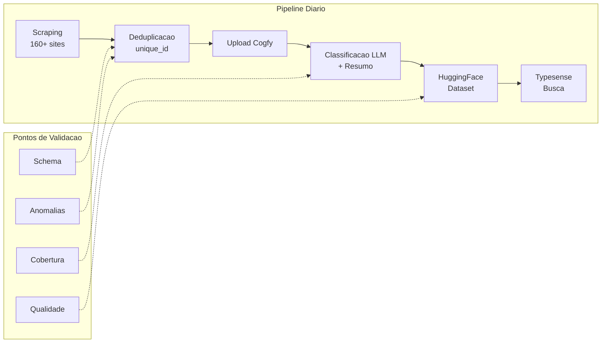

# Qualidade de Dados no DestaquesGovBr

> Guia avancado para monitoramento, validacao e melhoria continua da qualidade dos dados no pipeline de scraping e enriquecimento.

## Indice

1. [Introducao e Contexto](#introducao-e-contexto)
2. [Validacao de Dados](#validacao-de-dados)
3. [Metricas de Qualidade do Pipeline](./metricas.md)
4. [Feedback Loop](./feedback-loop.md)
5. [Exercicios Praticos](./feedback-loop.md#exercicios-praticos)
6. [Troubleshooting](./feedback-loop.md#troubleshooting)
7. [Glossario](./feedback-loop.md#glossario)

---

## Introducao e Contexto

### Visao Geral do Pipeline

O DestaquesGovBr processa diariamente noticias de **160+ sites gov.br**, enriquecendo-as via **Cogfy** (LLM) e disponibilizando no **HuggingFace** (~300k documentos).



### Por que Qualidade de Dados?

| Problema | Impacto | Exemplo |
|----------|---------|---------|
| **Dados faltantes** | Noticias sem conteudo | `body: null` ou `body: ""` |
| **Duplicatas** | Inflacao do dataset | Mesma noticia de fontes diferentes |
| **Classificacao errada** | Busca imprecisa | Noticia de saude classificada como educacao |
| **Resumos ruins** | UX degradada | Resumos truncados ou incoerentes |
| **Drift de dados** | Modelo obsoleto | Mudanca na estrutura dos sites gov.br |

### Deduplicacao: unique_id

O identificador unico de cada documento e calculado como:

```python
import hashlib

def generate_unique_id(agency: str, published_at: str, title: str) -> str:
    """
    Gera unique_id = MD5(agency + published_at + title)

    Args:
        agency: Orgao de origem (ex: "mec", "ms")
        published_at: Data de publicacao ISO (ex: "2024-01-15")
        title: Titulo da noticia

    Returns:
        Hash MD5 de 32 caracteres
    """
    content = f"{agency}{published_at}{title}"
    return hashlib.md5(content.encode()).hexdigest()

# Exemplo
unique_id = generate_unique_id(
    agency="mec",
    published_at="2024-01-15",
    title="MEC anuncia novo programa de bolsas"
)
# Output: "a1b2c3d4e5f6..."
```

---

## Validacao de Dados

### Parte 1: Schema Validation com Pydantic

O Pydantic permite definir schemas tipados e validar documentos automaticamente.

#### Schema Base do Documento

```python
# schemas/document.py
from pydantic import BaseModel, Field, validator, HttpUrl
from typing import Optional, List
from datetime import datetime, date
from enum import Enum

class DocumentStatus(str, Enum):
    PENDING = "pending"
    PROCESSED = "processed"
    ENRICHED = "enriched"
    ERROR = "error"

class GovBrDocument(BaseModel):
    """Schema Pydantic para documentos do DestaquesGovBr."""

    # Campos obrigatorios
    unique_id: str = Field(..., min_length=32, max_length=32, description="MD5 hash")
    agency: str = Field(..., min_length=2, max_length=100)
    title: str = Field(..., min_length=10, max_length=500)
    published_at: date
    url: HttpUrl

    # Campos opcionais
    body: Optional[str] = Field(None, min_length=50)
    summary: Optional[str] = Field(None, max_length=1000)
    themes: Optional[List[str]] = Field(default_factory=list)
    status: DocumentStatus = DocumentStatus.PENDING
    scraped_at: datetime = Field(default_factory=datetime.utcnow)

    # Campos de enriquecimento Cogfy
    cogfy_classification: Optional[str] = None
    cogfy_summary: Optional[str] = None
    cogfy_processed_at: Optional[datetime] = None

    @validator('unique_id')
    def validate_unique_id_format(cls, v):
        """Valida que unique_id e um hash MD5 valido."""
        if not v.isalnum() or len(v) != 32:
            raise ValueError("unique_id deve ser um hash MD5 de 32 caracteres")
        return v.lower()

    @validator('title')
    def clean_title(cls, v):
        """Remove espacos extras e normaliza titulo."""
        return ' '.join(v.split())

    @validator('body')
    def validate_body_content(cls, v):
        """Valida que body nao e apenas espacos em branco."""
        if v and not v.strip():
            return None
        return v

    @validator('themes')
    def validate_themes(cls, v):
        """Garante que temas sao unicos e em minusculo."""
        if v:
            return list(set(theme.lower().strip() for theme in v))
        return v

    class Config:
        json_encoders = {
            datetime: lambda v: v.isoformat(),
            date: lambda v: v.isoformat(),
        }

# Uso
try:
    doc = GovBrDocument(
        unique_id="a1b2c3d4e5f6a1b2c3d4e5f6a1b2c3d4",
        agency="mec",
        title="MEC anuncia novo programa de bolsas para estudantes",
        published_at="2024-01-15",
        url="https://www.gov.br/mec/noticia-exemplo",
        body="Conteudo completo da noticia com pelo menos 50 caracteres...",
    )
    print("Documento valido!")
except Exception as e:
    print(f"Erro de validacao: {e}")
```

#### Validacao em Lote

```python
# validators/batch_validator.py
from pydantic import ValidationError
from typing import List, Dict, Any, Tuple
from schemas.document import GovBrDocument
import logging

logger = logging.getLogger(__name__)

class BatchValidator:
    """Validador de lotes de documentos."""

    def __init__(self):
        self.valid_docs: List[GovBrDocument] = []
        self.invalid_docs: List[Dict[str, Any]] = []
        self.errors: List[Dict[str, Any]] = []

    def validate_batch(self, documents: List[Dict]) -> Tuple[List[GovBrDocument], List[Dict]]:
        """
        Valida um lote de documentos.

        Returns:
            Tuple de (documentos_validos, documentos_invalidos)
        """
        self.valid_docs = []
        self.invalid_docs = []
        self.errors = []

        for i, doc in enumerate(documents):
            try:
                validated = GovBrDocument(**doc)
                self.valid_docs.append(validated)
            except ValidationError as e:
                self.invalid_docs.append(doc)
                self.errors.append({
                    'index': i,
                    'unique_id': doc.get('unique_id', 'N/A'),
                    'errors': e.errors(),
                })
                logger.warning(f"Documento invalido [{i}]: {e.errors()}")

        return self.valid_docs, self.invalid_docs

    def get_validation_report(self) -> Dict[str, Any]:
        """Gera relatorio de validacao."""
        total = len(self.valid_docs) + len(self.invalid_docs)
        return {
            'total_documents': total,
            'valid_count': len(self.valid_docs),
            'invalid_count': len(self.invalid_docs),
            'validation_rate': len(self.valid_docs) / total if total > 0 else 0,
            'error_summary': self._summarize_errors(),
        }

    def _summarize_errors(self) -> Dict[str, int]:
        """Agrupa erros por tipo."""
        error_counts = {}
        for error in self.errors:
            for e in error['errors']:
                field = '.'.join(str(loc) for loc in e['loc'])
                error_counts[field] = error_counts.get(field, 0) + 1
        return error_counts

# Exemplo de uso
validator = BatchValidator()
documents = [
    {"unique_id": "abc123...", "agency": "mec", ...},
    {"unique_id": "def456...", "agency": "", ...},  # Invalido
]
valid, invalid = validator.validate_batch(documents)
print(validator.get_validation_report())
```

### Parte 2: Schema Validation com Pandera (DataFrames)

Para validacao de dados tabulares em pandas/polars, use Pandera.

```python
# schemas/dataframe_schema.py
import pandera as pa
from pandera import Column, Check, DataFrameSchema
import pandas as pd

# Schema para DataFrame de documentos
document_schema = DataFrameSchema(
    columns={
        "unique_id": Column(
            str,
            checks=[
                Check.str_length(32, 32),
                Check.str_matches(r'^[a-f0-9]{32}$'),
            ],
            nullable=False,
            unique=True,
        ),
        "agency": Column(
            str,
            checks=[
                Check.str_length(2, 100),
                Check.isin([
                    "mec", "ms", "mf", "mj", "mma", "mds", "mc", "mct",
                    "mapa", "mdr", "mme", "mtur", "presidencia",
                    # ... outros orgaos
                ]),
            ],
            nullable=False,
        ),
        "title": Column(
            str,
            checks=[
                Check.str_length(10, 500),
            ],
            nullable=False,
        ),
        "published_at": Column(
            "datetime64[ns]",
            checks=[
                Check.less_than_or_equal_to(pd.Timestamp.now()),
                Check.greater_than_or_equal_to(pd.Timestamp("2020-01-01")),
            ],
            nullable=False,
        ),
        "body": Column(
            str,
            checks=[
                Check.str_length(50, None),  # Minimo 50 caracteres
            ],
            nullable=True,
        ),
        "themes": Column(
            object,  # Lista de strings
            nullable=True,
        ),
        "cogfy_classification": Column(
            str,
            nullable=True,
        ),
    },
    strict=False,  # Permite colunas extras
    coerce=True,   # Tenta converter tipos automaticamente
)

# Validacao
def validate_dataframe(df: pd.DataFrame) -> pd.DataFrame:
    """Valida DataFrame contra schema."""
    try:
        validated_df = document_schema.validate(df, lazy=True)
        print(f"DataFrame valido: {len(validated_df)} registros")
        return validated_df
    except pa.errors.SchemaErrors as e:
        print(f"Erros de validacao:\n{e.failure_cases}")
        raise

# Exemplo
df = pd.read_parquet("documents.parquet")
validated_df = validate_dataframe(df)
```

### Parte 3: Deteccao de Anomalias

```python
# validators/anomaly_detector.py
import pandas as pd
import numpy as np
from typing import Dict, List, Any
from datetime import datetime, timedelta
import logging

logger = logging.getLogger(__name__)

class AnomalyDetector:
    """Detecta anomalias no pipeline de scraping."""

    def __init__(self, df: pd.DataFrame):
        self.df = df
        self.anomalies: List[Dict[str, Any]] = []

    def detect_all(self) -> List[Dict[str, Any]]:
        """Executa todas as deteccoes de anomalia."""
        self.anomalies = []

        self._detect_volume_anomaly()
        self._detect_duplicate_spike()
        self._detect_missing_fields()
        self._detect_date_anomalies()
        self._detect_agency_coverage()
        self._detect_content_anomalies()

        return self.anomalies

    def _detect_volume_anomaly(self, threshold_std: float = 2.0):
        """Detecta volume anormal de documentos por dia."""
        daily_counts = self.df.groupby(
            self.df['scraped_at'].dt.date
        ).size()

        mean = daily_counts.mean()
        std = daily_counts.std()

        for date, count in daily_counts.items():
            z_score = (count - mean) / std if std > 0 else 0
            if abs(z_score) > threshold_std:
                self.anomalies.append({
                    'type': 'volume_anomaly',
                    'severity': 'high' if abs(z_score) > 3 else 'medium',
                    'date': str(date),
                    'count': count,
                    'expected': mean,
                    'z_score': z_score,
                    'message': f"Volume {'alto' if z_score > 0 else 'baixo'}: {count} docs (esperado: ~{mean:.0f})",
                })

    def _detect_duplicate_spike(self, threshold: float = 0.1):
        """Detecta aumento anormal de duplicatas."""
        duplicates = self.df[self.df.duplicated(subset=['unique_id'], keep=False)]
        dup_rate = len(duplicates) / len(self.df) if len(self.df) > 0 else 0

        if dup_rate > threshold:
            self.anomalies.append({
                'type': 'duplicate_spike',
                'severity': 'high',
                'duplicate_count': len(duplicates),
                'duplicate_rate': dup_rate,
                'message': f"Taxa de duplicatas alta: {dup_rate:.1%}",
            })

    def _detect_missing_fields(self):
        """Detecta campos obrigatorios faltantes."""
        required_fields = ['unique_id', 'agency', 'title', 'published_at', 'url']

        for field in required_fields:
            if field in self.df.columns:
                missing_count = self.df[field].isna().sum()
                missing_rate = missing_count / len(self.df)

                if missing_count > 0:
                    self.anomalies.append({
                        'type': 'missing_field',
                        'severity': 'high' if missing_rate > 0.05 else 'medium',
                        'field': field,
                        'missing_count': missing_count,
                        'missing_rate': missing_rate,
                        'message': f"Campo '{field}' faltando em {missing_count} docs ({missing_rate:.1%})",
                    })

    def _detect_date_anomalies(self):
        """Detecta datas invalidas ou no futuro."""
        today = pd.Timestamp.now().normalize()

        # Datas no futuro
        future_dates = self.df[self.df['published_at'] > today]
        if len(future_dates) > 0:
            self.anomalies.append({
                'type': 'future_dates',
                'severity': 'medium',
                'count': len(future_dates),
                'message': f"{len(future_dates)} documentos com data no futuro",
            })

        # Datas muito antigas (antes de 2020)
        old_threshold = pd.Timestamp("2020-01-01")
        old_dates = self.df[self.df['published_at'] < old_threshold]
        if len(old_dates) > 0:
            self.anomalies.append({
                'type': 'old_dates',
                'severity': 'low',
                'count': len(old_dates),
                'message': f"{len(old_dates)} documentos anteriores a 2020",
            })

    def _detect_agency_coverage(self):
        """Detecta orgaos sem documentos recentes."""
        expected_agencies = [
            "mec", "ms", "mf", "mj", "mma", "mds", "mc", "mct",
            "mapa", "mdr", "mme", "mtur", "presidencia"
        ]

        recent_cutoff = pd.Timestamp.now() - timedelta(days=7)
        recent_df = self.df[self.df['scraped_at'] >= recent_cutoff]
        recent_agencies = set(recent_df['agency'].unique())

        missing_agencies = set(expected_agencies) - recent_agencies
        if missing_agencies:
            self.anomalies.append({
                'type': 'missing_agencies',
                'severity': 'medium',
                'agencies': list(missing_agencies),
                'message': f"Orgaos sem dados recentes: {', '.join(missing_agencies)}",
            })

    def _detect_content_anomalies(self):
        """Detecta problemas no conteudo dos documentos."""
        # Body muito curto
        if 'body' in self.df.columns:
            short_body = self.df[
                (self.df['body'].notna()) &
                (self.df['body'].str.len() < 100)
            ]
            if len(short_body) > 0:
                self.anomalies.append({
                    'type': 'short_content',
                    'severity': 'low',
                    'count': len(short_body),
                    'message': f"{len(short_body)} documentos com body < 100 caracteres",
                })

        # Titulos duplicados (diferentes unique_ids)
        title_dups = self.df.groupby('title').filter(lambda x: len(x) > 1)
        if len(title_dups) > 0:
            self.anomalies.append({
                'type': 'duplicate_titles',
                'severity': 'low',
                'count': len(title_dups),
                'unique_titles': title_dups['title'].nunique(),
                'message': f"{title_dups['title'].nunique()} titulos duplicados",
            })

    def get_report(self) -> Dict[str, Any]:
        """Gera relatorio de anomalias."""
        if not self.anomalies:
            self.detect_all()

        return {
            'total_anomalies': len(self.anomalies),
            'by_severity': {
                'high': len([a for a in self.anomalies if a['severity'] == 'high']),
                'medium': len([a for a in self.anomalies if a['severity'] == 'medium']),
                'low': len([a for a in self.anomalies if a['severity'] == 'low']),
            },
            'by_type': {
                t: len([a for a in self.anomalies if a['type'] == t])
                for t in set(a['type'] for a in self.anomalies)
            },
            'anomalies': self.anomalies,
        }

# Uso
df = pd.read_parquet("documents.parquet")
detector = AnomalyDetector(df)
report = detector.get_report()
print(f"Anomalias detectadas: {report['total_anomalies']}")
```

### Parte 4: Identificacao de Duplicatas

```python
# validators/deduplicator.py
import hashlib
import pandas as pd
from typing import Tuple, List
from difflib import SequenceMatcher

class Deduplicator:
    """Identifica e remove duplicatas no dataset."""

    @staticmethod
    def generate_unique_id(agency: str, published_at: str, title: str) -> str:
        """Gera unique_id padrao do DestaquesGovBr."""
        content = f"{agency}{published_at}{title}"
        return hashlib.md5(content.encode()).hexdigest()

    @staticmethod
    def find_exact_duplicates(df: pd.DataFrame) -> pd.DataFrame:
        """Encontra duplicatas exatas por unique_id."""
        duplicates = df[df.duplicated(subset=['unique_id'], keep=False)]
        return duplicates.sort_values('unique_id')

    @staticmethod
    def find_fuzzy_duplicates(
        df: pd.DataFrame,
        similarity_threshold: float = 0.85
    ) -> List[Tuple[str, str, float]]:
        """
        Encontra duplicatas por similaridade de titulo.

        Atencao: O(n^2) - usar apenas em amostras pequenas.
        """
        fuzzy_duplicates = []
        titles = df[['unique_id', 'title']].drop_duplicates()

        for i, row1 in titles.iterrows():
            for j, row2 in titles.iterrows():
                if i >= j:
                    continue

                similarity = SequenceMatcher(
                    None,
                    row1['title'].lower(),
                    row2['title'].lower()
                ).ratio()

                if similarity >= similarity_threshold:
                    fuzzy_duplicates.append((
                        row1['unique_id'],
                        row2['unique_id'],
                        similarity
                    ))

        return fuzzy_duplicates

    @staticmethod
    def remove_duplicates(
        df: pd.DataFrame,
        keep: str = 'first'
    ) -> Tuple[pd.DataFrame, int]:
        """
        Remove duplicatas mantendo a primeira ou ultima ocorrencia.

        Returns:
            Tuple de (DataFrame limpo, numero de duplicatas removidas)
        """
        original_count = len(df)
        deduplicated = df.drop_duplicates(subset=['unique_id'], keep=keep)
        removed_count = original_count - len(deduplicated)

        return deduplicated, removed_count

# Uso em pipeline
df = pd.read_parquet("documents.parquet")

# Verificar duplicatas exatas
exact_dups = Deduplicator.find_exact_duplicates(df)
print(f"Duplicatas exatas: {len(exact_dups)}")

# Remover duplicatas
clean_df, removed = Deduplicator.remove_duplicates(df)
print(f"Removidas {removed} duplicatas. Total: {len(clean_df)}")
```

---

## Navegacao

- **Proximo:** [Metricas de Qualidade do Pipeline](./metricas.md)

---

## Navegacao da Trilha Data Science

- [Setup Data Science](../../setup-datascience.md): Configuracao do ambiente
- [Explorando o Dataset](../explorando-dataset/index.md): Analise exploratoria
- [NLP Aplicado](../nlp-pipeline/index.md): Processamento de linguagem natural
- [ML para Classificacao](../ml-classificacao/index.md): Machine Learning
- **Qualidade de Dados** (voce esta aqui)

---

> Voltar para [ML para Classificacao](../ml-classificacao/index.md)
