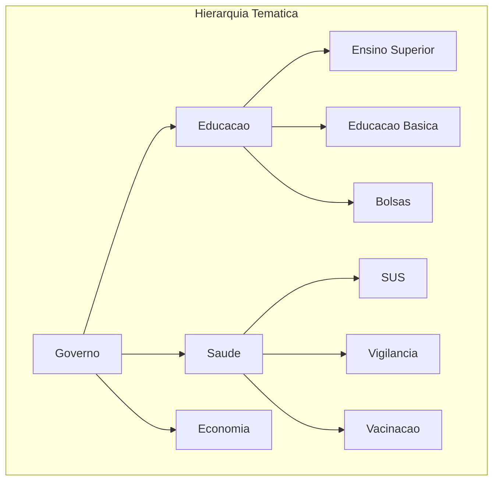

# Metricas de Qualidade do Pipeline

> Metricas avancadas para monitorar cobertura de classificacao, consistencia tematica, qualidade de resumos e deteccao de drift.

---

## Parte 1: Cobertura de Classificacao

```python
# metrics/classification_coverage.py
import pandas as pd
from typing import Dict, Any
from datetime import datetime, timedelta

class ClassificationMetrics:
    """Metricas de cobertura e qualidade de classificacao."""

    def __init__(self, df: pd.DataFrame):
        self.df = df

    def coverage_rate(self) -> float:
        """Percentual de documentos com tema atribuido."""
        if 'themes' not in self.df.columns:
            return 0.0

        has_theme = self.df['themes'].apply(
            lambda x: bool(x) if isinstance(x, list) else False
        )
        return has_theme.mean()

    def cogfy_classification_rate(self) -> float:
        """Percentual processado pelo Cogfy."""
        if 'cogfy_classification' not in self.df.columns:
            return 0.0

        return self.df['cogfy_classification'].notna().mean()

    def summary_rate(self) -> float:
        """Percentual com resumo gerado."""
        if 'cogfy_summary' not in self.df.columns:
            return 0.0

        return self.df['cogfy_summary'].notna().mean()

    def coverage_by_agency(self) -> pd.DataFrame:
        """Cobertura de classificacao por orgao."""
        if 'themes' not in self.df.columns:
            return pd.DataFrame()

        def has_theme(x):
            return bool(x) if isinstance(x, list) else False

        return self.df.groupby('agency').agg({
            'unique_id': 'count',
            'themes': lambda x: x.apply(has_theme).mean(),
            'cogfy_classification': lambda x: x.notna().mean() if 'cogfy_classification' in self.df.columns else 0,
        }).rename(columns={
            'unique_id': 'total_docs',
            'themes': 'theme_coverage',
            'cogfy_classification': 'cogfy_coverage',
        }).sort_values('total_docs', ascending=False)

    def coverage_trend(self, days: int = 30) -> pd.DataFrame:
        """Tendencia de cobertura nos ultimos N dias."""
        cutoff = datetime.now() - timedelta(days=days)
        recent = self.df[self.df['scraped_at'] >= cutoff].copy()

        recent['date'] = recent['scraped_at'].dt.date

        def has_theme(x):
            return bool(x) if isinstance(x, list) else False

        return recent.groupby('date').agg({
            'unique_id': 'count',
            'themes': lambda x: x.apply(has_theme).mean(),
        }).rename(columns={
            'unique_id': 'daily_docs',
            'themes': 'daily_coverage',
        })

    def get_report(self) -> Dict[str, Any]:
        """Relatorio completo de cobertura."""
        return {
            'overall_theme_coverage': self.coverage_rate(),
            'cogfy_classification_rate': self.cogfy_classification_rate(),
            'summary_rate': self.summary_rate(),
            'coverage_by_agency': self.coverage_by_agency().to_dict(),
            'timestamp': datetime.now().isoformat(),
        }

# Uso
df = pd.read_parquet("documents.parquet")
metrics = ClassificationMetrics(df)
print(f"Cobertura de temas: {metrics.coverage_rate():.1%}")
print(f"Taxa Cogfy: {metrics.cogfy_classification_rate():.1%}")
```

---

## Parte 2: Consistencia Tematica



```python
# metrics/thematic_consistency.py
from typing import Dict, List, Set, Any
import pandas as pd

class ThematicConsistency:
    """Verifica consistencia da hierarquia tematica."""

    # Arvore tematica do DestaquesGovBr
    THEME_HIERARCHY = {
        'governo': {
            'educacao': ['ensino-superior', 'educacao-basica', 'bolsas', 'enem', 'prouni'],
            'saude': ['sus', 'vigilancia', 'vacinacao', 'hospitais', 'medicamentos'],
            'economia': ['orcamento', 'impostos', 'investimentos', 'comercio'],
            'infraestrutura': ['transportes', 'energia', 'saneamento', 'telecomunicacoes'],
            'meio-ambiente': ['preservacao', 'clima', 'fauna', 'flora', 'licenciamento'],
            'seguranca': ['policia-federal', 'fronteiras', 'prisional', 'defesa'],
            'social': ['assistencia', 'previdencia', 'trabalho', 'cultura'],
        }
    }

    def __init__(self, df: pd.DataFrame):
        self.df = df
        self.valid_themes = self._build_valid_themes()

    def _build_valid_themes(self) -> Set[str]:
        """Constroi set de todos os temas validos."""
        valid = set()
        for category, subcategories in self.THEME_HIERARCHY.get('governo', {}).items():
            valid.add(category)
            valid.update(subcategories)
        return valid

    def check_theme_validity(self) -> Dict[str, Any]:
        """Verifica se temas atribuidos sao validos."""
        invalid_themes = {}

        for idx, row in self.df.iterrows():
            themes = row.get('themes', [])
            if not themes:
                continue

            for theme in themes:
                if theme.lower() not in self.valid_themes:
                    if theme not in invalid_themes:
                        invalid_themes[theme] = 0
                    invalid_themes[theme] += 1

        return {
            'total_invalid_themes': len(invalid_themes),
            'invalid_theme_counts': invalid_themes,
        }

    def check_hierarchy_consistency(self) -> List[Dict]:
        """Verifica se temas respeitam hierarquia (pai + filho)."""
        inconsistencies = []

        for idx, row in self.df.iterrows():
            themes = row.get('themes', [])
            if not themes or len(themes) < 2:
                continue

            themes_set = set(t.lower() for t in themes)

            # Verifica se subcategoria esta presente sem categoria pai
            for category, subcategories in self.THEME_HIERARCHY.get('governo', {}).items():
                for sub in subcategories:
                    if sub in themes_set and category not in themes_set:
                        inconsistencies.append({
                            'unique_id': row['unique_id'],
                            'themes': themes,
                            'issue': f"Subcategoria '{sub}' sem categoria pai '{category}'",
                        })
                        break

        return inconsistencies

    def theme_distribution(self) -> pd.DataFrame:
        """Distribuicao de temas no dataset."""
        theme_counts = {}

        for themes in self.df['themes'].dropna():
            if isinstance(themes, list):
                for theme in themes:
                    theme_counts[theme] = theme_counts.get(theme, 0) + 1

        return pd.DataFrame([
            {'theme': k, 'count': v}
            for k, v in sorted(theme_counts.items(), key=lambda x: -x[1])
        ])

# Uso
df = pd.read_parquet("documents.parquet")
consistency = ThematicConsistency(df)

validity = consistency.check_theme_validity()
print(f"Temas invalidos: {validity['total_invalid_themes']}")

inconsistencies = consistency.check_hierarchy_consistency()
print(f"Inconsistencias hierarquicas: {len(inconsistencies)}")
```

---

## Parte 3: Qualidade dos Resumos

```python
# metrics/summary_quality.py
from typing import Dict, Any, List
import pandas as pd
import numpy as np

# Para metricas ROUGE
try:
    from rouge_score import rouge_scorer
    ROUGE_AVAILABLE = True
except ImportError:
    ROUGE_AVAILABLE = False
    print("Instale rouge-score: pip install rouge-score")

# Para BERTScore
try:
    from bert_score import score as bert_score
    BERT_AVAILABLE = True
except ImportError:
    BERT_AVAILABLE = False
    print("Instale bert-score: pip install bert-score")

class SummaryQualityMetrics:
    """Metricas de qualidade para resumos gerados."""

    def __init__(self):
        if ROUGE_AVAILABLE:
            self.rouge_scorer = rouge_scorer.RougeScorer(
                ['rouge1', 'rouge2', 'rougeL'],
                use_stemmer=True
            )

    def compute_rouge(
        self,
        summaries: List[str],
        references: List[str]
    ) -> Dict[str, float]:
        """
        Calcula metricas ROUGE.

        Args:
            summaries: Resumos gerados pelo modelo
            references: Textos originais (body)

        Returns:
            Dict com scores ROUGE-1, ROUGE-2, ROUGE-L
        """
        if not ROUGE_AVAILABLE:
            return {'error': 'rouge-score nao instalado'}

        scores = {'rouge1': [], 'rouge2': [], 'rougeL': []}

        for summary, reference in zip(summaries, references):
            if not summary or not reference:
                continue

            result = self.rouge_scorer.score(reference, summary)
            for key in scores:
                scores[key].append(result[key].fmeasure)

        return {
            'rouge1_mean': np.mean(scores['rouge1']),
            'rouge2_mean': np.mean(scores['rouge2']),
            'rougeL_mean': np.mean(scores['rougeL']),
            'sample_size': len(scores['rouge1']),
        }

    def compute_bertscore(
        self,
        summaries: List[str],
        references: List[str],
        lang: str = 'pt'
    ) -> Dict[str, float]:
        """
        Calcula BERTScore para qualidade semantica.

        Nota: Requer GPU para performance.
        """
        if not BERT_AVAILABLE:
            return {'error': 'bert-score nao instalado'}

        # Filtrar pares validos
        valid_pairs = [
            (s, r) for s, r in zip(summaries, references)
            if s and r
        ]

        if not valid_pairs:
            return {'error': 'Nenhum par valido para avaliacao'}

        summaries_clean, references_clean = zip(*valid_pairs)

        P, R, F1 = bert_score(
            list(summaries_clean),
            list(references_clean),
            lang=lang,
            verbose=False
        )

        return {
            'bertscore_precision': P.mean().item(),
            'bertscore_recall': R.mean().item(),
            'bertscore_f1': F1.mean().item(),
            'sample_size': len(valid_pairs),
        }

    def length_analysis(
        self,
        summaries: List[str],
        references: List[str]
    ) -> Dict[str, Any]:
        """Analisa proporcao de tamanho resumo/original."""
        ratios = []

        for summary, reference in zip(summaries, references):
            if summary and reference:
                ratio = len(summary) / len(reference)
                ratios.append(ratio)

        if not ratios:
            return {}

        return {
            'mean_compression_ratio': np.mean(ratios),
            'median_compression_ratio': np.median(ratios),
            'min_ratio': np.min(ratios),
            'max_ratio': np.max(ratios),
            'ideal_range': '0.1-0.3 (10-30% do original)',
        }

    def evaluate_sample(
        self,
        df: pd.DataFrame,
        summary_col: str = 'cogfy_summary',
        reference_col: str = 'body',
        sample_size: int = 100
    ) -> Dict[str, Any]:
        """
        Avalia uma amostra do dataset.

        Args:
            df: DataFrame com documentos
            summary_col: Coluna com resumos
            reference_col: Coluna com texto original
            sample_size: Tamanho da amostra
        """
        # Filtrar documentos com resumo e body
        valid = df[
            (df[summary_col].notna()) &
            (df[reference_col].notna())
        ]

        if len(valid) == 0:
            return {'error': 'Nenhum documento com resumo e body'}

        # Amostra
        sample = valid.sample(min(sample_size, len(valid)))

        summaries = sample[summary_col].tolist()
        references = sample[reference_col].tolist()

        return {
            'sample_size': len(sample),
            'rouge_scores': self.compute_rouge(summaries, references),
            'length_analysis': self.length_analysis(summaries, references),
            # BERTScore e lento - usar apenas quando necessario
            # 'bertscore': self.compute_bertscore(summaries, references),
        }

# Uso
df = pd.read_parquet("documents.parquet")
quality = SummaryQualityMetrics()
report = quality.evaluate_sample(df, sample_size=50)
print(f"ROUGE-L medio: {report['rouge_scores'].get('rougeL_mean', 'N/A'):.3f}")
```

---

## Parte 4: Monitoramento de Drift

```python
# metrics/drift_detector.py
import pandas as pd
import numpy as np
from typing import Dict, Any, Optional
from datetime import datetime, timedelta
from scipy import stats

class DriftDetector:
    """Detecta mudancas na distribuicao de dados ao longo do tempo."""

    def __init__(self, df: pd.DataFrame, date_column: str = 'scraped_at'):
        self.df = df
        self.date_column = date_column

    def detect_volume_drift(
        self,
        window_days: int = 7,
        baseline_days: int = 30
    ) -> Dict[str, Any]:
        """
        Compara volume recente com baseline historico.
        """
        now = datetime.now()

        # Periodo recente
        recent_start = now - timedelta(days=window_days)
        recent = self.df[self.df[self.date_column] >= recent_start]

        # Baseline (periodo anterior)
        baseline_end = recent_start
        baseline_start = baseline_end - timedelta(days=baseline_days)
        baseline = self.df[
            (self.df[self.date_column] >= baseline_start) &
            (self.df[self.date_column] < baseline_end)
        ]

        # Volumes diarios
        recent_daily = recent.groupby(
            recent[self.date_column].dt.date
        ).size().mean()

        baseline_daily = baseline.groupby(
            baseline[self.date_column].dt.date
        ).size().mean()

        # Variacao percentual
        if baseline_daily > 0:
            pct_change = (recent_daily - baseline_daily) / baseline_daily
        else:
            pct_change = 0

        return {
            'recent_daily_avg': recent_daily,
            'baseline_daily_avg': baseline_daily,
            'pct_change': pct_change,
            'drift_detected': abs(pct_change) > 0.3,  # >30% mudanca
            'direction': 'increase' if pct_change > 0 else 'decrease',
        }

    def detect_agency_drift(
        self,
        window_days: int = 7,
        baseline_days: int = 30
    ) -> Dict[str, Any]:
        """
        Detecta mudancas na distribuicao de orgaos.
        """
        now = datetime.now()

        # Periodos
        recent = self.df[self.df[self.date_column] >= now - timedelta(days=window_days)]
        baseline = self.df[
            (self.df[self.date_column] >= now - timedelta(days=baseline_days)) &
            (self.df[self.date_column] < now - timedelta(days=window_days))
        ]

        # Distribuicoes
        recent_dist = recent['agency'].value_counts(normalize=True)
        baseline_dist = baseline['agency'].value_counts(normalize=True)

        # Alinhar indices
        all_agencies = set(recent_dist.index) | set(baseline_dist.index)
        recent_aligned = recent_dist.reindex(all_agencies, fill_value=0)
        baseline_aligned = baseline_dist.reindex(all_agencies, fill_value=0)

        # Teste Chi-quadrado
        try:
            chi2, p_value = stats.chisquare(
                recent_aligned.values,
                baseline_aligned.values + 1e-10  # Evitar divisao por zero
            )
        except:
            chi2, p_value = 0, 1.0

        # Maiores diferencas
        diff = (recent_aligned - baseline_aligned).abs().sort_values(ascending=False)

        return {
            'chi2_statistic': chi2,
            'p_value': p_value,
            'drift_detected': p_value < 0.05,
            'top_changes': diff.head(5).to_dict(),
        }

    def detect_theme_drift(
        self,
        window_days: int = 7,
        baseline_days: int = 30
    ) -> Dict[str, Any]:
        """
        Detecta mudancas na distribuicao de temas.
        """
        now = datetime.now()

        def extract_themes(series):
            themes = {}
            for theme_list in series.dropna():
                if isinstance(theme_list, list):
                    for theme in theme_list:
                        themes[theme] = themes.get(theme, 0) + 1
            total = sum(themes.values())
            return {k: v/total for k, v in themes.items()} if total > 0 else {}

        recent = self.df[self.df[self.date_column] >= now - timedelta(days=window_days)]
        baseline = self.df[
            (self.df[self.date_column] >= now - timedelta(days=baseline_days)) &
            (self.df[self.date_column] < now - timedelta(days=window_days))
        ]

        recent_themes = extract_themes(recent.get('themes', pd.Series()))
        baseline_themes = extract_themes(baseline.get('themes', pd.Series()))

        # Novos temas
        new_themes = set(recent_themes.keys()) - set(baseline_themes.keys())

        # Temas que desapareceram
        missing_themes = set(baseline_themes.keys()) - set(recent_themes.keys())

        return {
            'new_themes': list(new_themes),
            'missing_themes': list(missing_themes),
            'theme_count_recent': len(recent_themes),
            'theme_count_baseline': len(baseline_themes),
        }

    def get_drift_report(self) -> Dict[str, Any]:
        """Relatorio completo de drift."""
        return {
            'timestamp': datetime.now().isoformat(),
            'volume_drift': self.detect_volume_drift(),
            'agency_drift': self.detect_agency_drift(),
            'theme_drift': self.detect_theme_drift(),
        }

# Uso
df = pd.read_parquet("documents.parquet")
detector = DriftDetector(df)
report = detector.get_drift_report()

if report['volume_drift']['drift_detected']:
    print(f"ALERTA: Drift de volume detectado ({report['volume_drift']['pct_change']:.1%})")
```

---

## Parte 5: Metricas de Scraping

```python
# metrics/scraping_metrics.py
import pandas as pd
from typing import Dict, Any, List
from datetime import datetime, timedelta
from dataclasses import dataclass

@dataclass
class ScrapingRun:
    """Registro de uma execucao de scraping."""
    run_id: str
    start_time: datetime
    end_time: datetime
    agency: str
    documents_scraped: int
    documents_new: int
    documents_updated: int
    errors: List[Dict[str, Any]]
    status: str  # 'success', 'partial', 'failed'

class ScrapingMetrics:
    """Metricas de performance do scraping."""

    def __init__(self, runs: List[ScrapingRun]):
        self.runs = runs

    def success_rate(self, days: int = 7) -> Dict[str, float]:
        """Taxa de sucesso por orgao nos ultimos N dias."""
        cutoff = datetime.now() - timedelta(days=days)
        recent_runs = [r for r in self.runs if r.start_time >= cutoff]

        rates = {}
        for agency in set(r.agency for r in recent_runs):
            agency_runs = [r for r in recent_runs if r.agency == agency]
            success_count = len([r for r in agency_runs if r.status == 'success'])
            rates[agency] = success_count / len(agency_runs) if agency_runs else 0

        return rates

    def error_analysis(self, days: int = 7) -> Dict[str, Any]:
        """Analise de erros recentes."""
        cutoff = datetime.now() - timedelta(days=days)
        recent_runs = [r for r in self.runs if r.start_time >= cutoff]

        error_types = {}
        error_by_agency = {}

        for run in recent_runs:
            for error in run.errors:
                error_type = error.get('type', 'unknown')
                error_types[error_type] = error_types.get(error_type, 0) + 1

                if run.agency not in error_by_agency:
                    error_by_agency[run.agency] = 0
                error_by_agency[run.agency] += 1

        return {
            'total_errors': sum(error_types.values()),
            'error_types': error_types,
            'error_by_agency': error_by_agency,
        }

    def throughput(self, days: int = 7) -> Dict[str, float]:
        """Documentos processados por hora."""
        cutoff = datetime.now() - timedelta(days=days)
        recent_runs = [r for r in self.runs if r.start_time >= cutoff]

        total_docs = sum(r.documents_scraped for r in recent_runs)
        total_hours = sum(
            (r.end_time - r.start_time).total_seconds() / 3600
            for r in recent_runs
        )

        return {
            'docs_per_hour': total_docs / total_hours if total_hours > 0 else 0,
            'total_documents': total_docs,
            'total_hours': total_hours,
        }

    def latency_stats(self) -> Dict[str, float]:
        """Estatisticas de latencia de scraping."""
        durations = [
            (r.end_time - r.start_time).total_seconds() / 60  # minutos
            for r in self.runs
        ]

        if not durations:
            return {}

        return {
            'mean_duration_min': sum(durations) / len(durations),
            'min_duration_min': min(durations),
            'max_duration_min': max(durations),
            'p95_duration_min': sorted(durations)[int(len(durations) * 0.95)],
        }

    def get_dashboard_metrics(self) -> Dict[str, Any]:
        """Metricas para dashboard."""
        return {
            'timestamp': datetime.now().isoformat(),
            'success_rates': self.success_rate(),
            'error_analysis': self.error_analysis(),
            'throughput': self.throughput(),
            'latency': self.latency_stats(),
        }
```

---

## Navegacao

- **Anterior:** [Introducao e Validacao](./index.md)
- **Proximo:** [Feedback Loop](./feedback-loop.md)

---

## Navegacao da Trilha Data Science

- [Setup Data Science](../../setup-datascience.md): Configuracao do ambiente
- [Explorando o Dataset](../explorando-dataset/index.md): Analise exploratoria
- [NLP Aplicado](../nlp-pipeline/index.md): Processamento de linguagem natural
- [ML para Classificacao](../ml-classificacao/index.md): Machine Learning
- **Qualidade de Dados** (voce esta aqui)

---

> Voltar para [Introducao e Validacao](./index.md)
