# Git Fundamentos

> Guia completo para entender e usar Git no dia a dia. Do zero ao intermediário, com linguagem simples e diagramas para facilitar o aprendizado.

---

## Parte 1: Nível Básico (Baby Steps)

### O que é Git?

Imagine que você está escrevendo um documento importante. Você já deve ter feito algo assim:

```
relatorio.docx
relatorio_v2.docx
relatorio_v2_final.docx
relatorio_v2_final_FINAL.docx
relatorio_v2_final_FINAL_agora_vai.docx
```

**Git resolve esse problema.** Ele é como uma "máquina do tempo" para seus arquivos de código. Com Git você pode:

- Salvar "fotos" do seu código em diferentes momentos
- Voltar para qualquer versão anterior
- Ver exatamente o que mudou entre versões
- Trabalhar em equipe sem sobrescrever o trabalho dos outros

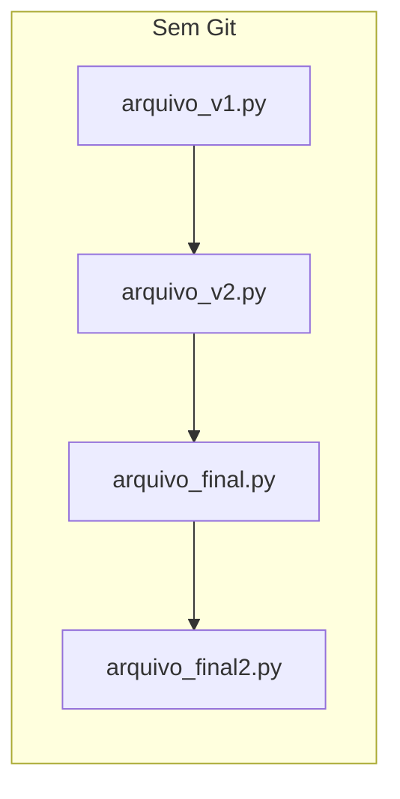

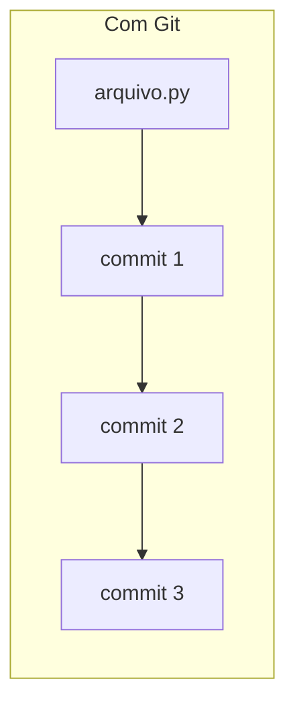

### Por que usar Git?

| Problema | Como o Git resolve |
|----------|-------------------|
| "Quem mexeu nesse arquivo?" | Git registra autor, data e descrição de cada mudança |
| "Preciso voltar para a versão de ontem" | Git mantém histórico completo, você viaja no tempo |
| "Duas pessoas editaram o mesmo arquivo" | Git ajuda a juntar as mudanças (merge) |
| "Perdi meu código no HD queimado" | Git sincroniza com servidores remotos (backup) |

### Conceitos Essenciais

Antes de começar, vamos entender 4 conceitos fundamentais:

#### 1. Repositório (repo)

Um **repositório** é uma pasta monitorada pelo Git. Dentro dela existe uma pasta oculta `.git` que guarda todo o histórico.

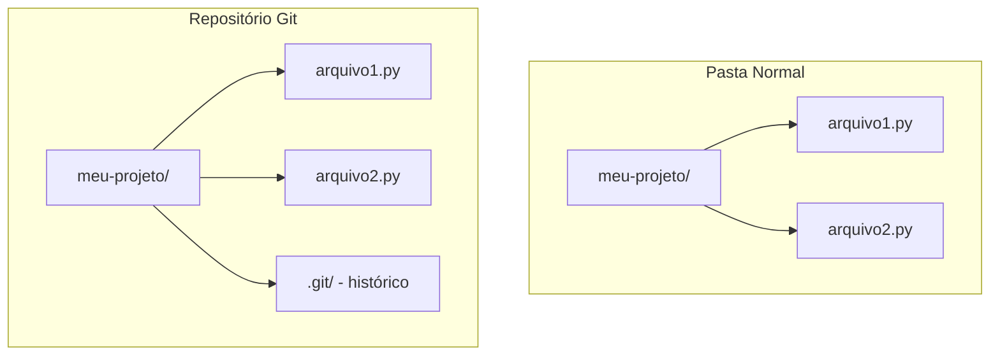

#### 2. Commit

Um **commit** é uma "foto" do seu projeto em um momento específico. Cada commit tem:

- Um identificador único (hash)
- Uma mensagem descritiva
- O autor e a data
- As mudanças feitas

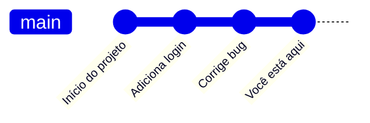

#### 3. Branch

Uma **branch** (ramificação) é uma linha de desenvolvimento independente. Pense como universos paralelos do seu código.

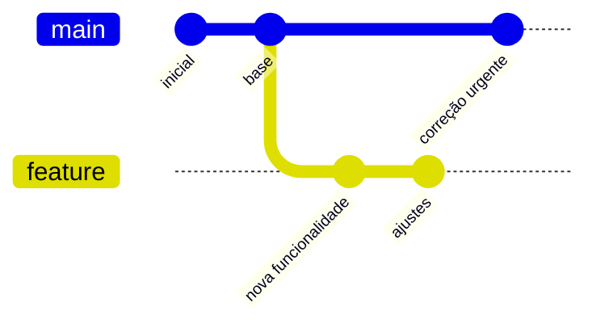

#### 4. Staging Area

A **staging area** (área de preparação) é onde você escolhe quais mudanças entrarão no próximo commit.

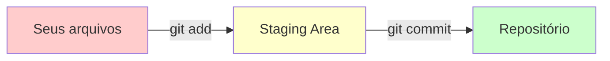

### Instalação

=== "Windows"

    1. Baixe o instalador em [git-scm.com](https://git-scm.com/download/win)
    2. Execute o instalador
    3. Aceite as opções padrão (next, next, next...)
    4. Abra o "Git Bash" para usar

=== "macOS"

    ```bash
    # Se tiver Homebrew instalado:
    brew install git

    # Ou baixe em git-scm.com/download/mac
    ```

=== "Linux (Ubuntu/Debian)"

    ```bash
    sudo apt update
    sudo apt install git
    ```

**Verificando a instalação:**

```bash
git --version
# Deve mostrar algo como: git version 2.40.0
```

### Configuração Inicial

Antes de usar o Git, configure seu nome e email. Esses dados aparecem em cada commit que você fizer:

```bash
# Configure seu nome
git config --global user.name "Seu Nome"

# Configure seu email (use o mesmo do GitHub)
git config --global user.email "seu.email@exemplo.com"

# Verifique as configurações
git config --list
```

> **Dica**: O `--global` aplica a configuração para todos os repositórios. Sem ele, vale só para o repositório atual.

### Seu Primeiro Repositório

Vamos criar um repositório do zero:

```bash
# 1. Crie uma pasta para o projeto
mkdir meu-primeiro-repo
cd meu-primeiro-repo

# 2. Inicialize o Git nessa pasta
git init

# 3. Veja que a pasta .git foi criada
ls -la
```

Você verá a mensagem:

```
Initialized empty Git repository in /caminho/meu-primeiro-repo/.git/
```

Parabéns! Você tem um repositório Git.

### O Ciclo Básico do Git

O fluxo de trabalho mais comum no Git tem 3 passos:

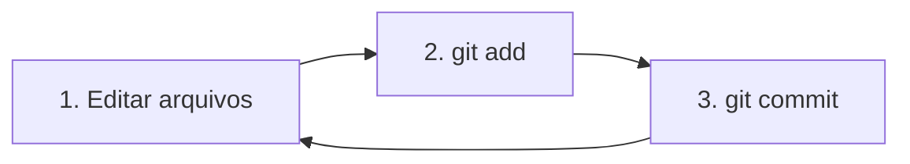

#### Passo 1: Criar/editar arquivos

```bash
# Crie um arquivo qualquer
echo "Olá, Git!" > arquivo.txt
```

#### Passo 2: Ver o status

```bash
git status
```

Você verá algo como:

```
Untracked files:
  (use "git add <file>..." to include in what will be committed)
        arquivo.txt
```

O arquivo está **Untracked** (não rastreado) - o Git sabe que ele existe, mas não está monitorando.

#### Passo 3: Adicionar à staging area

```bash
git add arquivo.txt

# Ou para adicionar TODOS os arquivos modificados:
git add .
```

Verifique novamente:

```bash
git status
```

Agora mostra:

```
Changes to be committed:
  (use "git restore --staged <file>..." to unstage)
        new file:   arquivo.txt
```

#### Passo 4: Fazer o commit

```bash
git commit -m "Adiciona arquivo inicial"
```

A flag `-m` permite escrever a mensagem do commit diretamente.

### Estados dos Arquivos

Um arquivo no Git pode estar em 4 estados:

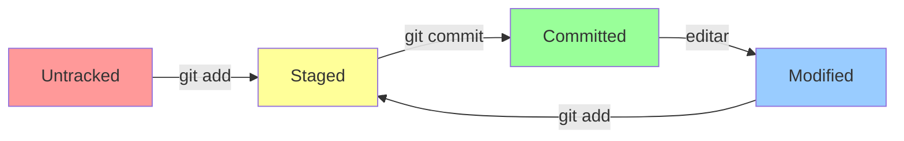

| Estado | Significado |
|--------|------------|
| **Untracked** | Arquivo novo, Git não conhece |
| **Staged** | Arquivo marcado para o próximo commit |
| **Committed** | Arquivo salvo no histórico |
| **Modified** | Arquivo alterado desde o último commit |

### Entendendo o Histórico

Para ver os commits anteriores:

```bash
# Histórico completo
git log

# Histórico resumido (uma linha por commit)
git log --oneline

# Histórico com gráfico de branches
git log --oneline --graph
```

Exemplo de saída do `git log --oneline`:

```
a1b2c3d (HEAD -> main) Adiciona validação de email
e4f5g6h Corrige bug no login
i7j8k9l Commit inicial
```

---

## Parte 2: Nível Intermediário

### Branches na Prática

Branches permitem trabalhar em funcionalidades isoladas sem afetar o código principal.

#### Visualizando branches

```bash
# Lista todas as branches locais
git branch

# Lista com mais detalhes
git branch -v
```

#### Criando uma branch

```bash
# Cria uma nova branch
git branch minha-feature

# Cria E muda para ela (atalho)
git checkout -b minha-feature

# Forma moderna (Git 2.23+)
git switch -c minha-feature
```

#### Trocando de branch

```bash
# Forma clássica
git checkout main

# Forma moderna
git switch main
```

#### Diagrama: trabalhando com branches

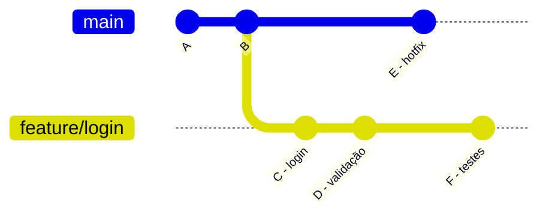

### Merge: Juntando Trabalhos

Quando terminar o trabalho em uma branch, você precisa juntar (merge) com a principal:

```bash
# 1. Volte para a branch de destino
git checkout main

# 2. Faça o merge
git merge minha-feature
```

#### Tipos de Merge

**Fast-forward** (avanço rápido): quando não há commits novos na branch de destino.

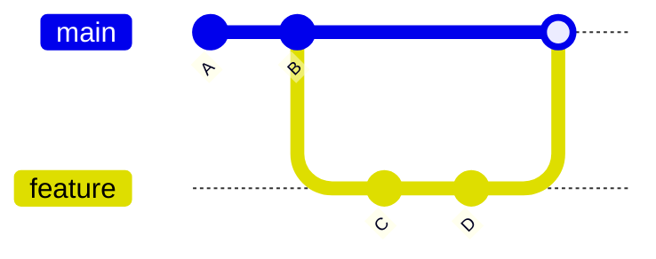

**Merge commit**: quando ambas as branches têm commits novos.

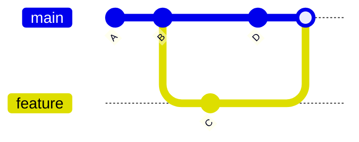

### Resolvendo Conflitos

Conflitos acontecem quando duas pessoas editam a mesma linha do mesmo arquivo.

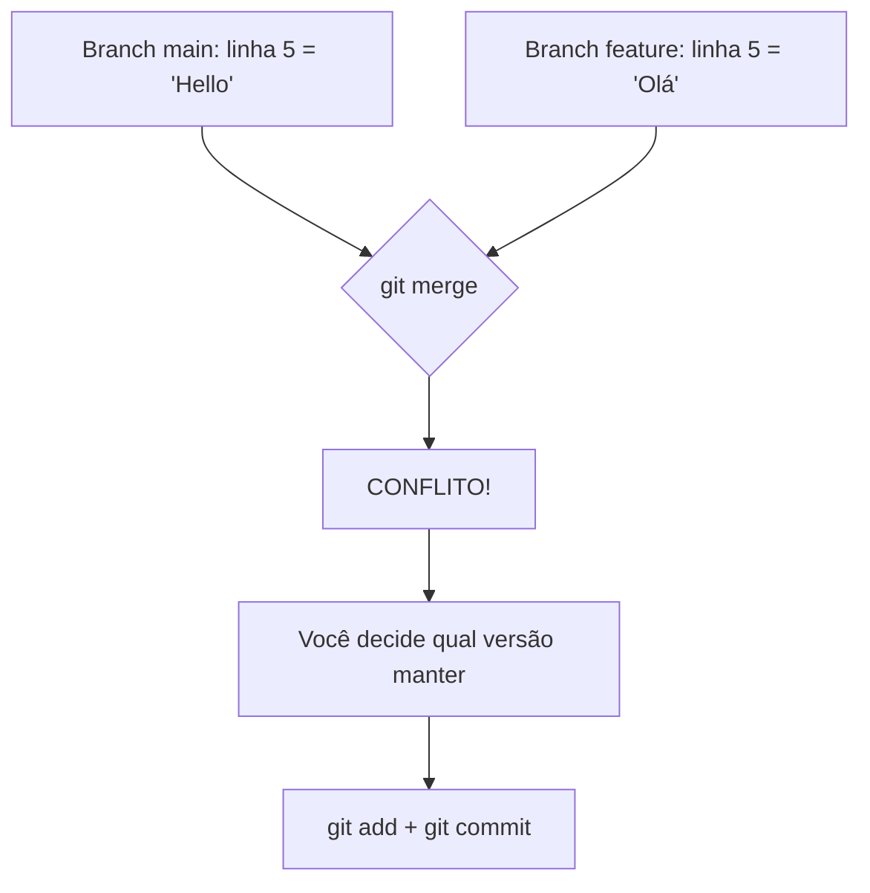

Quando há conflito, o arquivo fica assim:

```
<<<<<<< HEAD
Código da branch atual (main)
=======
Código da branch que está sendo mesclada (feature)
>>>>>>> feature
```

**Como resolver:**

1. Abra o arquivo com conflito
2. Escolha qual versão manter (ou combine as duas)
3. Remova os marcadores `<<<<<<<`, `=======`, `>>>>>>>`
4. Salve o arquivo
5. Execute:

```bash
git add arquivo-com-conflito.py
git commit -m "Resolve conflito no arquivo X"
```

> **Dica**: IDEs como VSCode mostram os conflitos de forma visual e facilitam a resolução.

### Desfazendo Coisas

O Git oferece várias formas de desfazer mudanças. Use a certa para cada situação:

#### Descartar mudanças não commitadas

```bash
# Descartar mudanças em um arquivo específico
git restore arquivo.py

# Descartar TODAS as mudanças (cuidado!)
git restore .
```

#### Remover arquivo da staging area

```bash
# Remove do staging, mas mantém as mudanças no arquivo
git restore --staged arquivo.py
```

#### Desfazer o último commit (mantendo mudanças)

```bash
# Volta o commit, mas mantém os arquivos modificados
git reset --soft HEAD~1
```

#### Criar um commit que reverte outro

```bash
# Cria um NOVO commit que desfaz as mudanças de um commit anterior
git revert abc123
```

#### Diagrama: Reset vs Revert

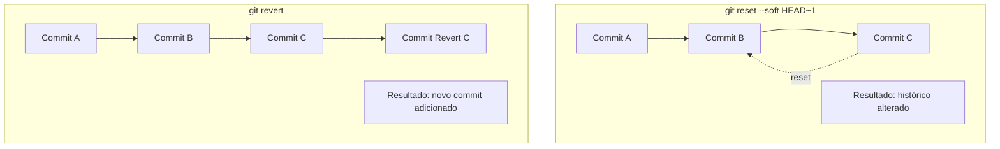

| Comando | Quando usar |
|---------|-------------|
| `git restore` | Descartar mudanças locais não commitadas |
| `git reset --soft` | Desfazer commit local (ainda não enviado) |
| `git revert` | Desfazer commit já enviado para o remoto |

### Git Stash: Guardando Mudanças no Bolso

O `stash` guarda temporariamente suas mudanças para você trocar de branch sem perder nada.

```bash
# Guarda as mudanças atuais
git stash

# Lista os stashes salvos
git stash list

# Recupera o último stash
git stash pop

# Recupera um stash específico
git stash apply stash@{2}

# Remove um stash
git stash drop stash@{0}
```

**Cenário comum:**

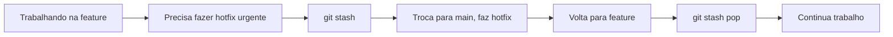

### Boas Práticas de Commits

#### Conventional Commits

O projeto DestaquesGovBr segue o padrão **Conventional Commits**:

```
<tipo>: <descrição curta>

[corpo opcional]
```

**Tipos principais:**

| Tipo | Quando usar |
|------|-------------|
| `feat` | Nova funcionalidade |
| `fix` | Correção de bug |
| `docs` | Mudanças na documentação |
| `style` | Formatação (não altera lógica) |
| `refactor` | Refatoração de código |
| `test` | Adição ou correção de testes |
| `chore` | Tarefas de manutenção |

**Exemplos:**

```bash
git commit -m "feat: adiciona filtro por data na busca"
git commit -m "fix: corrige erro de encoding no scraper"
git commit -m "docs: atualiza guia de instalação"
```

#### Regras para boas mensagens

1. Use o imperativo: "Adiciona" (não "Adicionado" ou "Adicionando")
2. Primeira linha com no máximo 72 caracteres
3. Descreva O QUE foi feito, não COMO
4. Se precisar explicar mais, deixe uma linha em branco e adicione detalhes

### Aliases: Atalhos Úteis

Configure atalhos para comandos que você usa frequentemente:

```bash
# Status resumido
git config --global alias.st "status -sb"

# Log bonito
git config --global alias.lg "log --oneline --graph --decorate"

# Adicionar tudo e commitar
git config --global alias.ac "!git add -A && git commit"
```

Agora você pode usar:

```bash
git st        # em vez de git status -sb
git lg        # em vez de git log --oneline --graph --decorate
git ac -m "mensagem"  # adiciona tudo e commita
```

---

## Resumo de Comandos

| Comando | O que faz |
|---------|-----------|
| `git init` | Cria um novo repositório |
| `git status` | Mostra estado dos arquivos |
| `git add <arquivo>` | Adiciona arquivo à staging |
| `git commit -m "msg"` | Cria um commit |
| `git log` | Mostra histórico |
| `git branch` | Lista/cria branches |
| `git checkout <branch>` | Muda de branch |
| `git merge <branch>` | Junta branches |
| `git stash` | Guarda mudanças temporariamente |
| `git restore <arquivo>` | Descarta mudanças |

---

## Próximos Passos

Agora que você domina os fundamentos do Git, continue aprendendo:

- [GitHub Colaboração](github-colaboracao.md): Como usar o GitHub para colaborar
- [Primeiro PR](primeiro-pr.md): Fluxo completo para contribuir com o projeto

---

> **Precisa de ajuda?** Consulte o [Troubleshooting](troubleshooting.md) ou pergunte no canal do time.
